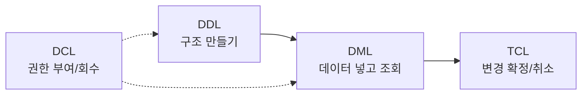

# 10-1 SQL 명령어 분류 — DDL / DML / DCL / TCL

> 이번 시간 학습 목표
> - SQL 명령어가 **네 가지 분류**(DDL, DML, DCL, TCL) 로 나뉜다는 것을 이해한다.
> - 각 분류의 대표 명령어를 **손으로 직접** 실행해 본다.
> - Python 코드에서도 네 가지 분류가 어떻게 쓰이는지 구분할 수 있다.
{: .prompt-tip }

---

## 1. 왜 분류를 배워야 하는가?

지금까지 배운 `CREATE TABLE`, `SELECT`, `INSERT`, `UPDATE`, `GRANT` 모두 SQL 문장이다.  
하지만 이들은 **역할이 완전히 다르다.**

- `CREATE TABLE` 은 **구조를 만드는 것**
- `INSERT` 는 **데이터를 넣는 것**
- `GRANT` 는 **권한을 주는 것**
- `COMMIT` 은 **변경 사항을 확정하는 것**

역할이 다르니 **분류 이름**도 다르다. 아래 네 가지로 정리한다.

| 분류 | 이름 | 다루는 대상 | 대표 명령어 |
|---|---|---|---|
| **DDL** | Data **Definition** Language | DB 구조 | `CREATE`, `ALTER`, `DROP`, `TRUNCATE` |
| **DML** | Data **Manipulation** Language | 데이터 값 | `SELECT`, `INSERT`, `UPDATE`, `DELETE` |
| **DCL** | Data **Control** Language | 권한·보안 | `GRANT`, `REVOKE` |
| **TCL** | **Transaction** Control Language | 트랜잭션 | `COMMIT`, `ROLLBACK`, `SAVEPOINT` |

> 💡 이 표는 시험에 단골로 나온다. **"DDL은 정의, DML은 조작, DCL은 제어, TCL은 트랜잭션"** 으로 암기하자.
{: .prompt-info }

---

## 2. 실습 준비 (Windows 11 + MySQL Workbench)

```sql
DROP DATABASE IF EXISTS lang_db;
CREATE DATABASE lang_db;
USE lang_db;
```

---

## 3. DDL — Data Definition Language

**"DB의 구조(뼈대)를 만들고, 바꾸고, 없앤다."**

### 3-1. `CREATE` — 만들기

```sql
CREATE TABLE members (
    id       INT PRIMARY KEY AUTO_INCREMENT,
    name     VARCHAR(30) NOT NULL,
    age      INT,
    grade    VARCHAR(10)
);
```

### 3-2. `ALTER` — 바꾸기

이미 만들어진 구조를 수정한다.

```sql
-- 새 컬럼 추가
ALTER TABLE members ADD COLUMN email VARCHAR(100);

-- 컬럼 이름 변경
ALTER TABLE members CHANGE COLUMN grade class_name VARCHAR(10);

-- 컬럼 자료형 변경
ALTER TABLE members MODIFY COLUMN age SMALLINT;
```

확인:

```sql
DESC members;
```

### 3-3. `DROP` — 완전 삭제

```sql
CREATE TABLE tmp (id INT);
DROP TABLE tmp;
```

### 3-4. `TRUNCATE` — 데이터만 싹 비우기 (구조는 유지)

```sql
CREATE TABLE tmp (id INT);
INSERT INTO tmp VALUES (1), (2), (3);

TRUNCATE TABLE tmp;   -- 모든 행 삭제. 구조는 그대로
SELECT * FROM tmp;    -- 비어 있음
```

> ⚠️ `DELETE` 와 `TRUNCATE` 의 차이  
> - `DELETE` 는 **DML** (한 행씩 지움, ROLLBACK 가능, 느림)  
> - `TRUNCATE` 는 **DDL** (테이블을 통째로 비움, ROLLBACK 불가, 빠름)  
> 이 차이는 시험에도 자주 출제된다.
{: .prompt-warning }

---

## 4. DML — Data Manipulation Language

**"구조는 건드리지 않고, 그 안의 데이터를 다룬다."**

### 4-1. `INSERT` — 추가

```sql
INSERT INTO members (name, age, class_name) VALUES
('김민준', 18, '3-1'),
('이서연', 18, '3-2'),
('박지호', 18, '3-1');
```

### 4-2. `SELECT` — 조회

```sql
SELECT * FROM members;
SELECT name, age FROM members WHERE class_name = '3-1';
```

### 4-3. `UPDATE` — 수정

```sql
UPDATE members
SET age = 19
WHERE name = '김민준';

SELECT * FROM members WHERE name = '김민준';
```

### 4-4. `DELETE` — 삭제

```sql
DELETE FROM members
WHERE name = '박지호';

SELECT * FROM members;
```

> ⚠️ `WHERE` 절 없는 `UPDATE`, `DELETE` 는 **모든 행이 바뀌거나 사라진다.**  
> 실습 중에도 반드시 WHERE 절을 확인하자.
{: .prompt-warning }

---

## 5. TCL — Transaction Control Language

**"여러 개의 DML을 하나의 묶음으로 처리한다."**

### 5-1. 트랜잭션이란?

은행 송금을 생각해 보자.

1. A 계좌에서 10만 원 차감
2. B 계좌에 10만 원 추가

둘 중 **하나만 성공하면 큰일**이다. 두 작업을 **하나로 묶어** 모두 성공하거나 모두 실패하도록 해야 한다.  
이 묶음을 **트랜잭션(Transaction)** 이라고 한다.

### 5-2. `COMMIT` / `ROLLBACK` 실습

```sql
-- 먼저 자동 커밋 해제
SET autocommit = 0;

START TRANSACTION;

UPDATE members SET age = 99 WHERE name = '이서연';

SELECT * FROM members WHERE name = '이서연';   -- age=99로 보임

ROLLBACK;   -- 되돌리기

SELECT * FROM members WHERE name = '이서연';   -- 원래 age로 복구됨
```

이번엔 확정해 보자.

```sql
START TRANSACTION;

UPDATE members SET age = 20 WHERE name = '이서연';
COMMIT;                  -- 영구 반영

SELECT * FROM members WHERE name = '이서연';   -- age=20
```

> 💡 `ROLLBACK` 은 **마지막 COMMIT 이후의 변경 사항**을 모두 취소한다.  
> DDL(CREATE, DROP 등)은 ROLLBACK 되지 않는다는 점을 기억하자.
{: .prompt-info }

---

## 6. DCL — Data Control Language (다음 시간 본격 실습)

**"누가 무엇을 할 수 있는지 권한을 제어한다."**

이번 시간은 개념만 본다. 본격 실습은 **10-2** 에서 한다.

### 6-1. `GRANT` — 권한 주기

```sql
-- 예시 (지금 실행하지는 말 것, 다음 시간에 사용자 만들고 실습)
GRANT SELECT ON lang_db.members TO 'viewer'@'localhost';
```

### 6-2. `REVOKE` — 권한 회수

```sql
REVOKE INSERT ON lang_db.members FROM 'viewer'@'localhost';
```

---

## 7. 전체 흐름 한눈에 보기



- 먼저 **DDL** 로 테이블을 만들고
- **DML** 로 데이터를 넣고 조회·수정한다.
- **TCL** 로 변경을 확정(COMMIT)하거나 취소(ROLLBACK)한다.
- **DCL** 은 누가 위 작업을 할 수 있는지를 제어한다.

---

## 8. Python에서도 똑같다 — 분류별 실습

Windows 11 명령 프롬프트에서 `C:\db_practice\week10\` 폴더를 만들고,  
아래 파일을 저장해 실행해 보자.

### 8-1. DDL 실행

```python
# ddl_demo.py
import mysql.connector

conn = mysql.connector.connect(
    host="localhost", user="root",
    password="본인_비밀번호", database="lang_db"
)
cursor = conn.cursor()

# DDL: CREATE
cursor.execute("""
    CREATE TABLE IF NOT EXISTS books (
        id INT PRIMARY KEY AUTO_INCREMENT,
        title VARCHAR(100),
        author VARCHAR(50)
    )
""")
conn.commit()

print("books 테이블 생성 완료")

cursor.close()
conn.close()
```

### 8-2. DML 실행 (파라미터 바인딩 포함)

```python
# dml_demo.py
import mysql.connector

conn = mysql.connector.connect(
    host="localhost", user="root",
    password="본인_비밀번호", database="lang_db"
)
cursor = conn.cursor()

# INSERT
data = [
    ("데이터베이스 첫걸음", "홍길동"),
    ("보안의 기초",          "김개발"),
    ("파이썬 입문",          "이코딩"),
]
cursor.executemany(
    "INSERT INTO books (title, author) VALUES (%s, %s)",
    data
)

# UPDATE
cursor.execute(
    "UPDATE books SET author = %s WHERE title = %s",
    ("이코딩_수정", "파이썬 입문")
)

# SELECT
cursor.execute("SELECT * FROM books")
for row in cursor.fetchall():
    print(row)

conn.commit()

cursor.close()
conn.close()
```

### 8-3. TCL 실행 (트랜잭션)

```python
# tcl_demo.py
import mysql.connector

conn = mysql.connector.connect(
    host="localhost", user="root",
    password="본인_비밀번호", database="lang_db",
    autocommit=False
)
cursor = conn.cursor()

try:
    cursor.execute(
        "UPDATE books SET author = %s WHERE id = 1",
        ("트랜잭션 테스트",)
    )
    # 일부러 오류 유발 (id=999 존재하지 않음이 아니라, 문법 오류 시 등)
    # raise Exception("문제 발생!")

    conn.commit()
    print("정상 반영 완료 (COMMIT)")
except Exception as e:
    conn.rollback()
    print("오류 발생, 모두 되돌림 (ROLLBACK):", e)

cursor.close()
conn.close()
```

`raise Exception(...)` 주석을 해제해서 실행해 보면, **변경이 ROLLBACK** 되어 원래 값으로 유지됨을 확인할 수 있다.

> 💡 Python에서 트랜잭션은 `try ~ except` 안에서 관리하는 것이 정석이다.  
> 오류가 나면 `rollback()`, 성공하면 `commit()`.
{: .prompt-info }

---

## 9. 연습 문제

### 문제 1
`books` 테이블에 **컬럼 `price INT` 를 추가**하는 SQL을 작성하시오.  
이것은 DDL / DML / DCL / TCL 중 어디에 속하는가?

<details>
<summary>정답 보기</summary>

```sql
ALTER TABLE books ADD COLUMN price INT;
```
분류: **DDL** (구조 변경)
</details>

### 문제 2
`books` 중 `author` 가 '홍길동' 인 책을 삭제하는 SQL을 작성하시오.  
이것은 어떤 분류인가?

<details>
<summary>정답 보기</summary>

```sql
DELETE FROM books WHERE author = '홍길동';
```
분류: **DML**
</details>

### 문제 3
`DELETE` 와 `TRUNCATE` 가 다른 분류인 이유를 한 문장으로 쓰시오.

<details>
<summary>정답 예시</summary>

`DELETE` 는 데이터 행 단위로 값을 지우므로 **DML**,  
`TRUNCATE` 는 테이블을 통째로 초기화하는 **구조적 명령**이므로 **DDL** 에 속한다.
</details>

---

## 10. 정리

- SQL은 **DDL / DML / DCL / TCL** 네 종류로 나뉜다.
- DDL = 구조 / DML = 데이터 / DCL = 권한 / TCL = 트랜잭션.
- Python에서도 네 가지 분류의 SQL을 모두 실행할 수 있다.
- 특히 **DML과 TCL은 `try/except` + `commit/rollback`** 으로 짝지어 쓴다.

다음 시간([10-2](/posts/database-10-2))에는 **DCL** 의 핵심인 **계정 생성과 GRANT/REVOKE** 를 실습한다.  
그 다음 시간([10-3](/posts/database-10-3))에는 권한을 잘못 주면 얼마나 위험한지 — **SQL Injection 실습**으로 확인한다.
