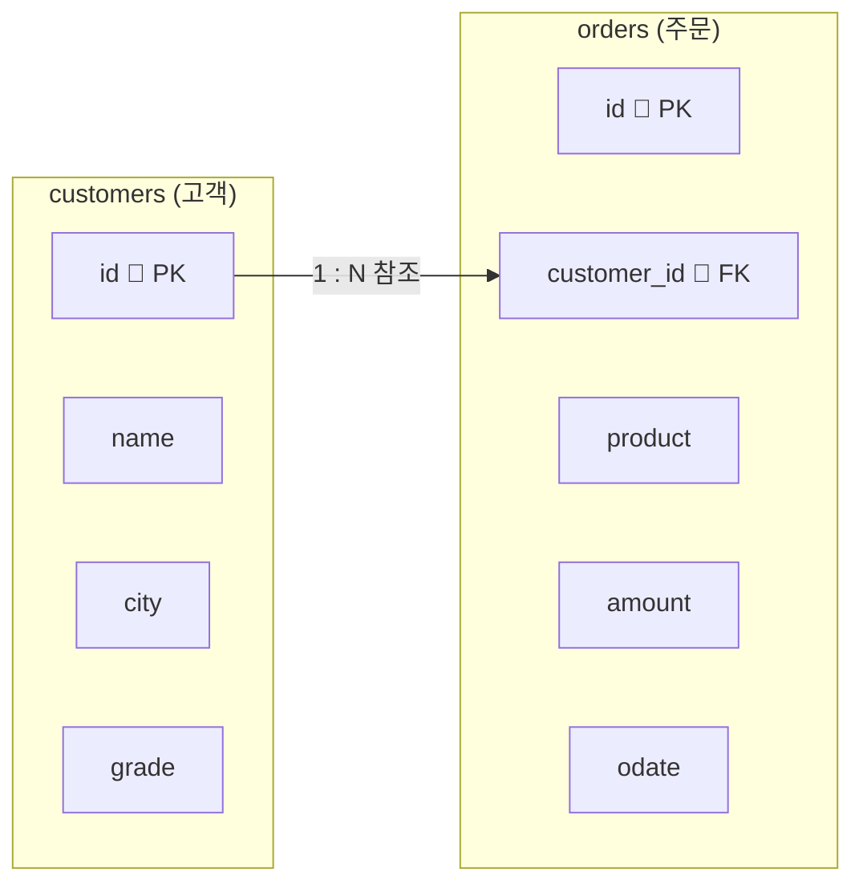

# 2026년 1학기 (재직자반) 데이터베이스 보안 기말고사 준비 문제


---

## 환경설정

### 1. 준비물

- **MySQL Server** 8.0 이상
- **MySQL Workbench**

### 2. 시작 방법

1. MySQL Workbench를 실행합니다.
2. 로컬 연결(`Local instance MySQL`)을 클릭해서 접속합니다.
3. 상단 메뉴에서 새 쿼리 창(SQL Editor)을 엽니다.
4. 아래 **문제**의 SQL을 **1번부터 순서대로** 입력하고, 번개(⚡) 버튼으로 한 줄씩 실행합니다.

### 3. 시험에서 사용할 데이터 구조

이번 시험은 **온라인 쇼핑몰**을 가정합니다.  
고객 정보를 담는 `customers` 테이블과, 주문 내역을 담는 `orders` 테이블을 만듭니다.



- 한 명의 고객은 여러 번 주문할 수 있습니다 → **1:N 관계**
- `orders.customer_id`는 `customers.id`를 외래키로 참조합니다.

> 문제 1~5에서 위 구조를 직접 만들고 데이터를 채운 뒤, 문제 6~20에서 조회합니다.  
> **앞 문제를 실행해야 뒤 문제가 동작합니다.** 반드시 순서대로 풀어 주세요.
{: .prompt-warning }

---

## 문제와 정답

> 각 문제 바로 아래에 **정답**이 있습니다.  
> 먼저 스스로 SQL을 작성해 실행해 보고, 그다음 정답과 비교해 보세요.
{: .prompt-tip }

---

### 문제 1

`exam_db`라는 이름의 데이터베이스를 만들고, 그 데이터베이스를 사용하도록 전환하세요.

**정답**

```sql
CREATE DATABASE exam_db;
USE exam_db;
```

---

### 문제 2

아래 조건에 맞는 `customers` 테이블을 만드세요.

| 칼럼 | 자료형 | 제약조건 |
|---|---|---|
| `id` | INT | 기본키(PK), 자동 증가 |
| `name` | VARCHAR(20) | NOT NULL |
| `city` | VARCHAR(20) | NOT NULL |
| `grade` | VARCHAR(10) | 값을 안 넣으면 기본값 `'일반'` |

**정답**

```sql
CREATE TABLE customers (
  id    INT          PRIMARY KEY AUTO_INCREMENT,
  name  VARCHAR(20)  NOT NULL,
  city  VARCHAR(20)  NOT NULL,
  grade VARCHAR(10)  DEFAULT '일반'
);
```

---

### 문제 3

아래 조건에 맞는 `orders` 테이블을 만드세요.  
`customer_id`는 `customers` 테이블의 `id`를 참조하는 **외래키**여야 합니다.

| 칼럼 | 자료형 | 제약조건 |
|---|---|---|
| `id` | INT | 기본키(PK), 자동 증가 |
| `customer_id` | INT | NOT NULL, 외래키(→ customers.id) |
| `product` | VARCHAR(30) | NOT NULL |
| `amount` | INT | NOT NULL |
| `odate` | DATE | NOT NULL |

**정답**

```sql
CREATE TABLE orders (
  id          INT          PRIMARY KEY AUTO_INCREMENT,
  customer_id INT          NOT NULL,
  product     VARCHAR(30)  NOT NULL,
  amount      INT          NOT NULL,
  odate       DATE         NOT NULL,
  FOREIGN KEY (customer_id) REFERENCES customers(id)
);
```

---

### 문제 4

`customers` 테이블에 아래 5명의 고객을 넣으세요. (`id`는 자동 증가이므로 생략합니다)

| name | city | grade |
|---|---|---|
| 김민준 | 서울 | VIP |
| 이서연 | 부산 | 일반 |
| 박지호 | 서울 | 일반 |
| 최하은 | 대구 | VIP |
| 정우진 | 서울 | 일반 |

**정답**

```sql
INSERT INTO customers (name, city, grade) VALUES ('김민준', '서울', 'VIP');
INSERT INTO customers (name, city, grade) VALUES ('이서연', '부산', '일반');
INSERT INTO customers (name, city, grade) VALUES ('박지호', '서울', '일반');
INSERT INTO customers (name, city, grade) VALUES ('최하은', '대구', 'VIP');
INSERT INTO customers (name, city, grade) VALUES ('정우진', '서울', '일반');
```

---

### 문제 5

`orders` 테이블에 아래 10건의 주문을 넣으세요. (`id`는 자동 증가이므로 생략합니다)

| customer_id | product | amount | odate |
|---|---|---|---|
| 1 | 노트북 | 1200000 | 2026-04-02 |
| 1 | 마우스 | 30000 | 2026-04-05 |
| 2 | 키보드 | 50000 | 2026-04-07 |
| 3 | 모니터 | 300000 | 2026-04-10 |
| 2 | 노트북 | 1500000 | 2026-04-12 |
| 4 | 태블릿 | 800000 | 2026-04-15 |
| 1 | 헤드셋 | 150000 | 2026-05-03 |
| 3 | 마우스 | 30000 | 2026-05-08 |
| 5 | 모니터 | 350000 | 2026-05-11 |
| 4 | 키보드 | 60000 | 2026-05-20 |

**정답**

```sql
INSERT INTO orders (customer_id, product, amount, odate) VALUES (1, '노트북', 1200000, '2026-04-02');
INSERT INTO orders (customer_id, product, amount, odate) VALUES (1, '마우스',   30000, '2026-04-05');
INSERT INTO orders (customer_id, product, amount, odate) VALUES (2, '키보드',   50000, '2026-04-07');
INSERT INTO orders (customer_id, product, amount, odate) VALUES (3, '모니터',  300000, '2026-04-10');
INSERT INTO orders (customer_id, product, amount, odate) VALUES (2, '노트북', 1500000, '2026-04-12');
INSERT INTO orders (customer_id, product, amount, odate) VALUES (4, '태블릿',  800000, '2026-04-15');
INSERT INTO orders (customer_id, product, amount, odate) VALUES (1, '헤드셋',  150000, '2026-05-03');
INSERT INTO orders (customer_id, product, amount, odate) VALUES (3, '마우스',   30000, '2026-05-08');
INSERT INTO orders (customer_id, product, amount, odate) VALUES (5, '모니터',  350000, '2026-05-11');
INSERT INTO orders (customer_id, product, amount, odate) VALUES (4, '키보드',   60000, '2026-05-20');
```

> 입력 후 `SELECT * FROM orders;` 로 10줄이 보이면 성공입니다. ✅
{: .prompt-info }

---

### 문제 6

존재하지 않는 고객 번호(`customer_id = 99`)로 주문을 넣으면 어떤 일이 일어나는지 아래 SQL을 실행해 확인하고, **왜 그런 결과가 나오는지** 한 문장으로 설명하세요.

```sql
INSERT INTO orders (customer_id, product, amount, odate)
VALUES (99, '스피커', 90000, '2026-05-25');
```

**정답**

```
ERROR 1452: Cannot add or update a child row:
a foreign key constraint fails
```

**이유**: `customers` 테이블에 `id=99`인 고객이 없기 때문에, 외래키 제약조건이 입력을 막은 것입니다.  
(외래키는 부모 테이블에 존재하는 값만 자식 테이블에 넣을 수 있습니다.)

---

### 문제 7

전체 주문이 총 몇 건인지 세어 보세요.

**정답**

```sql
SELECT COUNT(*) AS 총주문수
FROM orders;
```

결과: `10`

---

### 문제 8

`city`가 `'서울'`인 고객이 몇 명인지 세어 보세요.

**정답**

```sql
SELECT COUNT(*) AS 서울고객수
FROM customers
WHERE city = '서울';
```

결과: `3`

---

### 문제 9

전체 주문 금액(`amount`)의 합계를 구하세요.

**정답**

```sql
SELECT SUM(amount) AS 총주문금액
FROM orders;
```

결과: `4470000`

---

### 문제 10

전체 주문 금액의 평균을 구하세요.

**정답**

```sql
SELECT AVG(amount) AS 평균주문금액
FROM orders;
```

결과: `447000`

---

### 문제 11

주문 금액 중 가장 큰 값과 가장 작은 값을 한 번에 구하세요.

**정답**

```sql
SELECT MAX(amount) AS 최대금액,
       MIN(amount) AS 최소금액
FROM orders;
```

결과: 최대 `1500000`, 최소 `30000`

---

### 문제 12

주문 금액이 **300,000원 이상**인 주문이 몇 건인지 세어 보세요.

**정답**

```sql
SELECT COUNT(*) AS 고액주문수
FROM orders
WHERE amount >= 300000;
```

결과: `5`

---

### 문제 13

**4월(2026-04-01 ~ 2026-04-30)** 에 들어온 주문이 몇 건인지 `BETWEEN`을 사용해 세어 보세요.

**정답**

```sql
SELECT COUNT(*) AS 사월주문수
FROM orders
WHERE odate BETWEEN '2026-04-01' AND '2026-04-30';
```

결과: `6`

---

### 문제 14

상품(`product`)이 **'노트북' 또는 '모니터'** 인 주문이 몇 건인지 `IN`을 사용해 세어 보세요.

**정답**

```sql
SELECT COUNT(*) AS 노트북모니터수
FROM orders
WHERE product IN ('노트북', '모니터');
```

결과: `4`

---

### 문제 15

**1번 고객(`customer_id = 1`)** 이 주문한 것 중 **금액이 100,000원 이상**인 주문이 몇 건인지 세어 보세요.

**정답**

```sql
SELECT COUNT(*) AS 일번고객고액주문수
FROM orders
WHERE customer_id = 1 AND amount >= 100000;
```

결과: `2`

---

### 문제 16

**5월(2026-05-01 ~ 2026-05-31)** 주문 금액의 합계를 구하세요.

**정답**

```sql
SELECT SUM(amount) AS 오월주문합계
FROM orders
WHERE odate BETWEEN '2026-05-01' AND '2026-05-31';
```

결과: `590000`

---

### 문제 17

주문된 상품의 **종류가 몇 가지**인지 중복을 제거하고 세어 보세요. (`DISTINCT` 사용)

**정답**

```sql
SELECT COUNT(DISTINCT product) AS 상품종류수
FROM orders;
```

결과: `6` (노트북, 마우스, 키보드, 모니터, 태블릿, 헤드셋)

---

### 문제 18

**'노트북' 또는 '모니터'** 이면서 **금액이 500,000원 이상**인 주문이 몇 건인지 세어 보세요. (`OR` + 괄호 + `AND` 사용)

**정답**

```sql
SELECT COUNT(*) AS 주문수
FROM orders
WHERE (product = '노트북' OR product = '모니터')
  AND amount >= 500000;
```

결과: `2`

> 괄호로 묶지 않으면 `product = '모니터' AND amount >= 500000`만 함께 계산되어  
> 노트북이 금액과 상관없이 모두 포함되므로 결과가 달라집니다. **괄호를 반드시 사용하세요.**
{: .prompt-warning }

---

### 문제 19

두 테이블을 키로 연결해서, **고객 이름 · 상품 · 금액**을 함께 조회하세요.  
(`WHERE`절에서 `orders.customer_id = customers.id`로 연결합니다)

**정답**

```sql
SELECT customers.name    AS 고객이름,
       orders.product    AS 상품,
       orders.amount     AS 금액
FROM orders
WHERE orders.customer_id = customers.id;
```

결과:

```
고객이름 | 상품   | 금액
김민준   | 노트북 | 1200000
김민준   | 마우스 |   30000
이서연   | 키보드 |   50000
박지호   | 모니터 |  300000
이서연   | 노트북 | 1500000
최하은   | 태블릿 |  800000
김민준   | 헤드셋 |  150000
박지호   | 마우스 |   30000
정우진   | 모니터 |  350000
최하은   | 키보드 |   60000
```

---

### 문제 20

문제 19의 조회에 조건을 더 얹어, **'김민준'** 고객이 주문한 상품과 금액만 조회하세요.

**정답**

```sql
SELECT customers.name    AS 고객이름,
       orders.product    AS 상품,
       orders.amount     AS 금액
FROM orders
WHERE orders.customer_id = customers.id
  AND customers.name = '김민준';
```

결과:

```
고객이름 | 상품   | 금액
김민준   | 노트북 | 1200000
김민준   | 마우스 |   30000
김민준   | 헤드셋 |  150000
```

---

## 시험 범위 요약

| 영역 | 관련 주차 | 문제 번호 |
|---|---|---|
| DB·테이블 생성 (PK, AUTO_INCREMENT, NOT NULL, DEFAULT) | 6주차 | 1, 2 |
| 외래키(FK)로 테이블 연결 | 6주차 | 3, 6 |
| 데이터 입력 (INSERT) | 5·6주차 | 4, 5 |
| 집계 함수 (COUNT, SUM, AVG, MAX, MIN) | 5주차 | 7~11 |
| 조건 조회 (비교, BETWEEN, IN, AND, OR, DISTINCT) | 5주차 | 12~18 |
| 키로 두 테이블 연결 조회 | 6주차 | 19, 20 |

> 다섯 가지만 기억하시면 됩니다: **만들고(CREATE) → 넣고(INSERT) → 세고(COUNT) → 계산하고(SUM·AVG·MAX·MIN) → 연결하기(FK 조회).**  
> 모든 문제는 이 흐름 안에 있습니다.
{: .prompt-tip }

---
