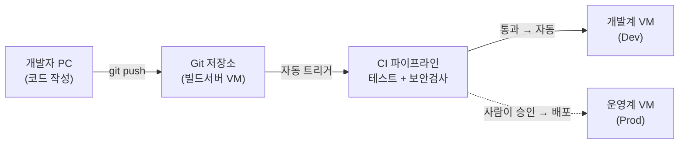
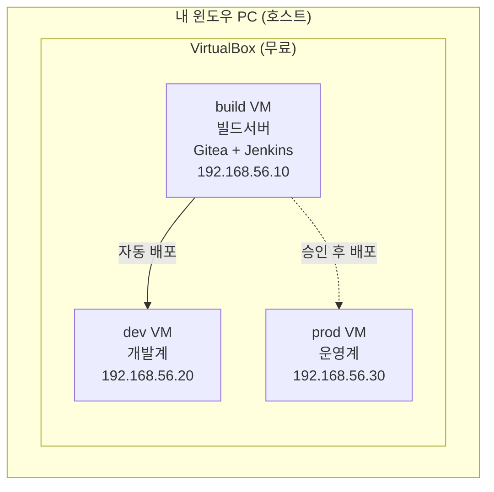

> 이 글은 **첫 시간(오리엔테이션)** 용입니다. 직접 실습하는 내용은 없고, **무엇을 어떤 순서로 배우는지** 와 **실습 환경을 어떻게 준비하는지** 를 안내합니다.
{: .prompt-info }

## 1. 이 과정은 무엇인가

이 과정은 **"개발자가 만든 프로그램을, 사람이 손으로 옮기지 않고, 자동으로 안전하게 서버에 올리는 방법"** 을 배우는 과목입니다.

한 문장으로 목표를 정하면 이렇습니다.

> **개발자가 Git에 파이썬 코드를 올리면 → 자동으로 테스트·보안검사를 거쳐 → 개발계 서버에 배포되고 → 승인하면 운영계 서버까지 배포되는** 자동화 파이프라인을, 전부 **무료 오픈소스**로, **VirtualBox의 Ubuntu** 위에 직접 만든다.
{: .prompt-tip }

- **대상**: 자동화·서버 운영을 처음 접하는 **1학년 / 비전공자**
- **준비 지식**: 리눅스 터미널을 조금 다뤄 봤으면 좋지만, 몰라도 한 줄씩 따라 할 수 있게 설명합니다.
- **핵심 약속**: 모든 실습은 **복사-붙여넣기 가능한 명령어**와 **단계별 화면 설명**으로 제공합니다.

---

## 2. 먼저 알아야 할 용어 4개

이 과정 내내 나오는 핵심 단어 4개를 먼저 한 줄로 잡고 갑니다.

| 용어 | 뜻 | 비유 |
|---|---|---|
| **CI** (지속적 통합) | 코드를 올릴 때마다 자동으로 **합치고·빌드하고·테스트** | 공장 **입고 검사** |
| **CD** (지속적 배포) | 검사를 통과한 코드를 자동으로 **서버에 배포** | 검수 통과품 **출고** |
| **DevSecOps** | 위 자동화 벨트 중간에 **"보안 검사"를 끼워 넣음** | 컨베이어 벨트의 **금속탐지기** |
| **MLOps** | 똑같은 자동화를 **"AI 모델 학습·배포"** 에 적용 | 같은 공장, **다른 제품** |

> 가장 중요한 깨달음: **이 네 가지는 서로 다른 기술이 아니라, "같은 자동화 벨트 위에 무엇을 올리느냐"의 차이**입니다.  
> 그래서 이 과정도 **벨트 깔기 → 보안 끼우기 → ML 올리기** 순서로 진행합니다.
{: .prompt-warning }

---

## 3. 10주 뒤 우리가 갖게 될 것 — 미리보기

이 그림 한 장이 이 과정의 **최종 결과물**입니다. 지금은 복잡해 보여도, 매주 한 칸씩 직접 만들어 붙이면 10주 뒤엔 전부 이해하게 됩니다.

---

## 4. 이 과정의 중심축 — 개발계 vs 운영계

학생들이 가장 많이 헷갈리는 부분이라 처음부터 분명히 잡고 갑니다.

| 구분 | **개발계 (Dev)** | **운영계 (Prod)** |
|---|---|---|
| 목적 | **실험·테스트** (망가져도 됨) | **실제 서비스** (망가지면 안 됨) |
| 배포 | 코드 올리면 **자동**으로 즉시 | **사람이 승인**한 뒤에만 |
| 데이터 | 가짜·샘플 데이터 | 진짜 데이터 |
| 접근 권한 | 개발자 누구나 | 엄격히 제한 |

> 자동화의 황금률: **"개발계는 자동, 운영계는 승인 게이트(gate)를 거친 자동"**  
> 이 차이를 **실제 가상머신과 파이프라인으로 구현**하는 것이 이 과정의 뼈대입니다.
{: .prompt-tip }

---

## 5. 우리가 쓸 무료 오픈소스 도구 (전부 0원)

라이선스 비용이 한 푼도 들지 않는 도구만 사용합니다.

| 단계 | 도구 | 역할 |
|---|---|---|
| 버전관리 | **Git** + **Gitea** | 코드 저장·이력 관리 (셀프호스팅) |
| CI/CD 엔진 | **Jenkins** | 자동화 벨트의 본체 |
| 빌드·테스트 | **pytest · venv · pip** | 파이썬 테스트 |
| 컨테이너 | **Docker** | 앱을 통째로 포장 |
| 인프라 자동화 | **Ansible** | 서버 구성·배포 자동화 |
| 보안 (소스) | **Bandit · Semgrep** | 소스코드 취약점 검사(SAST) |
| 보안 (의존성) | **pip-audit** | 라이브러리 취약점 검사 |
| 보안 (시크릿) | **gitleaks** | 비밀번호 유출 탐지 |
| 보안 (이미지·실행) | **Trivy · OWASP ZAP** | 컨테이너·실행 중 취약점 |
| MLOps | **MLflow · DVC** | 모델 학습·버전·배포 |

---

## 6. 전체 편성표 (11개 카테고리, 약 10주)

각 카테고리는 **이론 1개 + 실습 1~2개** 로 구성됩니다.  
난이도 표시: 🟢 **직접 실습** · 🟡 **단순화 실습** · 🔴 **데모/이론**(직접 하지 않고 시연·개념으로)

| 카테고리 | 이론에서 다루는 것 | 실습에서 하는 것 |
|---|---|---|
| **00. 오리엔테이션** | 과정 편성·핵심 개념 | (이 글) |
| **01. 실습 환경 구축** | 가상화·네트워크 개념 | 🟡 VirtualBox + Ubuntu VM **3대** 구축 |
| **02. Git & 버전관리** | Git 개념, 브랜치 전략 | 🟢 Gitea 설치, 커밋·브랜치·PR |
| **03. 파이썬 빌드 기초** | 빌드·의존성·테스트 개념 | 🟢 Flask 앱 + pytest 테스트 |
| **04. CI 파이프라인** | CI·Jenkins 구조 | 🟢 Jenkins 설치, push→자동 빌드 |
| **05. CD: 개발계 자동배포** | CD·systemd·롤백 | 🟢 dev 서버 자동 배포, 롤백 |
| **06. 컨테이너화** | Docker·이미지·레지스트리 | 🟢 앱 이미지화, 빌드→배포 |
| **07. IaC & 운영계 승격** | Ansible·승인 게이트 | 🟢 운영계 구성, **승인 후 배포** |
| **08. DevSecOps ①** | shift-left, 보안 게이트 | 🟢 Bandit·pip-audit·gitleaks |
| **09. DevSecOps ②** | 컨테이너 보안, DAST | 🟢 Trivy 스캔 · 🔴 ZAP 데모 |
| **10. MLOps & 종합** | MLOps 개념, MLflow | 🟢 모델 학습→배포, 전체 복습 |

> 🔴 항목은 **직접 실습하지 않습니다.** 설정이 1학년에게 과하기 때문에 시연·개념으로 대체하지만, **무엇을 왜 하는지**는 그대로 다룹니다.
{: .prompt-warning }

---

## 7. 실습 환경 — VirtualBox + Ubuntu VM 3대

이 과정은 윈도우 PC 한 대 위에 **가상머신(VM) 3대** 를 올려서 사용합니다.

| VM | 역할 | IP(내부망) | 비유 |
|---|---|---|---|
| **build** | 빌드서버 | 192.168.56.10 | "자동화 공장" |
| **dev** | 개발계 | 192.168.56.20 | "실험실 매대" |
| **prod** | 운영계 | 192.168.56.30 | "실제 매장 진열대" |

### 7.1 왜 가상머신(VM)을 쓰나?

- **안전**: 내 윈도우가 아니라 격리된 가상 컴퓨터 안에서만 작업하므로, 실수해도 PC는 멀쩡합니다.
- **동일 환경**: 모두가 똑같은 Ubuntu를 쓰므로 화면·명령어가 교재와 100% 일치합니다.
- **되돌리기**: 문제가 생기면 **스냅샷**으로 처음 상태로 복구할 수 있습니다.
- **현실 반영**: 실제 회사도 빌드·개발계·운영계를 **별도 서버**로 나눕니다. 그 구조를 그대로 축소해 체험합니다.

### 7.2 준비물

- **윈도우 PC** (RAM **8GB 이상** 권장 — VM 3대를 동시에 켜기 위함)
- 여유 디스크 **50GB 이상**
- 인터넷 연결 (도구 다운로드용)

> RAM이 부족하면 VM을 한 번에 1~2대만 켜거나, 01회차에서 안내하는 **메모리 절약 설정**을 따르면 됩니다.
{: .prompt-info }

---

## 8. 수업 진행 방식

1. **이론 (X-1)** — 개념과 원리를 그림·비유로 이해합니다. (예: "CI는 왜 필요한가?")
2. **실습 (X-2, X-3)** — VM 안에서 직접 도구를 설치하고 파이프라인을 한 칸씩 만듭니다.
3. **데모(🔴)** — 너무 복잡한 주제는 시연·개념 설명으로 대체합니다.

> 매주 결과물은 **직전 주차 결과물 위에 한 칸만** 추가됩니다. 중간에 길을 잃지 않도록 설계했습니다.
{: .prompt-tip }

---

## 9. 다음 시간

**01. 실습 환경 구축** — VirtualBox 설치부터 Ubuntu 가상머신 3대(빌드/개발/운영)를 올리고, 세 머신이 서로 통신되는지 확인하는 것까지 함께 진행합니다. 이 한 번의 준비가 10주 전체 실습의 토대가 됩니다.
