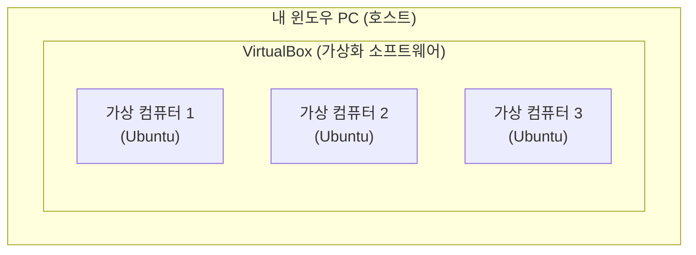
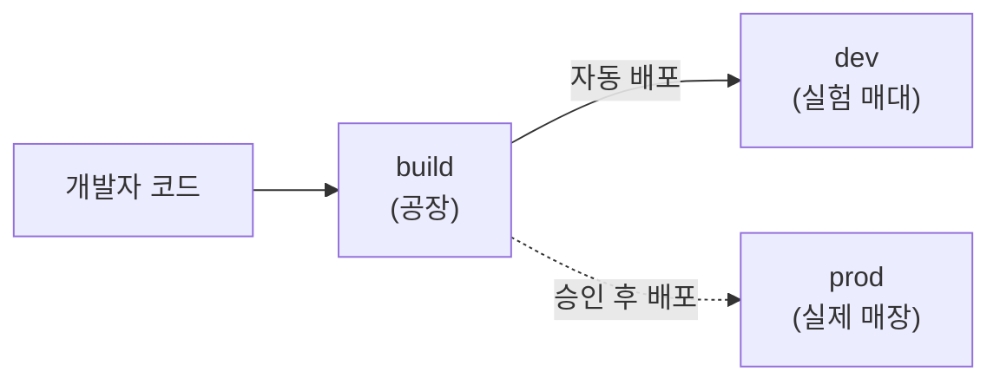
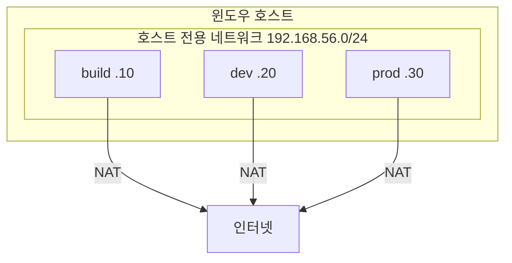

> 이번 글은 **순수 이론**입니다. 다음 글(01-2, 01-3)에서 실제로 VM을 설치하기 전에, **"왜 이렇게 구성하는지"** 를 먼저 이해합니다.
{: .prompt-info }

## 1. 가상머신(VM)이란 무엇인가

**가상머신(Virtual Machine, VM)** 은 **내 컴퓨터 안에 소프트웨어로 만든 또 하나의 컴퓨터** 입니다.

- 윈도우 PC 한 대 안에, 리눅스 컴퓨터를 여러 대 "흉내 내어" 만들 수 있습니다.
- 이 가짜 컴퓨터들은 진짜 컴퓨터처럼 운영체제(OS)를 깔고, 프로그램을 돌리고, 네트워크로 통신합니다.

| 용어 | 뜻 |
|---|---|
| **호스트(Host)** | 진짜 컴퓨터 (내 윈도우 PC) |
| **게스트(Guest)** | 가상으로 만든 컴퓨터 (Ubuntu VM) |
| **VirtualBox** | 게스트를 만들고 돌려주는 무료 소프트웨어 |

> 우리는 **Oracle VirtualBox**(무료)를 써서 **Ubuntu 게스트 3대**를 호스트(윈도우) 위에 올립니다.
{: .prompt-tip }

### 1.1 왜 굳이 VM을 쓰나?

- **격리**: 가상 컴퓨터가 망가져도 진짜 PC는 멀쩡합니다.
- **복제**: 한 대를 잘 만들어 두면 **복사(Clone)** 로 똑같은 컴퓨터를 순식간에 여러 대 만듭니다.
- **스냅샷**: 특정 시점을 사진 찍듯 저장해 두고, 문제가 생기면 그 순간으로 되돌립니다.
- **현실 연습**: 실제 회사 서버 여러 대를 다루는 연습을, 내 PC 한 대 안에서 할 수 있습니다.

---

## 2. 왜 서버를 3대로 나누나 — 3계층 구조

이 과정의 핵심 구조입니다. 서버를 **빌드 / 개발계 / 운영계** 세 역할로 나눕니다.

| VM 이름 | 역할 | 한 줄 설명 | 비유 |
|---|---|---|---|
| **build** | 빌드서버 | 코드를 받아 검사·포장해서 배포를 지휘 | **자동화 공장** |
| **dev** | 개발계 | 만든 프로그램을 **먼저 실험**해 보는 곳 | **시제품 매대** |
| **prod** | 운영계 | **진짜 사용자**가 쓰는 실제 서비스 | **실제 매장 진열대** |

### 2.1 개발계와 운영계는 무엇이 다른가

| 구분 | **개발계 (dev)** | **운영계 (prod)** |
|---|---|---|
| 목적 | 실험·테스트 (망가져도 됨) | 실제 서비스 (망가지면 안 됨) |
| 배포 방식 | 코드 올리면 **자동**으로 즉시 | **사람이 승인**한 뒤에만 |
| 데이터 | 가짜·샘플 | 진짜 사용자 데이터 |

> **왜 나누나?** 새 코드를 곧바로 실제 서비스에 올리면, 버그가 있을 때 **진짜 사용자가 피해**를 봅니다.  
> 그래서 먼저 **개발계에서 안전하게 실험**하고, 문제없을 때만 **운영계로 승격**합니다.
{: .prompt-warning }

이 "개발계는 자동, 운영계는 승인 후"라는 원칙은 10주 내내 반복됩니다.

---

## 3. VM의 네트워크 — 어댑터 2개를 단다

VM도 진짜 컴퓨터처럼 **네트워크 카드(어댑터)** 가 있어야 통신합니다. 우리는 각 VM에 **어댑터를 2개** 답니다. 이유가 중요합니다.

| 어댑터 종류 | 역할 | 비유 |
|---|---|---|
| **NAT** | VM이 **인터넷**에 나가게 해 줌 (도구 다운로드용) | 집 밖으로 나가는 **현관문** |
| **호스트 전용 어댑터** | VM끼리, 그리고 호스트와 **내부에서만** 통신 | 집 안 식구끼리 쓰는 **내부 전화** |

### 3.1 왜 두 개나 다나?

- **NAT 하나만** 있으면: 인터넷은 되지만, VM끼리 **고정된 주소로 서로를 부르기**가 불편합니다.
- **호스트 전용 하나만** 있으면: VM끼리는 통신되지만 **인터넷이 안 되어** 도구를 설치할 수 없습니다.
- 그래서 **둘 다** 답니다 — 인터넷(NAT)과 내부 통신(호스트 전용)을 각각 맡깁니다.

### 3.2 고정 IP를 쓰는 이유

내부망(호스트 전용)에서 각 VM에 **변하지 않는 주소(고정 IP)** 를 줍니다.

| VM | 내부 IP |
|---|---|
| build | **192.168.56.10** |
| dev | **192.168.56.20** |
| prod | **192.168.56.30** |

> 자동 배포는 "build가 192.168.56.20(dev)로 파일을 보낸다"처럼 **주소를 콕 집어** 동작합니다.  
> 주소가 매번 바뀌면 자동화가 깨지므로 **고정 IP** 가 필수입니다.
{: .prompt-tip }

---

## 4. 우리가 쓸 운영체제 — Ubuntu Server

세 VM 모두 **Ubuntu Server**(LTS, 장기지원판)를 씁니다.

- **Server 판**은 화면(GUI)이 없고 **글자(터미널)** 로만 다룹니다. 가볍고, 실제 서버와 똑같습니다.
- 처음엔 낯설지만, 모든 명령을 **복사-붙여넣기**로 제공하므로 따라올 수 있습니다.
- 데스크톱판보다 **메모리를 훨씬 적게** 써서, VM 3대를 동시에 켜기에 유리합니다.

| 구분 | Ubuntu Desktop | **Ubuntu Server (우리 선택)** |
|---|---|---|
| 화면 | 마우스 GUI | 글자 터미널만 |
| 메모리 | 많이 씀 | 적게 씀 |
| 실제 서버와 | 다름 | **똑같음** |

---

## 5. 스냅샷 — 안전벨트

**스냅샷(Snapshot)** 은 VM의 **특정 순간을 통째로 저장**하는 기능입니다.

- 설정을 마친 깨끗한 상태에서 스냅샷을 찍어 둡니다.
- 실습 중 무언가 꼬이면, 스냅샷으로 **그 깨끗한 순간으로 즉시 복구**합니다.
- "다시 설치"할 필요 없이 몇 초 만에 되돌아갑니다.

> 실습 전 **반드시 스냅샷**을 찍는 습관을 들이세요. 자동화 실습은 시스템 설정을 많이 건드리므로, 되돌릴 안전벨트가 꼭 필요합니다.
{: .prompt-warning }

---

## 6. 이번 회차 실습 미리보기

다음 두 실습에서 아래를 직접 합니다.

- **01-2 실습**: VirtualBox 설치 → Ubuntu Server VM 1대 설치 → **복제로 3대** 만들기 → 어댑터 2개·고정 IP 설정
- **01-3 실습**: VM 3대가 서로 **ping·SSH** 되는지 확인 → 스냅샷 찍기 → 공통 계정 정리

---

## 7. 핵심 정리

| 개념 | 한 줄 요약 |
|---|---|
| 호스트 / 게스트 | 진짜 PC / 가상 컴퓨터(VM) |
| 3계층 | build(공장) · dev(실험) · prod(실제) |
| 개발계 vs 운영계 | 자동 배포 vs **승인 후** 배포 |
| 어댑터 2개 | NAT(인터넷) + 호스트 전용(내부 통신) |
| 고정 IP | .10 / .20 / .30 — 자동화가 주소를 콕 집기 위함 |
| 스냅샷 | 깨끗한 순간으로 되돌리는 안전벨트 |

다음 글 **01-2** 에서 VirtualBox와 Ubuntu를 실제로 설치합니다.
