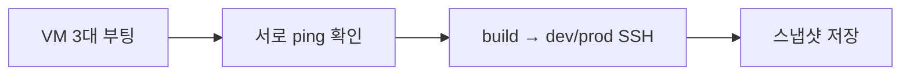
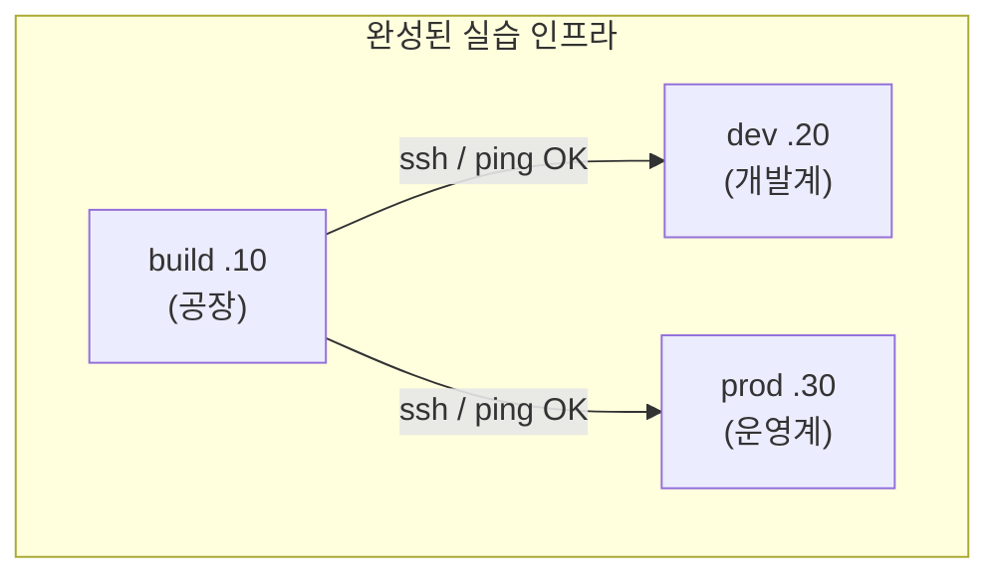

> 이번 글은 **직접 따라 하는 실습**입니다. 01-2에서 만든 VM 3대(build·dev·prod)가 **서로 통신**되는지 확인하고, 깨끗한 상태를 **스냅샷**으로 저장합니다.
{: .prompt-info }

## 0. 이번 실습의 목표



이번 회차가 끝나면 **"build가 dev·prod에 명령을 보낼 수 있는"** 토대가 완성됩니다. 이것이 5회차부터 시작하는 자동 배포의 출발점입니다.

---

## 1. VM 3대 모두 켜기

VirtualBox에서 **build · dev · prod** 세 VM을 모두 시작하고 각각 로그인합니다(`devops` / `devops123`).

프롬프트가 각각 이렇게 보여야 합니다.

```
devops@build:~$
devops@dev:~$
devops@prod:~$
```

> RAM이 부족해 3대를 동시에 못 켜면, 이번 실습은 **build + dev 2대씩** 짝지어 진행해도 됩니다.
{: .prompt-tip }

---

## 2. 내부망 통신 확인 (ping)

**build** VM에서 dev와 prod로 ping을 보냅니다.

```bash
# build VM에서 실행
ping -c2 192.168.56.20   # dev
ping -c2 192.168.56.30   # prod
```

양쪽 모두 `2 received` 가 나오면 내부망이 살아 있는 것입니다. 반대로 dev에서도 확인해 봅니다.

```bash
# dev VM에서 실행
ping -c2 192.168.56.10   # build
```

> ping이 안 되면: 01-2의 netplan(고정 IP)과 **어댑터 2(호스트 전용)** 가 같은 네트워크에 연결됐는지 다시 확인하세요. 세 VM의 어댑터 2는 **동일한 호스트 전용 네트워크**여야 합니다.
{: .prompt-warning }

---

## 3. 이름으로 부르기 — hosts 파일 등록

매번 IP를 외우긴 번거롭습니다. 세 VM **모두** 에서 `/etc/hosts` 에 이름을 등록합니다.

```bash
sudo nano /etc/hosts
```

파일 끝에 아래 3줄을 추가하고 저장합니다.

```
192.168.56.10   build
192.168.56.20   dev
192.168.56.30   prod
```

이제 IP 대신 이름으로 통신할 수 있습니다.

```bash
ping -c2 dev
ping -c2 prod
```

> 자동화 스크립트에서 `192.168.56.20` 대신 `dev` 라고 쓸 수 있어 가독성이 좋아집니다.
{: .prompt-tip }

---

## 4. SSH 원격 접속 확인

**SSH(Secure Shell)** 는 다른 컴퓨터에 **암호화된 원격 접속**을 하는 도구입니다. 자동 배포는 결국 "build가 dev/prod에 SSH로 접속해 명령을 내리는 것"이므로, 먼저 손으로 확인합니다.

**build** VM에서 dev로 접속합니다.

```bash
# build VM에서 실행
ssh devops@dev
```

처음 접속하면 **호스트 키를 신뢰하겠냐**는 질문이 나옵니다. `yes` 를 입력하고, 비밀번호 `devops123` 을 칩니다.

```
The authenticity of host 'dev (192.168.56.20)' can't be established.
...
Are you sure you want to continue connecting (yes/no)? yes
devops@dev's password:
```

접속에 성공하면 프롬프트가 `devops@dev:~$` 로 바뀝니다. 빠져나오려면:

```bash
exit
```

같은 방식으로 prod에도 접속해 봅니다.

```bash
ssh devops@prod
```

> **호스트 키(host key)** 란? 접속 대상 서버의 "지문"입니다. 처음 한 번 신뢰해 두면, 다음부터 같은 서버인지 자동 확인해 **중간자 공격**을 막아 줍니다. 이 개념은 05회차 자동 배포에서 다시 나옵니다.
{: .prompt-info }

---

## 5. 기본 패키지 업데이트 (3대 모두)

이후 실습을 매끄럽게 하기 위해, 세 VM 모두에서 패키지 목록을 갱신하고 기본 도구를 깔아 둡니다.

```bash
sudo apt update && sudo apt -y upgrade
sudo apt -y install curl wget git net-tools
```

> `git` 은 다음 02회차의 주인공입니다. 미리 깔아 둡니다.
{: .prompt-tip }

---

## 6. 스냅샷 — 깨끗한 상태 저장 (가장 중요)

지금이 **모든 것이 정상인 깨끗한 순간**입니다. 반드시 스냅샷을 찍어 둡니다.

각 VM에 대해:

1. VirtualBox 메인 화면에서 해당 VM 선택
2. 오른쪽 위 메뉴(또는 우클릭) → **스냅샷(Snapshots)**
3. **찍기(Take)** → 이름: `01-clean-network` → 설명: "고정IP·SSH·업데이트 완료" → 확인

build · dev · prod **세 대 모두** 찍습니다.

> 앞으로 실습이 꼬이면, 이 `01-clean-network` 스냅샷으로 되돌리면 됩니다. **재설치 없이** 깨끗한 출발점으로 돌아갑니다.
{: .prompt-warning }

---

## 7. 체크포인트

| 항목 | 확인 방법 | 기대 결과 |
|---|---|---|
| 내부 ping | build에서 `ping dev`, `ping prod` | 응답 옴 |
| 이름 해석 | `ping dev` (IP 대신 이름) | 동작 |
| SSH | build에서 `ssh devops@dev` | 로그인 성공 |
| 업데이트 | `git --version` | 버전 출력 |
| 스냅샷 | VirtualBox 스냅샷 목록 | 3대 모두 `01-clean-network` |

---

## 8. 1주차 정리



이제 **빈 서버 3대**가 서로 통신되는 상태가 됐습니다. 다음 **02회차** 부터는 이 위에 **Git 저장소(Gitea)** 를 올려, 코드를 버전 관리하고 자동화의 첫 단추를 끼웁니다.
