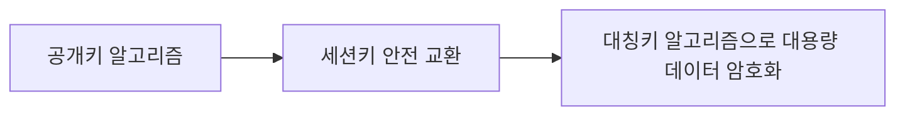

# 현대 암호 #2: 공개키 암호체계와 무결성

---

## 1. 왜 공개키 암호가 필요했는가

### 1.1 대칭키의 핵심 문제: 키 분배

대칭키 암호는 빠르고 강력하지만, 송신자와 수신자가 같은 키를 안전하게 공유해야 한다.

- 통신 전 키를 어떻게 전달할 것인가?
- 전달 과정에서 도청되면 어떻게 할 것인가?
- 사용자 수가 늘어날수록 키 관리가 폭발적으로 어려워진다.

이 문제를 **Key Distribution Problem**이라고 부른다.

### 1.2 1970년대 환경 변화

PDF에서 강조하듯 1970년대에는:

1. 컴퓨터 네트워크 확산
2. 이메일 등장
3. 전자상거래 구상
4. 글로벌 통신 급증

**이런 변화 때문에 “서로 미리 키를 공유하지 않고도 안전하게 시작하는 방법”이 필요해졌다.**

---

## 2. 공개키 암호의 기본 개념

공개키 암호(public key encryption)는 서로 다른 두 키를 사용한다.

- 공개키(public key): 누구에게나 공개
- 개인키(private key): 본인만 보관

핵심 아이디어:

1. 공개키로 암호화한 것은 대응 개인키로만 복호 가능
2. 개인키로 서명한 것은 대응 공개키로 검증 가능

> 공개키는 “열쇠를 나눠주는 방식”을 바꾼 혁신이다.
{: .prompt-tip }

---

## 3. Diffie-Hellman 키 교환

### 3.1 역사적 의미

1976년 Diffie-Hellman은 공개 채널에서 공통 비밀키를 만드는 방법을 제시했다.  
이 논문(`New Directions in Cryptography`)은 현대 공개키 암호학의 출발점이다.

### 3.2 알고리즘 직관

양측이 공개값 `p`(큰 소수), `g`(원시근)를 공유한다.

1. Alice는 비밀값 `a`를 고르고 `A = g^a mod p`를 보냄
2. Bob은 비밀값 `b`를 고르고 `B = g^b mod p`를 보냄
3. Alice: `K = B^a mod p`
4. Bob: `K = A^b mod p`

두 값은 같아 공통키가 된다.

$$
K = g^{ab} \bmod p
$$

#### 키 배송 문제(Key Distribution Problem)를 해결한 의미

- 공개 채널에서도 안전하게 공통 키를 만들 수 있다.
- 공개키 암호학의 출발점이 되었다.
- 인터넷 보안의 기초 토대를 마련했다.
- 두 사람이 미리 만나지 않아도 비밀을 공유할 수 있게 했다.

### 3.3 왜 안전한가

공격자는 `p, g, A, B`는 볼 수 있지만, `a` 또는 `b`를 찾기 어렵다.  
이 어려움이 **이산로그 문제(Discrete Logarithm Problem)**에 기반한다.

### 3.4 한계: MITM 공격

DH만 단독으로 쓰면 인증이 없다.  
공격자가 중간에서 각각과 별도 키를 맺는 Man-in-the-Middle 공격이 가능하다.

결론:

1. DH는 키 교환에 강력하다.
2. 단독으로는 신원 보장이 부족하다.
3. 인증서/서명/PKI와 결합해야 안전하다.

---

## 4. RSA 공개키 암호

### 4.1 핵심 아이디어

RSA(1977, Rivest-Shamir-Adleman)는 “곱셈은 쉽고 소인수분해는 어렵다”는 비대칭성을 이용한다.

기본 식:

$$
C = M^e \bmod n,\quad M = C^d \bmod n
$$

### 4.2 키 생성 개요

1. 큰 소수 `p, q` 선택
2. `n = pq`
3. `\phi(n) = (p-1)(q-1)`
4. `gcd(e, \phi(n)) = 1`인 `e` 선택
5. `ed \equiv 1 \pmod{\phi(n)}`를 만족하는 `d` 계산

공개키는 `(e, n)`, 개인키는 `(d, n)`이다.

### 4.3 RSA 실습 링크

- [RSA 키 생성](https://emn178.github.io/online-tools/rsa/key-generator/)
- [RSA 복호](https://emn178.github.io/online-tools/rsa/decrypt/)
- [RSA 서명](https://emn178.github.io/online-tools/rsa/sign/)
- [RSA 서명 검증](https://emn178.github.io/online-tools/rsa/verify/)

실습 권장:

1. 키 생성 후 공개키/개인키 분리 저장
2. 상대 공개키로 암호화
3. 본인 개인키로 복호
4. 개인키로 서명 후 공개키로 검증

---

## 5. 공개키 암호의 장단점

장점:

1. 키 분배 문제 완화
2. 사용자 수 증가 시 확장성 우수
3. 전자서명/인증 체계 구축 가능

단점:

1. 대칭키 대비 연산이 느림
2. 구현 복잡도와 인증 인프라 필요

그래서 실무는 보통 하이브리드 방식을 쓴다.

---

## 6. 하이브리드 암호와 PKI

### 6.1 하이브리드 암호

실무 표준 흐름:

1. 공개키 방식으로 세션키(대칭키) 교환
2. 실제 데이터는 빠른 대칭키로 처리

여기서 **세션키(session key)** 는 "지금 이 연결에서만 잠깐 쓰는 일회용 대칭키"라고 생각하면 쉽다.  
예를 들어 웹브라우저가 은행 사이트에 접속하면, 처음부터 로그인 정보 전체를 공개키로 느리게 처리하는 것이 아니라:

1. 서버의 공개키 또는 공개키 기반 키교환 절차를 사용해
2. 브라우저와 서버만 아는 세션키를 안전하게 만들고
3. 그 뒤부터는 AES 같은 빠른 대칭키 암호로 데이터를 주고받는다.

왜 이렇게 나눠 쓰는가:

1. 공개키 암호는 안전한 키교환과 인증에 강하다.
2. 대칭키 암호는 속도가 빨라 대용량 데이터 처리에 유리하다.
3. 두 장점을 합치면 "안전하면서도 빠른" 구조가 된다.

생활식 비유:

- 공개키 암호: "비밀번호가 걸린 안전한 열쇠 전달 절차"
- 대칭키 암호: "전달받은 열쇠로 실제 창고 문을 빠르게 여닫는 과정"

즉, **공개키는 '열쇠를 안전하게 주고받는 역할'**, **대칭키는 '실제 내용을 빠르게 지키는 역할'** 을 맡는다.

### 6.2 PKI(Public Key Infrastructure)

공개키를 신뢰하려면 “이 키가 정말 그 사람의 키인가?”를 검증해야 한다.

PKI는 이를 위한 기반구조다.

- CA(인증기관): 인증서 발급/폐기
- RA(등록기관): 신원 확인 절차 지원
- 인증서/CRL/체인 검증: 신뢰 경로 확인

핵심 문제는 이것이다.  
공개키 암호에서는 공개키를 남에게 보여줘도 되지만, **그 공개키가 진짜 누구 것인지** 는 별도로 확인해야 한다.

예를 들어 공격자가 "이게 은행 공개키입니다"라고 가짜 공개키를 보내면, 사용자는 속아서 공격자 키로 암호화할 수 있다.  
이 문제를 해결하기 위해 등장한 것이 **인증서(certificate)** 와 **PKI** 다.

인증서를 쉽게 말하면:

- "이 공개키는 정말 이 사이트/이 사람의 것이다"라고
- 믿을 수 있는 기관이 전자서명해서 붙여 둔 디지털 증명서

브라우저가 HTTPS 사이트에 접속할 때는 보통 다음을 확인한다.

1. 인증서를 누가 발급했는가(Issuer)
2. 인증서가 지금도 유효한가(유효기간)
3. 접속한 도메인 이름과 인증서의 도메인이 일치하는가
4. 중간 CA와 루트 CA를 따라 올라가는 신뢰 체인이 맞는가
5. 폐기된 인증서가 아닌가

학교 비유:

1. 학생증에 이름과 사진이 적혀 있다.
2. 하지만 그냥 종이에 이름만 적었다고 학생증이 되지는 않는다.
3. 학교가 공식 도장을 찍어 줘야 신뢰할 수 있다.

PKI에서 CA의 역할이 바로 이 "공식 도장"에 가깝다.

따라서 PKI는 단순히 키를 저장하는 곳이 아니라, **공개키의 주인을 믿을 수 있게 만들어 주는 신뢰 체계** 라고 정리하면 된다.

---

## 7. 전자서명과 해시 함수

### 7.1 전자서명의 목적

1. 송신자 신원 확인(인증)
2. 메시지 변조 검출(무결성)
3. 사후 부인 방지(부인방지)

서명 기본 흐름:

1. 메시지 해시 `H(M)` 계산
2. 개인키로 해시에 서명
3. 수신자는 공개키로 서명 검증 + 메시지 해시 재계산 비교

전자서명은 "내용을 숨기는 것"이 아니라 "누가 보냈는지와 내용이 안 바뀌었는지"를 확인하는 기술이다.

예시:

1. 학교가 PDF 공지문을 배포한다.
2. 학교는 공지문 자체를 암호화하는 것이 아니라, 공지문 해시에 개인키로 서명한다.
3. 학생이나 학부모는 학교 공개키로 서명을 검증한다.
4. 검증이 성공하면 "정말 학교가 보낸 문서이고, 중간에 변조되지 않았구나"라고 판단할 수 있다.

여기서 중요한 오해 정리:

- 전자서명 = 암호화 자체가 아니다.
- 전자서명 = 인증 + 무결성 + 부인방지에 초점이 있다.
- 기밀성이 필요하면 별도로 암호화를 함께 써야 한다.

즉, **암호화와 전자서명은 역할이 다르며 같이 쓰일 수도 있다.**

### 7.2 해시 함수 핵심 성질(3가지)

 

### 7.3 주요 해시 함수

- MD5: 보안 목적 부적합
- SHA-1: 권장하지 않음
- SHA-2/SHA-3: 현재 실무 권장

왜 MD5와 SHA-1이 밀려났는가:

1. 해시 충돌 공격 연구가 진행되면서 안전성이 충분하지 않다고 판단되었다.
2. 인증서, 전자서명, 파일 무결성 검증처럼 중요한 곳에서는 더 강한 알고리즘이 필요해졌다.
3. 

실습 링크:

- [SHA-512 실습](https://emn178.github.io/online-tools/sha512.html)

**그런데 해시 함수만으로는 부족하다. 왜냐하면 해시는 누구나 계산할 수 있기 때문이다.**

---

## 8. 무결성: MAC와 HMAC

암호화(기밀성)만으로는 충분하지 않다.  
메시지가 바뀌지 않았는지(무결성) 확인해야 한다.

### 8.1 MAC 정의(Message Authentication Codes)

- `KeyGen() -> K`
- `MAC(K, M) -> T`
- 검증자는 동일한 `K`로 태그를 재계산해 비교

핵심:

1. 키를 모르면 올바른 태그 생성이 어렵다.
2. 메시지 변조를 검출할 수 있다.

여기서 중요한 점은 **MAC은 "메시지를 숨기는 기능"이 아니라 "메시지가 안 바뀌었는지 확인하는 기능"**이라는 것이다.

예시:

1. A와 B가 비밀키 `K`를 함께 알고 있다.
2. A가 "동아리 회비 10000원 입금 완료"라는 메시지 `M`을 보낸다.
3. 동시에 `MAC(K, M)`으로 태그 `T`를 만들어 함께 보낸다.
4. B는 같은 키 `K`로 다시 태그를 계산한다.
5. 계산 결과가 같으면 "중간에 내용이 바뀌지 않았구나"라고 판단한다.

만약 공격자가 메시지를 "10000원"에서 "100000원"으로 바꾸면, 원래 태그와 새 메시지가 맞지 않으므로 검증에서 걸린다.

### 8.2 왜 HMAC가 필요한가

단순 해시만 붙이면 공격자가 메시지를 바꾸고 해시를 다시 계산할 수 있다.  
HMAC는 비밀키를 함께 써서 이를 막는다.

단순 해시와 HMAC의 차이를 꼭 구분하자.

1. 단순 해시: 누구나 계산 가능
2. HMAC: 비밀키를 아는 사람만 올바르게 계산 가능

예를 들어 메시지 뒤에 SHA-256 해시만 붙여 두면, 공격자도 메시지를 바꾼 뒤 새 해시를 다시 붙일 수 있다.  
하지만 HMAC는 비밀키가 들어가므로, 공격자는 메시지를 바꿔도 올바른 HMAC 값을 만들 수 없다.

짧게 비교하면:

- 해시: "내용 요약 지문"
- HMAC: "비밀 도장이 찍힌 내용 요약 지문"

실무 예시:

- API 서버와 클라이언트가 공유 비밀키를 가지고 요청 위변조를 막는 경우
- 쿠키나 토큰의 무결성을 확인하는 경우
- 내부 시스템 간 메시지 위조를 방지하는 경우

여기까지는 **공유 비밀키를 알고 있는 당사자들끼리** 무결성을 확인하는 방법이다.  
이제 한 걸음 더 나아가, **제3자도 검증할 수 있는 공개키 기반 무결성/인증 방식**인 전자서명으로 넘어가 보자.

---
## 9. 전자 서명

---

## 10. GPG4Win 실습 흐름

여기까지의 개념을 실제 도구로 연결해 보는 단계가 GPG4Win 실습이다.  
PDF 후반부는 GPG4Win 기반의 실습 절차를 안내하며, 앞에서 배운 공개키 암호, 전자서명, 무결성 개념이 실제로 어떻게 쓰이는지 체험하게 한다.

공식 사이트:

- [GPG4Win](https://www.gpg4win.org/)

실습 단계:

1. 개인별 키쌍(인증서) 생성
2. 공개키 내보내기(`.asc`) 및 공유
3. 상대 공개키 가져오기
4. 파일 암호화 + 서명
5. 수신 측 복호 + 서명 검증

이 과정을 하면서 꼭 관찰하면 좋은 포인트:

1. 암호화만 하면 "남이 읽지 못하게" 할 수 있다.
2. 서명만 하면 "누가 보냈는지와 변조 여부"를 확인할 수 있다.
3. 암호화와 서명을 함께 하면 기밀성과 무결성/인증을 동시에 얻는다.

예를 들어 A가 B에게 과제 파일을 보낼 때:

1. B의 공개키로 암호화하면 B만 읽을 수 있다.
2. A의 개인키로 서명하면 B는 A의 공개키로 진짜 A가 보냈는지 확인할 수 있다.
3. 두 기능을 같이 쓰면 "읽을 수 있는 사람"과 "보낸 사람 확인"을 모두 만족한다.

---
