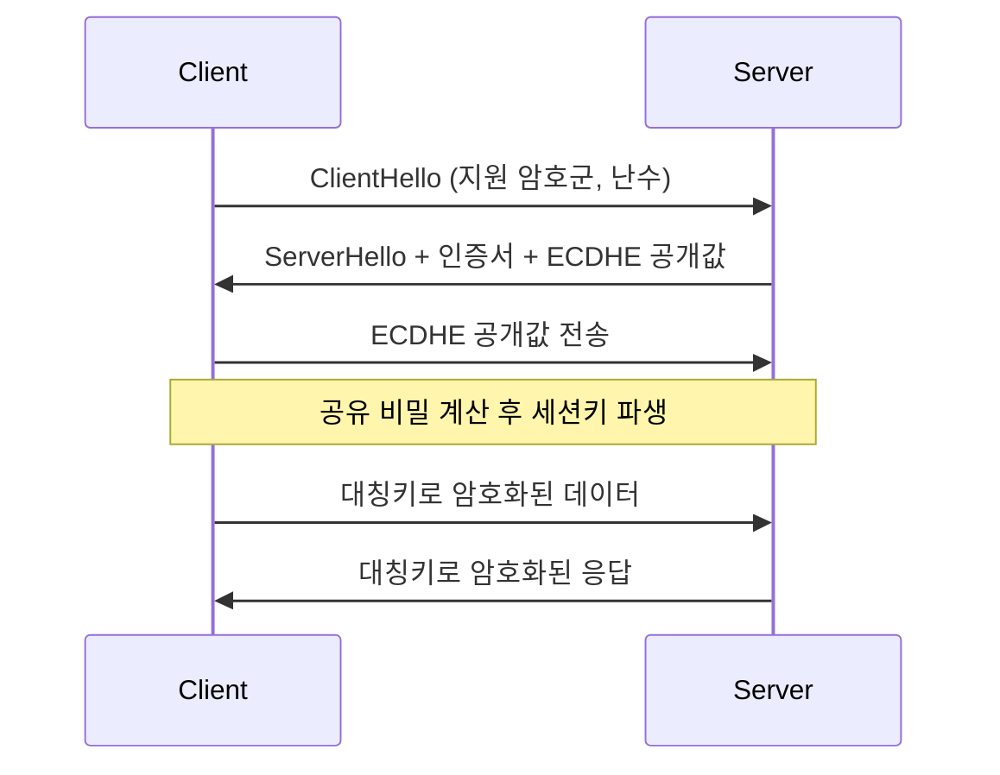

# 현대 암호 #2: 공개키 암호체계와 무결성

---

## 1. 왜 공개키 암호가 필요했는가

### 1.1 대칭키의 핵심 문제: 키 분배

대칭키 암호는 빠르고 강력하지만, 송신자와 수신자가 같은 키를 안전하게 공유해야 한다.

- 통신 전 키를 어떻게 전달할 것인가?
- 전달 과정에서 도청되면 어떻게 할 것인가?
- 사용자 수가 늘어날수록 키 관리가 폭발적으로 어려워진다.

이 문제를 **Key Distribution Problem**이라고 부른다.

### 1.2 1970년대 환경 변화

PDF에서 강조하듯 1970년대에는:

1. 컴퓨터 네트워크 확산
2. 이메일 등장
3. 전자상거래 구상
4. 글로벌 통신 급증

**이런 변화 때문에 “서로 미리 키를 공유하지 않고도 안전하게 시작하는 방법”이 필요해졌다.**

---

## 2. 공개키 암호의 기본 개념

공개키 암호(public key encryption)는 서로 다른 두 키를 사용한다.

- 공개키(public key): 누구에게나 공개
- 개인키(private key): 본인만 보관

핵심 아이디어:

1. 공개키로 암호화한 것은 대응 개인키로만 복호 가능
2. 개인키로 서명한 것은 대응 공개키로 검증 가능

> 공개키는 “열쇠를 나눠주는 방식”을 바꾼 혁신이다.
{: .prompt-tip }

---

## 3. Diffie-Hellman 키 교환

### 3.1 역사적 의미

1976년 Diffie-Hellman은 공개 채널에서 공통 비밀키를 만드는 방법을 제시했다.  
이 논문(`New Directions in Cryptography`)은 현대 공개키 암호학의 출발점이다.

### 3.2 알고리즘 직관

양측이 공개값 `p`(큰 소수), `g`(원시근)를 공유한다.

1. Alice는 비밀값 `a`를 고르고 `A = g^a mod p`를 보냄
2. Bob은 비밀값 `b`를 고르고 `B = g^b mod p`를 보냄
3. Alice: `K = B^a mod p`
4. Bob: `K = A^b mod p`

두 값은 같아 공통키가 된다.

$$
K = g^{ab} \bmod p
$$

#### 키 배송 문제(Key Distribution Problem)를 해결한 의미

- 공개 채널에서도 안전하게 공통 키를 만들 수 있다.
- 공개키 암호학의 출발점이 되었다.
- 인터넷 보안의 기초 토대를 마련했다.
- 두 사람이 미리 만나지 않아도 비밀을 공유할 수 있게 했다.

### 3.3 왜 안전한가

공격자는 `p, g, A, B`는 볼 수 있지만, `a` 또는 `b`를 찾기 어렵다.  
이 어려움이 **이산로그 문제(Discrete Logarithm Problem)**에 기반한다.

### 3.4 한계: MITM 공격

DH만 단독으로 쓰면 인증이 없다.  
공격자가 중간에서 각각과 별도 키를 맺는 Man-in-the-Middle 공격이 가능하다.

결론:

1. DH는 키 교환에 강력하다.
2. 단독으로는 신원 보장이 부족하다.
3. 인증서/서명/PKI와 결합해야 안전하다.

---

## 4. RSA 공개키 암호

### 4.1 핵심 아이디어

RSA(1977, Rivest-Shamir-Adleman)는 “곱셈은 쉽고 소인수분해는 어렵다”는 비대칭성을 이용한다.

기본 식:

$$
C = M^e \bmod n,\quad M = C^d \bmod n
$$

### 4.2 키 생성 개요

1. 큰 소수 `p, q` 선택
2. `n = pq`
3. `\phi(n) = (p-1)(q-1)`
4. `gcd(e, \phi(n)) = 1`인 `e` 선택
5. `ed \equiv 1 \pmod{\phi(n)}`를 만족하는 `d` 계산

공개키는 `(e, n)`, 개인키는 `(d, n)`이다.

### 4.3 RSA 실습 링크

- [RSA 키 생성](https://emn178.github.io/online-tools/rsa/key-generator/)
- [RSA 복호](https://emn178.github.io/online-tools/rsa/decrypt/)
- [RSA 서명](https://emn178.github.io/online-tools/rsa/sign/)
- [RSA 서명 검증](https://emn178.github.io/online-tools/rsa/verify/)

실습 권장:

1. 키 생성 후 공개키/개인키 분리 저장
2. 상대 공개키로 암호화
3. 본인 개인키로 복호
4. 개인키로 서명 후 공개키로 검증

---

## 5. 공개키 암호의 장단점

장점:

1. 키 분배 문제 완화
2. 사용자 수 증가 시 확장성 우수
3. 전자서명/인증 체계 구축 가능

단점:

1. 대칭키 대비 연산이 느림
2. 구현 복잡도와 인증 인프라 필요

그래서 실무는 보통 하이브리드 방식을 쓴다.

---

## 6. 하이브리드 암호와 PKI

### 6.1 하이브리드 암호

실무 표준 흐름:

1. 공개키 방식으로 세션키(대칭키) 교환
2. 실제 데이터는 빠른 대칭키로 처리

### 6.2 PKI(Public Key Infrastructure)

공개키를 신뢰하려면 “이 키가 정말 그 사람의 키인가?”를 검증해야 한다.

PKI는 이를 위한 기반구조다.

- CA(인증기관): 인증서 발급/폐기
- RA(등록기관): 신원 확인 절차 지원
- 인증서/CRL/체인 검증: 신뢰 경로 확인

---

## 7. 무결성: MAC와 HMAC

암호화(기밀성)만으로는 충분하지 않다.  
메시지가 바뀌지 않았는지(무결성) 확인해야 한다.

### 7.1 MAC 정의

- `KeyGen() -> K`
- `MAC(K, M) -> T`
- 검증자는 동일한 `K`로 태그를 재계산해 비교

핵심:

1. 키를 모르면 올바른 태그 생성이 어렵다.
2. 메시지 변조를 검출할 수 있다.

### 7.2 왜 HMAC가 필요한가

단순 해시만 붙이면 공격자가 메시지를 바꾸고 해시를 다시 계산할 수 있다.  
HMAC는 비밀키를 함께 써서 이를 막는다.

여기까지는 **공유 비밀키를 알고 있는 당사자들끼리** 무결성을 확인하는 방법이다.  
이제 한 걸음 더 나아가, **제3자도 검증할 수 있는 공개키 기반 무결성/인증 방식**인 전자서명으로 넘어가 보자.

---

## 8. 전자서명과 해시 함수

### 8.1 전자서명의 목적

1. 송신자 신원 확인(인증)
2. 메시지 변조 검출(무결성)
3. 사후 부인 방지(부인방지)

서명 기본 흐름:

1. 메시지 해시 `H(M)` 계산
2. 개인키로 해시에 서명
3. 수신자는 공개키로 서명 검증 + 메시지 해시 재계산 비교

### 8.2 해시 함수 핵심 성질(3가지)

1. 역상 저항성(Pre-image resistance)
2. 제2 역상 저항성(Second pre-image resistance)
3. 충돌 저항성(Collision resistance)

### 8.3 해시 알고리즘 실무 포인트

- MD5: 보안 목적 부적합
- SHA-1: 권장하지 않음
- SHA-2/SHA-3: 현재 실무 권장

실습 링크:

- [SHA-512 실습](https://emn178.github.io/online-tools/sha512.html)

---

## 9. GPG4Win 실습 흐름

여기까지의 개념을 실제 도구로 연결해 보는 단계가 GPG4Win 실습이다.  
PDF 후반부는 GPG4Win 기반의 실습 절차를 안내하며, 앞에서 배운 공개키 암호, 전자서명, 무결성 개념이 실제로 어떻게 쓰이는지 체험하게 한다.

공식 사이트:

- [GPG4Win](https://www.gpg4win.org/)

실습 단계:

1. 개인별 키쌍(인증서) 생성
2. 공개키 내보내기(`.asc`) 및 공유
3. 상대 공개키 가져오기
4. 파일 암호화 + 서명
5. 수신 측 복호 + 서명 검증

이 실습은 본문 앞에서 설명한 개념들을 손으로 확인하는 과정이다.  
이후의 내용은 실습을 마친 뒤 시험 대비나 실무 관점에서 다시 정리해 두면 좋은 보강 포인트들이다.

> “암호화”와 “서명”은 다른 기능이며, 둘을 함께 써야 실제 보안이 완성된다.
{: .prompt-info }

---

## 10. 수학 배경 분리 자료

이번 PDF의 수학 파트(소수, 모듈러 거듭제곱, 원시근, 오일러 정리 등)는 별도 문서로 분리했다.

- [공개키 암호 수학 배경 노트](/posts/infosec-5-crypto-3-math/)

---

## 11. 대칭키 vs 공개키: 시험형 비교표

| 구분 | 대칭키 암호 | 공개키 암호 |
|---|---|---|
| 사용 키 | 같은 키 1개 | 공개키/개인키 2개 |
| 성능 | 빠름(대용량 처리 유리) | 상대적으로 느림 |
| 키 분배 | 사전 안전 전달 필요 | 공개키 공개 가능 |
| 확장성 | 사용자 증가 시 키관리 부담 큼 | 상대적으로 유리 |
| 주요 역할 | 본문 데이터 암호화 | 키교환, 인증, 전자서명 |
| 대표 알고리즘 | AES, ChaCha20 | RSA, DH, ECC |

실무 결론:

1. 본문 암호화는 대칭키가 담당한다.
2. 키교환/인증은 공개키가 담당한다.
3. 따라서 현실 시스템은 하이브리드 구조를 사용한다.

---

## 13. RSA 실무 보안 포인트(산업기사 필수)

### 13.1 Textbook RSA를 쓰지 않는 이유

`C = M^e mod n` 형태를 패딩 없이 쓰는 Textbook RSA는 결정적(deterministic) 성질 때문에 같은 평문이 같은 암호문으로 반복된다.  
또한 구조적 공격 위험이 커서, 현대 환경에서는 표준 패딩을 붙인 RSA만 사용한다.

### 13.2 OAEP와 PSS

1. RSA 암호화에는 `RSAES-OAEP` 사용
2. RSA 전자서명에는 `RSASSA-PSS` 사용

핵심 포인트:

- OAEP는 랜덤성을 도입해 암호문 패턴 노출을 줄인다.
- PSS는 서명 보안을 강화해 현대 권고안과 정합성이 높다.

### 13.3 키 길이 정책

- 1024비트 RSA: 신규 시스템 기준 부적절
- 2048비트 RSA: 일반적 최소 기준
- 3072비트 이상: 장기 보호/고보안 환경에서 고려

키 길이를 늘리는 이유는 인수분해 공격 비용을 현실적으로 감당 불가능한 수준으로 끌어올리기 위해서다.

### 13.4 난수 품질(RNG)의 중요성

RSA/DH/ECC 모두 난수 품질이 약하면 전체 보안이 붕괴할 수 있다.

1. 약한 RNG는 개인키 예측 위험을 만든다.
2. CSPRNG 사용이 필수다.
3. 키 생성 환경(시드/엔트로피) 검증이 필요하다.

---

## 14. MAC/HMAC와 전자서명의 차이

| 항목 | MAC/HMAC | 전자서명 |
|---|---|---|
| 사용 키 | 공유 비밀키 | 개인키(서명), 공개키(검증) |
| 무결성 검증 | 가능 | 가능 |
| 송신자 인증 | 공유키 보유자 범위에서 가능 | 공개적으로 검증 가능 |
| 부인방지 | 불가 | 가능 |
| 제3자 검증 | 어려움 | 가능 |

시험에서 자주 나오는 함정:

1. "전자서명은 기밀성을 제공한다"는 오답이다.
2. "HMAC이면 부인방지가 된다"도 오답이다.

전자서명의 1차 목적은 기밀성이 아니라 무결성/인증/부인방지다.

---

## 15. X.509 인증서와 PKI 운영 포인트

### 15.1 인증서에서 반드시 확인할 필드

1. Subject: 인증서 주체(도메인/조직)
2. Issuer: 발급자(CA)
3. Validity: 유효기간(Not Before / Not After)
4. Serial Number: 인증서 고유 번호
5. Subject Public Key Info: 공개키 정보
6. Signature Algorithm: 서명 알고리즘
7. SAN: Subject Alternative Name(도메인 목록)

### 15.2 인증서 체인 검증

체인의 어느 지점에서라도 검증 실패가 발생하면 신뢰할 수 없는 연결로 처리해야 한다.

### 15.3 CRL vs OCSP

| 방식 | 설명 | 특징 |
|---|---|---|
| CRL | 폐기 인증서 목록을 파일로 배포 | 단순하지만 목록이 커질 수 있음 |
| OCSP | 인증서 상태를 온라인 질의 | 최신성 높지만 네트워크 의존 |

실무에서는 가용성과 최신성 사이의 트레이드오프를 고려해 조합해 사용한다.

---

## 16. DH 심화: DHE/ECDHE와 PFS

### 16.1 정적 DH와 임시 DH

1. 정적 DH: 장기 개인키 반복 사용
2. DHE/ECDHE: 세션마다 임시키 생성

### 16.2 PFS(Forward Secrecy)

PFS는 "나중에 장기 개인키가 유출돼도 과거 세션 복호가 어려운 성질"이다.

왜 가능한가:

1. 세션마다 임시 비밀값을 새로 만든다.
2. 세션 종료 후 임시키를 폐기한다.
3. 장기키만 탈취해도 과거 세션키를 바로 복원하기 어렵다.

시험형 정리 문장:

- "ECDHE는 PFS 제공에 유리하다."

---

## 17. TLS에서 보는 하이브리드 암호 동작

### 17.1 동작 흐름

### 17.2 핵심 해석

1. 공개키: 키교환/인증 담당
2. 대칭키: 대용량 데이터 보호 담당
3. 인증서 검증 실패: MITM 위험 신호

---

## 18. 대표 공격 시나리오와 방어

### 18.1 MITM

- 위험: 공격자가 키교환 중간에 끼어 각각과 별도 채널을 형성
- 방어: 인증서 검증, 신뢰 루트 관리, 필요 시 키 핀닝

### 18.2 Replay 공격

- 위험: 과거 메시지 재전송으로 인증 우회 시도
- 방어: nonce, timestamp, 세션 식별자, 만료 정책

### 18.3 패딩/구현 취약점

- 위험: 알고리즘 자체보다 구현 실수로 취약점 노출
- 방어: 검증된 라이브러리, 균일한 에러 처리, 최신 권고안 준수

### 18.4 약한 키/난수

- 위험: 예측 가능한 개인키 생성
- 방어: CSPRNG, 키 생성 환경 점검, 주기적 키 교체

---

## 19. 산업기사 서술형 답안 전략

1. 정의를 먼저 쓰고, 바로 "왜 필요한지"를 한 줄로 붙인다.
2. 비교 문제는 최소 3축(키 종류, 성능, 보안 기능)으로 작성한다.
3. PKI 문제는 "체인-유효기간-SAN-폐기확인" 순서로 정리한다.
4. RSA 문제는 "패딩+키길이+난수"를 함께 적어 실무성을 보여준다.
5. DH 문제는 "MITM 한계 + 인증 결합 필요"까지 적어야 완성된다.

---

## 20. 핵심 정리

1. 공개키 암호는 키 분배 문제를 크게 완화했다.
2. DH는 키 교환의 출발점이지만 인증이 없으면 MITM에 취약하다.
3. RSA는 공개키 암호와 전자서명의 대표 구조다.
4. 무결성은 MAC/HMAC/전자서명으로 다루며, 기밀성과 별개로 반드시 필요하다.
5. 실무는 하이브리드 암호 + PKI + 표준 해시(SHA-2/3) 조합으로 운영된다.

---

## 참고 링크

- [New Directions in Cryptography (역사적 배경)](https://en.wikipedia.org/wiki/New_Directions_in_Cryptography)
- [ACM Turing Award](https://amturing.acm.org/)
- [RSA Key Generator](https://emn178.github.io/online-tools/rsa/key-generator/)
- [RSA Decrypt](https://emn178.github.io/online-tools/rsa/decrypt/)
- [RSA Sign](https://emn178.github.io/online-tools/rsa/sign/)
- [RSA Verify](https://emn178.github.io/online-tools/rsa/verify/)
- [SHA-512 Tool](https://emn178.github.io/online-tools/sha512.html)
- [GPG4Win](https://www.gpg4win.org/)
