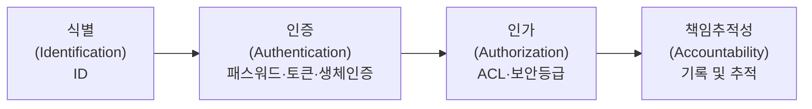

# 9주차: 접근통제(인증과 인가)

학생들이 매일 접하는 서비스는 대부분 로그인 화면에서 시작한다.  
학교 포털, 메신저, 게임, 인터넷 쇼핑몰 모두 "누구인지 확인하고, 어디까지 접근할 수 있는지 정하는 과정"을 갖고 있다.  
이 주차에서는 **접근통제(Access Control)** 의 전체 구조와, 인증·인가를 구현하는 다양한 기술을 다룬다.

---

## 1. 접근통제 개요

**접근통제(Access Control)** 는 시스템 자원의 접근과 관련된 모든 보안 주제를 통칭하는 용어다.

핵심 질문은 두 가지다.

- **인증(authentication)**: 당신은 당신이라고 주장하는 사람이 맞는가?
- **인가(authorization)**: 당신은 그렇게 하도록 허락을 받았는가?

### 1.1 접근통제 4단계

교과서적으로 접근통제는 다음 4단계로 구성된다.

| 단계 | 명칭 | 설명 | 예시 |
|---|---|---|---|
| 1 | 식별(Identification) | 내가 누구인지 시스템에 밝힘 | 아이디(ID) 입력 |
| 2 | 인증(Authentication) | 내가 본인임을 증명 | 패스워드, 토큰, 스마트카드, 생체인증 |
| 3 | 인가(Authorization) | 허가된 범위 내에서만 접근 허용 | 접근제어목록(ACL), 보안 등급 |
| 4 | 책임추적성(Accountability) | 모든 행위를 기록하고 추적 | 로그 기록 및 감사 |



> 로그인 성공만으로 모든 것이 끝나는 것이 아니다.  
> 인가 확인 → 책임추적성까지 이어져야 완전한 접근통제가 된다.
{: .prompt-tip }

---

## Part I : 인증(Authentication)

---

## 2. 인증과 인가의 차이

### 2.1 인증(Authentication)

인증은 "당신이 누구인지 증명해 보세요"라는 질문에 답하는 과정이다.


- **식별(Identification)**: 사용자가 어떤 아이디를 쓰는지 밝히는 단계 — 예: 학번 입력
- **인증(Authentication)**: 그 아이디가 정말 본인인지 확인하는 단계 — 예: 비밀번호 입력
- **인가(Authorization)**: 본인이 맞다면 무엇을 할 수 있는지 허용 범위를 정하는 단계

### 2.2 인가(Authorization)

인가는 인증이 끝난 뒤 "그 사람이 무엇을 할 수 있는가"를 결정하는 과정이다.  
같은 학교 포털에 로그인해도 학생·교사·관리자 화면이 다른 이유가 여기에 있다.

- 학생은 자신의 성적만 조회 가능
- 교사는 담당 반 성적 입력 가능
- 관리자는 사용자 계정과 권한을 관리 가능

> **인증 ≠ 인가.**  
> 비밀번호가 유출되어 다른 사람이 로그인했다면 **인증 문제**,  
> 로그인은 정상인데 일반 사용자가 관리자 기능에 접근할 수 있다면 **인가 문제**다.
{: .prompt-warning }

---

## 3. 인증 방법: 3가지 요소

사람이 기계로부터 인증받을 수 있는 근거는 크게 세 가지다.


| 구분 | 영문 용어 | 의미 | 예 |
|---|---|---|---|
| 지식 기반 | What you know | 내가 아는 것 | 패스워드, PIN |
| 소유 기반 | What you have | 내가 가진 것 | ATM 카드, 스마트폰, USB 토큰 |
| 생체 기반 | What you are | 나 자신인 것 | 지문, 홍채, 얼굴인식 |

추가적인 요소가 필요할 때는 위치(Somewhere you are) 나 행동(Something you do) 도 쓰인다.

---

## 4. 패스워드

### 4.1 이상적인 패스워드란

이상적인 패스워드의 조건:

- 사용자가 알고 있고, 컴퓨터가 그것을 검증할 수 있어야 함
- 무제한으로 컴퓨팅 자원에 접근할 수 있는 다른 누구라도 추측할 수 없어야 함

패스워드가 인기 있는 이유는 **비용과 편의성** 때문이다.

- 패스워드는 무료이며, 새로 생성하는 것이 훨씬 편리함
- ATM 카드나 PIN 번호도 패스워드처럼 행동하는 것들

### 4.2 키 vs. 패스워드: 엔트로피 비교

암호 키와 패스워드는 비슷해 보이지만 엔트로피에 큰 차이가 있다.

**예시 비교**

트루디가 64비트 키를 사용하는 대칭 암호로 암호문 메시지를 해독한다고 가정하자.

- 키는 무작위로 선택되었으며 지름길 공격도 없음
- 트루디는 정확한 키를 찾아내기 전에 평균적으로 $2^{63}$개의 키를 시도해야 함

이번엔 트루디가 앨리스의 패스워드를 추측하고자 하는데,  
앨리스의 패스워드는 **8자 길이**이며 각 글자는 **256개** 중 선택 가능하다고 가정하면:

$$\text{가능한 패스워드} = 256^8 = 2^{64}$$

이론적으로 키 공간과 같지만, 문제는 **사용자는 기억하기 쉬운 것을 선택할 가능성이 훨씬 높다는 점이다.**

```
Kf&Y3!aE  보다  Frank012  를 선택하는 경향이 있다.
```

### 4.3 취약한 패스워드와 강한 패스워드

**취약한 패스워드 예시**: `Frank`, `Pikachu`, `incorrect`, `10252010`, `AustinStamp`

**강한 패스워드를 만드는 방법**:

| 예시 | 특징 |
|---|---|
| `jflej(43j-EmmL+y` | 트루디가 알아내기 어렵지만 앨리스가 기억하기도 어려움 |
| `09864376537263` | 대부분의 사용자가 기억하기 어려움 |
| `FS&7Yago` | 앨리스가 기억하기엔 쉬우면서 트루디가 알아내기 어려움 |
| `Servenoterampartoriginal` | **패스워드를 선정하는 최고의 방법** — 긴 패스프레이즈 |

> 사용자들에게 줄 수 있는 최선의 조언은 **단어에 기반한 긴 패스프레이즈를 선택하라는 것**이다.  
> 즉, 외울 수 있으면서도 어려운 것.
{: .prompt-tip }

### 4.4 자주 쓰이는 비밀번호 실태

실제로 유출된 데이터베이스를 분석해 보면, 가장 많이 쓰이는 비밀번호는 충격적일 정도로 단순하다.

| 순위 | 패스워드 | 사용 횟수 |
|---|---|---|
| 1 | 123456 | 120,417 |
| 2 | 123456789 | 32,775 |
| 3 | qwerty | 22,770 |
| 4 | password | 17,471 |
| 5 | 1234567 | 14,401 |
| 6 | 1234567890 | 13,799 |
| 7 | 12345678 | 13,380 |
| 8 | 123321 | 13,161 |
| 9 | 111111 | 12,138 |
| 10 | 12345 | 11,239 |

보안을 위해 비밀번호를 사이트마다 다르게 설정하는 것이 좋지만,  
수십 개의 사이트마다 다른 비밀번호를 저장 후 기억하기란 거의 불가능한 것이 현실이다.

### 4.5 패스워드 실험 결과

패스워드 선정 방식에 따라 크래킹 성공률이 크게 달라진다는 연구 결과가 있다.

| 그룹 | 지침 | 해독 성공률 |
|---|---|---|
| A | 적어도 여섯 문자로 된 패스워드를 선정 | 약 30% |
| B | 패스프레이즈에 근거해서 패스워드를 정함 | 약 10% |
| C | 8자리의 문자를 무작위로 선택해 패스워드를 구성 | 약 10% |

결론: **단어에 기반한 긴 패스프레이즈**가 기억하기도 쉽고 공격에도 강하다.

### 4.6 패스워드를 통한 시스템 공격

트루디가 외부인으로서 특정 시스템에 대한 접근 권한이 없다고 가정하자.  
공격 경로는 보통 **외부 → 일반 사용자 → 관리자** 순으로 권한을 높여 간다.

**계정 잠금 문제**

일반적으로 틀린 패스워드를 3회 이상 반복 시도하면 시스템은 잠금 상태가 된다.  
그러나 이 방어 방식에는 역이용 가능한 허점이 있다.

> 트루디가 모든 계정을 대상으로, 각 계정에 대해 5분 내에 3회 패스워드 추측을 반복하면  
> **모든 계정을 영원히 잠금 상태에 있도록 만들 수 있다.**  
> 이는 가용성을 훼손하는 서비스 거부(DoS) 공격이 된다.
{: .prompt-danger }

### 4.7 패스워드 검증: 왜 해시로 저장하는가

서비스가 패스워드를 그대로 저장하는 것은 매우 위험하다.

**해시 저장의 기본 원리**

- 컴퓨터는 패스워드를 어떤 형태로든 정확한 형태로 접근할 수 있어야 함
- 패스워드 파일을 대칭키로 암호화하는 방법도 있으나, 검증하려면 복호화 키에도 접근이 가능해야 함 (암호화는 가치가 없음)
- **해시된 패스워드로 저장하는 것이 훨씬 더 나은 방법**

앨리스의 패스워드가 `servenoterampartoriginal`일 때, 파일에는 다음과 같이 저장된다.

$$y = h(\text{servenoterampartoriginal})$$

패스워드를 보호하기 위해 암호화 해시 함수의 **단방향(one-way) 특성**에만 의존한다.  
그래서 많은 서비스에서 "비밀번호 찾기"를 하면 원래 비밀번호를 보여 주지 않고, **비밀번호 재설정 링크**만 보내는 것이다.

**사전 공격(Dictionary Attack)이 가능한 이유**

트루디가 $N$개의 공통적인 패스워드를 담고 있는 사전을 가지고 있다고 가정하자.

$$d_0, d_1, d_2, \cdots, d_{N-1}$$

그러면 트루디는 사전에서 각 패스워드의 해시를 미리 계산할 수 있다.

$$y_0 = h(d_0),\ y_1 = h(d_1),\ \cdots,\ y_{N-1} = h(d_{N-1})$$

트루디가 해시된 패스워드를 포함하는 패스워드 파일에 접근하게 된다면,  
패스워드 파일에 있는 엔트리와 미리 계산한 사전에 있는 엔트리를 비교하기만 하면 된다.  
이 미리 계산된 해시 사전은 **재사용 가능**하므로 각 패스워드 파일별로 다시 계산하지 않아도 된다.


### 4.8 패스워드 크래킹의 핵심

계산된 해시 값의 갯수는 변하지 않지만,  
패스워드를 크래킹하는 데 필요한 시간은 **해시 함수의 느림에 정비례해서 늘어난다.**

패스워드를 크랙하고자 시도할 때 공격자는 전형적으로 많은 수의 해시를 계산해야 할 것이며,  
이에 걸리는 시간은 합리적으로 잘 선택된 패스워드를 공격하기에는 불가능할 정도로 길어질 수 있다.

### 4.9 패스워드 크래킹 종류

#### (1) 사전 공격 (Dictionary Attack)

영어사전, 국어사전에 있는 단어들처럼 하나의 패스워드 사전 파일로 만든 후,  
하나씩 대입하여 패스워드 일치 여부를 확인한다.

- 예: `asdf`, `qazplm`, `angel`

#### (2) 무차별 대입 공격 (Brute Force Attack)

비밀번호로 사용될 수 있는 모든 문자를 대입하여 패스워드 일치 여부를 확인한다.

- 예: `a`, `ab`, `abc`, `aba`, `abb`, ...

#### (3) 혼합 공격

사전 공격 + 무차별 공격을 혼합한다.  
사전파일에 있는 문자열에 문자·숫자 등을 추가로 무작위 대입하여 패스워드 일치 여부 확인.  
일반적으로 사전 파일 문자열 뒤에 숫자나 문구를 추가한다.

- 예: `qazplm159`, `asdf123`

#### (4) 레인보우 테이블 공격 (Rainbow Table Attack)

**패스워드와 해시로 이루어진 테이블을 무수히 만들어놓은 체인을 이용,**  
**테이블과 R함수의 반복 수행을 통해 일치하는 해시 값을 통해서 패스워드를 찾아내는 방식이다.**

**레인보우 테이블의 핵심 원리**


_레인보우 테이블의 핵심 원리: 해시 함수($H$)와 리덕션 함수($R$)의 반복적 연결_

체인(Chain)의 흐름 예시:

$$\text{bnis} \xrightarrow{H} \text{853c3622} \xrightarrow{R_1} \text{vqky} \xrightarrow{H} \text{0549e738} \xrightarrow{R_2} \text{bmki} \xrightarrow{H} \text{69b9bf21} \cdots$$

- 테이블에는 체인의 **시작 값**과 **끝 값**만 저장하여 디스크 용량을 대폭 아낀다.
- **리덕션 함수(R)** 는 해시의 역함수가 아니라, 해시값을 임의의 평문 후보로 매핑하는 규칙이다.
- 매 단계마다 **서로 다른 리덕션 함수**($R_1, R_2, \cdots$)를 쓰는 이유는 체인 병합(Merge)을 방지하기 위함 — 서로 다른 색깔을 가진 무지개처럼 보인다 하여 '레인보우'라고 부른다.


### 4.10 비밀번호는 왜 평문으로 저장하면 안 되는가

1. 서버가 침해되면 사용자의 비밀번호가 한 번에 유출된다.
2. 사용자가 다른 사이트에서도 같은 비밀번호를 썼다면 피해가 연쇄적으로 퍼진다.
3. 서비스 운영자조차 사용자의 비밀번호를 직접 알 수 있게 된다.

### 4.11 Salt의 필요성


레인보우 공격을 무력화하는 비밀 무기가 바로 **Salt** 다.

**솔트(salt)** 라고 불리는 비밀이 아닌 난수 값을 각 패스워드를 해시하기 이전에 추가함으로써 패스워드에서도 이와 비슷한 효과를 볼 수 있다.

```
password + SALT1 = passwordSALT1  =>  A7981C...
password + SALT2 = passwordSALT2  =>  F1389E...
```

두 사람이 같은 비밀번호 `qwer1234`를 써도,  
각자의 salt가 다르므로 저장값이 달라진다.

- A의 저장값: `Hash(qwer1234 + 7F2A...)`
- B의 저장값: `Hash(qwer1234 + 91CD...)`

**Salt가 필요한 이유:**

1. 같은 비밀번호를 쓴 사용자들을 바로 찾아내기 어렵게 만든다.
2. 미리 계산된 레인보우 테이블을 그대로 쓰기 어렵게 만든다.
3. 비밀번호 저장 방식을 한 단계 더 안전하게 만든다.

> "Salt는 같은 비밀번호라도 서로 다른 저장값이 되게 만들어 대량 추측 공격을 어렵게 한다."
{: .prompt-tip }

### 4.12 왜 SHA-256만으로는 부족한가

SHA-256은 **빠른 해시 함수**다.  
파일 무결성 검증에는 장점이지만, 비밀번호 저장에는 오히려 단점이 된다.  
공격자도 매우 빠른 속도로 후보 비밀번호를 계속 대입해 볼 수 있기 때문이다.

비밀번호 저장에서는 "빠르다"가 항상 좋은 특성이 아니다.  
오히려 **일부러 계산을 느리게 만들어** 대량 대입 공격 비용을 높이는 것이 더 중요하다.

그래서 비밀번호 저장에는 보통 다음과 같은 전용 알고리즘을 사용한다.

- `bcrypt` — Work Factor(라운드 수)로 연산 비용 조절 가능
- `scrypt` — 메모리 사용량도 높여 GPU 크래킹 어렵게 설계
- `Argon2` — 최신 표준, 메모리·CPU·병렬성 모두 조절 가능

#### bcrypt & Argon2 온라인 실습

보안 세계에서는 파일 검증용 해시(SHA-256 등)와 비밀번호용 해시를 다르게 취급한다.  
비밀번호용 해시는 공격자가 해시값을 엄청나게 빠르게 대입해 보는 것을 막기 위해  
**일부러 연산 속도를 늦추도록 설계**되어 있다.

- [bcrypt 해시 생성 및 검증기](https://www.bcryptcalculator.com/)
- [Argon2 온라인 계산기](https://argon2.online/)

**실습 가이드**

1. bcrypt 실습 사이트에 접속한다.
2. Rounds(작업 팩터) 값을 기본값 `10`으로 설정하고 비밀번호를 입력해 Encrypt 클릭.
3. Rounds 값을 `14`로 높여서 다시 해시를 생성 — 브라우저가 약 1~2초 멈추는 것을 확인한다.
4. `15`나 `16`으로 더 높이면 대기 시간이 배로 늘어난다.

**배움의 요점**: Rounds 값이 1 증가할 때마다 연산량은 2배씩 늘어난다.  
평범한 로그인 한 번에 걸리는 0.5초의 멈춤은 사용자에게 사소하지만,  
초당 수억 번의 대입을 시도하려는 해커에게는 치명적인 시간 비용 방벽이 된다.

| 구분 | 특성 | 용도 |
|---|---|---|
| SHA-256 | 빠름 | 파일 무결성 검증 |
| bcrypt / Argon2 | 일부러 느림 | 비밀번호 저장 |

### 4.13 다른 패스워드 문제들

- **패스워드 재사용**: 꽤 많은 사용자가 여러 사이트에서 동일한 패스워드를 사용함
- **사회공학(Social Engineering)**: 패스워드와 관련된 또 다른 주요 위협 — 피싱, 사칭 등
- **키로거(Keylogger)**: 키 입력을 기록하는 소프트웨어나 이와 유사한 스파이웨어도 패스워드 기반 보안에 심각한 위협이 됨

---

## 5. 생체인증(Biometrics)

생체인증은 **'본인 자체의 어떤 것'** 을 대표하는 인증 방법으로,  
"당신 자신이 키"라는 개념이다.

종류: 지문, 손바닥 인식, 목소리 인식, 안면 인식, 보행 인식, 심지어 디지털 강아지 등

생체인증은 생리적(Physiological)과 행동적(Behavioral) 두 가지 범주로 나뉜다.

| 범주 | 종류 |
|---|---|
| 생리적(Physiological) | 지문(Fingerprint), 손바닥(Hand), 홍채(Iris), 얼굴(Face), DNA |
| 행동적(Behavioral) | 키스트로크(Keystroke), 서명(Signature), 음성(Voice) |

### 5.1 생체인증의 이상적인 특성

| 특성 | 설명 |
|---|---|
| **보편성** | 인증하려는 생체 특성이 인구 대부분에 존재해야 함 (예: 지문, 얼굴) |
| **구별성** | 각 개인의 생체 특성은 다른 사람과 구별될 수 있을 만큼 고유해야 함 |
| **영구성** | 나이가 들거나 환경이 바뀌어도 특성이 크게 변하지 않아야 함 |
| **수집성** | 특별한 도구나 복잡한 절차 없이 생체 정보를 수집할 수 있어야 함 |
| **신뢰성** | 동일한 사람을 항상 올바르게 인식하고, 다른 사람을 정확히 거부해야 함 |
| **강건성** | 가짜 생체 정보(예: 인공 지문, 사진)로 시스템을 속이기 어려워야 함 |
| **사용자 친화성** | 사용자가 인증 과정을 불편하게 느끼지 않고 쉽게 사용할 수 있어야 함 |

### 5.2 생체인증 시스템의 두 단계

1. **등록 단계**: 대상자들이 그들의 생체인증 정보를 모으고 데이터베이스에 입력하는 단계
2. **인증 단계**: 생체인증 시스템이 실제로 사용자를 인증할 것인가 인증하지 않을 것인가를 결정하는 시점 — 신속·단순·정확해야 함

생체인증은 두 가지 문제를 해결하는 데 사용된다.

- **식별 문제**: '당신은 누구인가?' — **일대다(1:N) 비교**
- **인증 문제**: '당신은 당신이라고 주장하는 사람이 맞는가?' — **일대일(1:1) 비교**

### 5.3 생체인증의 오류(Fault) 종류

생체인증 시스템에는 두 종류의 오류가 존재하며, 이는 서로 **상충 관계(trade-off)** 에 있다.

#### False Positive (오긍정, 기만율)

- **설명**: 시스템이 실제로는 인증되지 않아야 할 사람을 잘못 인증하는 경우
- **예시**: "트루디가 앨리스인 척하고, 시스템이 실수로 트루디를 앨리스로 인증"한 상황
- **용어**: 이러한 오류 발생 비율을 **기만율(fraud rate)** 이라고 함
- **보안 영향**: 권한이 없는 사람이 시스템에 접근할 수 있게 되기 때문에 보안에 직접적인 위협

#### False Negative (오부정, 모욕률)

- **설명**: 시스템이 실제로는 인증되어야 할 정당한 사용자를 인증하지 못하는 경우
- **예시**: "앨리스가 자신임을 인증받으려고 하지만 시스템이 인증하는 데 실패"한 상황
- **용어**: 이러한 오류 발생 비율을 **모욕률(insult rate)** 이라고 함
- **사용자 경험 영향**: 정당한 사용자의 불편함을 초래

#### 두 오류 간의 관계

기만율을 줄이면(보안을 강화하면) 모욕률이 증가하는 경향이 있고,  
반대로 모욕률을 줄이면(사용자 편의성 증가) 기만율이 증가하는 경향이 있다.

시스템 설계자는 보안과 사용성 사이의 균형을 맞추기 위해 두 오류율이 동일해지는 지점인  
**동일 오류율(Crossover Error Rate, CER)** 에서 시스템 매개변수를 설정하는 경우가 많다.


#### 생체인증 방법별 성능 비교

| Modality | Accuracy | Ease to Use | User Acceptance |
|---|---|---|---|
| 얼굴(Face) | Low | High | High |
| 지문(Fingerprint) | High | Medium | Low |
| 홍채(Iris) | High | Medium | Medium |
| 손바닥 정맥(Palm Vein) | High | High | Medium |
| 음성(Voice) | Medium | High | High |

### 5.4 생체인증 결론

- 생체인증은 불가능하지는 않지만 **위조하기 어려움**
- 인증에 대해서는 소프트웨어를 대상으로 하는 공격의 가능성도 많음
- 해독된 암호화 키나 잊어버린 패스워드는 폐지되고 대체될 수 있는 반면에,  
  **해독된 생체인증 정보를 어떻게 폐지할지에 대해서는 불분명**

---

## 6. FIDO (Fast Identity Online)

FIDO는 **온라인 인증을 보다 안전하고 편리하게 만드는 표준**이다.

- FIDO는 비밀번호를 대체하여 **공개 키 암호화를 기반**으로 하는 비밀 키와 공개 키 쌍을 사용
- 비밀 키는 사용자의 장치에 저장되며, 공개 키는 온라인 서비스에 등록

**FIDO 로그인 흐름:**

1. 사용자가 서비스에 로그인 요청
2. 서비스가 로그인 챌린지(Login Challenge)를 장치로 전송
3. 사용자 장치가 저장된 비밀 키로 챌린지에 서명
4. 서비스는 등록된 공개 키로 서명을 검증하여 로그인 완료


### 6.1 FIDO의 장점과 극복한 단점

| 문제 | FIDO의 해결 방법 |
|---|---|
| **비밀번호의 취약성**: 비밀번호는 쉽게 해킹되거나 잊어버릴 수 있음 | **비밀번호 대체**: FIDO는 비밀번호를 사용하지 않아 보안을 강화하고 사용자 편의성을 높임 |
| **2차 인증의 불편함**: 추가적인 코드를 입력해야 하므로 불편함 | 비밀번호나 추가 코드 없이도 안전하게 로그인할 수 있어 더 편리한 인증 경험 제공 |
| **생체 인증의 취약성**: 3D 모델을 통해 얼굴 인식 시스템 우회 가능 | 생체 인증 데이터를 사용자의 장치에 저장하여 개인 정보 보호, 피싱·중간자 공격에 강한 보안 제공 |

---

## 7. MFA: 다요소 인증

비밀번호는 가장 흔한 인증 수단이지만, 가장 약한 고리가 되기도 쉽다.  
이 때문에 현대 서비스는 비밀번호 하나에만 의존하지 않고, **MFA(Multi-Factor Authentication)** 를 사용한다.

### 7.1 2FA vs MFA


- **2FA (Two-Factor Authentication)**: 신원을 정확히 두 번 증명 (예: 비밀번호 + OTP)
- **MFA (Multi-Factor Authentication)**: 신원을 여러 번 증명 (예: 비밀번호 + OTP + 생체인증)

**MFA는 서로 다른 범주의 요소를 2개 이상 결합한 것이다.**  
비밀번호(지식) + OTP 앱(소유)은 MFA이지만,  
비밀번호 + 보안 질문은 둘 다 지식 요소이므로 **MFA로 보기 어렵다.**

### 7.2 MFA 방법 종류

| 방법 | 설명 |
|---|---|
| SMS Token | 문자 메시지로 일회용 코드 수신 |
| Email Token | 이메일로 일회용 코드 수신 |
| Hardware Token | 물리적 OTP 기기 사용 |
| Software Token | OTP 앱(Google Authenticator 등) 사용 |
| Phone Authentication | 전화 통화로 인증 |
| Biometric Verification | 지문·얼굴 등 생체인증 |

### 7.3 왜 MFA가 더 안전한가

만약 공격자가 비밀번호를 알아냈다고 해도, 두 번째 요소가 없으면 로그인하기 어려워진다.  
즉 MFA는 "비밀번호 유출"이라는 하나의 사고가 곧바로 계정 탈취로 이어지는 것을 막아 주는 추가 방어선이다.

단, 모든 2단계 인증이 완전히 같은 수준은 아니다.  
**문자 메시지 인증(SMS)** 보다 **OTP 앱**이나 **보안키(FIDO)** 가 더 강한 방식으로 평가된다.


---

## 8. 통합 인증 (Single Sign-On, SSO)

사용자들은 패스워드와 같은 인증 정보를 반복해서 입력하는 것을 힘들어한다.

**편리한 해결책**: 초기의 인증에는 사용자가 참여해야 하지만,  
이후에 따라 나오는 인증은 표면 뒤에서 일어나도록 하는 것 = **통합인증(SSO)**

**SSO 흐름:**

1. 사용자가 서비스(Service Provider)에 접근 요청
2. 서비스가 Identity Provider(IdP)에 SSO Request 전송
3. IdP가 사용자를 인증
4. IdP가 서비스에 SSO Response 반환
5. 사용자는 한 번의 로그인으로 여러 서비스 이용 가능

실생활 예: 구글 계정으로 여러 다른 웹사이트에 로그인하는 경우


---

## 9. 웹 인증(Web Authentication)

### 9.1 웹 인증이 필요한 이유

HTTP는 원래 **무상태(Stateless)** 프로토콜이다.  
인터넷은 원래 누가 요청했는지 기억하지 못한다.  
마치 가게에서 손님을 매번 처음 보는 것처럼 대하는 문제가 발생한다.

- 로그인 상태 유지가 불가능
- 장바구니, 추천 상품, 설정 기억 등 개인화된 서비스 제공 불가능

**쿠키와 세션은 인터넷의 "기억력 문제"를 해결한다.**

### 9.2 쿠키(Cookie)

쿠키는 웹사이트가 내 컴퓨터에 남기는 **작은 메모지**다.

- 사용자 확인을 위한 "이름표" 역할
- 예: "이 사람은 아까 로그인했던 사람이야" 정보 저장
- 보안 기능: `Secure`(안전한 연결로만 전송), `HttpOnly`(해킹 방지)
- 주의점: 비밀번호 같은 중요 정보는 그대로 저장하면 안 됨


### 9.3 세션(Session)

세션은 서버가 사용자를 기억하기 위해 만드는 **임시 보관함**이다.

- 세션 ID라는 열쇠를 쿠키로 사용자에게 줌
- 서버에 있는 보관함에 사용자 정보를 안전하게 보관
- 많은 사용자를 기억하려면 서버 공간이 많이 필요함

**기본 흐름:**

1. 사용자가 로그인 성공
2. 서버가 세션 생성
3. 세션 식별자(Session ID)를 브라우저에 쿠키로 전달
4. 이후 요청마다 이 식별자를 확인해 로그인 상태 유지

### 9.4 쿠키 보안 속성

로그인 쿠키에는 반드시 다음 보안 속성이 설정되어야 한다.

| 속성 | 역할 |
|---|---|
| `HttpOnly` | 자바스크립트로 쿠키를 읽지 못하게 막음 → XSS 공격에서 쿠키 탈취 방지 |
| `Secure` | HTTPS 통신에서만 전송 → 네트워크 도청 방지 |
| `SameSite` | 다른 사이트에서 보낸 요청에 쿠키를 붙이지 않음 → CSRF 방지 |
| `Domain` / `Path` | 쿠키가 유효한 범위 지정 |
| `Expires` / `Max-Age` | 쿠키 유효 기간 지정 |

### 9.5 세션을 노리는 두 가지 공격

#### (1) 세션 하이재킹(Session Hijacking) — 사물함 열쇠를 훔친다

이미 발급된 **세션 ID를 훔쳐** 사용자를 가장하는 공격.

**예시 시나리오**

1. 민준이가 커피숍 공용 와이파이에서 학교 포털에 로그인한다.
2. 같은 와이파이에 있던 공격자가 네트워크를 엿보다가 **민준이의 세션 쿠키 값**을 가로챈다.
3. 공격자가 자기 브라우저에 그 쿠키 값을 집어넣으면, 서버는 **공격자를 민준이로 착각**한다.
4. 공격자는 비밀번호를 몰라도 민준이의 학적 정보를 볼 수 있게 된다.

탈취 경로: 공용 와이파이 도청, **XSS 공격을 통한 쿠키 탈취**, 감염된 기기에서 쿠키 파일 유출.

#### (2) 세션 고정(Session Fixation) — 미리 준비한 사물함 번호를 쓰게 만든다

공격자가 **먼저 세션 ID를 받아 놓고**, 피해자가 **그 ID로 로그인하도록 유도**하는 공격.

**예시 시나리오**

1. 공격자가 학교 포털에 접속해 "세션 ID = `ABC123`"을 받는다 (아직 로그인 안 함).
2. 공격자가 서연이에게 이런 링크를 보낸다: `https://학교포털/?SESSIONID=ABC123`
3. 서연이가 이 링크를 눌러 포털에서 **자기 계정으로 로그인**한다.
4. 서버가 실수로 **로그인 후에도 세션 ID를 바꾸지 않으면**, 세션 `ABC123`은 이제 "로그인된 서연이"가 된다.
5. 공격자가 자신이 갖고 있던 `ABC123`으로 접속 → **서연이처럼 로그인된 상태로 사용 가능**.

#### 방어 4가지

1. 로그인 **성공 직후 세션 ID를 새로 발급**한다 (세션 재발급) — 세션 고정 방어의 핵심
2. 쿠키에 `HttpOnly` + `Secure` + `SameSite`를 적용한다
3. **세션 만료 시간**을 설정한다 (예: 30분 무활동 시 자동 로그아웃)
4. 중요한 작업(송금, 비밀번호 변경)에는 **재인증**을 요구한다

### 9.6 새로운 인증 기술

쿠키·세션 외에도 현대 웹에서는 다양한 인증 기술이 사용된다.

| 기술 | 설명 |
|---|---|
| **토큰 기반 인증(JWT)** | 휴대폰처럼 다양한 기기에서도 잘 작동. 서버가 상태를 저장할 필요 없음 |
| **OAuth** | 하나의 계정으로 여러 웹사이트 이용 가능 (예: 구글 계정으로 다른 웹사이트 로그인) |
| **OpenID Connect** | OAuth 위에 인증 레이어를 추가. 더 편리하고 안전한 로그인 방식 제공 |

---

## Part II : 인가(Authorization)

---

## 10. 인가 개요

**인가(authorization)** 는 인증된 사용자의 행동을 제한하는 것으로, 접근제어의 일부다.  
이미 인증된 사람이 **할 수 있는 것에 제한을 두는 것**이다.

- 인증(Authentication): "Who are you?" (누구인가?)
- 인가(Authorization): "What permissions do you have?" (어떤 권한을 가졌는가?)

### 10.1 접근통제 실현 구조

접근통제 실현은 다음 세 요소의 관계로 구성된다.


| 요소 | 설명 | 예시 |
|---|---|---|
| **주체(Subject)** | 접근을 요청하는 주체 | 사람, 프로그램, 프로세스 |
| **객체(Object)** | 보호되어야 할 자원 | 파일, DB, 컴퓨터 |
| **접근(Access)** | 주체가 객체에 가하는 행위 | Read, Write, Delete |

접근통제의 구현 계층:

- **접근통제 정책** (Policy): MAC, DAC, RBAC
- **접근통제 모델** (Model): BLP, Biba, Clark-Wilson
- **접근통제 메커니즘** (Mechanism): ACL, CL

---

## 11. 접근제어 행렬(Access Control Matrix)

인가에 대한 전통적인 관점은 **램슨(Lampson)의 접근제어 행렬**에서 시작한다.  
인가의 두 가지 기본 구조는 **접근제어 목록(ACL)** 과 **권한 목록(C-list)** 이다.

### 11.1 접근제어 행렬 예시

| | OS | 회계 프로그램 | 회계 데이터 | 보험 데이터 | 월급 데이터 |
|---|---|---|---|---|---|
| 밥 | rx | rx | r | — | — |
| 앨리스 | rx | rx | r | rw | rw |
| 샘 | rwx | rwx | r | rw | rw |
| 회계 프로그램 | rx | rx | rw | rw | r |

### 11.2 접근제어 목록 (ACL)

접근제어 행렬을 **열(Column) 단위로** 나누어, 각 열을 상응하는 객체와 함께 저장한다.

- 객체에 대해 접근할 때마다 접근제어 행렬의 열을 확인하여 특정 연산을 허락할지 여부를 결정
- 예: 보험 데이터에 상응하는 ACL = `(밥, --), (앨리스, rw), (샘, rw), (회계 프로그램, rw)`

### 11.3 권한 목록 (C-list)

접근제어 행렬을 **행(Row) 단위로** 저장하는 것.

- 각 행은 상응하는 주체와 함께 저장됨
- 어떤 주체가 연산을 수행하려고 할 때마다 접근제어 목록에 있는 열을 확인
- 앨리스의 권한 목록 = `(OS, rx), (회계 프로그램, rx), (회계 데이터, r), (보험 데이터, rw), (월급 데이터, rw)`

---

## 12. 다단계 보안모델(Multi-Level Security)

### 12.1 다단계 보안(MLS; Multi Level Security) 개요

- 주체가 사용자이며 객체는 보호되어야 할 데이터
- 취급 등급은 주체에게 적용되지만 기밀 등급은 객체에 적용
- 미국 국방성의 4단계 기밀 등급: **극비 > 비밀 > 기밀 > 일반 평문**
- 다단계 보안의 응용 프로그램으로 네트워크 방화벽이 있음

### 12.2 벨-라파둘라 모델 (BLP; Bell-LaPadula) — 기밀성

**목적**: 다단계 보안 시스템이 만족시켜야 하는 최소한의 기밀 요구사항을 캡처하는 것.

**두 가지 규칙:**

| 규칙 | 조건 | 의미 |
|---|---|---|
| **단순 보안 조건** (No Read Up) | $L(O) \leq L(S)$일 경우에만 주체 $S$는 객체 $O$를 읽을 수 있다 | 낮은 등급의 주체는 높은 등급의 객체를 읽을 수 없음 |
| **\*-특성 (스타 특성)** (No Write Down) | $L(S) \leq L(O)$일 경우에만 주체 $S$는 객체 $O$를 쓸 수 있다 | 높은 등급의 주체는 낮은 등급의 객체에 쓸 수 없음 |

**결과적으로 BLP는 '상향 읽기 금지 및 하향 쓰기 금지'로 명확하게 기술된다.**


| 행위 | 허용 | 금지 |
|---|---|---|
| READ | 하위 레벨 문서 읽기 허락 (Read Down) | 상위 레벨 문서 읽기 금지 (No Read Up) |
| WRITE | 상위 레벨 문서 쓰기 허락 (Write Up) | 하위 레벨 문서 쓰기 금지 (No Write Down) |

### 12.3 비바 모델 (Biba's Model) — 무결성

BLP는 기밀성을 다루는 데 반해, **비바 모델은 무결성을 다룬다.**

$I(O)$를 객체 $O$의 무결성, $I(S)$를 주체 $S$의 무결성이라고 하자.

| 규칙 | 조건 | 의미 |
|---|---|---|
| **쓰기 접근 규칙** | $I(O) \leq I(S)$인 경우에만 주체 $S$는 객체 $O$를 쓸 수 있다 | No Write Down (하향 쓰기 금지) |
| **읽기 접근 규칙** | $I(S) \leq I(O)$인 경우에만 주체 $S$는 객체 $O$를 읽을 수 있다 | No Read Down (하향 읽기 금지) |


| 행위 | 허용 | 금지 |
|---|---|---|
| READ | 상위 레벨 문서 읽기 허락 (Read Up) | 하위 레벨 문서 읽기 금지 (No Read Down) |
| WRITE | 하위 레벨 문서 쓰기 허락 (Write Down) | 상위 레벨 문서 쓰기 금지 (No Write Up) |

$S$가 더 낮은 무결성 수준의 객체를 보지 않도록 방지하기 때문에 비바 모델은 실제적으로 아주 엄격하다.

**저수위 원칙**: 주체 $S$가 객체 $O$를 읽으면 $I(S) = \min(I(S), I(O))$이다.

### 12.4 구획 (Compartment)

일반적으로 보안 등급의 간단한 계층적 구조는 대부분의 상황을 다루기에 유연하지 못하다.  
실제적으로는 보안 등급에 '걸쳐서' 정보 흐름을 더 제한하도록 **구획(Compartment)** 을 사용할 필요가 있다.

**표기법**: `보안 등급 {구획명}`

예: 극비 등급 내에 '고양이'와 '개' 구획이 있음
- `극비{고양이}`, `극비{개}`, `극비{고양이,개}`

구획은 **지식 한정 원칙(Need to Know)** 을 실현하는 일을 담당한다.

---

## 13. 은닉 채널 (Covert Channel)

**은닉 채널(covert channel)** 은 시스템의 설계자가 의도하지 않은 통신 통로다.


- 네트워크로 연결된 시스템에서 특히 많이 발생
- 사실상 제거하기 불가능하므로 주안점을 두고자 하는 것은 그런 통로의 **용량을 제한**하는 것에 있음
- 은닉 채널은 정보가 흘러가는 또 다른 길을 제공
- 몇몇 해킹 도구는 네트워크상에서의 은닉 채널을 악용

---

## 14. CAPTCHA

### 14.1 튜링 테스트 (Turing Test)

컴퓨터 개척자이자 이니그마의 해독자인 **앨런 튜링(Alan Turing)** 이 1950년에 제안한 테스트.


- 이 테스트에서는 한 사람이 다른 사람과 컴퓨터에게 질문을 던짐
- 질문자는 오직 키보드로만 질문을 던질 수 있고, 응답도 컴퓨터 스크린에만 나타남
- 질문자는 어느 쪽이 컴퓨터인지 사람인지 모르며, 목표는 오직 질문과 답변으로만 구별해내는 것
- 만약 사람 질문자가 추측하는 것 이상의 확률로 이 퍼즐을 풀 수 없다면 컴퓨터는 튜링 테스트를 통과한 것 — **어떤 컴퓨터도 아직 튜링 테스트를 통과하지 못함**

### 14.2 CAPTCHA

**CAPTCHA** = **C**ompletely **A**utomated **P**ublic **T**uring test to tell **C**omputers and **H**umans **A**part

- 컴퓨터와 사람을 구별 짓는 완전히 자동화된 공개 튜링 테스트
- 사람은 통과할 수 있지만 컴퓨터는 확률상 통과할 수 없음 (**역튜링 테스트**)
- 캡차는 사람이 아닌 컴퓨터가 자원에 접근하는 것을 막기 위해 설계되었기 때문에 **접근제어의 한 형태**


### 14.3 보안에서 CAPTCHA가 중요한 이유

| 역할 | 설명 |
|---|---|
| **자동화된 봇 공격 방지** | 자동화된 봇이 대량으로 계정을 생성하거나, 로그인을 시도하거나, 스팸을 게시하는 공격 차단 |
| **서비스 남용 방지** | 티켓 예매, 설문 조사, 투표 시스템 등에서 자동화된 프로그램이 시스템을 조작하거나 과부하를 일으키는 것을 방지 |
| **무차별 대입 공격 방지** | 로그인 시도 횟수를 제한하고 자동화된 비밀번호 크래킹을 어렵게 만듦 |
| **데이터 스크래핑 방지** | 웹 크롤러가 대량으로 데이터를 수집하는 것을 제한 |
| **DDoS 공격 완화** | 자동화된 요청을 필터링하여 웹사이트의 과부하를 방지 |

---

