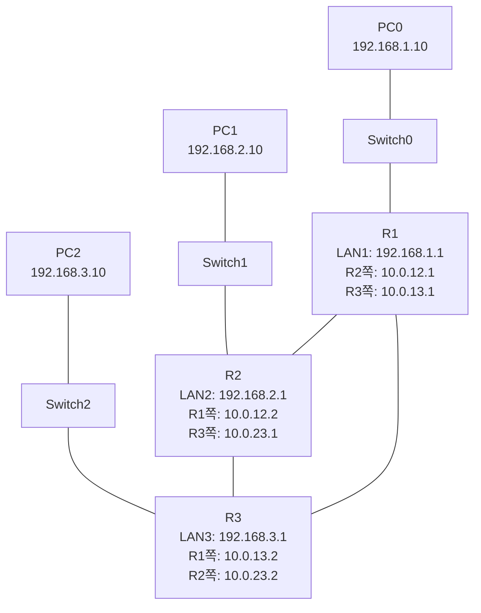

# 라우터 3대 동적 라우팅으로 변경하기

> 9강에서는 R1, R2, R3가 서로 직접 연결된 상태에서 `ip route`를 직접 넣어 통신시켰음.
> 이번 10강에서는 **토폴로지와 IP 설정은 그대로 두고**, 정적 라우팅을 **동적 라우팅(RIP)** 으로 바꾼다.

---

# 1장. 이번 강의 목표

9강의 구조는 그대로 사용한다.



9강과 다른 점은 라우팅 방식이다.

| 구분 | 9강 | 10강 |
|---|---|---|
| 토폴로지 | 라우터 3대 + LAN 3개 | 동일 |
| IP 주소 | 수동 설정 | 동일 |
| 라우터끼리 케이블 | Cross-Over 3개 | 동일 |
| 라우팅 방식 | 정적 라우팅 | **동적 라우팅** |
| 사용하는 명령 | `ip route ...` | `router rip` |
| 라우팅 테이블 표시 | `S` | `R` |

> 10강은 장비를 새로 만들 필요가 없다.
> 9강 실습 파일에서 이어서 해도 되고, 같은 토폴로지를 새로 만든 뒤 진행해도 된다.

---

# 2장. 왜 동적 라우팅을 쓰는가?

9강에서는 라우터마다 직접 경로를 입력했다.

R1 예시:

```bash
R1(config)# ip route 192.168.2.0 255.255.255.0 10.0.12.2
R1(config)# ip route 192.168.3.0 255.255.255.0 10.0.13.2
R1(config)# ip route 10.0.23.0 255.255.255.0 10.0.12.2
```

라우터가 3대라서 아직은 할 만하다.
하지만 라우터가 10대, 20대가 되면 목적지 네트워크를 전부 손으로 입력하기 어렵다.

동적 라우팅은 라우터끼리 서로 정보를 주고받으며 경로를 자동으로 배운다.

| 방식 | 설명 |
|---|---|
| 정적 라우팅 | 관리자가 목적지별 경로를 직접 입력 |
| 동적 라우팅 | 라우터끼리 경로 정보를 교환하고 자동 학습 |

이번 강의에서는 동적 라우팅 프로토콜 중 가장 단순한 **RIP**을 사용한다.

---

# 3장. RIP이란?

RIP은 Routing Information Protocol의 약자다.

라우터끼리 자신이 알고 있는 네트워크 정보를 주고받고, 목적지까지 가는 길을 자동으로 라우팅 테이블에 넣는다.

| 항목 | 내용 |
|---|---|
| 이름 | RIP |
| 종류 | 동적 라우팅 프로토콜 |
| 기준 | 홉 수 |
| 홉의 의미 | 지나가는 라우터 개수 |
| 최대 홉 | 15홉 |
| 16홉 | 도달 불가 |
| 실습에서 사용할 버전 | RIP v2 |

> RIP은 실제 대규모 네트워크에서는 잘 쓰이지 않지만, 동적 라우팅 개념을 처음 배우기에는 좋다.
> "라우터끼리 길을 자동으로 알려준다"는 감각을 잡는 데 집중하면 된다.

---

# 4장. 9강과 동일한 IP 구성 확인

10강에서는 아래 IP 구성을 그대로 사용한다.

| 장비 | 포트 | IP 주소 | 서브넷 마스크 | 연결되는 곳 |
|---|---|---|---|---|
| PC0 | FastEthernet0 | 192.168.1.10 | 255.255.255.0 | LAN1 |
| PC0 | Gateway | 192.168.1.1 | - | R1 |
| R1 | G0/0 | 192.168.1.1 | 255.255.255.0 | SW0, PC0 |
| R1 | G0/1 | 10.0.12.1 | 255.255.255.0 | R2 |
| R1 | G0/2 | 10.0.13.1 | 255.255.255.0 | R3 |
| PC1 | FastEthernet0 | 192.168.2.10 | 255.255.255.0 | LAN2 |
| PC1 | Gateway | 192.168.2.1 | - | R2 |
| R2 | G0/0 | 192.168.2.1 | 255.255.255.0 | SW1, PC1 |
| R2 | G0/1 | 10.0.12.2 | 255.255.255.0 | R1 |
| R2 | G0/2 | 10.0.23.1 | 255.255.255.0 | R3 |
| PC2 | FastEthernet0 | 192.168.3.10 | 255.255.255.0 | LAN3 |
| PC2 | Gateway | 192.168.3.1 | - | R3 |
| R3 | G0/0 | 192.168.3.1 | 255.255.255.0 | SW2, PC2 |
| R3 | G0/1 | 10.0.13.2 | 255.255.255.0 | R1 |
| R3 | G0/2 | 10.0.23.2 | 255.255.255.0 | R2 |

라우터끼리 Cross-Over 연결도 그대로다.

```text
R1 G0/1  -- Cross-Over --  R2 G0/1
R1 G0/2  -- Cross-Over --  R3 G0/1
R2 G0/2  -- Cross-Over --  R3 G0/2
```

---

# 5장. 먼저 기존 정적 라우팅 제거

9강 실습을 이어서 한다면 라우터에 `ip route`가 이미 들어가 있다.
동적 라우팅 결과를 제대로 보려면 먼저 정적 라우팅을 지운다.

> 새 파일에서 처음부터 만들었다면 이 장은 건너뛰어도 된다.

---

## 5.1 R1 정적 라우팅 제거

```bash
R1> enable
R1# configure terminal

R1(config)# no ip route 192.168.2.0 255.255.255.0 10.0.12.2
R1(config)# no ip route 192.168.3.0 255.255.255.0 10.0.13.2
R1(config)# no ip route 10.0.23.0 255.255.255.0 10.0.12.2
```

---

## 5.2 R2 정적 라우팅 제거

```bash
R2> enable
R2# configure terminal

R2(config)# no ip route 192.168.1.0 255.255.255.0 10.0.12.1
R2(config)# no ip route 192.168.3.0 255.255.255.0 10.0.23.2
R2(config)# no ip route 10.0.13.0 255.255.255.0 10.0.12.1
```

---

## 5.3 R3 정적 라우팅 제거

```bash
R3> enable
R3# configure terminal

R3(config)# no ip route 192.168.1.0 255.255.255.0 10.0.13.1
R3(config)# no ip route 192.168.2.0 255.255.255.0 10.0.23.1
R3(config)# no ip route 10.0.12.0 255.255.255.0 10.0.13.1
```

정적 라우팅이 빠졌는지 확인한다.

```bash
R1# show ip route
```

이때 `S`로 시작하는 줄이 없어야 한다.

| 표시 | 의미 |
|---|---|
| `C` | 직접 연결된 네트워크 |
| `L` | 라우터 인터페이스 자기 자신 주소 |
| `S` | 정적 라우팅 |
| `R` | RIP으로 배운 동적 라우팅 |

아직 RIP을 설정하기 전이므로 `R`도 보이지 않는다.

---

# 6장. RIP 설정하기

RIP 설정의 기본 흐름은 3줄이다.

```bash
router rip
version 2
no auto-summary
```

그리고 RIP에 참여시킬 네트워크를 `network` 명령어로 알려준다.

```bash
network <직접 연결된 네트워크>
```

여기서 주의할 점이 있다.

Cisco IOS의 RIP `network` 명령은 큰 주소 묶음 기준으로 동작한다.
그래서 `10.0.12.0`, `10.0.13.0`, `10.0.23.0`을 각각 넣기보다 아래처럼 `10.0.0.0`을 넣는다.

```bash
network 10.0.0.0
```

그리고 각 라우터의 LAN 대역을 넣는다.

| 라우터 | RIP에 넣을 network |
|---|---|
| R1 | `network 192.168.1.0`, `network 10.0.0.0` |
| R2 | `network 192.168.2.0`, `network 10.0.0.0` |
| R3 | `network 192.168.3.0`, `network 10.0.0.0` |

---

## 6.1 R1 RIP 설정

```bash
R1(config)# router rip
R1(config-router)# version 2
R1(config-router)# no auto-summary
R1(config-router)# network 192.168.1.0
R1(config-router)# network 10.0.0.0
R1(config-router)# exit

R1(config)# end
R1# copy running-config startup-config
```

R1은 아래 네트워크를 RIP으로 광고한다.

| R1이 광고하는 네트워크 | 이유 |
|---|---|
| 192.168.1.0/24 | R1 아래 LAN1 |
| 10.0.12.0/24 | R1-R2 직접 연결 |
| 10.0.13.0/24 | R1-R3 직접 연결 |

---

## 6.2 R2 RIP 설정

```bash
R2(config)# router rip
R2(config-router)# version 2
R2(config-router)# no auto-summary
R2(config-router)# network 192.168.2.0
R2(config-router)# network 10.0.0.0
R2(config-router)# exit

R2(config)# end
R2# copy running-config startup-config
```

R2는 아래 네트워크를 RIP으로 광고한다.

| R2가 광고하는 네트워크 | 이유 |
|---|---|
| 192.168.2.0/24 | R2 아래 LAN2 |
| 10.0.12.0/24 | R1-R2 직접 연결 |
| 10.0.23.0/24 | R2-R3 직접 연결 |

---

## 6.3 R3 RIP 설정

```bash
R3(config)# router rip
R3(config-router)# version 2
R3(config-router)# no auto-summary
R3(config-router)# network 192.168.3.0
R3(config-router)# network 10.0.0.0
R3(config-router)# exit

R3(config)# end
R3# copy running-config startup-config
```

R3는 아래 네트워크를 RIP으로 광고한다.

| R3가 광고하는 네트워크 | 이유 |
|---|---|
| 192.168.3.0/24 | R3 아래 LAN3 |
| 10.0.13.0/24 | R1-R3 직접 연결 |
| 10.0.23.0/24 | R2-R3 직접 연결 |

---

# 7장. 전체 설정 모음

처음부터 동적 라우팅으로 실습한다면 아래처럼 입력하면 된다.
인터페이스 IP 설정은 9강과 같고, 라우팅 부분만 RIP으로 바뀐다.

---

## 7.1 R1 전체 설정

```bash
enable
configure terminal
hostname R1

interface g0/0
ip address 192.168.1.1 255.255.255.0
no shutdown
exit

interface g0/1
ip address 10.0.12.1 255.255.255.0
no shutdown
exit

interface g0/2
ip address 10.0.13.1 255.255.255.0
no shutdown
exit

router rip
version 2
no auto-summary
network 192.168.1.0
network 10.0.0.0
exit

end
copy running-config startup-config
```

---

## 7.2 R2 전체 설정

```bash
enable
configure terminal
hostname R2

interface g0/0
ip address 192.168.2.1 255.255.255.0
no shutdown
exit

interface g0/1
ip address 10.0.12.2 255.255.255.0
no shutdown
exit

interface g0/2
ip address 10.0.23.1 255.255.255.0
no shutdown
exit

router rip
version 2
no auto-summary
network 192.168.2.0
network 10.0.0.0
exit

end
copy running-config startup-config
```

---

## 7.3 R3 전체 설정

```bash
enable
configure terminal
hostname R3

interface g0/0
ip address 192.168.3.1 255.255.255.0
no shutdown
exit

interface g0/1
ip address 10.0.13.2 255.255.255.0
no shutdown
exit

interface g0/2
ip address 10.0.23.2 255.255.255.0
no shutdown
exit

router rip
version 2
no auto-summary
network 192.168.3.0
network 10.0.0.0
exit

end
copy running-config startup-config
```

---

# 8장. 라우팅 테이블 확인

RIP 설정 후 바로 안 보이면 10~30초 정도 기다린다.
RIP은 라우터끼리 정보를 주고받는 시간이 필요하다.

```bash
show ip route
```

---

## 8.1 R1 라우팅 테이블 예시

R1은 직접 연결된 LAN1 외에 LAN2, LAN3를 RIP으로 배워야 한다.

```bash
R1# show ip route

C    192.168.1.0/24 is directly connected, GigabitEthernet0/0
C    10.0.12.0/24 is directly connected, GigabitEthernet0/1
C    10.0.13.0/24 is directly connected, GigabitEthernet0/2
R    192.168.2.0/24 [120/1] via 10.0.12.2, GigabitEthernet0/1
R    192.168.3.0/24 [120/1] via 10.0.13.2, GigabitEthernet0/2
R    10.0.23.0/24 [120/1] via 10.0.12.2, GigabitEthernet0/1
                 [120/1] via 10.0.13.2, GigabitEthernet0/2
```

여기서 핵심은 `R`이다.

| 표시 | 의미 |
|---|---|
| `C` | 직접 연결됨 |
| `R` | RIP으로 배움 |
| `[120/1]` | 관리 거리 120, 홉 수 1 |

> R1은 R2-R3 사이 네트워크인 `10.0.23.0/24`를 R2 쪽으로도, R3 쪽으로도 배울 수 있다.
> 그래서 Packet Tracer에서는 두 경로가 함께 보일 수 있다.

---

## 8.2 R2 라우팅 테이블 예시

```bash
R2# show ip route

C    192.168.2.0/24 is directly connected, GigabitEthernet0/0
C    10.0.12.0/24 is directly connected, GigabitEthernet0/1
C    10.0.23.0/24 is directly connected, GigabitEthernet0/2
R    192.168.1.0/24 [120/1] via 10.0.12.1, GigabitEthernet0/1
R    192.168.3.0/24 [120/1] via 10.0.23.2, GigabitEthernet0/2
R    10.0.13.0/24 [120/1] via 10.0.12.1, GigabitEthernet0/1
                 [120/1] via 10.0.23.2, GigabitEthernet0/2
```

---

## 8.3 R3 라우팅 테이블 예시

```bash
R3# show ip route

C    192.168.3.0/24 is directly connected, GigabitEthernet0/0
C    10.0.13.0/24 is directly connected, GigabitEthernet0/1
C    10.0.23.0/24 is directly connected, GigabitEthernet0/2
R    192.168.1.0/24 [120/1] via 10.0.13.1, GigabitEthernet0/1
R    192.168.2.0/24 [120/1] via 10.0.23.1, GigabitEthernet0/2
R    10.0.12.0/24 [120/1] via 10.0.13.1, GigabitEthernet0/1
                 [120/1] via 10.0.23.1, GigabitEthernet0/2
```

---

# 9장. RIP 설정 확인 명령어

## 9.1 `show ip protocols`

RIP이 켜져 있는지 확인한다.

```bash
R1# show ip protocols
```

확인할 부분:

| 항목 | 정상 값 |
|---|---|
| Routing Protocol | rip |
| Sending updates | RIP Version 2 |
| Receiving updates | RIP Version 2 |
| Automatic network summarization | not in effect |
| Routing for Networks | 10.0.0.0, 192.168.1.0 |

R2라면 `192.168.2.0`, R3라면 `192.168.3.0`이 보여야 한다.

---

## 9.2 `show running-config`

현재 설정에서 RIP 부분만 확인한다.

```bash
R1# show running-config
```

R1에 아래가 있어야 한다.

```bash
router rip
 version 2
 network 10.0.0.0
 network 192.168.1.0
 no auto-summary
```

> 순서는 Packet Tracer가 자동으로 바꿔서 보여줄 수 있다.
> 핵심은 `router rip`, `version 2`, `network 10.0.0.0`, 자기 LAN network, `no auto-summary`가 들어가 있는지다.

---

# 10장. PC끼리 Ping 테스트

## 10.1 PC0에서 가까운 곳부터 확인

```bash
PC0> ping 192.168.1.1
PC0> ping 10.0.12.2
PC0> ping 10.0.13.2
PC0> ping 192.168.2.10
PC0> ping 192.168.3.10
```

각 테스트의 의미:

| 명령어 | 확인하는 것 |
|---|---|
| `ping 192.168.1.1` | PC0 ↔ R1 LAN 연결 |
| `ping 10.0.12.2` | R1 ↔ R2 직접 연결 |
| `ping 10.0.13.2` | R1 ↔ R3 직접 연결 |
| `ping 192.168.2.10` | PC0 ↔ PC1 통신 |
| `ping 192.168.3.10` | PC0 ↔ PC2 통신 |

첫 ping에서 한두 개가 실패하고 뒤에 성공할 수 있다.
ARP 때문에 처음 패킷이 늦는 경우가 있다.

---

## 10.2 세 PC끼리 최종 테스트

PC0에서 PC1:

```bash
PC0> ping 192.168.2.10

Reply from 192.168.2.10: bytes=32 time<1ms TTL=126
Reply from 192.168.2.10: bytes=32 time<1ms TTL=126
Reply from 192.168.2.10: bytes=32 time<1ms TTL=126
Reply from 192.168.2.10: bytes=32 time<1ms TTL=126
```

PC0에서 PC2:

```bash
PC0> ping 192.168.3.10

Reply from 192.168.3.10: bytes=32 time<1ms TTL=126
Reply from 192.168.3.10: bytes=32 time<1ms TTL=126
Reply from 192.168.3.10: bytes=32 time<1ms TTL=126
Reply from 192.168.3.10: bytes=32 time<1ms TTL=126
```

PC1에서 PC2:

```bash
PC1> ping 192.168.3.10

Reply from 192.168.3.10: bytes=32 time<1ms TTL=126
Reply from 192.168.3.10: bytes=32 time<1ms TTL=126
Reply from 192.168.3.10: bytes=32 time<1ms TTL=126
Reply from 192.168.3.10: bytes=32 time<1ms TTL=126
```

---

# 11장. 정적 라우팅과 RIP 비교

9강에서 R1은 아래처럼 목적지별 경로를 직접 가졌다.

```bash
S    192.168.2.0/24 [1/0] via 10.0.12.2
S    192.168.3.0/24 [1/0] via 10.0.13.2
```

10강에서는 직접 입력하지 않았는데 RIP이 자동으로 넣어준다.

```bash
R    192.168.2.0/24 [120/1] via 10.0.12.2
R    192.168.3.0/24 [120/1] via 10.0.13.2
```

차이는 앞 글자다.

| 표시 | 라우팅 방식 | 뜻 |
|---|---|---|
| `S` | Static | 사람이 직접 넣은 경로 |
| `R` | RIP | RIP으로 자동 학습한 경로 |

---

# 12장. 자주 나는 실수

| 증상 | 원인 | 해결 |
|---|---|---|
| `show ip route`에 `R`이 안 보임 | RIP 설정 누락 또는 아직 업데이트 전 | `show ip protocols` 확인, 30초 대기 |
| `S`만 보임 | 9강 정적 라우팅을 지우지 않음 | `no ip route ...`로 제거 |
| R1에서 LAN2만 안 보임 | R2에 `network 192.168.2.0` 누락 | R2 RIP 설정 확인 |
| R1에서 LAN3만 안 보임 | R3에 `network 192.168.3.0` 누락 | R3 RIP 설정 확인 |
| 라우터끼리 ping이 안 됨 | RIP 문제가 아니라 케이블/IP 문제 | 먼저 라우터 직접 연결 ping 확인 |
| PC끼리만 안 됨 | PC IP/Gateway 문제 | PC의 Default Gateway 확인 |
| `network 10.0.12.0`을 넣었는데 이상함 | RIP network 명령 이해 부족 | `network 10.0.0.0` 사용 |
| RIP 설정 후에도 통신 안 됨 | `no auto-summary` 누락 가능 | `router rip` 아래 `no auto-summary` 입력 |

---

# 13장. 실습 순서 요약

처음부터 차례대로 하면 아래 순서다.

1. 9강과 동일하게 장비와 케이블 구성
2. PC IP와 Gateway 설정
3. R1, R2, R3 인터페이스 IP 설정
4. 라우터끼리 직접 ping 확인
5. 기존 `ip route` 제거
6. `router rip` 설정
7. `show ip protocols` 확인
8. `show ip route`에서 `R` 확인
9. PC0, PC1, PC2끼리 ping 테스트

---

# 정리

| 핵심 | 내용 |
|---|---|
| 10강 구조 | 9강과 동일한 라우터 3대 + LAN 3개 |
| 바뀌는 것 | 정적 라우팅을 동적 라우팅으로 변경 |
| 사용하는 프로토콜 | RIP v2 |
| 주요 명령어 | `router rip`, `version 2`, `no auto-summary`, `network ...` |
| 10.0.x.x 대역 설정 | `network 10.0.0.0` |
| 각 LAN 설정 | R1은 `192.168.1.0`, R2는 `192.168.2.0`, R3는 `192.168.3.0` |
| 라우팅 테이블 표시 | RIP으로 배운 경로는 `R` |
| 검증 순서 | `show ip protocols` → `show ip route` → PC ping |

> **다음 강의 예고**
> 11강에서는 RIP보다 더 실제 네트워크에서 많이 쓰이는 **OSPF**의 기본 개념과 설정 방법을 다룬다.
