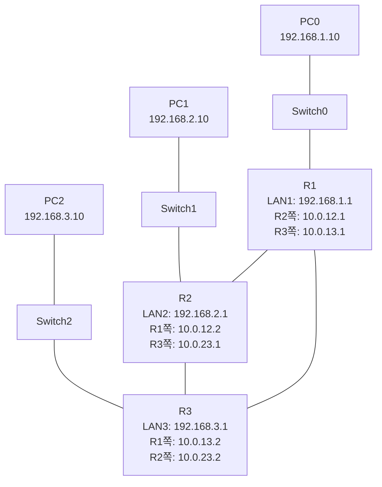

# 라우터 3대 OSPF 동적 라우팅으로 변경하기

> 10강에서는 9강과 같은 라우터 3대 구조에서 **RIP**으로 동적 라우팅을 설정했음.
> 이번 11강에서는 **토폴로지와 IP 설정은 그대로 유지**하고, 동적 라우팅 프로토콜만 **OSPF**로 바꾼다.

---

# 1장. 이번 강의 목표

10강의 구조를 그대로 사용한다.



10강과 11강의 차이는 라우팅 프로토콜이다.

| 구분 | 10강 | 11강 |
|---|---|---|
| 토폴로지 | 라우터 3대 + LAN 3개 | 동일 |
| IP 주소 | 동일 | 동일 |
| 라우터끼리 연결 | R1-R2, R1-R3, R2-R3 | 동일 |
| 동적 라우팅 | RIP v2 | **OSPF** |
| 설정 명령 | `router rip` | `router ospf 1` |
| 라우팅 테이블 표시 | `R` | `O` |

> 11강은 장비를 다시 만들 필요가 없다.
> 10강 실습 파일에서 이어서 하되, RIP을 끄고 OSPF를 새로 설정하면 된다.

---

# 2장. RIP과 OSPF 차이

RIP과 OSPF는 둘 다 동적 라우팅 프로토콜이다.
하지만 경로를 고르는 기준이 다르다.

| 항목 | RIP | OSPF |
|---|---|---|
| 경로 기준 | 홉 수 | Cost |
| 홉 제한 | 15홉 | 사실상 훨씬 큼 |
| 수렴 속도 | 느린 편 | 빠른 편 |
| 실제 사용 | 학습용, 소규모 | 실무에서 자주 사용 |
| 라우팅 테이블 표시 | `R` | `O` |

RIP은 라우터를 몇 대 지나가는지만 보고 판단한다.

```text
라우터 1대 통과 = 1홉
라우터 2대 통과 = 2홉
```

OSPF는 인터페이스의 비용(Cost)을 기준으로 더 좋은 경로를 계산한다.
이번 실습에서는 비용 계산을 깊게 들어가지 않고, **OSPF로 경로가 자동 학습되는 것**에 집중한다.

---

# 3장. OSPF 기본 개념

OSPF는 Open Shortest Path First의 약자다.

라우터끼리 서로 연결 상태 정보를 교환하고, 목적지까지 가는 경로를 계산한다.

| 개념 | 설명 |
|---|---|
| OSPF | 링크 상태 기반 동적 라우팅 프로토콜 |
| Area | OSPF 네트워크를 나누는 영역 |
| Area 0 | OSPF의 기본 백본 영역 |
| Process ID | 라우터 안에서 OSPF 프로세스를 구분하는 번호 |
| Router ID | OSPF에서 라우터를 식별하는 ID |
| Wildcard Mask | OSPF network 명령에서 사용하는 반대 마스크 |

이번 실습에서는 모든 라우터를 **area 0**에 넣는다.

```text
R1, R2, R3 모두 area 0
```

> 처음 OSPF를 배울 때는 “모든 네트워크를 area 0에 넣는다”로 시작하면 충분하다.

---

# 4장. 10강과 동일한 IP 구성 확인

아래 IP 구성은 10강과 동일하다.

| 장비 | 포트 | IP 주소 | 서브넷 마스크 | 연결되는 곳 |
|---|---|---|---|---|
| PC0 | FastEthernet0 | 192.168.1.10 | 255.255.255.0 | LAN1 |
| PC0 | Gateway | 192.168.1.1 | - | R1 |
| R1 | G0/0 | 192.168.1.1 | 255.255.255.0 | SW0, PC0 |
| R1 | G0/1 | 10.0.12.1 | 255.255.255.0 | R2 |
| R1 | G0/2 | 10.0.13.1 | 255.255.255.0 | R3 |
| PC1 | FastEthernet0 | 192.168.2.10 | 255.255.255.0 | LAN2 |
| PC1 | Gateway | 192.168.2.1 | - | R2 |
| R2 | G0/0 | 192.168.2.1 | 255.255.255.0 | SW1, PC1 |
| R2 | G0/1 | 10.0.12.2 | 255.255.255.0 | R1 |
| R2 | G0/2 | 10.0.23.1 | 255.255.255.0 | R3 |
| PC2 | FastEthernet0 | 192.168.3.10 | 255.255.255.0 | LAN3 |
| PC2 | Gateway | 192.168.3.1 | - | R3 |
| R3 | G0/0 | 192.168.3.1 | 255.255.255.0 | SW2, PC2 |
| R3 | G0/1 | 10.0.13.2 | 255.255.255.0 | R1 |
| R3 | G0/2 | 10.0.23.2 | 255.255.255.0 | R2 |

라우터끼리 연결도 10강과 동일하다.

```text
R1 G0/1  -- Cross-Over --  R2 G0/1
R1 G0/2  -- Cross-Over --  R3 G0/1
R2 G0/2  -- Cross-Over --  R3 G0/2
```

---

# 5장. 기존 RIP 제거

10강 실습 파일에서 이어서 한다면 라우터에 RIP 설정이 들어가 있다.
OSPF 결과를 명확히 보려면 먼저 R1, R2, R3에서 각각 RIP을 제거한다.

> 새 파일에서 처음부터 만들었다면 이 장은 건너뛰어도 된다.

---

## 5.1 R1에서 RIP 제거

R1의 CLI에 접속한 뒤 입력한다.

```bash
R1> enable
R1# configure terminal
R1(config)# no router rip
R1(config)# end
```

---

## 5.2 R2에서 RIP 제거

R2의 CLI에 접속한 뒤 입력한다.

```bash
R2> enable
R2# configure terminal
R2(config)# no router rip
R2(config)# end
```

---

## 5.3 R3에서 RIP 제거

R3의 CLI에 접속한 뒤 입력한다.

```bash
R3> enable
R3# configure terminal
R3(config)# no router rip
R3(config)# end
```

---

## 5.4 RIP 제거 확인

각 라우터에서 아래 명령어로 확인한다.

```bash
show ip protocols
```

RIP이 꺼졌다면 `Routing Protocol is "rip"` 같은 내용이 보이지 않는다.

R1, R2, R3 모두에서 동일하게 확인한다.

> 9강 정적 라우팅이 남아 있다면 `S` 경로가 우선 보일 수 있다.
> 정적 라우팅까지 남아 있는 경우에는 10강 5장의 `no ip route ...` 명령도 같이 제거한다.

---

# 6장. OSPF 설정 명령어 이해

OSPF 설정 기본 형태는 아래와 같다.

```bash
router ospf 1
network <네트워크 주소> <와일드카드 마스크> area 0
```

여기서 `1`은 OSPF Process ID다.

```bash
router ospf 1
```

뜻은 “이 라우터에서 OSPF 프로세스 1번을 시작한다”이다.

> Process ID는 라우터 내부에서만 의미가 있다.
> R1, R2, R3가 모두 `1`을 써도 되고, 서로 달라도 이론상 동작은 가능하다.
> 실습에서는 헷갈리지 않게 모두 `1`로 통일한다.

---

## 6.1 Wildcard Mask란?

OSPF는 서브넷 마스크 대신 **와일드카드 마스크**를 쓴다.

이번 실습은 전부 `/24`이므로 와일드카드 마스크는 모두 `0.0.0.255`다.

| 서브넷 마스크 | 와일드카드 마스크 |
|---|---|
| 255.255.255.0 | 0.0.0.255 |

예를 들어 `192.168.1.0/24`를 OSPF에 넣으려면 이렇게 쓴다.

```bash
network 192.168.1.0 0.0.0.255 area 0
```

`10.0.12.0/24`도 마찬가지다.

```bash
network 10.0.12.0 0.0.0.255 area 0
```

---

# 7장. OSPF 설정하기

각 라우터는 자기에게 직접 연결된 네트워크만 OSPF에 넣는다.

| 라우터 | OSPF에 넣을 네트워크 |
|---|---|
| R1 | `192.168.1.0`, `10.0.12.0`, `10.0.13.0` |
| R2 | `192.168.2.0`, `10.0.12.0`, `10.0.23.0` |
| R3 | `192.168.3.0`, `10.0.13.0`, `10.0.23.0` |

---

## 7.1 R1 OSPF 설정

```bash
R1# configure terminal
R1(config)# router ospf 1
R1(config-router)# network 192.168.1.0 0.0.0.255 area 0
R1(config-router)# network 10.0.12.0 0.0.0.255 area 0
R1(config-router)# network 10.0.13.0 0.0.0.255 area 0
R1(config-router)# exit
R1(config)# end
R1# copy running-config startup-config
```

R1은 LAN1, R1-R2, R1-R3 네트워크를 OSPF에 참여시킨다.

---

## 7.2 R2 OSPF 설정

```bash
R2# configure terminal
R2(config)# router ospf 1
R2(config-router)# network 192.168.2.0 0.0.0.255 area 0
R2(config-router)# network 10.0.12.0 0.0.0.255 area 0
R2(config-router)# network 10.0.23.0 0.0.0.255 area 0
R2(config-router)# exit
R2(config)# end
R2# copy running-config startup-config
```

R2는 LAN2, R1-R2, R2-R3 네트워크를 OSPF에 참여시킨다.

---

## 7.3 R3 OSPF 설정

```bash
R3# configure terminal
R3(config)# router ospf 1
R3(config-router)# network 192.168.3.0 0.0.0.255 area 0
R3(config-router)# network 10.0.13.0 0.0.0.255 area 0
R3(config-router)# network 10.0.23.0 0.0.0.255 area 0
R3(config-router)# exit
R3(config)# end
R3# copy running-config startup-config
```

R3는 LAN3, R1-R3, R2-R3 네트워크를 OSPF에 참여시킨다.

---

# 8장. 전체 설정 모음

처음부터 OSPF로 실습한다면 아래처럼 입력하면 된다.
인터페이스 IP 설정은 10강과 같고, 라우팅 부분만 OSPF로 바뀐다.

---

## 8.1 R1 전체 설정

```bash
enable
configure terminal
hostname R1

interface g0/0
ip address 192.168.1.1 255.255.255.0
no shutdown
exit

interface g0/1
ip address 10.0.12.1 255.255.255.0
no shutdown
exit

interface g0/2
ip address 10.0.13.1 255.255.255.0
no shutdown
exit

router ospf 1
network 192.168.1.0 0.0.0.255 area 0
network 10.0.12.0 0.0.0.255 area 0
network 10.0.13.0 0.0.0.255 area 0
exit

end
copy running-config startup-config
```

---

## 8.2 R2 전체 설정

```bash
enable
configure terminal
hostname R2

interface g0/0
ip address 192.168.2.1 255.255.255.0
no shutdown
exit

interface g0/1
ip address 10.0.12.2 255.255.255.0
no shutdown
exit

interface g0/2
ip address 10.0.23.1 255.255.255.0
no shutdown
exit

router ospf 1
network 192.168.2.0 0.0.0.255 area 0
network 10.0.12.0 0.0.0.255 area 0
network 10.0.23.0 0.0.0.255 area 0
exit

end
copy running-config startup-config
```

---

## 8.3 R3 전체 설정

```bash
enable
configure terminal
hostname R3

interface g0/0
ip address 192.168.3.1 255.255.255.0
no shutdown
exit

interface g0/1
ip address 10.0.13.2 255.255.255.0
no shutdown
exit

interface g0/2
ip address 10.0.23.2 255.255.255.0
no shutdown
exit

router ospf 1
network 192.168.3.0 0.0.0.255 area 0
network 10.0.13.0 0.0.0.255 area 0
network 10.0.23.0 0.0.0.255 area 0
exit

end
copy running-config startup-config
```

---

# 9장. OSPF 이웃 확인

OSPF는 라우터끼리 이웃 관계를 맺는다.
RIP과 달리 이웃 상태를 직접 확인할 수 있다.

각 라우터에서 아래 명령어를 입력한다.

```bash
show ip ospf neighbor
```

각 라우터는 직접 연결된 다른 두 라우터를 이웃으로 봐야 한다.

| 라우터 | 봐야 하는 이웃 | 인터페이스 |
|---|---|---|
| R1 | R2 (10.0.12.2), R3 (10.0.13.2) | G0/1, G0/2 |
| R2 | R1 (10.0.12.1), R3 (10.0.23.2) | G0/1, G0/2 |
| R3 | R1 (10.0.13.1), R2 (10.0.23.1) | G0/1, G0/2 |

---

## 9.1 R1에서 이웃 확인

```bash
R1# show ip ospf neighbor

Neighbor ID     Pri   State           Dead Time   Address         Interface
2.2.2.2           1   FULL/DR         00:00:3x    10.0.12.2       GigabitEthernet0/1
3.3.3.3           1   FULL/DR         00:00:3x    10.0.13.2       GigabitEthernet0/2
```

R1에서는 R2와 R3 두 이웃이 보여야 한다.

---

## 9.2 R2에서 이웃 확인

```bash
R2# show ip ospf neighbor

Neighbor ID     Pri   State           Dead Time   Address         Interface
1.1.1.1           1   FULL/DR         00:00:3x    10.0.12.1       GigabitEthernet0/1
3.3.3.3           1   FULL/DR         00:00:3x    10.0.23.2       GigabitEthernet0/2
```

R2에서는 R1과 R3 두 이웃이 보여야 한다.

---

## 9.3 R3에서 이웃 확인

```bash
R3# show ip ospf neighbor

Neighbor ID     Pri   State           Dead Time   Address         Interface
1.1.1.1           1   FULL/DR         00:00:3x    10.0.13.1       GigabitEthernet0/1
2.2.2.2           1   FULL/DR         00:00:3x    10.0.23.1       GigabitEthernet0/2
```

R3에서는 R1과 R2 두 이웃이 보여야 한다.

---

## 9.4 State 의미

가장 중요한 것은 `State` 컬럼이다.

| 상태 | 의미 |
|---|---|
| `FULL` | OSPF 이웃 관계 정상 |
| `INIT` | 상대를 봤지만 완전한 이웃은 아님 |
| 아무것도 안 보임 | OSPF 설정 또는 연결 문제 |

> Packet Tracer에서는 Router ID가 예시와 다르게 보일 수 있다.
> `Neighbor ID` 숫자보다 `State`가 `FULL`인지 보는 게 중요하다.

---

# 10장. 라우팅 테이블 확인

OSPF 설정 후 아래 명령어로 확인한다.

```bash
show ip route
```

OSPF로 배운 경로는 앞에 `O`가 붙는다.

| 표시 | 의미 |
|---|---|
| `C` | 직접 연결된 네트워크 |
| `L` | 자기 인터페이스 주소 |
| `R` | RIP으로 배운 경로 |
| `O` | OSPF로 배운 경로 |

---

## 10.1 R1 라우팅 테이블 예시

R1은 LAN2와 LAN3를 OSPF로 배워야 한다.

```bash
R1# show ip route

C    192.168.1.0/24 is directly connected, GigabitEthernet0/0
C    10.0.12.0/24 is directly connected, GigabitEthernet0/1
C    10.0.13.0/24 is directly connected, GigabitEthernet0/2
O    192.168.2.0/24 [110/2] via 10.0.12.2, GigabitEthernet0/1
O    192.168.3.0/24 [110/2] via 10.0.13.2, GigabitEthernet0/2
O    10.0.23.0/24 [110/2] via 10.0.12.2, GigabitEthernet0/1
                  [110/2] via 10.0.13.2, GigabitEthernet0/2
```

여기서 `[110/2]`의 의미:

| 값 | 의미 |
|---|---|
| 110 | OSPF의 Administrative Distance |
| 2 | OSPF Cost 예시 |

> Packet Tracer에서는 Cost 값이 환경에 따라 다르게 보일 수 있다.
> 핵심은 `O` 경로가 보이는지다.

---

## 10.2 R2 라우팅 테이블 예시

```bash
R2# show ip route

C    192.168.2.0/24 is directly connected, GigabitEthernet0/0
C    10.0.12.0/24 is directly connected, GigabitEthernet0/1
C    10.0.23.0/24 is directly connected, GigabitEthernet0/2
O    192.168.1.0/24 [110/2] via 10.0.12.1, GigabitEthernet0/1
O    192.168.3.0/24 [110/2] via 10.0.23.2, GigabitEthernet0/2
O    10.0.13.0/24 [110/2] via 10.0.12.1, GigabitEthernet0/1
                  [110/2] via 10.0.23.2, GigabitEthernet0/2
```

---

## 10.3 R3 라우팅 테이블 예시

```bash
R3# show ip route

C    192.168.3.0/24 is directly connected, GigabitEthernet0/0
C    10.0.13.0/24 is directly connected, GigabitEthernet0/1
C    10.0.23.0/24 is directly connected, GigabitEthernet0/2
O    192.168.1.0/24 [110/2] via 10.0.13.1, GigabitEthernet0/1
O    192.168.2.0/24 [110/2] via 10.0.23.1, GigabitEthernet0/2
O    10.0.12.0/24 [110/2] via 10.0.13.1, GigabitEthernet0/1
                  [110/2] via 10.0.23.1, GigabitEthernet0/2
```

---

# 11장. OSPF 설정 확인 명령어

각 라우터에서 OSPF가 제대로 동작하는지 두 가지 명령어로 확인한다.

```bash
show ip protocols
show running-config
```

---

## 11.1 `show ip protocols`로 프로토콜 확인

라우팅 프로토콜이 OSPF로 동작하는지 확인한다.
세 라우터 모두에서 아래 항목이 보여야 한다.

| 공통 항목 | 정상 값 |
|---|---|
| Routing Protocol | ospf 1 |
| Routing Information Sources | 이웃 라우터 정보 |
| Distance | 110 |

`Routing for Networks` 항목은 라우터마다 다르다.

---

### 11.1.1 R1에서 확인

```bash
R1# show ip protocols
```

R1에 보여야 하는 network 목록:

```text
Routing for Networks:
  10.0.12.0 0.0.0.255 area 0
  10.0.13.0 0.0.0.255 area 0
  192.168.1.0 0.0.0.255 area 0
```

---

### 11.1.2 R2에서 확인

```bash
R2# show ip protocols
```

R2에 보여야 하는 network 목록:

```text
Routing for Networks:
  10.0.12.0 0.0.0.255 area 0
  10.0.23.0 0.0.0.255 area 0
  192.168.2.0 0.0.0.255 area 0
```

---

### 11.1.3 R3에서 확인

```bash
R3# show ip protocols
```

R3에 보여야 하는 network 목록:

```text
Routing for Networks:
  10.0.13.0 0.0.0.255 area 0
  10.0.23.0 0.0.0.255 area 0
  192.168.3.0 0.0.0.255 area 0
```

---

## 11.2 `show running-config`로 설정 확인

설정에 OSPF가 들어갔는지 확인한다.

---

### 11.2.1 R1에서 확인

```bash
R1# show running-config
```

R1에 아래가 있어야 한다.

```bash
router ospf 1
 network 10.0.12.0 0.0.0.255 area 0
 network 10.0.13.0 0.0.0.255 area 0
 network 192.168.1.0 0.0.0.255 area 0
```

---

### 11.2.2 R2에서 확인

```bash
R2# show running-config
```

R2에 아래가 있어야 한다.

```bash
router ospf 1
 network 10.0.12.0 0.0.0.255 area 0
 network 10.0.23.0 0.0.0.255 area 0
 network 192.168.2.0 0.0.0.255 area 0
```

---

### 11.2.3 R3에서 확인

```bash
R3# show running-config
```

R3에 아래가 있어야 한다.

```bash
router ospf 1
 network 10.0.13.0 0.0.0.255 area 0
 network 10.0.23.0 0.0.0.255 area 0
 network 192.168.3.0 0.0.0.255 area 0
```

> 순서는 Packet Tracer가 자동으로 바꿔서 보여줄 수 있다.
> 핵심은 `router ospf 1` 아래에 자기에게 직접 연결된 세 네트워크가 모두 들어가 있는지다.

---

# 12장. PC끼리 Ping 테스트

## 12.1 PC0에서 가까운 곳부터 확인

```bash
PC0> ping 192.168.1.1
PC0> ping 10.0.12.2
PC0> ping 10.0.13.2
PC0> ping 192.168.2.10
PC0> ping 192.168.3.10
```

각 테스트의 의미:

| 명령어 | 확인하는 것 |
|---|---|
| `ping 192.168.1.1` | PC0 ↔ R1 LAN 연결 |
| `ping 10.0.12.2` | R1 ↔ R2 직접 연결 |
| `ping 10.0.13.2` | R1 ↔ R3 직접 연결 |
| `ping 192.168.2.10` | PC0 ↔ PC1 통신 |
| `ping 192.168.3.10` | PC0 ↔ PC2 통신 |

첫 ping에서 한두 개가 실패하고 뒤에 성공할 수 있다.
ARP나 OSPF 수렴 시간 때문에 처음 패킷이 늦는 경우가 있다.

---

## 12.2 세 PC끼리 최종 테스트

PC0에서 PC1:

```bash
PC0> ping 192.168.2.10

Reply from 192.168.2.10: bytes=32 time<1ms TTL=126
Reply from 192.168.2.10: bytes=32 time<1ms TTL=126
Reply from 192.168.2.10: bytes=32 time<1ms TTL=126
Reply from 192.168.2.10: bytes=32 time<1ms TTL=126
```

PC0에서 PC2:

```bash
PC0> ping 192.168.3.10

Reply from 192.168.3.10: bytes=32 time<1ms TTL=126
Reply from 192.168.3.10: bytes=32 time<1ms TTL=126
Reply from 192.168.3.10: bytes=32 time<1ms TTL=126
Reply from 192.168.3.10: bytes=32 time<1ms TTL=126
```

PC1에서 PC2:

```bash
PC1> ping 192.168.3.10

Reply from 192.168.3.10: bytes=32 time<1ms TTL=126
Reply from 192.168.3.10: bytes=32 time<1ms TTL=126
Reply from 192.168.3.10: bytes=32 time<1ms TTL=126
Reply from 192.168.3.10: bytes=32 time<1ms TTL=126
```

---

# 13장. RIP과 OSPF 결과 비교

10강에서는 라우팅 테이블에 `R`이 보였다.

```bash
R    192.168.2.0/24 [120/1] via 10.0.12.2
```

11강에서는 OSPF를 사용하므로 `O`가 보인다.

```bash
O    192.168.2.0/24 [110/2] via 10.0.12.2
```

| 표시 | 프로토콜 | 의미 |
|---|---|---|
| `R` | RIP | RIP으로 배운 경로 |
| `O` | OSPF | OSPF로 배운 경로 |

또 다른 차이는 관리 거리다.

| 프로토콜 | Administrative Distance |
|---|---|
| RIP | 120 |
| OSPF | 110 |

> 같은 목적지에 RIP과 OSPF 경로가 둘 다 있으면, 기본적으로 OSPF가 더 우선된다.
> 숫자가 낮을수록 더 신뢰하는 경로로 본다.

---

# 14장. 왜 OSPF가 더 좋은가?

이 실습처럼 라우터 3대뿐인 작은 네트워크에서는 RIP이나 OSPF나 결과가 거의 같아 보인다.
하지만 라우터 수십 대, 회선 종류가 섞여 있는 실제 네트워크에서는 OSPF가 훨씬 강하다.

## 14.1 Cost 기준으로 더 똑똑한 경로 선택

RIP은 **라우터를 몇 번 지나가는지(홉 수)** 만 본다.
OSPF는 **인터페이스 대역폭**을 반영한 Cost로 경로를 정한다.

같은 출발지·목적지에 두 경로가 있다고 해보자.

| 경로 | 회선 | 홉 수 |
|---|---|---|
| 경로 A | 1Gbps × 5홉 | 5 |
| 경로 B | 100Mbps × 3홉 | 3 |

| 프로토콜 | 선택하는 경로 | 이유 |
|---|---|---|
| RIP | 경로 B | 홉 수가 작음 (3 < 5) |
| OSPF | 경로 A | 빠른 회선이라 Cost 합이 더 작음 |

> RIP은 회선 속도를 모른다. OSPF는 빠른 회선이 있으면 그쪽으로 보낸다.

---

## 14.2 장애가 났을 때 빠르게 회복

RIP과 OSPF는 장애를 감지하고 새 경로를 찾는 속도가 다르다.

| 항목 | RIP | OSPF |
|---|---|---|
| 정기 업데이트 | 30초마다 라우팅 테이블 전체 전송 | Hello 패킷만 짧게 주고받음 |
| 장애 감지 | 무효화까지 약 180초 | 보통 수 초 안에 감지 |
| 새 경로 계산 | 여러 사이클 거쳐 수렴 | LSA 받자마자 SPF 재계산 |

> 회선 하나가 끊기면 RIP은 분 단위로 헤매지만 OSPF는 보통 몇 초 안에 다른 길을 찾는다.

---

## 14.3 홉 수 제한 차이

| 프로토콜 | 최대 홉 |
|---|---|
| RIP | 15홉 |
| OSPF | 사실상 무제한 |

RIP은 16홉이면 도달 불가로 본다. 라우터가 16대 이상 일렬로 늘어선 네트워크에서는 RIP을 쓸 수 없다.

---

## 14.4 이웃 관계로 안정성 확인

OSPF는 이웃 라우터와 Hello 패킷을 주기적으로 주고받으며 명시적인 이웃 관계를 맺는다.

```bash
R1# show ip ospf neighbor
```

이웃이 사라지면 즉시 알 수 있다.
RIP은 일정 시간 동안 업데이트가 없으면 서서히 경로가 무효화되는 구조라 반응이 느리다.

---

## 14.5 변화된 부분만 전달

RIP은 30초마다 자기가 아는 모든 경로를 통째로 보낸다.
OSPF는 토폴로지가 바뀐 부분만 LSA(Link State Advertisement)로 알린다.

| 비교 | RIP | OSPF |
|---|---|---|
| 정기 전송 주기 | 30초마다 전체 전송 | Hello만 (10초마다, 매우 작음) |
| 변경 시 전송 | 다음 주기까지 대기 | 즉시 LSA 전송 |
| 전송 내용 | 전체 라우팅 테이블 | 변경된 링크 상태만 |
| 네트워크 부하 | 큼 | 적음 |

> 라우터가 많을수록 RIP의 30초 주기 트래픽이 누적된다. OSPF는 평소엔 거의 조용하다.

---

## 14.6 Area로 큰 네트워크 분할

OSPF는 Area로 큰 네트워크를 작은 영역으로 나눌 수 있다.

```text
Area 0 (백본)
├── Area 1 (서울 지사)
├── Area 2 (부산 지사)
└── Area 3 (해외)
```

라우터 수백 대가 있어도 각 영역 안에서만 경로 계산이 일어난다.
RIP에는 영역 개념이 없어 라우터가 늘어나면 모두 같은 평면에서 정보를 주고받는다.

---

## 14.7 인증으로 보안 강화

OSPF는 라우팅 정보 교환에 인증을 적용할 수 있다.

```bash
ip ospf authentication message-digest
ip ospf message-digest-key 1 md5 <password>
```

가짜 라우터가 들어와서 잘못된 경로를 주입하는 공격을 막을 수 있다.
RIP v2도 인증을 지원하지만 OSPF가 더 광범위하게 쓰인다.

---

## 14.8 한눈에 보는 비교

| 관점 | RIP | OSPF |
|---|---|---|
| 경로 선택 | 단순 (홉 수만) | 똑똑 (대역폭 반영 Cost) |
| 장애 대응 속도 | 느림 (분 단위) | 빠름 (초 단위) |
| 홉 제한 | 15홉 | 사실상 없음 |
| 큰 네트워크 | 부적합 | 적합 (Area 분할) |
| 정기 트래픽 | 무거움 (전체 테이블) | 가벼움 (Hello만) |
| 변경 감지 | 다음 주기 대기 | 즉시 LSA |
| 보안 | 약함 | 강함 (인증) |
| 주 사용처 | 학습용, 소규모 | 기업/대형 인프라 |

> 작은 네트워크라면 RIP이 더 단순해서 설정하기 쉽다.
> 하지만 라우터가 늘어나고 회선 속도가 다양해지는 순간 OSPF의 장점이 커진다.
> 그래서 실제 기업 네트워크에서는 OSPF나 EIGRP, BGP 같은 더 강력한 프로토콜을 사용한다.
> RIP은 보통 동적 라우팅의 감을 잡기 위한 학습용으로 본다.

---

# 15장. 자주 나는 실수

| 증상 | 원인 | 해결 |
|---|---|---|
| `show ip route`에 `O`가 안 보임 | OSPF 설정 누락 또는 이웃 미형성 | `show ip ospf neighbor` 확인 |
| `R`만 보임 | 10강 RIP 설정을 지우지 않음 | `no router rip` 입력 |
| `S`만 보임 | 9강 정적 라우팅이 남아 있음 | `no ip route ...`로 제거 |
| R1에서 R2/R3 이웃이 안 보임 | 케이블/IP/OSPF network 문제 | 직접 ping 후 OSPF network 확인 |
| `network 10.0.0.0 area 0`처럼 입력함 | 와일드카드 마스크 누락 | `network 10.0.12.0 0.0.0.255 area 0` 형식 사용 |
| `network 192.168.1.0 255.255.255.0 area 0` 입력 | 서브넷 마스크를 넣음 | OSPF는 `0.0.0.255` 사용 |
| PC끼리만 안 됨 | PC Gateway 문제 | PC0/PC1/PC2 Default Gateway 확인 |
| 설정 후 바로 안 됨 | OSPF 수렴 대기 중 | 10~30초 기다린 뒤 다시 ping |

---

# 16장. 실습 순서 요약

처음부터 차례대로 하면 아래 순서다.

1. 10강과 동일한 토폴로지 준비
2. PC IP와 Gateway 확인
3. R1, R2, R3 인터페이스 IP 확인
4. 라우터끼리 직접 ping 확인
5. 기존 RIP 제거: `no router rip`
6. OSPF 설정: `router ospf 1`
7. 각 직접 연결 네트워크를 `network ... area 0`으로 추가
8. `show ip ospf neighbor`로 이웃 확인
9. `show ip route`에서 `O` 확인
10. PC끼리 ping 테스트

---

# 정리

| 핵심 | 내용 |
|---|---|
| 11강 구조 | 10강과 동일한 라우터 3대 + LAN 3개 |
| 바뀌는 것 | RIP을 OSPF로 변경 |
| 사용하는 프로토콜 | OSPF |
| OSPF 영역 | 모두 area 0 |
| 주요 명령어 | `router ospf 1`, `network ... 0.0.0.255 area 0` |
| 라우팅 테이블 표시 | OSPF 경로는 `O` |
| 이웃 확인 | `show ip ospf neighbor` |
| 검증 순서 | 직접 ping → OSPF neighbor → `show ip route` → PC ping |

> **다음 강의 예고**
> 12강에서는 OSPF에서 직접 연결 하나를 끊었을 때 경로가 어떻게 바뀌는지,
> 장애 상황에서 동적 라우팅이 다시 계산되는 과정을 확인한다.
