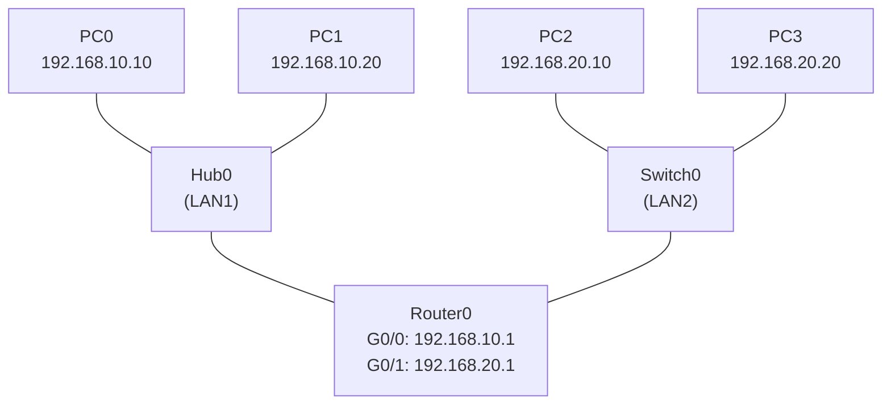

# 4일차까지 핵심 개념 총정리 & 통합 실습 과제

> 4일차까지 배운 **허브, 스위치, 라우터, IP, MAC** 다섯 가지를 한 토폴로지에 모아서 직접 만든다.
> 마지막에 `.pkt` 파일로 저장해서 제출까지 한다.

---

# 1장. 이번 강의 목표

이번 실습은 새 명령어를 배우는 시간이 아니다.
지금까지 따라 한 내용을 한 번에 모아서 **혼자 힘으로 작은 네트워크를 만들어 보는 것**이 목표다.

| 점검할 것 | 내용 |
|---|---|
| 허브 | 어떻게 동작하는지 보고 직접 사용 |
| 스위치 | 허브와 무엇이 다른지 보고 사용 |
| 라우터 | 두 LAN을 연결 |
| IP | PC와 라우터 인터페이스에 정확히 할당 |
| MAC | ping이 일어날 때 ARP로 학습되는 것 확인 |

> 이 다섯 개념만 머릿속에 잡혀 있으면 5일차 이후 나올 더 큰 토폴로지도 같은 방식으로 만들 수 있다.

---

# 2장. 핵심 개념 빠른 복습

본격적인 실습 전에 다섯 개념을 짧게 정리한다.

---

## 2.1 허브 (Hub)

허브는 받은 신호를 **연결된 모든 포트로 그대로 뿌린다**.

| 항목 | 내용 |
|---|---|
| 동작 방식 | 한 포트로 들어온 신호를 다른 모든 포트로 복사 |
| 똑똑한가? | 아니다. 어떤 PC가 어디 있는지 모름 |
| 결과 | 통신 1건이 발생하면 LAN 전체가 시끄러워짐 |
| 충돌 | 자주 발생 |

> 허브에 PC가 4대 붙어 있으면, PC0이 PC1에게 보내는 패킷도 PC2, PC3에게까지 전부 전달된다.

---

## 2.2 스위치 (Switch)

스위치는 **MAC 주소를 학습**해서 **필요한 포트로만** 보낸다.

| 항목 | 내용 |
|---|---|
| 동작 방식 | MAC 주소 테이블을 만들어 해당 PC가 있는 포트로만 전달 |
| 똑똑한가? | 그렇다. 학습할 수 있다 |
| 결과 | LAN 전체가 시끄러워지지 않음 |
| 충돌 | 거의 없음 |

> 스위치는 처음 한 번은 모르니까 모든 포트로 뿌리지만(broadcast), 한 번 본 MAC은 기억해서 다음부터는 해당 포트로만 보낸다.

---

## 2.3 라우터 (Router)

라우터는 **서로 다른 네트워크(LAN)를 연결**한다.

| 항목 | 내용 |
|---|---|
| 동작 단위 | IP 주소 |
| 역할 | 다른 네트워크로 가는 길을 정해줌 |
| 인터페이스 | 각 LAN마다 하나씩 IP를 가짐 |
| 라우팅 테이블 | 목적지 네트워크별로 어디로 보낼지 기록 |

> 허브와 스위치는 같은 LAN 안에서 PC끼리 연결한다.
> 라우터는 LAN과 LAN을 연결한다.

---

## 2.4 IP 주소

IP 주소는 **네트워크 안에서 PC를 구분**하는 논리 주소다.

| 항목 | 내용 |
|---|---|
| 형태 | 192.168.10.10 처럼 4개의 숫자 |
| 네트워크 부분 | 어느 네트워크에 속하는지 (서브넷 마스크로 구분) |
| 호스트 부분 | 그 네트워크 안 몇 번째 PC인지 |
| 변경 가능? | 관리자가 자유롭게 설정 가능 |

서브넷 마스크 `255.255.255.0`(/24)에서는 앞 3자리가 네트워크 부분이다.

```
192.168.10.10  ← 192.168.10.0 네트워크의 10번
192.168.10.20  ← 192.168.10.0 네트워크의 20번
192.168.20.10  ← 192.168.20.0 네트워크의 10번 (다른 네트워크)
```

---

## 2.5 MAC 주소

MAC 주소는 **랜카드에 새겨진 물리 주소**다.

| 항목 | 내용 |
|---|---|
| 형태 | 0001.6342.AB12 처럼 12자리 16진수 |
| 누가 정함 | 제조사가 출고 시 부여 |
| 변경 가능? | 사실상 고정 |
| 사용 범위 | 같은 LAN 안에서 통신할 때 |

> IP는 “어느 동네 몇 번지”라면, MAC은 “그 집의 등록번호”에 가깝다.
> 같은 LAN 안에서 ping을 보낼 때, PC는 ARP로 상대방의 MAC을 먼저 알아낸다.

---

## 2.6 다섯 개념의 관계 한 줄 정리

| 개념 | 한 줄 요약 |
|---|---|
| 허브 | 모두에게 뿌린다 |
| 스위치 | MAC 보고 정확히 보낸다 |
| 라우터 | LAN끼리 연결한다 |
| IP | 네트워크에서 PC를 구분 (논리 주소) |
| MAC | 랜카드의 고유 ID (물리 주소) |

---

# 3장. 만들 토폴로지

이번 과제에서는 **LAN 2개를 라우터 하나로 연결**한다.
한쪽 LAN은 **허브**, 다른 쪽 LAN은 **스위치**를 쓴다.



| 영역 | 장비 | 네트워크 |
|---|---|---|
| LAN1 | PC0, PC1, Hub0 | 192.168.10.0/24 |
| LAN2 | PC2, PC3, Switch0 | 192.168.20.0/24 |
| 연결 | Router0 | 두 LAN을 라우팅 |

> 같은 LAN 안에서는 허브/스위치만으로 통신이 된다.
> 다른 LAN으로 가려면 라우터의 도움이 필요하다.

---

# 4장. IP 주소 설계

각 장비에 들어갈 IP를 미리 표로 정리한다.

| 장비 | 포트 | IP 주소 | 서브넷 마스크 | 게이트웨이 |
|---|---|---|---|---|
| PC0 | FastEthernet0 | 192.168.10.10 | 255.255.255.0 | 192.168.10.1 |
| PC1 | FastEthernet0 | 192.168.10.20 | 255.255.255.0 | 192.168.10.1 |
| PC2 | FastEthernet0 | 192.168.20.10 | 255.255.255.0 | 192.168.20.1 |
| PC3 | FastEthernet0 | 192.168.20.20 | 255.255.255.0 | 192.168.20.1 |
| Router0 | GigabitEthernet0/0 | 192.168.10.1 | 255.255.255.0 | - |
| Router0 | GigabitEthernet0/1 | 192.168.20.1 | 255.255.255.0 | - |

> 같은 LAN 안의 PC들과 라우터 인터페이스는 **모두 같은 네트워크 대역**이어야 한다.
> 예: PC0(192.168.10.10), PC1(192.168.10.20), Router G0/0(192.168.10.1) 모두 192.168.10.x 대역.

---

# 5장. 장비 설치하기

## 5.1 장비 꺼내기

Packet Tracer 좌측 하단에서 아래 장비를 캔버스로 끌어다 놓는다.

| 장비 종류 | 모델 | 개수 | 이름 |
|---|---|---|---|
| Router | 2911 | 1개 | Router0 |
| Switch | 2960-24TT | 1개 | Switch0 |
| Hub | Hub-PT | 1개 | Hub0 |
| PC | PC-PT | 4개 | PC0, PC1, PC2, PC3 |

> 허브는 좌하단 장비 분류 중 **End Devices** 또는 **Hubs** 카테고리에 있다.
> 모델 이름은 `Hub-PT`다.

---

## 5.2 케이블 연결

좌하단 **번개 아이콘(Connections)**에서 케이블을 골라 연결한다.

| 연결 | 케이블 | 한쪽 포트 | 반대쪽 포트 |
|---|---|---|---|
| PC0 ↔ Hub0 | Straight-Through | PC0 FastEthernet0 | Hub0 FastEthernet0 |
| PC1 ↔ Hub0 | Straight-Through | PC1 FastEthernet0 | Hub0 FastEthernet1 |
| PC2 ↔ Switch0 | Straight-Through | PC2 FastEthernet0 | Switch0 FastEthernet0/1 |
| PC3 ↔ Switch0 | Straight-Through | PC3 FastEthernet0 | Switch0 FastEthernet0/2 |
| Hub0 ↔ Router0 | Cross-Over | Hub0 FastEthernet3 | Router0 GigabitEthernet0/0 |
| Switch0 ↔ Router0 | Straight-Through | Switch0 GigabitEthernet0/1 | Router0 GigabitEthernet0/1 |

케이블 종류 정리:

| 연결 | 케이블 |
|---|---|
| PC ↔ Hub | Straight-Through |
| PC ↔ Switch | Straight-Through |
| **Hub ↔ Router** | **Cross-Over** |
| Switch ↔ Router | Straight-Through |

> 모든 포트에 초록색 점이 표시되어야 정상 연결이다.
> 빨간색 점이 보이면 케이블 종류 또는 포트가 잘못된 것이다.

---

# 6장. PC IP 설정

각 PC를 **더블클릭 → Desktop → IP Configuration**에서 입력한다.

---

## 6.1 PC0 설정

```
IP Address       : 192.168.10.10
Subnet Mask      : 255.255.255.0
Default Gateway  : 192.168.10.1
```

---

## 6.2 PC1 설정

```
IP Address       : 192.168.10.20
Subnet Mask      : 255.255.255.0
Default Gateway  : 192.168.10.1
```

---

## 6.3 PC2 설정

```
IP Address       : 192.168.20.10
Subnet Mask      : 255.255.255.0
Default Gateway  : 192.168.20.1
```

---

## 6.4 PC3 설정

```
IP Address       : 192.168.20.20
Subnet Mask      : 255.255.255.0
Default Gateway  : 192.168.20.1
```

> Default Gateway를 빠뜨리면 같은 LAN 통신은 되지만 **다른 LAN 통신은 실패**한다.
> 4대 모두에 게이트웨이를 꼭 넣는다.

---

# 7장. 라우터 인터페이스 설정

Router0를 **더블클릭 → CLI 탭**에서 입력한다.

`Continue with configuration dialog?`가 나오면 `no` 입력 후 Enter.

```bash
Router> enable
Router# configure terminal
Router(config)# hostname R0

R0(config)# interface g0/0
R0(config-if)# ip address 192.168.10.1 255.255.255.0
R0(config-if)# no shutdown
R0(config-if)# exit

R0(config)# interface g0/1
R0(config-if)# ip address 192.168.20.1 255.255.255.0
R0(config-if)# no shutdown
R0(config-if)# exit

R0(config)# end
R0# copy running-config startup-config
```

| 명령어 | 의미 |
|---|---|
| `enable` | 관리자 모드로 진입 |
| `configure terminal` | 설정 모드로 진입 |
| `hostname R0` | 라우터 이름을 R0로 변경 |
| `interface g0/0` | G0/0 인터페이스 설정 시작 |
| `ip address ...` | IP 주소 할당 |
| `no shutdown` | 포트 켜기 |
| `copy running-config startup-config` | 재부팅해도 사라지지 않게 저장 |

> 이번 과제에서는 LAN 2개가 **라우터에 직접 연결**되어 있으므로 정적 라우팅(`ip route`)을 따로 넣지 않아도 된다.
> 라우터는 자기에게 직접 연결된 두 LAN을 자동으로 안다.

---

# 8장. 점검하기

설정이 끝나면 단계별로 확인한다.

---

## 8.1 라우터 인터페이스 상태 확인

```bash
R0# show ip interface brief
```

기대 결과:

```bash
Interface              IP-Address      OK? Method Status                Protocol
GigabitEthernet0/0     192.168.10.1    YES manual up                    up
GigabitEthernet0/1     192.168.20.1    YES manual up                    up
```

`Status`와 `Protocol`이 모두 `up`이면 정상이다.

---

## 8.2 같은 LAN 안에서 ping

먼저 같은 LAN끼리 통신이 되는지부터 본다.

**LAN1 안에서 (Hub):**

```bash
PC0> ping 192.168.10.20
```

**LAN2 안에서 (Switch):**

```bash
PC2> ping 192.168.20.20
```

같은 LAN 안 통신이 되면 허브/스위치 부분은 정상이다.

---

## 8.3 다른 LAN으로 ping

```bash
PC0> ping 192.168.20.10
PC0> ping 192.168.20.20
PC2> ping 192.168.10.10
PC2> ping 192.168.10.20
```

각 ping의 의미:

| 명령어 | 확인하는 것 |
|---|---|
| `PC0 → 192.168.20.10` | LAN1 → LAN2 (PC2) 라우터 경유 통신 |
| `PC0 → 192.168.20.20` | LAN1 → LAN2 (PC3) 라우터 경유 통신 |
| `PC2 → 192.168.10.10` | LAN2 → LAN1 (PC0) 라우터 경유 통신 |
| `PC2 → 192.168.10.20` | LAN2 → LAN1 (PC1) 라우터 경유 통신 |

`Reply from`이 보이면 라우터 통신까지 성공한 것이다.

> 첫 ping 1~2개 정도 실패하는 것은 정상이다. ARP로 MAC을 학습하는 시간이 필요하다.

---

# 9장. 허브와 스위치 차이 직접 보기

이번 토폴로지의 재미있는 점은 **허브와 스위치를 한눈에 비교**할 수 있다는 것이다.

Packet Tracer 우측 하단 **Simulation** 모드를 켜고 ping을 보내면 패킷이 어떻게 움직이는지 보인다.

---

## 9.1 허브 동작 관찰

PC0에서 PC1로 ping을 보낸다.

```bash
PC0> ping 192.168.10.20
```

Simulation 모드에서 보면:

| 단계 | 관찰 포인트 |
|---|---|
| PC0 → Hub0 | 패킷 1개 |
| Hub0 → PC1, Router0 (그리고 PC0 빼고 모든 포트) | 패킷이 **여러 갈래로 복사**됨 |

> 허브는 한 포트로 들어온 신호를 모든 포트로 그대로 뿌린다는 것을 눈으로 볼 수 있다.
> 받을 PC가 아닌 장비도 패킷을 받지만, 자기 MAC이 아니면 그냥 버린다.

---

## 9.2 스위치 동작 관찰

PC2에서 PC3로 ping을 보낸다.

```bash
PC2> ping 192.168.20.20
```

처음 한 번은 스위치도 모르니까 모든 포트로 뿌린다(broadcast).
하지만 두 번째부터는 학습한 MAC 주소를 보고 **PC3 쪽 포트로만** 보낸다.

| 단계 | 관찰 포인트 |
|---|---|
| PC2 → Switch0 (첫 번째) | 모든 포트로 broadcast |
| PC2 → Switch0 (두 번째 이후) | PC3 포트로만 전송 |

```bash
Switch0# show mac address-table
```

스위치가 학습한 MAC 주소가 보인다.

> 같은 ping이지만 허브는 항상 뿌리고, 스위치는 학습 후 정확히 보낸다.
> 이 차이가 큰 네트워크에서 성능 차이를 만든다.

---

# 10장. 파일 저장 및 제출

## 10.1 pkt 파일로 저장

```
File → Save As → day5-homework.pkt
```

> 저장 위치는 본인이 찾기 쉬운 폴더로 한다.
> 파일 이름은 `day5-homework.pkt`로 통일한다.

---

## 10.2 제출물

아래 4가지를 모두 제출한다.

| 제출 항목 | 내용 |
|---|---|
| `.pkt` 파일 | `day5-homework.pkt` |
| 캡처 1 | 같은 LAN ping 성공 화면 (`PC0 → 192.168.10.20`) |
| 캡처 2 | 다른 LAN ping 성공 화면 (`PC0 → 192.168.20.10`) |
| 캡처 3 | `R0# show ip interface brief` 화면 |

> **캡처 방법**: 키보드 `PrtSc` 키 또는 `Win + Shift + S` (Windows 스니핑 도구)

---

# 11장. 자주 막히는 부분

| 증상 | 원인 | 해결 |
|---|---|---|
| 케이블 빨간 점 | 케이블 종류 잘못됨 | Hub ↔ Router는 **Cross-Over** |
| 같은 LAN ping은 되는데 다른 LAN은 안 됨 | PC의 Default Gateway 누락 | PC IP Configuration에 게이트웨이 입력 |
| `Destination host unreachable` | 게이트웨이 또는 IP 대역 오류 | IP 표를 다시 확인 |
| 라우터 인터페이스가 down | `no shutdown` 빠뜨림 | 해당 인터페이스에서 `no shutdown` |
| 첫 ping만 실패 | ARP 학습 지연 (정상) | 같은 ping을 한 번 더 |
| 허브 포트가 모자람 | 4포트 이상 필요 | Hub-PT의 빈 포트 확인, 필요시 더 큰 허브 사용 |
| Router0 CLI에서 명령어가 안 먹음 | 모드가 다름 | `enable` → `configure terminal` 순서 확인 |

---

# 12장. 핵심 개념 다시 정리

이번 실습으로 다섯 개념을 모두 직접 만져 봤다.

| 개념 | 이번 실습에서 한 일 |
|---|---|
| 허브 | LAN1에서 PC0, PC1을 묶음. 패킷이 모든 포트로 뿌려지는 것 확인 |
| 스위치 | LAN2에서 PC2, PC3을 묶음. MAC 학습 후 정확히 전달되는 것 확인 |
| 라우터 | LAN1과 LAN2를 G0/0, G0/1로 연결 |
| IP | 4대 PC와 라우터 인터페이스 2개에 정확히 할당 |
| MAC | ping 시 ARP로 학습되는 것을 `show mac address-table`로 확인 |

> 이 다섯 가지를 머릿속에 그리면서 토폴로지를 만들 수 있게 되었다면, 5일차 이후의 더 복잡한 실습도 같은 패턴으로 풀 수 있다.

---

# 정리

| 핵심 | 내용 |
|---|---|
| 토폴로지 | LAN1(허브) + LAN2(스위치) + 라우터 1대 |
| LAN1 | 192.168.10.0/24, PC0/PC1/Hub0 |
| LAN2 | 192.168.20.0/24, PC2/PC3/Switch0 |
| 라우터 인터페이스 | G0/0=192.168.10.1, G0/1=192.168.20.1 |
| 같은 LAN 통신 | 허브/스위치만으로 가능 |
| 다른 LAN 통신 | PC의 Default Gateway + 라우터 필요 |
| 제출 | `day5-homework.pkt` + ping 캡처 2장 + 라우터 상태 캡처 1장 |

> **다음 강의 예고**
> 13강에서는 PC에서 서버까지 패킷이 어떻게 흘러가는지 OSI 7계층과 캡슐화 관점에서 전체 흐름을 다시 한번 복습한다.
