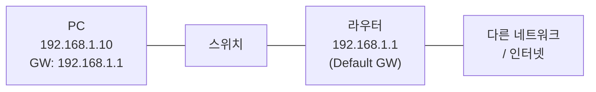
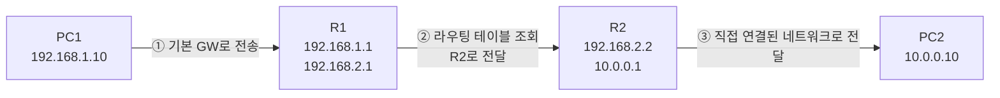
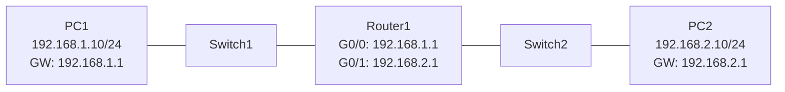

# IP·라우팅·Gateway·Subnet Mask 개념과 CISCO 라우터 설정 실습

---

# 1장. IP 주소의 개념

---

## 1.1 IP 주소란?

IP 주소(Internet Protocol Address)는 **네트워크상에서 장비를 식별하는 고유한 번호**임.  
전화번호가 사람을 구분하듯, IP 주소는 PC·서버·라우터 같은 **장비를 구분**함.

> 같은 네트워크 안에서 IP 주소가 중복되면 **IP 충돌(IP Conflict)** 이 발생해 통신이 불가능해짐.

---

## 1.2 IPv4 주소 구조

IPv4는 **32비트(4바이트)** 로 구성되며, 8비트씩 4개 블록으로 나눠 10진수로 표기함.

```
   192   .   168   .     1   .    10
 11000000 . 10101000 . 00000001 . 00001010
  └ 8bit ┘ └ 8bit ┘ └ 8bit ┘ └ 8bit ┘  = 총 32bit
```

- 각 블록은 **0 ~ 255** 범위의 값을 가짐
- 전체 표현 가능 개수: 2³² = 약 **43억 개**
- 43억 개가 부족해서 현재는 IPv6(128bit)도 함께 사용함

---

## 1.3 IP 주소의 구성: 네트워크부 + 호스트부

IP 주소는 **네트워크 부분(Network ID)** 과 **호스트 부분(Host ID)** 으로 나뉨.

```
192.168.1.10  /  255.255.255.0
└─────────┘      └─────────┘
 네트워크부+호스트부  서브넷 마스크

구분:
  192.168.1   → 네트워크 ID (어느 네트워크인가)
         .10  → 호스트 ID  (그 안에서 몇 번 장비인가)
```

> 전화번호로 비유하면,  
> **네트워크부 = 지역번호(02, 031)**, **호스트부 = 개인 번호**

---

## 1.4 공인 IP vs 사설 IP

| 구분 | 공인 IP (Public IP) | 사설 IP (Private IP) |
|---|---|---|
| **사용 범위** | 전 세계 인터넷에서 유일 | 내부 네트워크(LAN) 안에서만 사용 |
| **할당 주체** | ISP(통신사) | 공유기/관리자가 자유롭게 지정 |
| **예시** | 203.0.113.55 | 192.168.0.10, 10.0.0.5 |
| **인터넷 접속** | 직접 가능 | NAT로 공인 IP 변환 후 가능 |

**사설 IP 대역(RFC 1918):**

| 클래스 | 범위 | 용도 |
|---|---|---|
| A | 10.0.0.0 ~ 10.255.255.255 | 대형 기업 내부망 |
| B | 172.16.0.0 ~ 172.31.255.255 | 중형 네트워크 |
| C | 192.168.0.0 ~ 192.168.255.255 | 가정·소규모 사무실 |

---

## 1.5 IP 주소 클래스 (전통적 구분)

| 클래스 | 첫 옥텟 범위 | 기본 서브넷 | 용도 |
|---|---|---|---|
| **A** | 1 ~ 126 | 255.0.0.0 | 대형 네트워크 (호스트 약 1677만 개) |
| **B** | 128 ~ 191 | 255.255.0.0 | 중형 네트워크 (호스트 약 6.5만 개) |
| **C** | 192 ~ 223 | 255.255.255.0 | 소형 네트워크 (호스트 254개) |
| D | 224 ~ 239 | - | 멀티캐스트 |
| E | 240 ~ 255 | - | 연구·예약용 |

> 현재 실무는 클래스 구분 대신 **CIDR (Classless Inter-Domain Routing)** 표기(예: `/24`)를 주로 사용함.

---

# 2장. Subnet Mask의 개념

---

## 2.1 Subnet Mask란?

Subnet Mask(서브넷 마스크)는 **IP 주소에서 어디까지가 네트워크이고 어디부터가 호스트인지 구분하는 32비트 값**임.

- `1`로 채운 비트 → **네트워크 부분**
- `0`으로 채운 비트 → **호스트 부분**

```
IP          : 192.168.  1.   10
            : 11000000.10101000.00000001.00001010

Subnet Mask : 255.255.255.  0
            : 11111111.11111111.11111111.00000000
              └─────── 네트워크부 ────────┘└─호스트부─┘
```

---

## 2.2 CIDR 표기법

서브넷 마스크를 짧게 쓰는 방식. **1의 개수**를 슬래시(/) 뒤에 붙임.

| 서브넷 마스크 | CIDR | 네트워크 개수 | 호스트 수 (사용 가능) |
|---|---|---|---|
| 255.0.0.0 | /8 | A 클래스 | 약 1,677만 개 |
| 255.255.0.0 | /16 | B 클래스 | 약 65,534개 |
| 255.255.255.0 | /24 | C 클래스 | 254개 |
| 255.255.255.128 | /25 | - | 126개 |
| 255.255.255.192 | /26 | - | 62개 |
| 255.255.255.224 | /27 | - | 30개 |

> **사용 가능 호스트 수 = 2^(호스트비트) - 2**  
> `-2`는 **네트워크 주소(.0)** 와 **브로드캐스트 주소(.255)** 를 제외하기 때문임.

---

## 2.3 같은 네트워크인지 판별하는 방법

두 IP가 **같은 네트워크**인지 확인하려면 각각의 IP와 서브넷 마스크를 **AND 연산**함.  
결과가 같으면 같은 네트워크.

```
예시: 192.168.1.10 과 192.168.1.200 이 같은 네트워크인가? (/24)

 192.168.1.10  AND 255.255.255.0 = 192.168.1.0
 192.168.1.200 AND 255.255.255.0 = 192.168.1.0
 → 같음 → 같은 네트워크 → 스위치만으로 통신 가능
```

```
예시: 192.168.1.10 과 192.168.2.10 (/24)

 192.168.1.10 AND 255.255.255.0 = 192.168.1.0
 192.168.2.10 AND 255.255.255.0 = 192.168.2.0
 → 다름 → 다른 네트워크 → 라우터(게이트웨이)를 거쳐야 통신 가능
```

---

## 2.4 네트워크 주소 · 브로드캐스트 주소 · 호스트 범위

192.168.1.0/24 대역을 예로 보면:

| 구분 | 주소 | 용도 |
|---|---|---|
| **네트워크 주소** | 192.168.1.0 | 이 네트워크 자체를 지칭 (장비 할당 불가) |
| **게이트웨이(관례)** | 192.168.1.1 | 보통 라우터에 할당 |
| **호스트 범위** | 192.168.1.1 ~ 192.168.1.254 | PC·서버에 할당 가능 |
| **브로드캐스트 주소** | 192.168.1.255 | 네트워크 전체에 동시 전송 (장비 할당 불가) |

---

# 3장. Gateway의 개념

---

## 3.1 Gateway란?

Gateway(게이트웨이)는 **서로 다른 네트워크로 나가는 출입구 역할을 하는 장비**임.  
일반적으로 **라우터(Router)** 가 그 역할을 수행함.

> 내부 네트워크(LAN)는 스위치만 있으면 통신되지만,  
> **다른 네트워크 또는 인터넷으로 나갈 때는 반드시 게이트웨이를 거쳐야 함**.

---

## 3.2 Default Gateway

PC 설정의 "기본 게이트웨이"는 **"내 네트워크에서 밖으로 나갈 때 우선 전달하는 주소"** 임.



**동작 흐름:**

```
① PC가 보낼 목적지가 같은 네트워크인가?
   → YES : 스위치로 직접 전달
   → NO  : 기본 게이트웨이(라우터)로 전달
② 라우터가 목적지까지 경로를 찾아 포워딩
```

---

## 3.3 Gateway가 잘못 설정되면?

| 증상 | 원인 |
|---|---|
| 같은 LAN은 되는데 인터넷이 안 됨 | 기본 게이트웨이 주소가 비어있거나 틀림 |
| 특정 네트워크만 안 됨 | 라우터 라우팅 테이블 누락 |
| Ping은 되는데 웹은 안 됨 | DNS 문제 (게이트웨이는 정상) |

---

# 4장. 라우팅(Routing)의 개념

---

## 4.1 라우팅이란?

라우팅(Routing)은 **출발지에서 목적지까지 패킷이 갈 경로를 결정하는 과정**임.  
이 작업을 수행하는 장비가 **라우터(Router)** 임.

> 택배에 비유하면,  
> **스위치** = 같은 아파트 내 호수 배달,  
> **라우터** = 지역 간 이동을 결정하는 허브 물류센터.

---

## 4.2 라우팅 테이블

라우터는 **라우팅 테이블(Routing Table)** 이라는 "길 안내서"를 보고 경로를 결정함.

| 목적지 네트워크 | 서브넷 | Next Hop (다음 라우터) | 인터페이스 |
|---|---|---|---|
| 192.168.1.0 | /24 | Directly Connected | Gig0/0 |
| 192.168.2.0 | /24 | Directly Connected | Gig0/1 |
| 10.0.0.0 | /8 | 192.168.2.2 | Gig0/1 |
| 0.0.0.0 (기본) | /0 | 203.0.113.1 | Serial0/0 |

> **0.0.0.0/0** 은 **기본 경로(Default Route)** — 테이블에 없는 모든 목적지를 이 방향으로 보냄.

---

## 4.3 라우팅 방식 분류

| 구분 | 정적 라우팅 (Static) | 동적 라우팅 (Dynamic) |
|---|---|---|
| **설정 방식** | 관리자가 수동으로 입력 | 라우터끼리 프로토콜로 자동 교환 |
| **장점** | 단순·보안·예측 가능 | 자동 복구, 확장성 좋음 |
| **단점** | 네트워크 변경 시 수동 수정 | 설정 복잡, 자원 소비 |
| **사용처** | 소규모·단순 구성 | 중대형 네트워크 |
| **대표 프로토콜** | (없음) | RIP, OSPF, EIGRP, BGP |

---

## 4.4 패킷이 라우터를 거쳐 가는 과정



---

# 5장. CISCO 라우터 설정 방법

---


## 5.1 CISCO IOS의 모드 구조

CISCO 라우터는 **모드(Mode)** 라는 계층적 명령 환경을 가짐.

```
Router>                 ← 사용자 모드 (User EXEC)       - 기본 조회만 가능
Router# enable          ← 관리자 모드 진입
Router#                 ← 관리자 모드 (Privileged EXEC) - 상태 확인·저장
Router# configure terminal
Router(config)#         ← 전역 설정 모드                - 장비 전체 설정
Router(config)# interface g0/0
Router(config-if)#      ← 인터페이스 설정 모드          - 특정 포트 설정
```

**모드 이동 명령:**

| 명령어 | 역할 |
|---|---|
| `enable` | User → Privileged 진입 |
| `disable` | Privileged → User 복귀 |
| `configure terminal` | Privileged → Global Config 진입 |
| `exit` | 한 단계 상위 모드로 |
| `end` | 바로 Privileged 모드로 복귀 |

---

## 5.2 모드별로 꼭 알아둘 명령

> 핵심만 외우면 됨. **모드가 맞아야 명령이 먹힘.**  
> 명령 끝에 `?` 를 붙이면 그 자리에서 쓸 수 있는 명령 목록이 나옴 (잘 모를 때 활용).

### ① User EXEC `Router>` — 구경만 가능

```bash
Router> enable          ← 관리자 모드로 들어가기
Router> ping 192.168.1.1   ← 연결 테스트
```

### ② Privileged EXEC `Router#` — 보기 / 저장 / 설정 진입

```bash
Router# show ip interface brief    ← 인터페이스 IP·상태 한눈에 (제일 많이 씀)
Router# show ip route              ← 라우팅 테이블
Router# show running-config        ← 지금 설정 보기
Router# configure terminal         ← 설정 모드로 들어가기
Router# copy running-config startup-config   ← 설정 저장
Router# disable                    ← User 모드로 돌아가기
```

### ③ Global Config `Router(config)#` — 장비 전체 설정

```bash
R1(config)# hostname R1            ← 장비 이름
R1(config)# interface g0/0         ← 인터페이스 설정 모드로 (g = gigabitEthernet 줄임)
R1(config)# exit                   ← 한 단계 위 (Privileged)
R1(config)# end                    ← Privileged 로 한 번에 복귀 (Ctrl+Z 도 동일)
```

### ④ Interface Config `Router(config-if)#` — 포트 한 개 설정

```bash
R1(config-if)# ip address 192.168.1.1 255.255.255.0   ← IP·마스크 할당
R1(config-if)# no shutdown                            ← 포트 켜기 (필수!)
R1(config-if)# exit
```

---

## 5.3 `do` 명령 — 설정 모드에서 show 쓰는 법

설정 모드(`config`, `config-if`)에서는 `show` 가 그냥은 안 됨. 앞에 **`do`** 만 붙이면 됨.

```bash
R1(config)# show ip interface brief
            ^
% Invalid input detected at '^' marker.   ← 에러

R1(config)# do show ip interface brief    ← 정상 동작
```

> 설정하다가 결과 보고 싶으면 빠져나가지 말고 `do` 만 붙이기.

---

## 5.4 에러가 떴을 때

가장 자주 보는 에러는 딱 하나임:

```
% Invalid input detected at '^' marker.
```

원인은 거의 항상 둘 중 하나:

1. **모드를 잘못 들어옴** → 프롬프트 확인 (`>`, `#`, `(config)#`, `(config-if)#`).  
   설정 모드에서 `show` 를 쳤다면 `do show ...` 또는 `end` 로 빠져나가기.
2. **명령 오타** → `^` 가 가리키는 위치 확인. `?` 로 가능한 명령 보기.

---

# 6장. 실습 — PC·스위치·라우터로 두 네트워크 연결

---

## 6.1 실습 토폴로지

서로 다른 네트워크(192.168.1.0/24, 192.168.2.0/24) 두 개를 라우터로 연결함.



**장비 준비:**

| 장비 | 개수 | 연결 |
|---|---|---|
| PC | 2대 (PC1, PC2) | 각 스위치에 1대씩 |
| Switch 2960 | 2대 (SW1, SW2) | 각 라우터 포트에 1대씩 |
| Router 2911 | 1대 | G0/0 ↔ SW1, G0/1 ↔ SW2 |

---

## 6.2 STEP 1 — PC IP 설정

**PC1 (Desktop → IP Configuration)**

| 항목 | 값 |
|---|---|
| IP Address | 192.168.1.10 |
| Subnet Mask | 255.255.255.0 |
| Default Gateway | 192.168.1.1 |

**PC2**

| 항목 | 값 |
|---|---|
| IP Address | 192.168.2.10 |
| Subnet Mask | 255.255.255.0 |
| Default Gateway | 192.168.2.1 |

> 게이트웨이 주소는 **각 네트워크에 연결된 라우터 인터페이스 IP** 와 같음.

---

## 6.3 STEP 2 — 스위치 (그냥 꽂으면 끝)

Cisco 2960 스위치는 **케이블만 꽂으면 동작**. 따로 IP·라우팅 설정 안 해도 됨.  
이름만 바꾸고 싶으면:

```bash
Switch> enable
Switch# configure terminal
Switch(config)# hostname SW1
SW1(config)# end
```

SW2 도 똑같이 `hostname SW2`. 끝.

---

## 6.4 STEP 3 — 라우터 호스트네임 설정

Packet Tracer 에서 Router 클릭 → **CLI 탭**.  
`Continue with configuration dialog? [yes/no]:` 나오면 **`no`** 입력.

```bash
Router> enable                  ← > 가 # 로 바뀌어야 정상
Router# configure terminal      ← (config)# 로 바뀌어야 정상
Router(config)# hostname R1     ← 이름 변경 (즉시 프롬프트에 반영)
R1(config)#
```

> 프롬프트 모양으로 지금 어느 모드인지 확인 가능:  
> `>` = User / `#` = Privileged / `(config)#` = 전체 설정 / `(config-if)#` = 인터페이스 설정

---

## 6.5 STEP 4 — 라우터 인터페이스에 IP 할당

핵심은 3줄: **인터페이스 들어가기 → IP 주기 → 켜기**.

**G0/0 (PC1 쪽, 192.168.1.0/24)**

```bash
R1(config)# interface g0/0                          ← 인터페이스 설정 모드로
R1(config-if)# ip address 192.168.1.1 255.255.255.0  ← IP·마스크 할당
R1(config-if)# no shutdown                          ← 포트 켜기 (필수!)
R1(config-if)# exit
```

**G0/1 (PC2 쪽, 192.168.2.0/24)**

```bash
R1(config)# interface g0/1
R1(config-if)# ip address 192.168.2.1 255.255.255.0
R1(config-if)# no shutdown
R1(config-if)# end
R1#
```

> ⚠ **`no shutdown` 빼먹으면 통신 안 됨** — 가장 흔한 실수.  
> `g0/0` 은 `gigabitEthernet 0/0` 의 줄임. Packet Tracer 도 인식함.

---

## 6.6 STEP 5 — 인터페이스 점검

라우터 설정의 **첫 점검 명령**. 이거 하나만 외워도 됨:

```bash
R1# show ip interface brief
```

**정상 결과:**

```
Interface              IP-Address      OK?  Status                Protocol
GigabitEthernet0/0     192.168.1.1     YES  up                    up
GigabitEthernet0/1     192.168.2.1     YES  up                    up
```

**Status / Protocol 칸이 둘 다 `up` 이어야 정상.**

| 보이는 값 | 뜻 | 해결 |
|---|---|---|
| `up` / `up` | 정상 | 👍 |
| `administratively down` | 포트가 꺼져 있음 | `no shutdown` 안 함 → 다시 들어가서 입력 |
| `down` / `down` | 케이블 미연결 | Packet Tracer 에서 케이블 다시 연결 |
| `up` / `down` | 선은 살아있는데 통신 협상 실패 | 양쪽 속도·duplex 확인 |

> 설정 모드에 있으면 `do show ip interface brief` 로도 볼 수 있음 (5.3절).

---

## 6.7 STEP 6 — Ping 으로 통신 확인

**PC1 → PC2 핑:**

```bash
PC1> ping 192.168.2.10

Reply from 192.168.2.10: bytes=32 time<1ms TTL=127
Reply from 192.168.2.10: bytes=32 time<1ms TTL=127
Reply from 192.168.2.10: bytes=32 time<1ms TTL=127
Reply from 192.168.2.10: bytes=32 time<1ms TTL=127
```

**Reply 가 4번 다 오면 성공.**

안 되면 가까운 곳부터 차례로 확인:

```bash
PC1> ping 192.168.1.1     ← 자기 게이트웨이 (R1 G0/0)
PC1> ping 192.168.2.1     ← 반대편 라우터 인터페이스 (R1 G0/1)
PC1> ping 192.168.2.10    ← 최종 목적지 (PC2)
```

→ 어디서 처음 실패했는지가 문제 위치임.

---

## 6.8 STEP 7 — 설정 저장

설정은 메모리에만 있어서 **전원 꺼지면 사라짐**. 저장 필수:

```bash
R1# copy running-config startup-config
Destination filename [startup-config]? [Enter]
Building configuration...
[OK]
```

짧게:

```bash
R1# write memory
```

스위치도 똑같이 저장.

---

## 6.9 잘 안 될 때 체크리스트

| 증상 | 해결 |
|---|---|
| `% Invalid input detected at '^' marker.` | 프롬프트 확인. 설정 모드에서 `show` 친 거면 `do show ...` 로 |
| Status 가 `administratively down` | 그 인터페이스 들어가서 `no shutdown` 다시 입력 |
| PC → 자기 GW 핑 실패 | PC IP·마스크·게이트웨이 설정, 케이블 연결 확인 |
| PC → 반대편 PC 핑 실패 | 반대편 PC 의 **Default Gateway** 빼먹었는지 확인 |
| 재부팅 후 설정 사라짐 | `copy running-config startup-config` 안 했음 |

---

# 정리

| 개념 | 핵심 내용 |
|---|---|
| **IP 주소** | 장비를 구분하는 32비트 고유 번호. 네트워크부 + 호스트부로 구성 |
| **Subnet Mask** | IP를 네트워크부/호스트부로 나누는 기준. `/24` = 255.255.255.0 |
| **Gateway** | 다른 네트워크로 나가는 출입구. 보통 라우터에 할당 |
| **Routing** | 패킷이 목적지까지 갈 경로를 결정. 라우팅 테이블이 길 안내서 |
| **CISCO 모드** | User → Privileged → Global Config → Interface 계층 구조 |
| **라우터 설정 핵심** | `interface` 선택 → `ip address` 할당 → `no shutdown` → 저장 |

