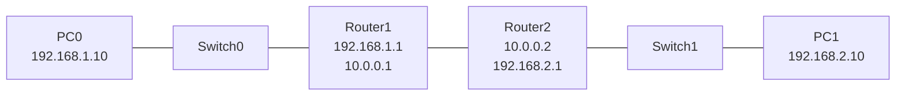

# 라우터 2대로 네트워크 연결하기

> 7강은 **라우터 1대**로 두 LAN을 연결했음.
> 이번엔 **라우터 2대**를 직접 연결해서 양쪽 PC끼리 통신되게 만든다.

---

# 1장. 만들 토폴로지



**3개의 네트워크가 들어감:**

| 구간 | 네트워크 |
|---|---|
| PC0 ↔ R1 | 192.168.1.0/24 |
| **R1 ↔ R2 (라우터 사이)** | **10.0.0.0/24** ← 새로 등장 |
| R2 ↔ PC1 | 192.168.2.0/24 |

**IP 표:**

| 장비 | 포트 | IP |
|---|---|---|
| PC0 | - | 192.168.1.10 (GW: 192.168.1.1) |
| R1 | G0/0 | 192.168.1.1 |
| R1 | G0/1 | 10.0.0.1 |
| R2 | G0/1 | 10.0.0.2 |
| R2 | G0/0 | 192.168.2.1 |
| PC1 | - | 192.168.2.10 (GW: 192.168.2.1) |

---

# 2장. 라우터끼리는 어떤 케이블?

**같은 종류 장비끼리는 Cross-Over (검은 점선) 케이블** 을 씀.

| 연결 | 케이블 |
|---|---|
| PC ↔ Switch | Straight-Through (검은 직선) |
| Switch ↔ Router | Straight-Through (검은 직선) |
| **Router ↔ Router** | **Cross-Over (검은 점선)** |

> 헷갈리면 **번개 모양 (Auto)** 를 골라도 됨 — 알아서 골라줌.
> Packet Tracer 좌하단 **번개 아이콘 (Connections)** 클릭하면 케이블 종류가 펼쳐짐.

---

# 3장. 토폴로지 만들기

## 3.1 장비 끌어다 놓기

좌측 하단에서:

1. **Routers → 2911** 두 개 → `Router0`, `Router1`
2. **Switches → 2960-24TT** 두 개 → `Switch0`, `Switch1`
3. **End Devices → PC-PT** 두 개 → `PC0`, `PC1`

## 3.2 케이블 연결

좌하단 번개 아이콘 → 케이블 선택 → 한쪽 장비 클릭 → 포트 선택 → 반대쪽도 똑같이.

| 연결          | 케이블                 | 포트 (왼쪽)                | 포트 (오른쪽)               |
| ----------- | ------------------- | ---------------------- | ---------------------- |
| PC0 ↔ SW0   | Straight (직선)       | FastEthernet0          | FastEthernet0/1        |
| SW0 ↔ R1    | Straight (직선)       | GigabitEthernet0/1     | GigabitEthernet0/0     |
| **R1 ↔ R2** | **Cross-Over (점선)** | **GigabitEthernet0/1** | **GigabitEthernet0/1** |
| R2 ↔ SW1    | Straight (직선)       | GigabitEthernet0/0     | GigabitEthernet0/1     |
| SW1 ↔ PC1   | Straight (직선)       | FastEthernet0/1        | FastEthernet0          |

> **포트 선택 규칙 (헷갈리지 않게):**
> - PC ↔ 스위치 → 스위치의 **FastEthernet 포트(0/1, 0/2 …)** 사용
> - 스위치 ↔ 라우터 → 스위치의 **GigabitEthernet 업링크 포트(0/1, 0/2)** 사용 (속도 빠름)
> - 라우터 ↔ 라우터 → 라우터의 GigabitEthernet 포트끼리

연결한 케이블 양 끝에 **녹색 삼각형**이 뜨면 정상.
주황색이면 30초 정도 기다리면 녹색으로 바뀜.

---

# 4장. PC 설정

PC 클릭 → **Desktop 탭 → IP Configuration**.

**PC0**

```
IP Address       : 192.168.1.10
Subnet Mask      : 255.255.255.0
Default Gateway  : 192.168.1.1
```

**PC1**

```
IP Address       : 192.168.2.10
Subnet Mask      : 255.255.255.0
Default Gateway  : 192.168.2.1
```

> Default Gateway 빠뜨리면 안 됨. 가장 흔한 실수.

---

# 5장. 라우터 설정

## 5.1 R1 설정

**R1 인터페이스 IP 할당 표:**

| 인터페이스 | IP 주소 | 서브넷 마스크 | 연결되는 곳 |
|---|---|---|---|
| GigabitEthernet0/0 | 192.168.1.1 | 255.255.255.0 | SW0 (LAN1, PC0 쪽) |
| GigabitEthernet0/1 | 10.0.0.1 | 255.255.255.0 | R2 (라우터 사이) |

**정적 라우팅:** 192.168.2.0/24 → 10.0.0.2 (= R2) 로 보내기

---

Router0 클릭 → **CLI 탭** → `Continue with configuration dialog?` 나오면 `no` → Enter.

```bash
Router> enable
Router# configure terminal
Router(config)# hostname R1

R1(config)# interface g0/0
R1(config-if)# ip address 192.168.1.1 255.255.255.0
R1(config-if)# no shutdown
R1(config-if)# exit

R1(config)# interface g0/1
R1(config-if)# ip address 10.0.0.1 255.255.255.0
R1(config-if)# no shutdown
R1(config-if)# exit

R1(config)# ip route 192.168.2.0 255.255.255.0 10.0.0.2
R1(config)# end
R1# copy running-config startup-config
```

**마지막에 추가한 한 줄이 핵심:**

```
ip route 192.168.2.0 255.255.255.0 10.0.0.2
```

→ "**192.168.2.0** 네트워크로 가야 하면, **10.0.0.2 (= R2)** 한테 넘겨라" 라는 안내.
R1은 자기랑 직접 연결된 곳만 알기 때문에, **모르는 네트워크는 이렇게 직접 가르쳐 줘야** 함.

---

## 5.2 R2 설정

**R2 인터페이스 IP 할당 표:**

| 인터페이스 | IP 주소 | 서브넷 마스크 | 연결되는 곳 |
|---|---|---|---|
| GigabitEthernet0/1 | 10.0.0.2 | 255.255.255.0 | R1 (라우터 사이) |
| GigabitEthernet0/0 | 192.168.2.1 | 255.255.255.0 | SW1 (LAN2, PC1 쪽) |

**정적 라우팅:** 192.168.1.0/24 → 10.0.0.1 (= R1) 로 보내기

---

Router1 클릭 → **CLI 탭** → 똑같은 방식으로.

```bash
Router> enable
Router# configure terminal
Router(config)# hostname R2

R2(config)# interface g0/1
R2(config-if)# ip address 10.0.0.2 255.255.255.0
R2(config-if)# no shutdown
R2(config-if)# exit

R2(config)# interface g0/0
R2(config-if)# ip address 192.168.2.1 255.255.255.0
R2(config-if)# no shutdown
R2(config-if)# exit

R2(config)# ip route 192.168.1.0 255.255.255.0 10.0.0.1
R2(config)# end
R2# copy running-config startup-config
```

R2 입장에서는 **반대 방향** 안내가 필요함:

```
ip route 192.168.1.0 255.255.255.0 10.0.0.1
```

→ "192.168.1.0 으로 가려면 R1 (10.0.0.1) 한테 넘겨라."

---

## 5.3 ⚠ 양쪽 다 넣어야 함

**한쪽 라우터에만 정적 라우팅 넣으면 안 됨.**

```
PC0 → PC1 으로 가는 길 :  R1이 알고 있음 → 도착
PC1 → PC0 으로 돌아오는 길 :  R2가 모름 → 응답 못 옴 → 핑 실패
```

→ R1, R2 **둘 다** `ip route` 한 줄씩 넣어야 통신됨.

---

# 6장. 점검 & 통신 테스트

## 6.1 인터페이스 점검 (R1, R2 각각)

```bash
R1# show ip interface brief
```

```
GigabitEthernet0/0     192.168.1.1     YES  up   up
GigabitEthernet0/1     10.0.0.1        YES  up   up
```

**둘 다 `up up`** 이어야 정상. `administratively down` 이면 그 인터페이스에서 `no shutdown` 다시 입력.

## 6.2 PC 핑 테스트

PC0 클릭 → **Desktop → Command Prompt**:

```bash
PC0> ping 192.168.2.10

Reply from 192.168.2.10: bytes=32 time<1ms TTL=126
Reply from 192.168.2.10: bytes=32 time<1ms TTL=126
Reply from 192.168.2.10: bytes=32 time<1ms TTL=126
Reply from 192.168.2.10: bytes=32 time<1ms TTL=126
```

**Reply 가 4번 다 오면 성공.**

> TTL=126 → 라우터 2번 거쳤다는 뜻 (7강 1대일 때는 127이었음).

## 6.3 안 되면 가까운 곳부터 차례로

```bash
PC0> ping 192.168.1.1     ← 자기 게이트웨이
PC0> ping 10.0.0.2        ← R2 (R1 정적라우팅 잘 됐는지)
PC0> ping 192.168.2.1     ← R2 의 LAN쪽
PC0> ping 192.168.2.10    ← 최종 PC1
```

→ **처음 실패한 곳이 문제 위치.**

---

# 7장. 잘 안 될 때

| 증상 | 해결 |
|---|---|
| 케이블 끝이 빨강/안 켜짐 | 케이블 종류 확인. 특히 **R1 ↔ R2 는 Cross-Over** |
| Status `administratively down` | 그 인터페이스에서 `no shutdown` |
| R1 ↔ R2 핑은 되는데 PC끼리 안 됨 | **두 라우터 모두에 `ip route` 넣었는지** 확인 |
| 한 방향만 됨 | 한 라우터에 정적 라우팅 빠짐 |
| 재부팅하니까 다 사라짐 | `copy running-config startup-config` 안 함 |
| `% Invalid input detected at '^' marker.` | 모드 잘못. `do show ...` 또는 `end` 로 빠져나가기 (7강 5.4절) |

---

# 정리

| 핵심 | 내용 |
|---|---|
| 라우터끼리 케이블 | **Cross-Over (검은 점선)** |
| 라우터 사이 IP | 별도 네트워크 하나 더 필요 (예: 10.0.0.0/24) |
| 정적 라우팅 한 줄 | `ip route <목적지> <마스크> <다음 라우터 IP>` |
| 양쪽 다 넣기 | R1, R2 둘 다에 정적 라우팅 추가 |
| 점검 순서 | `show ip int brief` → ping 가까운 곳부터 |

> **다음 강의 예고**
> 9강에서는 라우터가 늘어나도 일일이 `ip route` 안 써도 되게 자동으로 길을 찾는 **동적 라우팅(RIP/OSPF)** 을 다룬다.
