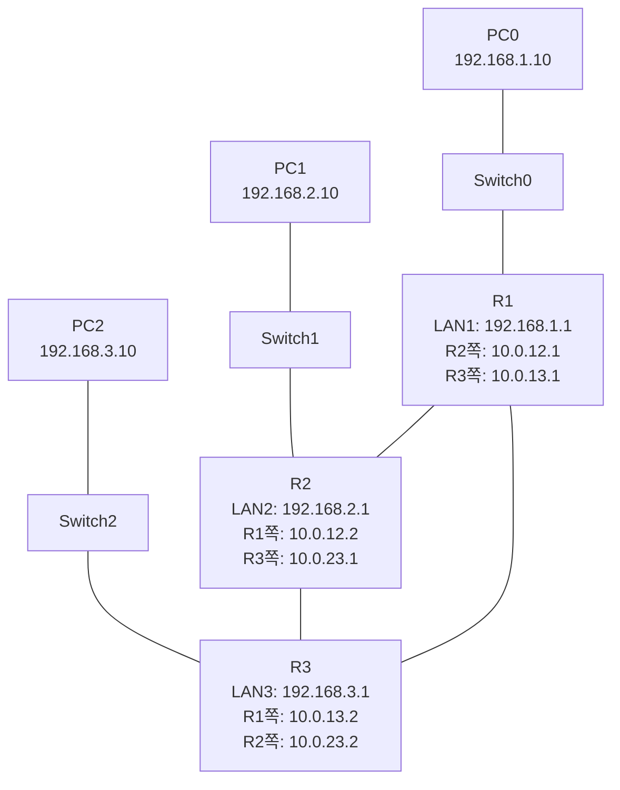
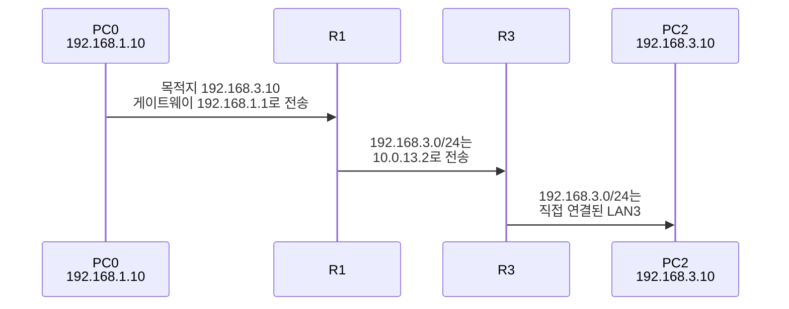
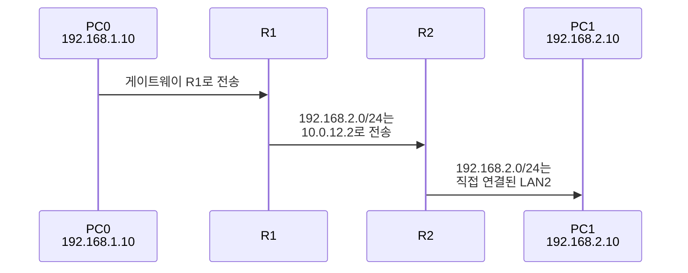

# 라우터 3대로 3개의 LAN 연결하기

> 8강에서는 **라우터 2대**를 연결해서 양쪽 LAN 2개가 통신하도록 만들었음.
> 이번에는 **라우터 3대가 서로 직접 연결된 구조**를 만들고, 각 라우터 아래에 **PC 1대 + Switch 1대**를 붙여서 **LAN 3개**를 구성한다.

---

# 1장. 이번에 만들 구조

이번 토폴로지의 핵심은 두 가지다.

1. **R1, R2, R3가 서로 직접 연결됨**
2. **각 라우터 아래에 LAN이 하나씩 있음**

라우터끼리는 삼각형처럼 연결한다.



> 여기서 중요한 부분은 `R1 --- R3` 연결도 있다는 것.
> `R1 --- R2 --- R3`처럼 일렬로만 연결하면 라우터 3대가 서로 직접 연결된 구조가 아니다.

---

# 2장. 네트워크 주소 설계

이번 실습에는 네트워크가 총 **6개** 들어간다.


| 구간 | 네트워크 | 설명 |
|---|---|---|
| PC0 ↔ SW0 ↔ R1 | 192.168.1.0/24 | LAN1 |
| PC1 ↔ SW1 ↔ R2 | 192.168.2.0/24 | LAN2 |
| PC2 ↔ SW2 ↔ R3 | 192.168.3.0/24 | LAN3 |
| R1 ↔ R2 | 10.0.12.0/24 | 라우터 사이 네트워크 |
| R1 ↔ R3 | 10.0.13.0/24 | 라우터 사이 네트워크 |
| R2 ↔ R3 | 10.0.23.0/24 | 라우터 사이 네트워크 |

라우터끼리 연결되는 구간은 각각 다른 네트워크를 쓴다.

| 연결 | 네트워크 이름처럼 외우기 |
|---|---|
| R1 ↔ R2 | `10.0.12.0/24` |
| R1 ↔ R3 | `10.0.13.0/24` |
| R2 ↔ R3 | `10.0.23.0/24` |

> 숫자를 `12`, `13`, `23`으로 잡으면 어느 라우터끼리 연결된 네트워크인지 바로 보인다.

---

# 3장. 전체 IP 할당 표

| 장비 | 포트 | IP 주소 | 서브넷 마스크 | 연결되는 곳 |
|---|---|---|---|---|
| PC0 | FastEthernet0 | 192.168.1.10 | 255.255.255.0 | LAN1 |
| PC0 | Gateway | 192.168.1.1 | - | R1 |
| R1 | G0/0 | 192.168.1.1 | 255.255.255.0 | SW0, PC0 |
| R1 | G0/1 | 10.0.12.1 | 255.255.255.0 | R2 |
| R1 | G0/2 | 10.0.13.1 | 255.255.255.0 | R3 |
| PC1 | FastEthernet0 | 192.168.2.10 | 255.255.255.0 | LAN2 |
| PC1 | Gateway | 192.168.2.1 | - | R2 |
| R2 | G0/0 | 192.168.2.1 | 255.255.255.0 | SW1, PC1 |
| R2 | G0/1 | 10.0.12.2 | 255.255.255.0 | R1 |
| R2 | G0/2 | 10.0.23.1 | 255.255.255.0 | R3 |
| PC2 | FastEthernet0 | 192.168.3.10 | 255.255.255.0 | LAN3 |
| PC2 | Gateway | 192.168.3.1 | - | R3 |
| R3 | G0/0 | 192.168.3.1 | 255.255.255.0 | SW2, PC2 |
| R3 | G0/1 | 10.0.13.2 | 255.255.255.0 | R1 |
| R3 | G0/2 | 10.0.23.2 | 255.255.255.0 | R2 |

각 PC의 Default Gateway는 자기 LAN에 붙어 있는 라우터 IP다.

| PC | 자기 LAN | Default Gateway |
|---|---|---|
| PC0 | 192.168.1.0/24 | 192.168.1.1 |
| PC1 | 192.168.2.0/24 | 192.168.2.1 |
| PC2 | 192.168.3.0/24 | 192.168.3.1 |

> 라우터 3대가 서로 직접 연결되려면 각 라우터에 포트가 3개 필요하다.
> LAN 연결 1개, 다른 라우터 연결 2개를 써야 하기 때문.

---

# 4장. 장비 설치하기

## 4.1 장비 꺼내기

Packet Tracer 좌측 하단에서 아래 장비를 놓는다.

| 장비 종류  | 모델        | 개수  | 이름                        |
| ------ | --------- | --- | ------------------------- |
| **Router** | **2911**      | 3개  | Router0, Router1, Router2 |
| Switch | 2960-24TT | 3개  | Switch0, Switch1, Switch2 |
| PC     | PC-PT     | 3개  | PC0, PC1, PC2             |

이번 강의에서는 아래 이름으로 부른다.

| Packet Tracer 기본 이름 | 강의 이름 |
|---|---|
| Router0 | R1 |
| Router1 | R2 |
| Router2 | R3 |
| Switch0 | SW0 |
| Switch1 | SW1 |
| Switch2 | SW2 |

---

## 4.2 케이블 연결

좌하단 **번개 아이콘(Connections)**을 클릭한 뒤 케이블을 선택한다.

| 연결 | 케이블 | 한쪽 포트 | 반대쪽 포트 |
|---|---|---|---|
| PC0 ↔ SW0 | Straight-Through | PC0 FastEthernet0 | SW0 FastEthernet0/1 |
| SW0 ↔ R1 | Straight-Through | SW0 GigabitEthernet0/1 | R1 GigabitEthernet0/0 |
| PC1 ↔ SW1 | Straight-Through | PC1 FastEthernet0 | SW1 FastEthernet0/1 |
| SW1 ↔ R2 | Straight-Through | SW1 GigabitEthernet0/1 | R2 GigabitEthernet0/0 |
| PC2 ↔ SW2 | Straight-Through | PC2 FastEthernet0 | SW2 FastEthernet0/1 |
| SW2 ↔ R3 | Straight-Through | SW2 GigabitEthernet0/1 | R3 GigabitEthernet0/0 |
| **R1 ↔ R2** | **Cross-Over** | R1 GigabitEthernet0/1 | R2 GigabitEthernet0/1 |
| **R1 ↔ R3** | **Cross-Over** | R1 GigabitEthernet0/2 | R3 GigabitEthernet0/1 |
| **R2 ↔ R3** | **Cross-Over** | R2 GigabitEthernet0/2 | R3 GigabitEthernet0/2 |

케이블 종류는 이렇게 기억한다.

| 연결 종류 | 케이블 |
|---|---|
| PC ↔ Switch | Straight-Through |
| Switch ↔ Router | Straight-Through |
| Router ↔ Router | Cross-Over |

> 이번 구조에서는 라우터끼리 연결이 3개다.
> `R1 ↔ R2`, `R1 ↔ R3`, `R2 ↔ R3` 세 줄이 모두 있어야 한다.

---

## 4.3 라우터끼리 연결 검증

케이블을 연결한 뒤, 라우터끼리 연결만 따로 떼어서 다시 확인한다.

**R1 기준으로는 Cross-Over 케이블이 2개 연결되어 있어야 한다.**

| R1 포트 | 연결 대상 | 대상 포트 | 케이블 | 네트워크 |
|---|---|---|---|---|
| R1 G0/1 | R2 | R2 G0/1 | Cross-Over | 10.0.12.0/24 |
| R1 G0/2 | R3 | R3 G0/1 | Cross-Over | 10.0.13.0/24 |

R2도 라우터 2대와 연결된다.

| R2 포트 | 연결 대상 | 대상 포트 | 케이블 | 네트워크 |
|---|---|---|---|---|
| R2 G0/1 | R1 | R1 G0/1 | Cross-Over | 10.0.12.0/24 |
| R2 G0/2 | R3 | R3 G0/2 | Cross-Over | 10.0.23.0/24 |

R3도 라우터 2대와 연결된다.

| R3 포트 | 연결 대상 | 대상 포트 | 케이블 | 네트워크 |
|---|---|---|---|---|
| R3 G0/1 | R1 | R1 G0/2 | Cross-Over | 10.0.13.0/24 |
| R3 G0/2 | R2 | R2 G0/2 | Cross-Over | 10.0.23.0/24 |

정리하면 라우터끼리 연결은 아래 3개가 반드시 있어야 한다.

```text
R1 G0/1  -- Cross-Over --  R2 G0/1
R1 G0/2  -- Cross-Over --  R3 G0/1
R2 G0/2  -- Cross-Over --  R3 G0/2
```

> 특히 R1은 R2, R3 둘 다와 직접 연결되어야 하므로 Cross-Over 케이블을 **두 번** 꽂는다.
> R1과 R3 연결을 빼먹으면 삼각형 구조가 아니라 일렬 구조가 된다.

---

# 5장. PC 설정

각 PC를 클릭하고 **Desktop 탭 → IP Configuration**으로 들어간다.

## 5.1 PC0 설정

```
IP Address       : 192.168.1.10
Subnet Mask      : 255.255.255.0
Default Gateway  : 192.168.1.1
```

## 5.2 PC1 설정

```
IP Address       : 192.168.2.10
Subnet Mask      : 255.255.255.0
Default Gateway  : 192.168.2.1
```

## 5.3 PC2 설정

```
IP Address       : 192.168.3.10
Subnet Mask      : 255.255.255.0
Default Gateway  : 192.168.3.1
```

> PC 설정에서 가장 흔한 실수는 Default Gateway를 빼먹는 것.
> PC끼리 다른 LAN으로 통신하려면 반드시 게이트웨이가 필요하다.

---

# 6장. 라우터 인터페이스 설정

라우터 CLI에서 IP 주소를 넣고 포트를 켠다.

`Continue with configuration dialog?`가 나오면 `no` 입력 후 Enter.

---

## 6.1 R1 설정

R1은 LAN1, R2, R3와 연결된다.

| 인터페이스 | IP 주소 | 연결 |
|---|---|---|
| G0/0 | 192.168.1.1/24 | SW0, PC0 |
| G0/1 | 10.0.12.1/24 | R2 |
| G0/2 | 10.0.13.1/24 | R3 |

```bash
Router> enable
Router# configure terminal
Router(config)# hostname R1

R1(config)# interface g0/0
R1(config-if)# ip address 192.168.1.1 255.255.255.0
R1(config-if)# no shutdown
R1(config-if)# exit

R1(config)# interface g0/1
R1(config-if)# ip address 10.0.12.1 255.255.255.0
R1(config-if)# no shutdown
R1(config-if)# exit

R1(config)# interface g0/2
R1(config-if)# ip address 10.0.13.1 255.255.255.0
R1(config-if)# no shutdown
R1(config-if)# exit
```

---

## 6.2 R2 설정

R2는 LAN2, R1, R3와 연결된다.

| 인터페이스 | IP 주소 | 연결 |
|---|---|---|
| G0/0 | 192.168.2.1/24 | SW1, PC1 |
| G0/1 | 10.0.12.2/24 | R1 |
| G0/2 | 10.0.23.1/24 | R3 |

```bash
Router> enable
Router# configure terminal
Router(config)# hostname R2

R2(config)# interface g0/0
R2(config-if)# ip address 192.168.2.1 255.255.255.0
R2(config-if)# no shutdown
R2(config-if)# exit

R2(config)# interface g0/1
R2(config-if)# ip address 10.0.12.2 255.255.255.0
R2(config-if)# no shutdown
R2(config-if)# exit

R2(config)# interface g0/2
R2(config-if)# ip address 10.0.23.1 255.255.255.0
R2(config-if)# no shutdown
R2(config-if)# exit
```

---

## 6.3 R3 설정

R3는 LAN3, R1, R2와 연결된다.

| 인터페이스 | IP 주소 | 연결 |
|---|---|---|
| G0/0 | 192.168.3.1/24 | SW2, PC2 |
| G0/1 | 10.0.13.2/24 | R1 |
| G0/2 | 10.0.23.2/24 | R2 |

```bash
Router> enable
Router# configure terminal
Router(config)# hostname R3

R3(config)# interface g0/0
R3(config-if)# ip address 192.168.3.1 255.255.255.0
R3(config-if)# no shutdown
R3(config-if)# exit

R3(config)# interface g0/1
R3(config-if)# ip address 10.0.13.2 255.255.255.0
R3(config-if)# no shutdown
R3(config-if)# exit

R3(config)# interface g0/2
R3(config-if)# ip address 10.0.23.2 255.255.255.0
R3(config-if)# no shutdown
R3(config-if)# exit
```

---

# 7장. 정적 라우팅 설정

인터페이스 IP만 넣으면 라우터는 **직접 연결된 네트워크만** 안다.

예를 들어 R1은 아래 세 네트워크만 바로 안다.

| 네트워크 | 이유 |
|---|---|
| 192.168.1.0/24 | 자기 LAN1 |
| 10.0.12.0/24 | R2와 직접 연결 |
| 10.0.13.0/24 | R3와 직접 연결 |

하지만 R1은 `192.168.2.0/24`, `192.168.3.0/24`, `10.0.23.0/24`를 모른다.
그래서 정적 라우팅으로 알려줘야 한다.

명령어 형식:

```bash
ip route <목적지 네트워크> <서브넷 마스크> <다음 라우터 IP>
```

---

## 7.1 R1 정적 라우팅

R1에서 LAN2는 R2 방향, LAN3는 R3 방향으로 보내면 된다.

| 목적지 네트워크 | 다음 라우터 | 이유 |
|---|---|---|
| 192.168.2.0/24 | 10.0.12.2 | R2 아래 LAN |
| 192.168.3.0/24 | 10.0.13.2 | R3 아래 LAN |
| 10.0.23.0/24 | 10.0.12.2 | R2-R3 사이 네트워크 점검용 |

```bash
R1(config)# ip route 192.168.2.0 255.255.255.0 10.0.12.2
R1(config)# ip route 192.168.3.0 255.255.255.0 10.0.13.2
R1(config)# ip route 10.0.23.0 255.255.255.0 10.0.12.2
```

> R1과 R3가 직접 연결되어 있으므로 LAN3로 갈 때는 R2를 거치지 않고 R3로 바로 보낸다.

---

## 7.2 R2 정적 라우팅

R2에서 LAN1은 R1 방향, LAN3는 R3 방향으로 보내면 된다.

| 목적지 네트워크 | 다음 라우터 | 이유 |
|---|---|---|
| 192.168.1.0/24 | 10.0.12.1 | R1 아래 LAN |
| 192.168.3.0/24 | 10.0.23.2 | R3 아래 LAN |
| 10.0.13.0/24 | 10.0.12.1 | R1-R3 사이 네트워크 점검용 |

```bash
R2(config)# ip route 192.168.1.0 255.255.255.0 10.0.12.1
R2(config)# ip route 192.168.3.0 255.255.255.0 10.0.23.2
R2(config)# ip route 10.0.13.0 255.255.255.0 10.0.12.1
```

> `10.0.13.0/24`는 R1과 R3 사이 네트워크다.
> R2가 이 네트워크를 테스트할 수 있게 하려고 R1 방향 경로를 하나 넣는다.

---

## 7.3 R3 정적 라우팅

R3에서 LAN1은 R1 방향, LAN2는 R2 방향으로 보내면 된다.

| 목적지 네트워크 | 다음 라우터 | 이유 |
|---|---|---|
| 192.168.1.0/24 | 10.0.13.1 | R1 아래 LAN |
| 192.168.2.0/24 | 10.0.23.1 | R2 아래 LAN |
| 10.0.12.0/24 | 10.0.13.1 | R1-R2 사이 네트워크 점검용 |

```bash
R3(config)# ip route 192.168.1.0 255.255.255.0 10.0.13.1
R3(config)# ip route 192.168.2.0 255.255.255.0 10.0.23.1
R3(config)# ip route 10.0.12.0 255.255.255.0 10.0.13.1
```

> R3과 R1도 직접 연결되어 있으므로 LAN1로 갈 때는 R2를 거치지 않고 R1로 바로 보낸다.

---

# 8장. 전체 설정 모음

복사해서 실습하기 좋게 전체 명령어를 모아두면 아래와 같다.

## 8.1 R1 전체 설정

```bash
enable
configure terminal
hostname R1

interface g0/0
ip address 192.168.1.1 255.255.255.0
no shutdown
exit

interface g0/1
ip address 10.0.12.1 255.255.255.0
no shutdown
exit

interface g0/2
ip address 10.0.13.1 255.255.255.0
no shutdown
exit

ip route 192.168.2.0 255.255.255.0 10.0.12.2
ip route 192.168.3.0 255.255.255.0 10.0.13.2
ip route 10.0.23.0 255.255.255.0 10.0.12.2

end
copy running-config startup-config
```

---

## 8.2 R2 전체 설정

```bash
enable
configure terminal
hostname R2

interface g0/0
ip address 192.168.2.1 255.255.255.0
no shutdown
exit

interface g0/1
ip address 10.0.12.2 255.255.255.0
no shutdown
exit

interface g0/2
ip address 10.0.23.1 255.255.255.0
no shutdown
exit

ip route 192.168.1.0 255.255.255.0 10.0.12.1
ip route 192.168.3.0 255.255.255.0 10.0.23.2
ip route 10.0.13.0 255.255.255.0 10.0.12.1

end
copy running-config startup-config
```

---

## 8.3 R3 전체 설정

```bash
enable
configure terminal
hostname R3

interface g0/0
ip address 192.168.3.1 255.255.255.0
no shutdown
exit

interface g0/1
ip address 10.0.13.2 255.255.255.0
no shutdown
exit

interface g0/2
ip address 10.0.23.2 255.255.255.0
no shutdown
exit

ip route 192.168.1.0 255.255.255.0 10.0.13.1
ip route 192.168.2.0 255.255.255.0 10.0.23.1
ip route 10.0.12.0 255.255.255.0 10.0.13.1

end
copy running-config startup-config
```

---

# 9장. 패킷이 이동하는 흐름

## 9.1 PC0에서 PC2로 ping

PC0에서 PC2로 ping을 보내면 R1에서 R3로 바로 간다.

```bash
PC0> ping 192.168.3.10
```



돌아오는 응답도 R3에서 R1로 바로 돌아온다.


> 이전 일렬 구조였다면 PC0에서 PC2로 갈 때 R1 → R2 → R3 순서로 갔다.
> 하지만 지금은 R1과 R3가 직접 연결되어 있으므로 R2를 거치지 않는다.

---

## 9.2 PC0에서 PC1로 ping

PC1은 R2 아래 LAN2에 있다.

```bash
PC0> ping 192.168.2.10
```



PC1에서 PC2로 ping할 때는 R2에서 R3로 바로 간다.

---

# 10장. 점검하기

## 10.1 인터페이스 상태 확인

각 라우터에서 아래 명령어를 입력한다.

```bash
show ip interface brief
```

R1 예시:

```bash
R1# show ip interface brief

Interface              IP-Address      OK? Method Status                Protocol
GigabitEthernet0/0     192.168.1.1     YES manual up                    up
GigabitEthernet0/1     10.0.12.1       YES manual up                    up
GigabitEthernet0/2     10.0.13.1       YES manual up                    up
```

R2 예시:

```bash
R2# show ip interface brief

Interface              IP-Address      OK? Method Status                Protocol
GigabitEthernet0/0     192.168.2.1     YES manual up                    up
GigabitEthernet0/1     10.0.12.2       YES manual up                    up
GigabitEthernet0/2     10.0.23.1       YES manual up                    up
```

R3 예시:

```bash
R3# show ip interface brief

Interface              IP-Address      OK? Method Status                Protocol
GigabitEthernet0/0     192.168.3.1     YES manual up                    up
GigabitEthernet0/1     10.0.13.2       YES manual up                    up
GigabitEthernet0/2     10.0.23.2       YES manual up                    up
```

`Status`와 `Protocol`이 모두 `up`이어야 정상이다.

| 상태 | 의미 | 해결 |
|---|---|---|
| `up up` | 정상 | 다음 단계 진행 |
| `administratively down` | 포트가 꺼져 있음 | 해당 인터페이스에서 `no shutdown` |
| `down down` | 물리 연결 문제 | 케이블, 포트 번호 확인 |

---

## 10.2 라우터끼리 직접 연결 확인

라우터끼리 서로 연결됐는지 먼저 확인한다.

R1에서 R2, R3 ping:

```bash
R1# ping 10.0.12.2
R1# ping 10.0.13.2
```

R2에서 R1, R3 ping:

```bash
R2# ping 10.0.12.1
R2# ping 10.0.23.2
```

R3에서 R1, R2 ping:

```bash
R3# ping 10.0.13.1
R3# ping 10.0.23.1
```

이 6개 ping이 모두 되면 라우터 3대의 직접 연결은 정상이다.

---

## 10.3 라우팅 테이블 확인

각 라우터에서 아래 명령어를 입력한다.

```bash
show ip route
```

R1에서 봐야 하는 것:

```bash
C    192.168.1.0/24 is directly connected, GigabitEthernet0/0
C    10.0.12.0/24 is directly connected, GigabitEthernet0/1
C    10.0.13.0/24 is directly connected, GigabitEthernet0/2
S    192.168.2.0/24 [1/0] via 10.0.12.2
S    192.168.3.0/24 [1/0] via 10.0.13.2
S    10.0.23.0/24 [1/0] via 10.0.12.2
```

R2에서 봐야 하는 것:

```bash
C    192.168.2.0/24 is directly connected, GigabitEthernet0/0
C    10.0.12.0/24 is directly connected, GigabitEthernet0/1
C    10.0.23.0/24 is directly connected, GigabitEthernet0/2
S    192.168.1.0/24 [1/0] via 10.0.12.1
S    192.168.3.0/24 [1/0] via 10.0.23.2
S    10.0.13.0/24 [1/0] via 10.0.12.1
```

R3에서 봐야 하는 것:

```bash
C    192.168.3.0/24 is directly connected, GigabitEthernet0/0
C    10.0.13.0/24 is directly connected, GigabitEthernet0/1
C    10.0.23.0/24 is directly connected, GigabitEthernet0/2
S    192.168.1.0/24 [1/0] via 10.0.13.1
S    192.168.2.0/24 [1/0] via 10.0.23.1
S    10.0.12.0/24 [1/0] via 10.0.13.1
```

앞 글자의 의미:

| 표시 | 의미 |
|---|---|
| `C` | Connected. 직접 연결된 네트워크 |
| `S` | Static. 직접 입력한 정적 라우팅 |

---

# 11장. PC끼리 Ping 테스트

## 11.1 PC0에서 가까운 곳부터 확인

PC0에서 아래 순서로 ping을 보낸다.

```bash
PC0> ping 192.168.1.1
PC0> ping 10.0.12.2
PC0> ping 10.0.13.2
PC0> ping 192.168.2.1
PC0> ping 192.168.2.10
PC0> ping 192.168.3.1
PC0> ping 192.168.3.10
```

각 테스트의 의미:

| 명령어 | 확인하는 것 |
|---|---|
| `ping 192.168.1.1` | PC0 ↔ R1 |
| `ping 10.0.12.2` | R1 ↔ R2 |
| `ping 10.0.13.2` | R1 ↔ R3 |
| `ping 192.168.2.1` | R2의 LAN2 인터페이스 |
| `ping 192.168.2.10` | PC1까지 통신 |
| `ping 192.168.3.1` | R3의 LAN3 인터페이스 |
| `ping 192.168.3.10` | PC2까지 통신 |

> 처음 실패하는 곳이 문제 위치다.

---

## 11.2 세 PC끼리 최종 테스트

PC0에서 PC1:

```bash
PC0> ping 192.168.2.10

Reply from 192.168.2.10: bytes=32 time<1ms TTL=126
Reply from 192.168.2.10: bytes=32 time<1ms TTL=126
Reply from 192.168.2.10: bytes=32 time<1ms TTL=126
Reply from 192.168.2.10: bytes=32 time<1ms TTL=126
```

PC0에서 PC2:

```bash
PC0> ping 192.168.3.10

Reply from 192.168.3.10: bytes=32 time<1ms TTL=126
Reply from 192.168.3.10: bytes=32 time<1ms TTL=126
Reply from 192.168.3.10: bytes=32 time<1ms TTL=126
Reply from 192.168.3.10: bytes=32 time<1ms TTL=126
```

PC1에서 PC2:

```bash
PC1> ping 192.168.3.10

Reply from 192.168.3.10: bytes=32 time<1ms TTL=126
Reply from 192.168.3.10: bytes=32 time<1ms TTL=126
Reply from 192.168.3.10: bytes=32 time<1ms TTL=126
Reply from 192.168.3.10: bytes=32 time<1ms TTL=126
```

이번 구조에서는 각 PC 통신이 보통 라우터 2대를 지난다.

| 통신 | 지나가는 라우터 | TTL 예시 |
|---|---|---|
| PC0 ↔ PC1 | R1, R2 | 126 |
| PC0 ↔ PC2 | R1, R3 | 126 |
| PC1 ↔ PC2 | R2, R3 | 126 |

> 라우터가 삼각형으로 직접 연결되어 있기 때문에 PC0에서 PC2로 갈 때도 R2를 거치지 않는다.

---

# 12장. 자주 나는 실수

| 증상 | 원인 | 해결 |
|---|---|---|
| R1과 R3가 직접 ping 안 됨 | R1-R3 케이블이 없거나 포트/IP 오류 | R1 G0/2 ↔ R3 G0/1 연결, `10.0.13.x` 주소 확인 |
| PC0에서 R1 ping 실패 | PC0 설정 또는 PC0-SW0-R1 연결 문제 | PC0 IP/Gateway, 케이블 확인 |
| PC1만 통신 안 됨 | R2의 LAN2 포트 설정 문제 | R2 `g0/0` IP와 `no shutdown` 확인 |
| R1-R2 ping 실패 | 라우터 사이 케이블 또는 IP 오류 | Cross-Over, `10.0.12.x` 주소 확인 |
| R2-R3 ping 실패 | 라우터 사이 케이블 또는 IP 오류 | Cross-Over, `10.0.23.x` 주소 확인 |
| PC0 ↔ PC2가 R2를 거치는 것 같음 | R1에서 LAN3 경로가 R2 방향으로 잡힘 | R1의 `192.168.3.0/24` 다음 홉을 `10.0.13.2`로 수정 |
| 한 방향만 ping 됨 | 돌아오는 경로 누락 | 반대쪽 라우터의 `ip route` 확인 |
| `show ip route`에 `S`가 없음 | 정적 라우팅 미입력 또는 오타 | `ip route` 다시 입력 |
| 재부팅 후 설정 사라짐 | 저장 안 함 | `copy running-config startup-config` |
| `% Invalid input detected at '^' marker.` | CLI 모드가 다름 | `end` 또는 `configure terminal`로 모드 확인 |

---

# 13장. 왜 라우터 3대부터 어려워지는가?

라우터 3대가 서로 직접 연결되면 길이 여러 개 생긴다.

예를 들어 PC0에서 PC2로 가는 길은 두 가지로 생각할 수 있다.

| 경로 | 설명 |
|---|---|
| PC0 → R1 → R3 → PC2 | 직접 연결된 빠른 경로 |
| PC0 → R1 → R2 → R3 → PC2 | 돌아가는 경로 |

이번 실습에서는 직접 연결된 경로를 우선 사용하도록 정적 라우팅을 넣었다.

| 라우터 | 직접 연결된 네트워크 | 정적으로 알려줘야 하는 네트워크 |
|---|---|---|
| R1 | LAN1, R1-R2, R1-R3 | LAN2, LAN3, R2-R3 |
| R2 | LAN2, R1-R2, R2-R3 | LAN1, LAN3, R1-R3 |
| R3 | LAN3, R1-R3, R2-R3 | LAN1, LAN2, R1-R2 |

라우터가 더 늘어나면 `ip route`도 계속 늘어난다.

| 문제 | 설명 |
|---|---|
| 설정량 증가 | 라우터와 LAN이 늘수록 입력할 경로가 많아짐 |
| 오타 위험 | 다음 홉 IP 하나만 틀려도 통신 실패 |
| 변경에 약함 | 중간 연결이 바뀌면 여러 라우터 설정을 수정해야 함 |
| 경로 선택 어려움 | 직접 경로와 우회 경로 중 어떤 길을 쓸지 직접 정해야 함 |

그래서 큰 네트워크에서는 라우터끼리 경로 정보를 자동으로 주고받는 **동적 라우팅**을 사용한다.

---

# 정리

| 핵심 | 내용 |
|---|---|
| 이번 구조 | R1, R2, R3가 서로 직접 연결되고 각 라우터 아래에 PC 1대 + Switch 1대 |
| LAN 개수 | LAN1, LAN2, LAN3 총 3개 |
| 전체 네트워크 수 | LAN 3개 + 라우터 사이 3개 = 총 6개 |
| 라우터끼리 연결 | R1-R2, R1-R3, R2-R3 세 연결 모두 필요 |
| 라우터 사이 네트워크 | `10.0.12.0/24`, `10.0.13.0/24`, `10.0.23.0/24` |
| 게이트웨이 | PC마다 자기 라우터의 LAN쪽 IP를 사용 |
| 정적 라우팅 | 직접 연결되지 않은 네트워크를 `ip route`로 추가 |
| 점검 순서 | `show ip int brief` → 라우터끼리 ping → `show ip route` → PC끼리 ping |

> **다음 강의 예고**
> 10강에서는 라우터가 더 늘어나도 정적 라우팅을 일일이 넣지 않도록,
> 라우터들이 자동으로 길을 배우는 **동적 라우팅(RIP)** 을 다룬다.
