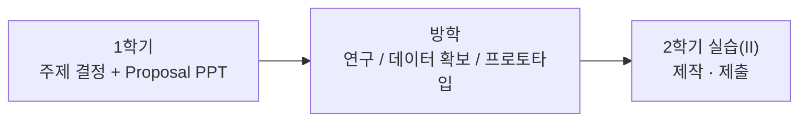
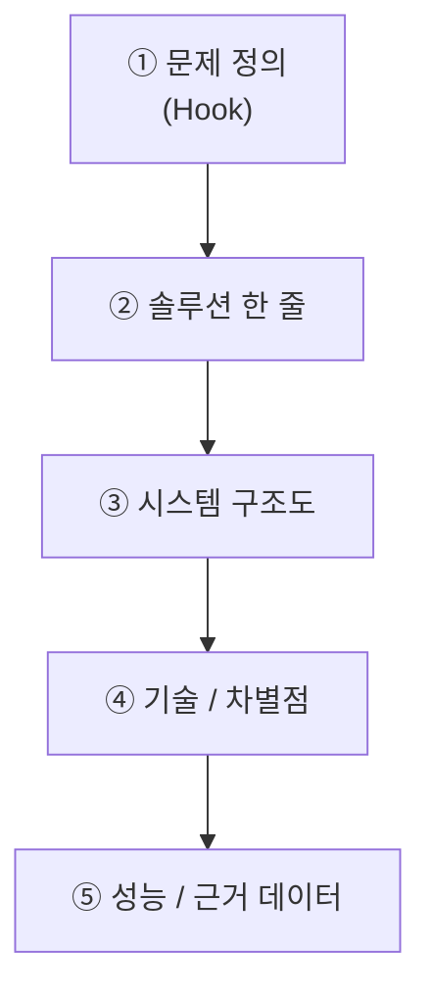

# 18부. 보안 프로젝트 안내 (Proposal & 기말 PPT)
---

> 📢 **공지 요약**
> - 주제: **보안 프로젝트** (1학년이 직접 구조를 이해하고 만들 수 있는 것)
> - 1학기 기말: **Proposal PPT 제출** (아래 5가지 필수 반영)
> - 마감: **6월 22일**. 단, **6월 중 언제든 제출 → Proposal Accept 시 기말고사 대체(시험 면제)**
> - 팀: **최대 3명** (개인도 가능)
> - 지원: **팀당 미니 서버 1~3대** 제공 (또는 본인 노트북 구현 가능)
> - 연계: **2학기 프로젝트 실습(II)** 로 이어짐 → 방학 연구 → 2학기 제작·제출
{: .prompt-info }

---

## 1. 이 프로젝트가 무엇인가?

"보안"을 주제로, **1학년이 직접 구조를 이해하고 만들 수 있는** 프로젝트를 진행함.

핵심은 화려한 기술이 아니라, **"왜 필요한지 → 무엇을 만들지 → 어떻게 동작하는지"** 를 본인이 설명할 수 있는가임.

이번 학기에는 **만드는 것이 아니라 "무엇을 만들지 결정하고 발표(Proposal)"** 하는 단계임.
실제 제작은 방학 연구를 거쳐 **2학기 프로젝트 실습(II)** 에서 완성함.



---

## 2. 일정과 제출 (가장 중요)

| 구분    | 내용                                                                       |
| ----- | ------------------------------------------------------------------------ |
| 제출물   | **Proposal PPT** (아래 5가지 필수 항목 반영)                                       |
| 마감    | **6월 22일**                                                               |
| 면제 조건 | **6월 중 언제든 제출**해서 **Proposal Accept** 되면, 이를 **기말고사로 간주** → 기말 시험 안 봐도 됨 |
| 재제출   | Accept 전까지 수정·재제출 가능 (빨리 낼수록 유리)                                         |

> ✅ **빨리 내는 사람이 이득.** 일찍 Accept 받으면 그만큼 기말 시험 부담이 사라지고, 방학 연구를 일찍 시작할 수 있음.
{: .prompt-tip }

---

## 3. Proposal PPT 필수 5가지 항목

아래 5가지는 **반드시** PPT에 들어가야 함. 하나라도 빠지면 Accept 보류됨.

### ① 문제 정의 (Hook) — "왜 이걸 만들었나"

> 30초 안에 심사위원(교수)을 사로잡아야 함.

- 충격적인 숫자/사례로 시작: 예) "전 세계 피싱 공격은 3초에 1건 발생합니다"
- 실제 피해 사례 사진 / 뉴스 헤드라인 **한 장**
- ❌ 기술 설명부터 시작하면 망함 (문제부터, 기술은 나중에)

### ② 솔루션 한 줄 요약

- "우리는 **X를 입력하면 Y를 보여주는** 도구를 만들었습니다"
- **한 문장** + 대표 화면 스크린샷(또는 목업) **1장**

### ③ 시스템 구조도 (Architecture)

> 전체적인 시스템을 설명하는 **그림 한 장**

```text
[데이터 입력]  →  [분석 엔진]  →  [시각화 화면]
  Kaggle CSV       ML 모델         위험점수 게이지
```

- 화살표로 **데이터 흐름**을 표시 → "우리가 시스템을 이해하고 있다"는 신호
- 그림이 없으면 "감으로 만든 것"으로 보임

### ④ 핵심 기술 / 차별점

- 사용 기술 스택을 깔끔하게 정리 (예: Python, Flask, scikit-learn …)
- **"기존 도구 대비 우리만의 차별점" 1~2개** → 심사위원 단골 질문을 선제 방어

### ⑤ 성능 / 근거 데이터

- 예) 피싱 탐지기면 "탐지 정확도 96%", **혼동행렬(confusion matrix) 1장**
- 숫자가 있어야 "그냥 만든 것"이 아니라 **"검증한 것"** 이 됨
- 1학기에는 목표 수치/예상 지표여도 됨 (2학기에 실측으로 채움)



---

## 4. 팀 구성

- **최대 3명** 까지 팀 구성 가능 (개인 진행도 허용)
- 역할을 나누면 좋음: 예) 데이터 담당 / 구현 담당 / 발표·문서 담당
- 팀이어도 **각자 무엇을 했는지 설명할 수 있어야 함** (전원이 구조를 이해할 것)

---

## 5. 제공되는 자원

| 자원         | 내용                                               |
| ---------- | ------------------------------------------------ |
| **미니 서버**  | 팀당 **1~3대** 제공 (허니팟 운영, 데이터 수집, 웹 서비스 호스팅 등에 활용) |
| **본인 노트북** | 서버가 필요 없거나 부족하면 노트북에 직접 구현해도 됨                   |

> 💡 미니 서버는 "실시간 공격을 받아보는 허니팟"이나 "웹 대시보드 띄우기" 같은,
> 노트북으로 하기 애매한 작업에 쓰면 효과적임.
{: .prompt-info }

---

## 6. 가능한 주제 예시

아래는 **예시일 뿐**, 본인 팀이 설명할 수 있는 주제면 자유롭게 변형·제안 가능함.

| 주제                   | 한 줄 설명                   | 데이터 확보 난이도                   |
| -------------------- | ------------------------ | ---------------------------- |
| **비밀번호 강도/크래킹 시각화**  | 비밀번호를 입력하면 해독 시간을 보여줌    | 매우 쉬움 (계산만, 데이터 불필요)         |
| **피싱 URL 탐지기**       | URL을 넣으면 위험 점수를 게이지로 표시  | 쉬움 (Kaggle/PhishTank 무료 CSV) |
| **실시간 공격 지도**        | 허니팟에 들어온 공격 IP를 세계지도에 표시 | 보통 (미니 서버 + 허니팟 필요)          |
| **네트워크 트래픽 대시보드**    | 내 트래픽을 실시간 그래프로 표시       | 쉬움 (직접 트래픽 생성)               |
| **다중 인증(MFA) 인증 기계** | 카드 + PIN 등 2요소로만 잠금 해제   | 보통 (하드웨어 부품 필요)              |

### 주제별 추천 도구 메모

- 피싱 탐지: `Python` + `scikit-learn` + 무료 데이터셋(Kaggle, PhishTank, OpenPhish)
- 공격 지도: 허니팟(`Cowrie`, `OpenCanary`, 또는 Python `socket` 미니 허니팟) + `GeoLite2`(무료) + `leaflet.js`
- 트래픽 대시보드: `Scapy` / `pyshark` + `Plotly Dash` 또는 Grafana
- 인증 기계: `Arduino`/`Raspberry Pi` + RFID/지문센서 + 서보락

> ⚠️ **윤리·안전**: 허니팟이나 공격 실습은 **본인 소유 미니 서버/노트북** 등 허가된 환경에서만 진행.
> 학교 네트워크나 타인 시스템을 대상으로 한 실제 공격·스캔은 금지.
{: .prompt-warning }

---

## 7. 발표(시연 빌드업) 권장 흐름

PPT를 만들 때 아래 순서를 따르면 위 5가지 항목이 자연스럽게 채워짐.

```text
0:00  문제 정의 (Hook)        ← ①
0:45  솔루션 한 줄             ← ②
1:15  시스템 구조도 + 기술      ← ③ ④
2:15  성능 / 근거 데이터        ← ⑤
2:45  (2학기에 만들 모습) 기대효과
3:30  Q&A 대비
```

- 시연(실물·라이브)은 2학기 몫. **1학기 Proposal은 "무엇을 왜, 어떻게 만들지"의 설계 발표**임.

---

## 8. 자주 하는 실수

### 실수 1. 기술 자랑부터 시작

문제(Hook) 없이 "저희는 Python을 썼고요…"로 시작하면 **왜 필요한지**가 안 보임. 항상 ①번부터.

### 실수 2. 구조도 없이 말로만 설명

③ 시스템 구조도가 없으면 "감으로 만든 것"처럼 보임. **그림 한 장**은 무조건 넣을 것.

### 실수 3. 너무 큰 주제

"AI로 모든 해킹을 막는 시스템" 같은 건 1학년이 설명·구현 불가.
**작지만 끝까지 직접 설명할 수 있는 주제**가 Accept에 유리함.

### 실수 4. 데이터 확보 계획 없음

"이런 걸 만들겠다"만 있고 **데이터를 어디서 구할지**가 없으면 2학기에 막힘.
무료 데이터 출처(Kaggle, PhishTank, GeoLite2 등)를 ③·⑤에 미리 적어둘 것.

---
## 9. 마무리

이번 학기는 **"만드는 단계"가 아니라 "무엇을 만들지 정하고 발표하는 단계"** 임.

- 5가지 항목이 들어간 **Proposal PPT**를 **6월 22일까지** 제출.
- **6월 중 먼저 내서 Accept 되면 기말고사 면제.**
- 여기서 정한 주제를 **방학에 연구**하고 **2학기 실습(II)** 에서 완성·제출함.

작게 시작하되, **본인이 끝까지 설명할 수 있는 주제**를 고르는 것이 가장 중요함.
