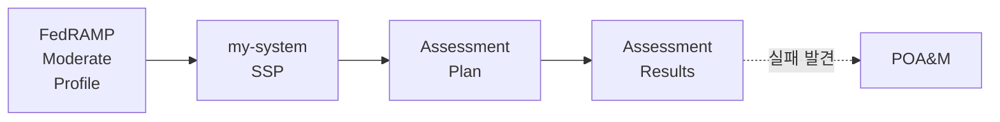
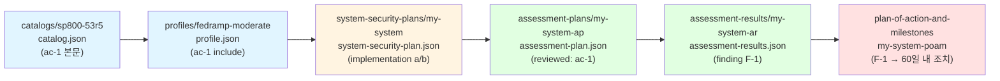
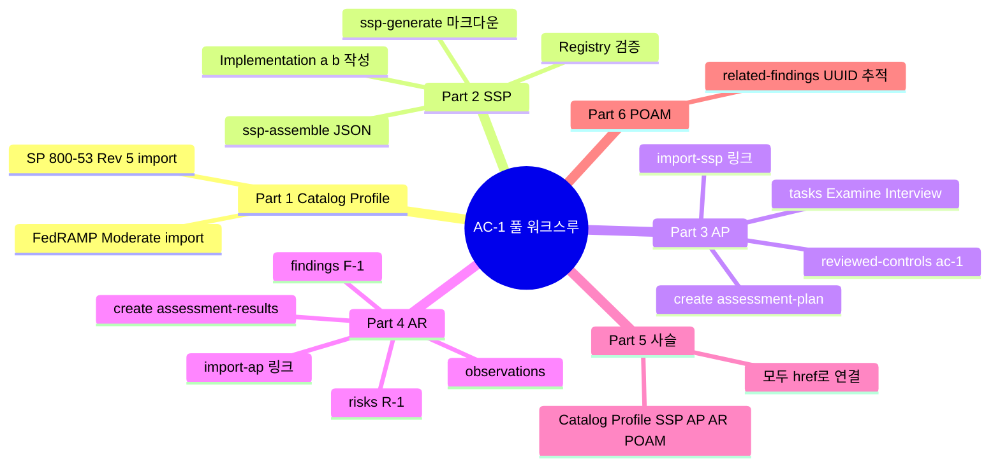

# AC-1 풀 워크스루 — Profile → SSP → AP → AR

---

## 들어가며

[OSCAL 1-2](2026-05-11-OSCAL-1-2.md) 의 시나리오 A를 약속한 대로 풀어낸다. 통제 하나(`AC-1, Policy and Procedures`)를 두고, OSCAL의 **세 계층 — Control / Implementation / Assessment** 을 처음부터 끝까지 한 줄로 이어 본다.

목표는 다음이다.



이 워크스루의 결과물은 다음 6개 파일이다.

1. `catalog/sp800-53r5/catalog.json` — NIST 카탈로그 (외부에서 임포트)
2. `profile/fedramp-moderate/profile.json` — FedRAMP Moderate Profile (외부 임포트)
3. `system-security-plan/my-system/system-security-plan.json` — 본 실습에서 만드는 SSP
4. `assessment-plan/my-system-ap/assessment-plan.json` — SSP를 가리키는 AP
5. `assessment-results/my-system-ar/assessment-results.json` — AP를 가리키는 AR
6. (선택) `plan-of-action-and-milestones/my-system-poam/plan-of-action-and-milestones.json`

---

## Part 0. 준비물

| 항목 | 버전 |
|------|------|
| Python | 3.9 이상 |
| compliance-trestle | 2.x |
| compliance-trestle-fedramp | 최신 (PyPI) |
| 디스크 | 200MB 정도 |

```bash
python -V
pip install --upgrade compliance-trestle compliance-trestle-fedramp
trestle version
```

작업 디렉토리:

```bash
mkdir oscal-ac1-walkthrough && cd oscal-ac1-walkthrough
trestle init
```

`trestle init` 후 다음 구조가 생긴다.

```
oscal-ac1-walkthrough/
├── .trestle/
├── catalogs/
├── profiles/
├── component-definitions/
├── system-security-plans/
├── assessment-plans/
├── assessment-results/
└── plan-of-action-and-milestones/
```

---

## Part 1. Control Layer — Catalog와 Profile 임포트

### 1.1 NIST SP 800-53 Rev 5 Catalog 임포트

OSCAL 세계에서 통제 본문은 한 번만 존재한다. 그것이 **Catalog**다.

```bash
# 1) NIST 공식 카탈로그 다운로드
curl -L -o sp800-53r5-catalog.json \
  https://raw.githubusercontent.com/usnistgov/oscal-content/main/nist.gov/SP800-53/rev5/json/NIST_SP-800-53_rev5_catalog.json

# 2) trestle 워크스페이스로 임포트
trestle import -f sp800-53r5-catalog.json -o sp800-53r5
```

결과:

```
catalogs/
└── sp800-53r5/
    └── catalog.json
```

이 카탈로그 안에 우리가 다룰 **AC-1** 이 다음과 같이 들어 있다 ([OSCAL 1-1](2026-05-11-OSCAL-1-1.md) 에서 본 그 구조).

```json
{
  "id": "ac-1",
  "class": "SP800-53",
  "title": "Policy and Procedures",
  "params": [
    { "id": "ac-1_prm_1", "label": "organization-defined personnel or roles" },
    ...
  ],
  "parts": [
    { "name": "statement", "id": "ac-1_smt", "parts": [ ... ] },
    { "name": "guidance",  "id": "ac-1_gdn", "prose": "..." }
  ],
  "links": [
    { "rel": "related", "href": "#ia-1" },
    { "rel": "related", "href": "#pm-9" }
  ]
}
```

### 1.2 FedRAMP Moderate Profile 임포트

Profile은 "Catalog 어느 통제를 어떤 파라미터로 채워서 베이스라인에 넣을 것인가"를 정한다.

```bash
curl -L -o fedramp-moderate.json \
  https://raw.githubusercontent.com/usnistgov/oscal-content/main/fedramp.gov/rev5/json/FedRAMP_rev5_MODERATE-baseline_profile.json

trestle import -f fedramp-moderate.json -o fedramp-moderate
```

이 Profile은 SP 800-53 Rev 5 카탈로그를 **import**하고, AC-1을 포함한 Moderate 통제 집합을 선택한다.

```json
"imports": [
  {
    "href": "trestle://catalogs/sp800-53r5/catalog.json",
    "include-controls": [
      { "with-ids": ["ac-1", "ac-2", "ac-2.1", ...] }
    ]
  }
],
"modify": {
  "set-parameters": [
    {
      "param-id": "ac-1_prm_1",
      "values": ["organization-defined personnel or roles"]
    }
  ]
}
```

> 위 `trestle://` 스킴은 trestle이 내부적으로 워크스페이스 상대 경로를 해석할 때 쓰는 표기다. import 후 `trestle href` 명령으로 외부 URL을 워크스페이스 경로로 교체할 수 있다.

### 1.3 AC-1 한 통제만 골라 보기

```bash
trestle describe -e profiles.fedramp-moderate \
  | grep -A2 "ac-1"
```

이 시점에서 Profile은 **"AC-1을 쓰겠다"** 까지만 선언한 상태다. 구현 기술이나 책임 주체는 다음 단계인 SSP에서 들어간다.

---

## Part 2. Implementation Layer — SSP 작성

### 2.1 SSP 스캐폴드 생성

```bash
trestle author ssp-generate \
  --profile fedramp-moderate \
  --output my-system-ssp
```

trestle이 **마크다운 파일**을 통제별로 쏟아낸다.

```
md/my-system-ssp/
├── ac/
│   ├── ac-1.md
│   ├── ac-2.md
│   └── ...
├── au/
├── ca/
└── ...
```

핵심은 **사람이 만질 곳은 이 마크다운뿐**이라는 것. 통제 본문·파라미터·관련 링크는 trestle이 Profile로부터 자동 인용한다.

### 2.2 `ac-1.md` 살펴보기

생성된 `md/my-system-ssp/ac/ac-1.md` 의 골격:


```markdown
---
x-trestle-set-params:
  ac-1_prm_1:
    values:
      - CISO, Privacy Officer
  ac-1_prm_2:
    values:
      - All system users
sort-id: ac-01
---

# ac-1 - Access Control Policy and Procedures

## Control Statement

Develop, document, and disseminate to {{ insert: param, ac-1_prm_1 }}:

  a. Access control policy that:
     1. Addresses purpose, scope, roles, responsibilities, ...
  b. Procedures to facilitate the implementation of the access control policy and the associated access controls;
  ...

## Control guidance

Access control policy and procedures address the controls in the AC family...

# What is the solution and how is it implemented?

<!-- Please leave this section blank and use the implementation sections instead. -->

## Implementation a.

### This System

<!-- Add implementation prose for AC-1 part a. here -->

## Implementation b.

### This System

<!-- Add implementation prose for AC-1 part b. here -->
```


### 2.3 AC-1 구현 기술 작성

`Implementation a.` 와 `b.` 섹션에만 글을 채워 넣으면 된다.

```markdown
## Implementation a.

### This System

본 시스템은 회사 정보보안 정책 문서 `INFOSEC-POL-001`(v3.2, 2026-01-15 발효)에
접근통제 정책을 정의한다. 이 정책은 CISO와 Privacy Officer에게 분기마다 검토되며,
승인된 사본은 사내 정책 포털에 게시되고 모든 권한 보유 사용자에게 이메일 알림된다.

## Implementation b.

### This System

접근통제 절차는 `INFOSEC-PROC-001`(v2.1)에 별도 문서화되어 있고,
연간 1회 정보보안실에서 검토·재발행한다. 절차의 변경은 정책관리위원회(PMC)의
승인을 거쳐 모든 시스템 운영자에게 통지된다.
```

같은 파일의 YAML 헤더 `x-trestle-set-params` 에서 파라미터 값도 같이 조정한다.

```yaml
x-trestle-set-params:
  ac-1_prm_1:
    values:
      - CISO, Privacy Officer
```

### 2.4 마크다운 → OSCAL JSON 으로 합치기

```bash
trestle author ssp-assemble \
  --markdown my-system-ssp \
  --output my-system
```

결과:

```
system-security-plans/
└── my-system/
    └── system-security-plan.json
```

### 2.5 결과 JSON 핵심부

`my-system/system-security-plan.json` 의 핵심 두 곳.

**(1) Import — Profile을 가리킴**

```json
"import-profile": {
  "href": "trestle://profiles/fedramp-moderate/profile.json"
}
```

**(2) Control Implementation — AC-1 구현**

```json
"control-implementation": {
  "description": "...",
  "implemented-requirements": [
    {
      "uuid": "9c8e4f...",
      "control-id": "ac-1",
      "set-parameters": [
        {
          "param-id": "ac-1_prm_1",
          "values": ["CISO, Privacy Officer"]
        }
      ],
      "statements": [
        {
          "statement-id": "ac-1_smt.a",
          "uuid": "a1b2...",
          "by-components": [
            {
              "component-uuid": "this-system",
              "uuid": "...",
              "description": "본 시스템은 회사 정보보안 정책 문서 ..."
            }
          ]
        },
        {
          "statement-id": "ac-1_smt.b",
          "by-components": [
            {
              "component-uuid": "this-system",
              "description": "접근통제 절차는 INFOSEC-PROC-001..."
            }
          ]
        }
      ]
    }
  ]
}
```

핵심은 **`control-id: "ac-1"` 하나뿐**이라는 것. 통제 본문은 어디에도 복붙되지 않고, Profile → Catalog로 추적된다.

### 2.6 검증

```bash
# 스키마 검증
trestle validate -f system-security-plans/my-system/system-security-plan.json

# FedRAMP 규칙 검증
trestle-fedramp validate ssp \
  system-security-plans/my-system/system-security-plan.json
```

`OK` 응답을 받으면 Implementation Layer 완료.

---

## Part 3. Assessment Layer ① — Assessment Plan (AP)

### 3.1 AP가 하는 일

**"이 SSP의 어떤 통제를, 누가, 언제, 어떻게 평가할 것인가"** 를 선언한다.

AP의 8개 핵심 섹션 ([NIST AP 모델 문서](https://pages.nist.gov/OSCAL/learn/concepts/layer/assessment/assessment-plan/) 기준):

| 섹션 | 역할 |
|------|------|
| `metadata` | 제목·버전·역할자 |
| `import-ssp` | **평가 대상 SSP** 참조 |
| `local-definitions` | SSP에 없는 보조 정보 |
| `reviewed-controls` | 평가 범위에 든 통제 목록 |
| `assessment-subjects` | 평가 대상(컴포넌트·위치·사용자) |
| `assessment-assets` | 평가자·도구 |
| `tasks` | 일정·절차 |
| `back-matter` | 첨부·인용 |

### 3.2 AP 생성

trestle은 AP에 대해 마크다운 워크플로우(`author ap-generate`)를 제공하지 않는다. AP는 **`trestle create assessment-plan`** 으로 빈 템플릿을 생성한 뒤 JSON을 직접 편집한다.

```bash
trestle create assessment-plan -n my-system-ap
```

생성 결과:

```
assessment-plans/
└── my-system-ap/
    └── assessment-plan.json
```

### 3.3 AC-1 평가용 최소 AP

`assessment-plan.json` 을 다음과 같이 채운다(최소형).

```json
{
  "assessment-plan": {
    "uuid": "11111111-1111-1111-1111-111111111111",
    "metadata": {
      "title": "AC-1 Assessment Plan for my-system",
      "last-modified": "2026-05-11T10:00:00Z",
      "version": "1.0.0",
      "oscal-version": "1.1.2",
      "roles": [
        { "id": "assessor", "title": "Lead Assessor" }
      ],
      "parties": [
        {
          "uuid": "22222222-2222-2222-2222-222222222222",
          "type": "organization",
          "name": "Acme 3PAO"
        }
      ]
    },
    "import-ssp": {
      "href": "trestle://system-security-plans/my-system/system-security-plan.json"
    },
    "reviewed-controls": {
      "control-selections": [
        {
          "include-controls": [ { "control-id": "ac-1" } ]
        }
      ]
    },
    "assessment-subjects": [
      {
        "type": "component",
        "include-all": {}
      }
    ],
    "tasks": [
      {
        "uuid": "33333333-3333-3333-3333-333333333333",
        "type": "action",
        "title": "Examine: AC-1 policy and procedures documents",
        "description": "정책 문서 INFOSEC-POL-001과 절차 INFOSEC-PROC-001 의 존재·승인·배포 증거 확인"
      },
      {
        "uuid": "44444444-4444-4444-4444-444444444444",
        "type": "action",
        "title": "Interview: CISO 및 Privacy Officer",
        "description": "정책 검토 주기와 배포 절차에 대한 운영 사실관계 확인"
      }
    ]
  }
}
```

핵심은 **`import-ssp.href`** — AP는 자기가 무엇을 평가하는지를 SSP를 가리켜 선언한다.

### 3.4 검증

```bash
trestle validate -f assessment-plans/my-system-ap/assessment-plan.json
```

스키마 OK가 나면 AP 완료.

---

## Part 4. Assessment Layer ② — Assessment Results (AR)

### 4.1 AR이 하는 일

AP가 "무엇을 어떻게 평가할 것인가" 였다면 AR은 **"그래서 무엇을 발견했는가"** 다. NIST 문서가 명시하듯 **AR은 반드시 AP를 import** 한다.

| 섹션 | 역할 |
|------|------|
| `metadata` | 동일 |
| `import-ap` | **참조 AP** |
| `local-definitions` | AP에 없는 보조 정보 |
| `results[]` | 평가 결과 묶음 |
| `results[].observations` | 사실관계 관찰 |
| `results[].findings` | 통제 적합/부적합 판정 |
| `results[].risks` | 식별된 위험 |
| `back-matter` | 증거 |

### 4.2 AR 생성

```bash
trestle create assessment-results -n my-system-ar
```

### 4.3 AC-1 평가 결과를 채운 최소 AR

```json
{
  "assessment-results": {
    "uuid": "55555555-5555-5555-5555-555555555555",
    "metadata": {
      "title": "AC-1 Assessment Results for my-system",
      "last-modified": "2026-05-11T18:00:00Z",
      "version": "1.0.0",
      "oscal-version": "1.1.2"
    },
    "import-ap": {
      "href": "trestle://assessment-plans/my-system-ap/assessment-plan.json"
    },
    "results": [
      {
        "uuid": "66666666-6666-6666-6666-666666666666",
        "title": "AC-1 평가 결과",
        "description": "정책·절차 문서와 인터뷰를 통한 AC-1 평가",
        "start": "2026-05-11T09:00:00Z",
        "end":   "2026-05-11T17:30:00Z",
        "reviewed-controls": {
          "control-selections": [
            { "include-controls": [ { "control-id": "ac-1" } ] }
          ]
        },
        "observations": [
          {
            "uuid": "77777777-7777-7777-7777-777777777777",
            "title": "Observation O-1: 정책 문서 존재 및 승인",
            "description": "INFOSEC-POL-001 v3.2(2026-01-15 발효, CISO 승인) 확인.",
            "methods": ["EXAMINE"],
            "collected": "2026-05-11T10:30:00Z"
          },
          {
            "uuid": "88888888-8888-8888-8888-888888888888",
            "title": "Observation O-2: 절차 문서 검토 주기",
            "description": "INFOSEC-PROC-001 의 최근 검토일이 13개월 전. 연간 검토 주기 1개월 초과.",
            "methods": ["EXAMINE", "INTERVIEW"],
            "collected": "2026-05-11T14:00:00Z"
          }
        ],
        "findings": [
          {
            "uuid": "99999999-9999-9999-9999-999999999999",
            "title": "Finding F-1: AC-1(b) 부분 적합",
            "description": "정책은 적합하나 절차 문서의 검토 주기가 통제 의도(연 1회)를 초과함.",
            "target": {
              "type": "objective-id",
              "target-id": "ac-1_obj.b",
              "status": { "state": "not-satisfied" }
            },
            "related-observations": [
              { "observation-uuid": "88888888-8888-8888-8888-888888888888" }
            ]
          }
        ],
        "risks": [
          {
            "uuid": "aaaaaaaa-aaaa-aaaa-aaaa-aaaaaaaaaaaa",
            "title": "Risk R-1: 절차 문서 노후화로 인한 운영 불일치",
            "description": "절차가 최신 통제 환경을 반영하지 않을 가능성",
            "statement": "절차 검토 주기 미준수 시 실제 운영과 문서 간 괴리가 누적될 수 있다.",
            "status": "open"
          }
        ]
      }
    ]
  }
}
```

### 4.4 검증

```bash
trestle validate -f assessment-results/my-system-ar/assessment-results.json
```

---

## Part 5. 전체 사슬 확인



핵심 사슬을 한 줄로 정리하면:

| 단계 | 가리키는 곳 | 의미 |
|------|----|----|
| Profile → Catalog | `imports[].href` | 어떤 통제를 쓸까 |
| SSP → Profile | `import-profile.href` | 어느 베이스라인인가 |
| AP → SSP | `import-ssp.href` | 무엇을 평가하나 |
| AR → AP | `import-ap.href` | 어떤 평가의 결과인가 |
| POA&M → SSP/AR | `import-ssp.href`, `findings[].related-observations` | 어떤 발견을 조치하나 |

**"한 번 작성한 통제 정보가, 도구·프레임워크·조직 경계를 넘어 그대로 재사용된다"** — [OSCAL 1-1](2026-05-11-OSCAL-1-1.md) 에서 약속했던 핵심 가치가 이 사슬에서 그대로 구현된다.

---

## Part 6. 자동 트레이서빌리티 — F-1을 POA&M으로

AR의 **Finding F-1** 은 자동으로 POA&M의 "조치 필요 항목"이 된다.

```bash
trestle create plan-of-action-and-milestones -n my-system-poam
```

`plan-of-action-and-milestones.json` 의 핵심부:

```json
"poam-items": [
  {
    "uuid": "bbbbbbbb-bbbb-bbbb-bbbb-bbbbbbbbbbbb",
    "title": "AC-1(b) 절차 문서 검토 주기 회복",
    "description": "INFOSEC-PROC-001 의 검토 주기를 연 1회로 정상화",
    "related-findings": [
      { "finding-uuid": "99999999-9999-9999-9999-999999999999" }
    ],
    "related-observations": [
      { "observation-uuid": "88888888-8888-8888-8888-888888888888" }
    ]
  }
]
```

`related-findings.finding-uuid` 가 AR에 정의된 F-1의 UUID와 같다. 도구는 이 링크로 "이 POA&M 항목은 어떤 평가의 어떤 발견에서 비롯되었나"를 자동 추적한다.

---

## Part 7. 자주 막히는 곳 5가지

| 증상 | 원인 | 해결 |
|------|------|------|
| `import-ssp.href` 가 외부 URL로 남음 | 임포트 후 `trestle href` 미실행 | `trestle href -i 0 -hr 'trestle://...'` |
| `ssp-assemble` 시 `param value missing` | 마크다운 YAML 헤더에 값 누락 | `x-trestle-set-params` 의 `values:` 채우기 |
| AR 검증 시 `import-ap` 미존재 | AP가 아직 워크스페이스에 없음 | Part 3 먼저 완료 |
| `oscal-version` 불일치 | Catalog/Profile/SSP의 버전 섞임 | 모두 동일 OSCAL 버전(예: 1.1.2)으로 맞춤 |
| `trestle-fedramp validate` 실패 (Registry 값) | `implementation-status` 등 값이 자유 텍스트 | 허용값으로 정규화 |

---

## 정리



이 워크스루를 한 번 따라가면 OSCAL의 약속이 추상이 아니라 **실제 파일들의 그래프**임을 손에 잡힌다. 다음 글에서는 같은 사슬을 두고 **Component Definition**을 도입해 — 즉 "AWS RDS가 충족하는 통제 묶음" 같은 재사용 라이브러리를 — SSP에 끼워 넣는 방법을 본다.

---

## References

1. NIST, *OSCAL Assessment Plan Model* (AP 8개 섹션과 import-ssp 정의). <https://pages.nist.gov/OSCAL/learn/concepts/layer/assessment/assessment-plan/>
2. NIST, *OSCAL Assessment Results Model* (AR이 AP를 import-ap로 가리킨다는 점의 원전). <https://pages.nist.gov/OSCAL/learn/concepts/layer/assessment/assessment-results/>
3. NIST, *OSCAL SP 800-53 Rev 5 Control Example — AC-1* (본 글의 통제 모델 출처). <https://pages.nist.gov/OSCAL/learn/concepts/layer/control/catalog/sp800-53rev5-example/>
4. usnistgov, *oscal-content* — NIST SP 800-53 Rev 5 Catalog · FedRAMP Rev5 Moderate Profile JSON 다운로드 출처. <https://github.com/usnistgov/oscal-content>
5. NIST, *OSCAL Assessment Plan v1.1.2 JSON Reference*. <https://pages.nist.gov/OSCAL-Reference/models/v1.1.2/assessment-plan/json-reference/>
6. NIST, *OSCAL Assessment Results v1.1.2 JSON Reference*. <https://pages.nist.gov/OSCAL-Reference/models/v1.1.2/assessment-results/json-reference/>
7. oscal-compass, *compliance-trestle* — `trestle init / import / create / author ssp-generate / ssp-assemble / validate` 명령 원전. <https://github.com/oscal-compass/compliance-trestle>
8. oscal-compass, *compliance-trestle: SSP Profile Catalog Authoring Tutorial*. <https://oscal-compass.dev/compliance-trestle/latest/tutorials/Trestle_authoring/ssp_profile_catalog_authoring/>
9. oscal-compass, *compliance-trestle-fedramp* — `trestle-fedramp validate ssp` 출처. <https://github.com/oscal-compass/compliance-trestle-fedramp>
