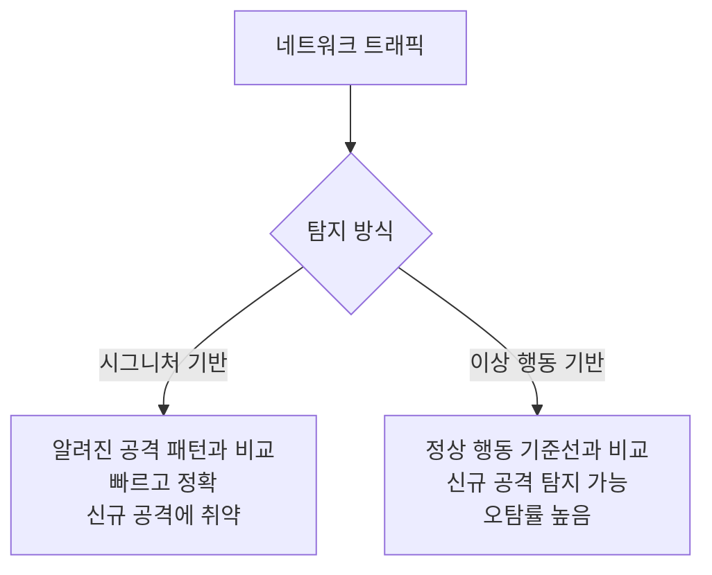
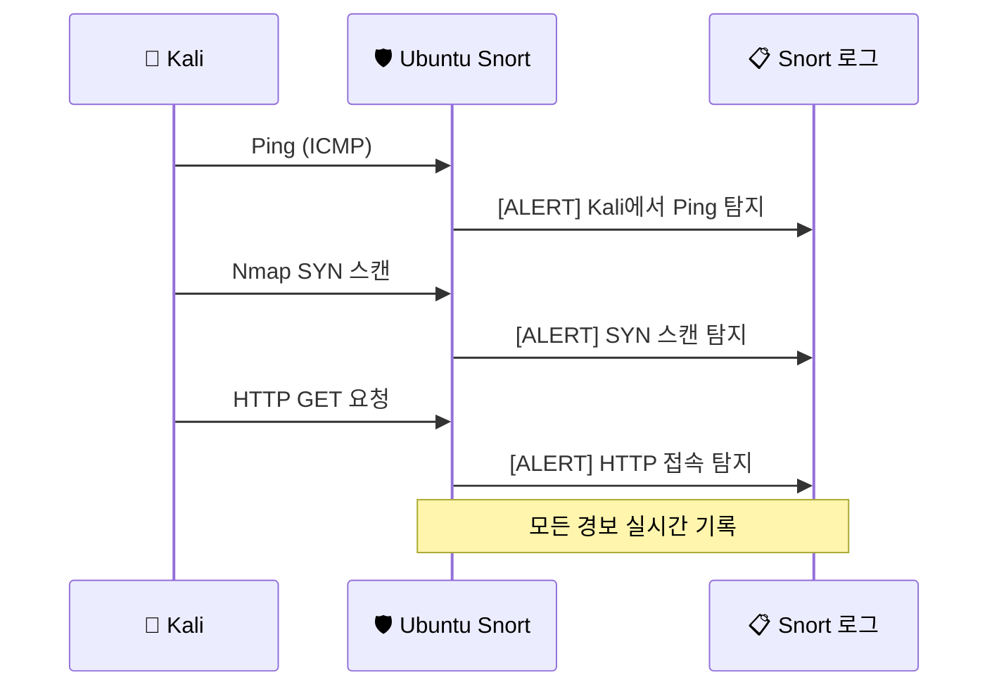
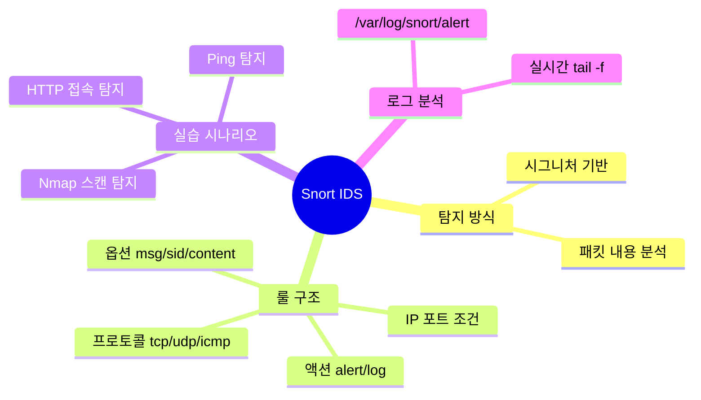

# 침입 탐지 시스템 — Snort IDS

---

## 실습 환경

| 역할 | OS | IP |
|------|----|----|
| 공격자 | Kali Linux | `192.168.0.10` |
| 탐지 서버 | Ubuntu | `192.168.0.30` |

---

## Part 1. IDS/IPS 개념

### 1.1 IDS vs IPS

| 항목 | IDS (Intrusion Detection System) | IPS (Intrusion Prevention System) |
|------|----------------------------------|-----------------------------------|
| 역할 | 공격 **탐지** → 경보 발생 | 공격 탐지 → **차단** |
| 동작 방식 | 트래픽 복사본 분석 (Passive) | 트래픽 경로 상에 위치 (Inline) |
| 서비스 영향 | 없음 | 오탐 시 정상 트래픽도 차단 위험 |
| 적합한 상황 | 모니터링 우선 | 즉각적인 방어 필요 |

### 1.2 탐지 방식



### 1.3 Snort란?

**Snort**는 가장 널리 쓰이는 오픈소스 네트워크 IDS/IPS다.

- **시그니처 기반** 탐지
- 패킷 스니퍼, 패킷 로거, NIDS 세 가지 모드 지원
- 커스텀 룰 작성 가능
- 실시간 트래픽 분석 및 경보

---

## Part 2. Snort 설치 (Ubuntu)

### 2.1 설치

> 이 실습은 Ubuntu 기본 저장소(apt)가 제공하는 **Snort 2.9.20** 기준입니다. (최신 계열은 Snort 3이지만 apt로 설치되지 않고 소스 빌드가 필요하므로, 1학년 실습에서는 apt로 설치되는 Snort 2를 사용합니다.)
{: .prompt-info }

```bash
# snort 패키지는 universe 저장소에 있으므로 먼저 활성화한다
# (Ubuntu 서버/최소 설치에서는 꺼져 있어 install이 실패할 수 있다)
sudo add-apt-repository universe -y
sudo apt update

sudo apt install snort -y
```

설치 중 파란 설정 화면이 뜨면 네트워크 인터페이스(예: `ens33`)와 홈 네트워크 대역을 입력한다:


```
HOME_NET: 192.168.0.0/24
```

> 설정 화면을 그냥 넘겼거나 값이 틀려도 괜찮다. 이 실습의 룰은 IP를 직접 명시하므로 동작에는 영향이 없고, 인터페이스는 아래 실행 명령에서 `-i` 옵션으로 다시 지정한다.
{: .prompt-tip }

### 2.2 설치 확인

```bash
snort --version
```


### 2.3 주요 설정 파일

| 파일 | 역할 |
|------|------|
| `/etc/snort/snort.conf` | 메인 설정 파일 |
| `/etc/snort/rules/` | 룰 파일 디렉토리 |
| `/var/log/snort/` | 로그 저장 디렉토리 |

### 2.4 네트워크 인터페이스 확인

```bash
ip addr show
```

`lo`가 아닌 인터페이스 이름을 확인한다. 가상머신 종류에 따라 이름이 다르다:

| 가상머신 | 흔한 인터페이스 이름 |
|----------|----------------------|
| VMware | `ens33` |
| VirtualBox | `enp0s3` |
| 기타/구형 | `eth0` |

> **중요:** 이 글의 모든 Snort 실행 명령은 `-i ens33`로 적혀 있다. **자신의 인터페이스 이름이 다르면 `ens33`을 자기 것으로 바꿔서** 실행해야 한다. (예: VirtualBox면 `-i enp0s3`)
{: .prompt-warning }

---

## Part 3. Snort 룰(Rule) 작성

### 3.1 룰 구조

Snort 룰은 **헤더**와 **옵션**으로 구성된다.

```
[액션] [프로토콜] [출발지IP] [출발지포트] -> [목적지IP] [목적지포트] (옵션들)
```

**예시:**
```
alert tcp any any -> 192.168.0.30 80 (msg:"HTTP 접속 탐지"; sid:1000001; rev:1;)
```

### 3.2 주요 액션

| 액션 | 의미 |
|------|------|
| `alert` | 경보 발생 + 로그 기록 |
| `log` | 로그만 기록 |
| `drop` | 패킷 차단 (IPS 모드) |
| `pass` | 무시 |

### 3.3 주요 룰 옵션

| 옵션 | 설명 | 예시 |
|------|------|------|
| `msg` | 경보 메시지 | `msg:"Nmap SYN Scan";` |
| `sid` | 룰 고유 ID (1000000 이상 커스텀) | `sid:1000001;` |
| `rev` | 룰 버전 | `rev:1;` |
| `content` | 페이로드 내용 매칭 | `content:"GET";` |
| `flags` | TCP 플래그 | `flags:S;` (SYN만) |
| `ttl` | TTL 값 조건 | `ttl:<64;` |
| `detection_filter` | 특정 기간 내 탐지 횟수 임계치 설정 | `detection_filter: track by_src, count 20, seconds 3;` |

---

## Part 4. 실습 — 커스텀 룰 작성 및 Kali 공격 탐지

### 4.1 커스텀 룰 파일 생성

```bash
sudo nano /etc/snort/rules/local.rules
```

아래 룰을 추가한다. 각 옵션의 역할은 주석을 참고하여 정확하게 작성해야 오류가 나지 않는다:

```bash
# 1. Kali(192.168.0.10)에서 서버(192.168.0.30)로 오는 모든 TCP 트래픽 탐지
#   - tcp: TCP 프로토콜만 감시
#   - sid:1000001: 커스텀 룰 식별자 (1,000,000 이상 설정 필수)
alert tcp 192.168.0.10 any -> 192.168.0.30 any (msg:"[ALERT] Kali에서 TCP 접속 탐지"; sid:1000001; rev:1;)

# 2. Nmap SYN 스캔 탐지 (3초 동안 동일한 출발지 IP에서 20번 이상 SYN 패킷 수신 시 탐지)
#   - flags:S : TCP 헤더 플래그 중 SYN 플래그만 설정된 패킷 매칭
#   - detection_filter: 기존의 threshold 옵션은 경보/오류를 방지하기 위해 최신 문법인 detection_filter로 대체
#     * track by_src : 출발지 IP 기준으로 카운트 누적
#     * count 20 : 20회 이벤트 도달 시 경보
#     * seconds 3 : 3초의 임계 시간 설정 (오타인 'second' 대신 복수형 'seconds' 필수!)
alert tcp any any -> 192.168.0.30 any (msg:"[ALERT] SYN 스캔 탐지"; flags:S; detection_filter: track by_src, count 20, seconds 3; sid:1000002; rev:1;)

# 3. HTTP 웹 서버 접속 탐지
#   - 192.168.0.30 80 : 80번 포트(웹 서비스)로 향하는 트래픽 대상
#   - content:"GET" : 패킷의 Application Layer 페이로드 내에 "GET" 문자열 매칭
alert tcp any any -> 192.168.0.30 80 (msg:"[ALERT] HTTP 접속 탐지"; content:"GET"; sid:1000003; rev:1;)

# 4. ICMP Ping 탐지 (Kali에서 오는 ICMP 패킷 탐지)
#   - icmp: ICMP 프로토콜 지정
#   - itype:8 : ICMP 타입 중 8번(Echo Request, Ping 요청) 패킷만 필터링
alert icmp 192.168.0.10 any -> 192.168.0.30 any (msg:"[ALERT] Kali에서 Ping 탐지"; itype:8; sid:1000004; rev:1;)
```

### 4.2 설정 파일에서 커스텀 룰 활성화 확인

Ubuntu apt로 설치한 Snort는 `snort.conf`에 `local.rules`가 **이미 포함되어 있다.** 그래서 보통 추가 작업이 필요 없다. 먼저 확인부터 한다:

```bash
sudo grep "local.rules" /etc/snort/snort.conf
```

- 출력에 `include $RULE_PATH/local.rules` 줄이 **그대로(맨 앞에 `#` 없이)** 보이면 → **아무것도 하지 않는다.** (이미 활성화됨)
- 줄 맨 앞에 `#`가 붙어 주석 처리되어 있으면 → 그 `#`만 지운다.
- 아예 줄이 없을 때만 → 파일 하단에 아래 한 줄을 추가한다.

```bash
include $RULE_PATH/local.rules
```

> **흔한 실수:** 이미 있는데 한 줄 더 추가하면 `local.rules`가 두 번 읽혀 **"Duplicate rule" (중복 SID) 에러로 4.3 검증이 실패**한다. 반드시 위 `grep`으로 먼저 확인하고, 중복으로 넣지 말 것.
{: .prompt-warning }

### 4.3 Snort 테스트 실행 (설정 검증)

```bash
#이더넷 정확히 확인하고 기입 사람에 따라 ens33 아닐 수 있음
sudo snort -T -c /etc/snort/snort.conf -i ens33 
```

성공하면 마지막에 아래 메시지가 나온다:

```
Snort successfully validated the configuration!
```

> **검증이 실패한다면** — 대부분 stock 설정의 평판(reputation) 룰 파일이 없어서 나는 에러다. 메시지에 `white_list.rules` 또는 `black_list.rules`가 보이면 빈 파일을 만들어 주면 해결된다:
> ```bash
> sudo touch /etc/snort/rules/white_list.rules /etc/snort/rules/black_list.rules
> ```
> `Duplicate rule` 에러가 보이면 4.2의 중복 include 문제이니 추가한 줄을 지운다.
{: .prompt-tip }

### 4.4 Snort 실시간 탐지 모드 실행

```bash
# -A console: 탐지된 경보(Alert)를 파일 대신 실시간 터미널 화면에 출력
sudo snort -A console -c /etc/snort/snort.conf -i ens33
```

> **Tip: Snort 일시 중지 및 종료 방법**
> 
> Snort는 실행 후 터미널을 점유하며 실시간 모니터링을 수행합니다. 멈추거나 종료할 때 다음 단축키와 명령어를 사용하세요.
> 
> 1. **정상 종료 (`Ctrl + C`):**
>    실행 중인 터미널 창에서 `Ctrl + C`를 누르면 패킷 수집 통계를 화면에 출력하며 안전하게 종료됩니다.
> 2. **강제 종료 (`Ctrl + \`):**
>    Snort가 멈추거나 `Ctrl + C` 키 입력에 반응하지 않을 때, **`Ctrl + \`** (SIGQUIT)을 누르면 즉시 강제 종료됩니다.
> 3. **새 터미널에서 프로세스 종료 (`killall`/`pkill`):**
>    터미널이 완전히 굳어서 입력이 되지 않는 경우, 새 터미널 창을 열고 아래 명령어로 실행 중인 snort 백그라운드/포그라운드 프로세스를 정리합니다.
>    ```bash
>    sudo killall snort      # Snort 정상 종료 요청
>    sudo killall -9 snort   # 먹통일 때 강제 즉시 종료
>    ```
> 4. **일시정지 후 종료 (`Ctrl + Z`):**
>    `Ctrl + Z`를 눌러 프로세스를 잠시 멈추고 백그라운드로 보낸 뒤, `sudo killall snort`를 입력해 종료할 수 있습니다.
{: .prompt-info }

### 4.5 Kali에서 공격 시나리오 실행

**시나리오 1: Ping 테스트**
```bash
# Kali에서 실행
ping -c 5 192.168.0.30
```

Ubuntu Snort 출력 예상:
```
03/26-09:30:01.123456  [**] [1:1000004:1] [ALERT] Kali에서 Ping 탐지 [**]
[Priority: 0]
ICMP 192.168.0.10 -> 192.168.0.30
```

**시나리오 2: Nmap SYN 스캔**
```bash
# Kali에서 실행
sudo nmap -sS 192.168.0.30
```

Ubuntu Snort 출력 예상:
```
[**] [1:1000002:1] [ALERT] SYN 스캔 탐지 [**]
[Priority: 0]
TCP 192.168.0.10:xxxxx -> 192.168.0.30:22
```

**시나리오 3: 웹 접속**
```bash
# Kali에서 실행
curl http://192.168.0.30/
```

**시나리오 4: 전체 종합 공격 흐름**



---

## Part 5. Snort 로그 분석

### 5.1 로그 파일 확인

```bash
# 로그 디렉토리
ls -la /var/log/snort/

# alert 로그 실시간 모니터링
sudo tail -f /var/log/snort/alert
```

### 5.2 로그 형식 이해

```
03/26-09:30:01.123456  [**] [1:1000001:1] [ALERT] Kali에서 TCP 접속 탐지 [**]
[Priority: 0]
{TCP} 192.168.0.10:54321 -> 192.168.0.30:80
```

| 항목 | 의미 |
|------|------|
| `03/26-09:30:01` | 탐지 시간 |
| `[1:1000001:1]` | gid:sid:rev |
| 메시지 | 룰의 msg 내용 |
| `{TCP}` | 프로토콜 |
| IP:포트 | 출발지 → 목적지 |

### 5.3 통계 확인

Snort 종료(`Ctrl+C`) 후 통계 출력:

```
Snort exiting
...
Total alerts:        47
...
```

---

## Part 6. 룰 심화 — 임계치 필터(detection_filter) 및 추가 실무 실습

무차별 스캔이나 자동화 도구를 사용한 무차별 대입 공격은 짧은 시간에 다량의 패킷을 발생시킵니다. 이를 효율적으로 탐지하기 위해 임계치를 적용하는 옵션을 심화하여 다뤄봅니다.

### 6.1 `detection_filter` 적용 (기존 `threshold` 대체)

> **중요:** 과거 Snort 룰 예제에 자주 쓰이는 `threshold` 옵션은 최신 Snort 버전의 룰 내부(Inline)에서 사용할 경우 경고(Deprecated)가 발생하며, 시간 인자로 단수형인 `second`를 쓰면 **문법 에러(Fatal Error)**로 시스템이 꺼집니다. 따라서 현재는 룰 내부에 **`detection_filter`** 옵션을 사용하는 것이 표준입니다.
{: .prompt-warning }

```bash
# 3초 안에 동일한 IP(by_src)로부터 20번 이상 SYN 패킷이 수신되면 경보를 울림
#   - detection_filter: 임계 조건을 필터링
#   - track by_src: 출발지 IP 기준으로 트래픽 추적
#   - count 20: 3초(seconds 3) 내에 해당 룰 매칭 횟수가 20회에 도달 시 이벤트 발생
#   - seconds 3: 임계 시간 범위(단위: 초). 복수형인 'seconds'로 정확히 기입 필수!
alert tcp any any -> 192.168.0.30 any (
    msg:"[ALERT] 포트 스캔 의심";
    flags:S;
    detection_filter: track by_src, count 20, seconds 3;
    sid:1000005;
    rev:1;
)
```

| 옵션 | 의미 | 상세 설명 |
|------|------|-----------|
| `detection_filter` | 임계치 탐지 옵션 | 특정 시간 동안의 공격 누적 횟수를 체크 |
| `track by_src` | 출발지 IP 기준 집계 | 공격 주체(공격자 IP)를 기준으로 패킷 수를 집계 |
| `count 20` | 임계 패킷 수 | 누적 패킷 개수가 20회 도달 시 이벤트 트리거 |
| `seconds 3` | 임계 시간 범위 | 패킷 카운트가 유효한 시간대 (3초 내) |

---

### 6.2 추가 실무 실습

현업에서 자주 모니터링해야 하는 주요 인프라 서비스인 **데이터베이스(MySQL)** 및 **원격 관리 도구(SSH)**에 대한 위협 탐지 룰을 작성하고 분석해 봅니다.

#### 1) MySQL 데이터베이스 접근 탐지
보안 정책상 내부 관리용 DB 포트(3306)에 외부 세션의 TCP 접근 시도가 발생하는지 실시간 모니터링하기 위한 룰입니다.

* **룰 정의:**
  ```bash
  # 목적지 포트 3306(MySQL 기본 포트)으로 들어오는 모든 외부 TCP 트래픽을 탐지
  #   - 3306 : 목적지 포트를 MySQL로 고정
  #   - sid:1000007 : 중복되지 않는 고유 룰 식별 번호 설정
  alert tcp any any -> 192.168.0.30 3306 (msg:"[ALERT] MySQL 접근 시도"; sid:1000007; rev:1;)
  ```

#### 2) SSH(22) 대상 무차별 대입(Brute Force) 공격 탐지
원격 쉘 접속을 위해 22번 포트로 과도하게 빠른 요청을 반복하는 행위를 임계치 필터를 적용해 무차별 대입 시도로 의심하여 탐지합니다.

* **룰 정의:**
  ```bash
  # 특정 공격지(Kali)로부터 SSH 22번 포트로 5초 동안 10번 이상 TCP 연결을 시도하는 경우 경보
  #   - 192.168.0.10 : 출발지 IP를 공격자 IP(Kali)로 명시하여 표적 탐지 수행
  #   - 22 : SSH 접속 포트 매칭
  #   - detection_filter : 5초(seconds 5) 범위 안에 접속 시도가 10회(count 10) 이상 누적 시 작동
  alert tcp 192.168.0.10 any -> 192.168.0.30 22 (
      msg:"[ALERT] SSH 무차별 대입 의심";
      detection_filter: track by_src, count 10, seconds 5;
      sid:1000006;
      rev:1;
  )
  ```

---

## 정리



| 명령어 | 설명 |
|--------|------|
| `sudo snort -T -c /etc/snort/snort.conf -i ens33` | 설정 검증 |
| `sudo snort -A console -c /etc/snort/snort.conf -i ens33` | 실시간 탐지 |
| `sudo tail -f /var/log/snort/alert` | 로그 실시간 확인 |

다음 시간에는 **10-2 과제**에서 Snort 경보 로그를 분석하고, IDS 우회 기법과 대응 방법을 정리합니다.
