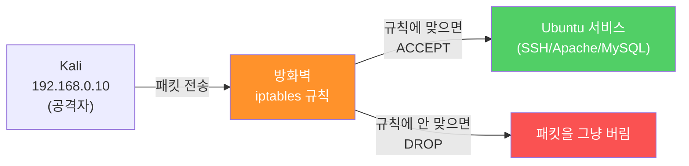
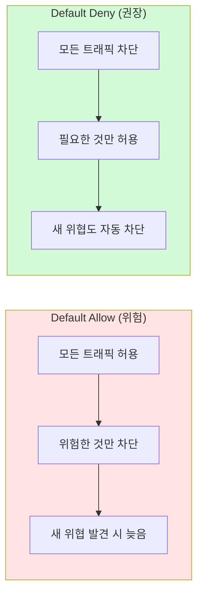
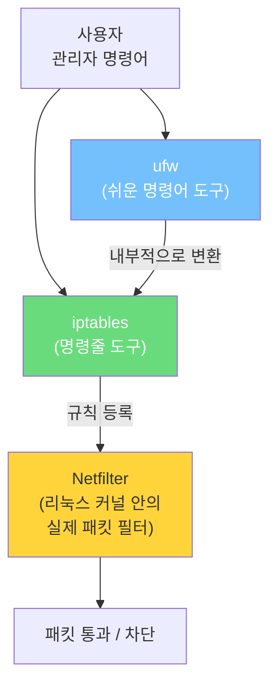
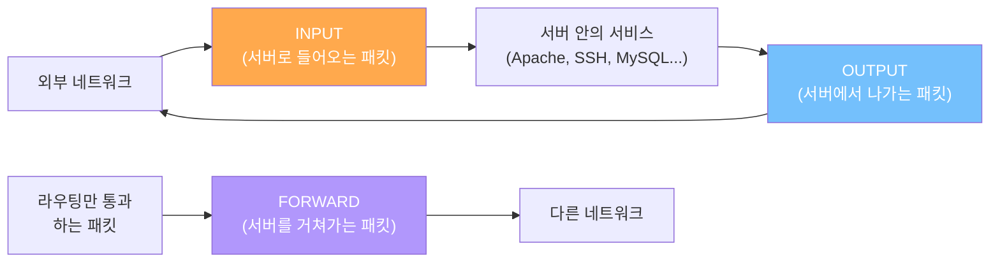
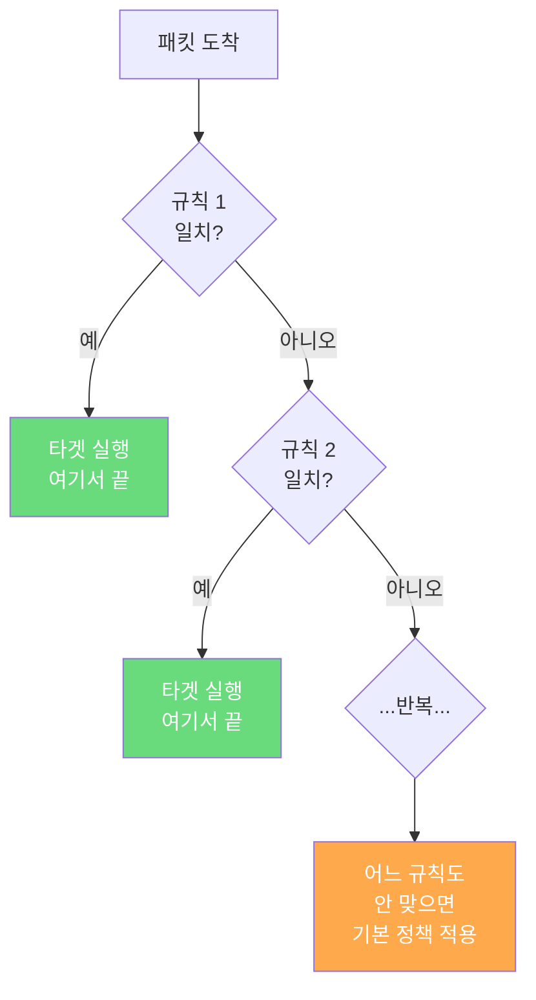
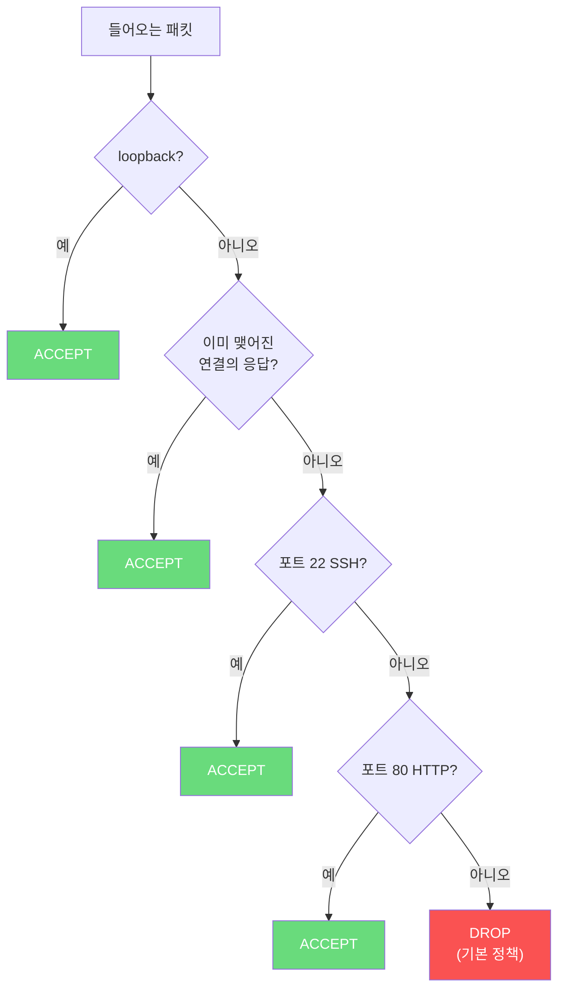

## 실습 환경

| 구분 | 운영체제 | IP 주소 | 역할 |
|------|----------|---------|------|
| 공격자 PC | Kali Linux | 192.168.0.10 | Nmap·ssh·curl 로 공격 시도 |
| 서버 | Ubuntu | 192.168.0.30 | iptables 방화벽으로 방어 |

이 자료는 **Ubuntu를 막 설치한 상태부터** 시작해도 그대로 따라할 수 있도록 만들었습니다.

---

## 왜 방화벽 실습을 해야 할까?

본격 실습에 들어가기 전에, "이걸 왜 배우는가" 를 잠깐 짚고 갑니다. 이유를 알면 실습이 훨씬 의미 있게 다가옵니다.

### 1. 실제 사고는 대부분 "열려 있으면 안 되는 포트"에서 시작된다

뉴스에 자주 나오는 데이터 유출 사고의 큰 비중이 매우 단순한 패턴에서 발생합니다.

| 패턴 | 사고 예시 |
|------|----------|
| MongoDB·Elasticsearch·MySQL을 외부에 노출 | "수억 건 개인정보 유출" 사건 다수 — 인증 없는 DB가 인터넷에 떠 있어 누구나 덤프 가능 |
| RDP(3389)·SSH(22) 무차별 대입 | 랜섬웨어 침투의 가장 흔한 진입 경로 |
| 개발용으로 잠깐 열어둔 관리 페이지 | 8080·8443·9090 등 "잠깐만" 열었다가 그대로 방치되어 침해 |
| 클라우드 보안그룹을 0.0.0.0/0 으로 설정 | "테스트만 하고 닫겠다" 가 그대로 운영에 흘러 들어감 |

이런 사고들의 공통점은 **"굳이 열려 있을 필요가 없는 포트"** 가 외부에서 보였다는 것입니다. 방화벽 한 줄이면 막혔을 일이 막히지 않은 채 운영된 결과입니다.

### 2. 방화벽은 다층 방어(Defense in Depth)의 가장 바깥 벽

보안은 한 가지 도구로 완성되지 않습니다. 여러 겹으로 쌓는 게 원칙입니다.


오늘 배우는 **호스트 방화벽**은 그중 가장 바깥에서 "그런 패킷은 애초에 들어오지 마라" 고 막는 역할입니다. 안쪽 계층(인증, 애플리케이션)이 아무리 튼튼해도 바깥 벽이 없으면 그 안쪽 계층이 24시간 공격에 노출됩니다.

### 3. 오늘 실습으로 얻게 되는 능력

이 실습을 끝내면 다음을 할 수 있게 됩니다.

- 새 서버를 받았을 때 **5분 안에** 안전한 기본 방화벽 정책 구성
- Nmap 스캔 결과만 보고 "지금 이 서버에 어떤 위험이 있는가" 판단
- "방화벽이 켜진 것 같은데 왜 안 막히지?" 같은 상황을 직접 디버깅
- 클라우드(AWS 보안그룹, GCP 방화벽 규칙)로 옮겨가도 같은 사고방식이 그대로 통함

> 이 실습의 핵심은 명령어 암기가 아니라, **"공격자가 무엇을 시도하는가"** ↔ **"방어자가 무엇으로 막는가"** 의 짝을 손으로 직접 만들어 보는 것입니다.
{: .prompt-info }

실습의 큰 그림:

1. Ubuntu에 실습용 서비스(SSH, Apache, MySQL)를 깔아 "지킬 거리" 를 만든다.
2. Kali에서 Nmap으로 스캔해서 어느 포트가 열려 있는지 본다 → **공격자 시점**
3. Ubuntu에 iptables 방화벽 규칙을 만들어 통과/차단을 직접 결정한다 → **방어자 시점**
4. Kali에서 다시 공격을 시도해 방어 효과를 눈으로 확인한다 → **검증**

---

## Part 0. Ubuntu 처음부터 준비하기

이 부분은 Ubuntu가 막 설치된 깨끗한 상태를 가정합니다. 이미 6주차에서 SSH 설치 등을 끝냈다면 빠르게 훑고 Part 1로 넘어가도 됩니다.

### 0.1 네트워크와 IP 확인

```bash
# Ubuntu 서버에서 실행

# 현재 IP 주소 확인
ip a
# ip          : 네트워크 설정 명령어
# a           : address (주소) 보기
# 출력에서 inet 192.168.0.30/24 같은 줄을 찾으면 됨
# 만약 다른 IP라면 가상머신 네트워크 설정에서 192.168.0.30으로 고정하세요

# 인터페이스 이름 확인 (이후 명령에서 사용)
ip -br link
# -br         : brief, 한 줄 요약
# 결과 예: ens33 UP ... 또는 enp0s3 UP ...
# 본인 환경의 이름을 기록해 두세요 (예: ens33, eth0, enp0s3)
```

```bash
# Kali와 연결되는지 확인
ping -c 3 192.168.0.10
# -c 3 : 3번만 보내고 종료
# "3 packets transmitted, 3 received" 가 보이면 정상
```

### 0.2 패키지 목록 갱신과 기본 도구 설치

```bash
# Ubuntu에서 실행
sudo apt update
# apt update : 설치 가능한 패키지의 최신 목록을 다운로드
# (실제 설치는 아니고 "어떤 게 있더라" 만 갱신)

sudo apt install -y net-tools curl vim tcpdump
# -y          : 설치 중 물어보면 자동으로 yes
# net-tools   : netstat 등 옛 네트워크 도구
# curl        : 웹 요청 보내는 도구
# vim         : 텍스트 편집기
# tcpdump     : 패킷 캡처 도구 (Part 6에서 방어 효과 확인용)
```

### 0.3 SSH 서버 설치 — 원격 접속 도구

방화벽 실습은 SSH가 있어야 의미가 있습니다(외부에서 들어오는 연결의 대표 사례).

```bash
# Ubuntu에서 실행
sudo apt install -y openssh-server
# openssh-server : SSH 서버 (외부에서 들어오는 SSH 접속을 받는 프로그램)

# 서비스 시작 + 부팅 시 자동 시작 등록
sudo systemctl enable --now ssh
# enable      : 부팅 시 자동 시작 등록
# --now       : 지금 당장도 시작
# ssh         : SSH 서비스 이름

# 동작 확인
sudo systemctl status ssh
# "active (running)" 이 보이면 정상
# 빠져나오려면 q
```

```bash
# Kali에서 SSH 연결 가능한지 확인
ssh 사용자명@192.168.0.30
# 처음 접속 시 "yes/no" 물으면 yes
# 비밀번호 입력 후 접속되면 정상
# exit 으로 빠져나오기
```

> 이 자료는 **SSH 표준 포트 22** 를 사용합니다. 6주차에서 2222로 옮긴 환경에서는 자료의 `22` 자리에 본인 포트를 넣으세요.
{: .prompt-tip }

### 0.4 Apache 웹 서버 설치 — 80번 포트 사용

```bash
# Ubuntu에서 실행
sudo apt install -y apache2
# apache2 : 가장 널리 쓰이는 웹 서버 중 하나

sudo systemctl enable apache2

sudo systemctl status apache2
# "active (running)" 확인
```

```bash
# Kali에서 웹 페이지 요청
curl -I http://192.168.0.30/
# -I     : 응답의 헤더(HEAD)만 받기
# HTTP/1.1 200 OK 가 나오면 Apache가 외부에서 보이는 상태
```

### 0.5 MySQL 설치 — 3306번 포트

```bash
# Ubuntu에서 실행
sudo apt install -y mysql-server
# mysql-server : MySQL 데이터베이스 서버

sudo systemctl enable --now mysql

sudo systemctl status mysql
```

MySQL은 기본 설정상 **로컬(127.0.0.1)에서만** 듣게 돼 있습니다. 외부에서는 보이지 않는 게 정상입니다.

```bash
# Ubuntu에서 어떤 주소에서 듣고 있는지 확인
sudo ss -tlnp | grep mysql
# 결과: 127.0.0.1:3306 ... → 외부에서 접근 불가 (정상)
```

### 0.6 현재 열린 포트 한눈에 보기

```bash
# Ubuntu에서 실행
sudo ss -tlnp
# ss          : 소켓 상태 보기
# -t          : TCP만
# -l          : LISTEN(대기 중)인 것만
# -n          : 숫자로 표시 (DNS 변환 안 함)
# -p          : 어느 프로세스가 그 포트를 쓰는지 표시
```

예상 출력:

```
LISTEN 0  128  0.0.0.0:22     0.0.0.0:*  users:(("sshd",...))
LISTEN 0  511  0.0.0.0:80     0.0.0.0:*  users:(("apache2",...))
LISTEN 0  151  127.0.0.1:3306 0.0.0.0:*  users:(("mysqld",...))
```

`Local Address:Port` 열을 읽는 법:

| 형식 | 의미 |
|------|------|
| `0.0.0.0:포트` | **모든 외부 IP**에서 접속 가능 (공개) |
| `127.0.0.1:포트` | **이 컴퓨터 안에서만** 접속 가능 (외부 차단) |

> MySQL이 `127.0.0.1:3306` 으로 보여야 정상입니다. 만약 `0.0.0.0:3306` 으로 보이면, 이게 바로 앞에서 말한 "수억 건 개인정보 유출" 사고들이 시작되는 모습입니다. 방화벽이 없으면 누구나 접속할 수 있는 상태죠.
{: .prompt-warning }

### 0.7 Kali에서 첫 스캔 — 방어 전 사진

방어 실습의 출발선이 되는 "현재 모습" 을 Kali에서 찍어 둡니다. 같은 명령을 방어 후에도 실행해서 비교할 겁니다.

```bash
# Kali에서 실행
nmap -p 22,80,443,3306 192.168.0.30
# -p 22,80,443,3306 : 검사할 포트(콤마로 여러 개)
```

예상 출력 (방화벽 적용 전):


```
PORT     STATE  SERVICE
22/tcp   open   ssh
80/tcp   open   http
443/tcp  closed https
3306/tcp closed mysql
```

| 포트 | 결과 | 이유 | 공격자 시점 |
|------|------|------|-------------|
| 22 | **open** | SSH 운영 중 | "여기 SSH 있다 → 비밀번호 무차별 대입 시도해 보자" |
| 80 | **open** | Apache 운영 중 | "웹이 떠 있다 → 어떤 페이지가 있는지 크롤링" |
| 443 | closed | 미설치 | (정보 가치 낮음) |
| 3306 | closed | MySQL 로컬 전용 설정 | (정보 가치 낮음) |

> 지금 상태는 **"운 좋게 닫혀 있는"** 포트와 **"허용된"** 포트가 섞여 있을 뿐입니다. 방화벽이 명시적으로 결정한 게 아니므로 보안 수준이 약합니다. 누군가 MySQL 설정을 한 번만 바꿔도 곧장 외부에 노출됩니다.
{: .prompt-info }

---

## Part 1. 방화벽(Firewall)이란?

### 1.1 한 줄 정의

> **방화벽이란, 들어오고 나가는 네트워크 패킷을 규칙대로 검사해서 통과시킬지 차단할지 결정하는 문지기입니다.**

빌딩의 1층 출입구를 떠올리면 됩니다. 출입증이 있는 사람만 들여보내고, 없는 사람은 막거나 돌려보냅니다. 컴퓨터에서는 "출입증" 자리에 **출발지 IP, 목적지 IP, 포트, 프로토콜** 같은 정보가 들어갑니다.



### 1.2 방화벽이 막아주는 공격 ↔ 못 막는 공격

| 방화벽이 막아주는 공격 | 어떻게 막는가 |
|----------------------|--------------|
| 외부에서 닫혀야 할 포트로 들어오는 연결 시도 | 그 포트로 들어오는 패킷을 DROP |
| 특정 IP에서 오는 무단 접속 | 출발지 IP 차단 규칙 |
| 무의미한 대량 포트 스캔 | 정의되지 않은 포트는 모두 DROP |
| 외부에 노출돼선 안 되는 관리 인터페이스 | 사내망 IP에서만 허용하는 규칙 |

| 방화벽이 못 막는 공격 | 왜 못 막는가 |
|----------------------|--------------|
| 약한 비밀번호로 SSH 로그인 | 22번 포트는 이미 허용된 정상 트래픽 |
| 웹 애플리케이션 취약점 (SQL Injection 등) | 80/443 패킷은 정상이고, 내용물이 악성 |
| 이미 침투해서 안에서 도는 악성코드 | 방화벽은 출입구만 보지 안쪽은 안 봄 |
| 사회공학(피싱) | 사람이 직접 자격을 넘기는 건 패킷이 아님 |

> 방화벽은 **출입구 통제**까지가 역할입니다. 그래서 SSH 비밀번호 보안, 웹 입력 검증, 사용자 교육 같은 것들이 함께 가야 합니다.
{: .prompt-tip }

### 1.3 왜 "기본 차단(Default Deny)" 이 안전한가

방화벽 설계에는 두 가지 전략이 있습니다.

| 전략 | 의미 | 안전성 |
|------|------|--------|
| **Default Allow (기본 허용)** | 일단 다 들여보내고, 위험한 것만 골라서 차단 | 새로운 위협이 생기면 못 막음 |
| **Default Deny (기본 차단)** | 일단 다 막고, 꼭 필요한 것만 골라서 허용 | **권장 (최소 권한 원칙)** |



> **인사이트:** 어떤 보안 사고도 100% 예측할 수는 없습니다. 그래서 "내가 모르는 위협까지 자동으로 막혀 있는 상태" 가 안전한 출발점이 됩니다. Default Deny가 그런 출발점을 만들어 줍니다. 새로운 포트를 쓸 일이 생기면 그때 한 줄 추가하면 됩니다.
{: .prompt-info }

이번 실습 후반부에서 우리도 **기본 차단(DROP) → 필요한 포트만 허용(ACCEPT)** 정책을 만들어 봅니다.

---

## Part 2. 리눅스 방화벽의 구조

### 2.1 Netfilter, iptables, ufw 관계

리눅스 방화벽이라 하면 `iptables`, `ufw`, `firewalld` 같은 이름이 자주 등장합니다. 헷갈리기 쉬우니 한 번 정리하고 갑니다.



| 이름 | 정체 |
|------|------|
| **Netfilter** | 리눅스 커널 안에 들어 있는 진짜 방화벽. 패킷을 직접 검사·차단함. |
| **iptables** | Netfilter에 규칙을 알려주는 명령줄 도구. 자세히 다룰 수 있어 강력하지만 문법이 다소 까다로움. |
| **ufw** | iptables를 더 쉽게 쓰게 해주는 한 단계 위 도구. 7-2에서 배웁니다. |

> 둘 다 결국은 같은 Netfilter에 규칙이 등록됩니다. 한 서버에서는 **iptables 또는 ufw 중 하나만** 쓰는 것을 권장합니다.
{: .prompt-tip }

### 2.2 패킷이 지나가는 길 (체인, Chain)

방화벽 규칙은 패킷이 어느 길로 지나가느냐에 따라 적용되는 곳이 다릅니다. iptables에서는 이 길의 이름을 **체인(Chain)** 이라고 부릅니다.



| 체인 | 언제 쓰이나 | 우리 실습에서 |
|------|-------------|--------------|
| **INPUT** | 서버로 들어오는 패킷 | **이번 실습의 주역.** Kali → Ubuntu 방향 막을 때 사용 |
| **OUTPUT** | 서버에서 나가는 패킷 | 이번 주차에서는 거의 건드리지 않음 |
| **FORWARD** | 서버를 통과해 다른 곳으로 가는 패킷 (라우터 역할) | 이번 주차에서는 사용 안 함 |

이번 7-1에서는 **INPUT 체인**만 다룬다고 생각하면 됩니다. 외부에서 들어오는 패킷을 검사해서 통과/차단하는 게 목표이기 때문입니다.

---

## Part 3. iptables 핵심 개념

### 3.1 규칙(Rule) 한 줄 뜯어보기

iptables 규칙은 다음과 같이 생겼습니다.

```bash
sudo iptables -A INPUT -p tcp --dport 3306 -j DROP
```

조각조각 해석:

| 조각 | 의미 |
|------|------|
| `sudo iptables` | 방화벽 규칙을 다루는 명령어 (관리자 권한 필요) |
| `-A INPUT` | INPUT 체인 끝에 규칙 **추가**(Append) |
| `-p tcp` | TCP 프로토콜 패킷을 대상으로 |
| `--dport 3306` | 도착 포트가 3306인 것을 |
| `-j DROP` | 도착하면 **DROP**(조용히 버림) |

자주 쓰는 옵션 정리:

| 옵션 | 의미 |
|------|------|
| `-A 체인` | 규칙을 체인의 **맨 끝**에 추가 |
| `-I 체인 [번호]` | 규칙을 체인의 **맨 앞** 또는 지정 위치에 삽입 |
| `-D 체인 ...` | 일치하는 규칙 삭제 |
| `-L` | 규칙 목록 보기 |
| `-F [체인]` | 규칙 전부 비우기 (Flush) |
| `-P 체인 정책` | 체인 기본 정책 설정 (`ACCEPT`/`DROP`) |
| `-s IP` | 출발지(source) IP 조건 |
| `-d IP` | 목적지(destination) IP 조건 |
| `-p tcp/udp/icmp` | 프로토콜 조건 |
| `--dport 번호` | 목적지 포트 조건 |
| `--sport 번호` | 출발지 포트 조건 |
| `-i 인터페이스` | 들어온 인터페이스 조건 (예: `lo`, `ens33`) |
| `-j 타겟` | 일치하면 어떤 동작을 할지 (Jump) |

### 3.2 타겟(Target) — 일치한 패킷을 어떻게 처리할까

| 타겟 | 동작 | 공격자(Kali) 입장에서 보이는 모습 |
|------|------|-----------------------------------|
| `ACCEPT` | 통과시킴 | 정상 응답 (포트 `open`) |
| `DROP` | 응답 없이 그냥 버림 | 한참 기다리다 타임아웃, Nmap에서 `filtered` 표시 |
| `REJECT` | 거부 메시지를 돌려줌 | 즉시 "포트 닫힘" 응답 |
| `LOG` | 로그만 남기고 다음 규칙으로 넘김 | 변화 없음 (단, 서버 로그에 기록 남음) |

> **DROP vs REJECT — 어느 게 더 안전한가?**
> 일반적으로 **DROP이 더 권장**됩니다. REJECT는 "여기 서버는 있는데 포트만 닫혀 있다" 고 알려주는 셈이라, 공격자에게 정보를 주게 됩니다. DROP은 마치 그 IP에 컴퓨터가 없는 것처럼 침묵하기 때문에 정찰을 어렵게 만듭니다. 단, 내부망 디버깅 환경에서는 REJECT가 빠른 응답을 줘서 트러블슈팅에 편하기도 합니다.
{: .prompt-tip }

### 3.3 규칙은 위에서 아래로, 처음 일치하면 끝

iptables 규칙은 **위에서 아래로 순서대로** 검사됩니다. 처음으로 조건이 일치하는 규칙의 타겟이 적용되고, 그 뒤 규칙은 검사하지 않습니다.



> **순서 실수 = 가장 흔한 사고.** "관리자 IP는 SSH 허용 → 그 외 SSH 차단" 순서로 써야 합니다. 반대로 쓰면 첫 규칙이 모든 SSH를 막아 버려서 관리자도 막힙니다.
{: .prompt-warning }

---

## Part 4. iptables 따라하기 — 한 규칙씩

여기서부터는 **Ubuntu 서버 콘솔에서 직접** 실행하는 것을 강력 권장합니다. 가상머신의 디스플레이 화면(또는 클라우드 콘솔)에서 작업하면 자기 SSH가 끊겨도 영향이 없습니다.

> **안전 장치: 비상 복구 명령**
> 실수로 모든 연결이 막혔을 때를 대비해 "전부 초기화" 명령을 외워 두세요.
> ```bash
> # 정책을 먼저 ACCEPT로 (SSH가 살아 있을 가능성을 위해)
> sudo iptables -P INPUT ACCEPT
> sudo iptables -P FORWARD ACCEPT
> sudo iptables -P OUTPUT ACCEPT
> sudo iptables -F                  # 모든 규칙 비우기
> ```
> 위 4줄을 가상머신 콘솔(VM 화면)에서 직접 입력하면 방화벽이 사실상 꺼진 초기 상태로 돌아갑니다.
{: .prompt-danger }

### 4.1 iptables 설치 확인

대부분의 Ubuntu에는 iptables가 이미 깔려 있습니다.

```bash
# Ubuntu에서 실행
which iptables
# 결과 예: /usr/sbin/iptables  → 이미 설치됨

# 만약 없으면
sudo apt install -y iptables
```

### 4.2 현재 규칙 확인

```bash
# Ubuntu에서 실행
sudo iptables -L -n -v
# -L : 규칙 목록 보기 (List)
# -n : IP/포트를 숫자로 (DNS 변환 안 해서 빠름)
# -v : 자세히 (패킷 수, 바이트 수 등)
```

처음 상태는 보통 다음과 같습니다(아직 아무 규칙도 없음).

```
Chain INPUT (policy ACCEPT 0 packets, 0 bytes)
 pkts bytes target  prot opt in out source     destination

Chain FORWARD (policy ACCEPT 0 packets, 0 bytes)
 pkts bytes target  prot opt in out source     destination

Chain OUTPUT (policy ACCEPT 0 packets, 0 bytes)
 pkts bytes target  prot opt in out source     destination
```

세 체인 모두 `policy ACCEPT` 이고, 규칙이 0개입니다 = "전부 통과" 상태.

### 4.3 첫 번째 규칙 — 특정 포트 차단 체험 (안전한 버전)

가장 단순한 규칙으로 시작합니다. 처음 체험은 **자기 SSH가 끊기지 않도록** 안전한 포트를 골라서 차단해 봅니다. **80번(HTTP)** 을 잠깐 차단해서 차단 동작을 눈으로 확인하고 다시 풉니다.

> **왜 22번이 아니라 80번을 막는가?**
> SSH로 원격 작업 중일 때 22번을 차단하면 자기 자신이 끊깁니다. 처음 배울 때는 안전한 80번으로 차단 효과를 본 다음, 5장의 종합 시나리오에서 ESTABLISHED 허용 규칙과 함께 22번을 다룹니다.
{: .prompt-warning }

```bash
# Ubuntu에서 실행
sudo iptables -A INPUT -p tcp --dport 80 -j DROP
# -A INPUT             : INPUT 체인 끝에 추가
# -p tcp               : TCP
# --dport 80           : 목적지 포트 80 (HTTP)
# -j DROP              : 응답 없이 버림
```

```bash
# 규칙 확인
sudo iptables -L INPUT -n -v
```

출력 예:

```
Chain INPUT (policy ACCEPT 0 packets, 0 bytes)
 pkts bytes target prot opt in out source     destination
    0     0 DROP   tcp  --  *  *   0.0.0.0/0  0.0.0.0/0    tcp dpt:80
```

**🎯 이 규칙이 막는 공격**

| 공격자 시점 | 방어 후 결과 |
|-------------|-------------|
| `nmap -p 80 192.168.0.30` 으로 웹 서비스 정찰 | 응답 없음, `filtered` 로 표시 |
| `curl http://192.168.0.30/` 로 페이지 가져오기 | 타임아웃, 페이지 못 가져옴 |
| 웹 취약점 스캐너로 자동화 공격 | 패킷 자체가 도달하지 못함 |

**Kali에서 효과 확인:**

```bash
# Kali에서 실행
nmap -p 80 192.168.0.30
# 결과: 80/tcp filtered http   ← 방화벽이 막고 있다는 증거

curl -m 5 -I http://192.168.0.30/
# -m 5 : 5초만 기다리고 끝내기
# 결과: curl: (28) Connection timed out
```


```bash
# Ubuntu에서 — 차단 효과 확인 후 다시 풀기
sudo iptables -D INPUT -p tcp --dport 80 -j DROP
# -D : Delete, 일치하는 규칙 삭제
# 추가할 때 썼던 옵션을 똑같이 적어주면 그 규칙이 삭제됨
```

```bash
# 사라졌는지 확인
sudo iptables -L INPUT -n -v
# DROP 줄이 없어졌으면 성공

# Kali에서 다시 curl
curl -I http://192.168.0.30/
# HTTP/1.1 200 OK 가 다시 보이면 정상 복구
```

> **인사이트:** `nmap`은 닫힌 포트(`closed`)와 막힌 포트(`filtered`)를 구분해서 보여줍니다. closed는 "거기 컴퓨터는 있는데 그 포트는 안 쓴다", filtered는 "응답이 없어서 알 수가 없다" 입니다. 공격자는 closed보다 filtered가 더 답답합니다 — 정보가 줄어들기 때문이죠. 방화벽이 만들어 주는 가장 큰 효과 중 하나입니다.
{: .prompt-info }

### 4.4 출발지 IP 기준 차단 — Kali만 막아 보기

이번엔 출발지 IP 조건을 추가합니다. **Kali(192.168.0.10)에서 오는 80번만 막고**, 다른 IP에서는 허용되는 규칙을 만듭니다. 만약 SSH가 아닌 콘솔에서 작업 중이라면 22번도 같은 방식으로 막아볼 수 있습니다.

```bash
# Ubuntu에서 실행
sudo iptables -A INPUT -s 192.168.0.10 -p tcp --dport 80 -j DROP
# -s 192.168.0.10 : 출발지가 Kali일 때만
```

**🎯 이 규칙이 막는 공격**

특정 IP에서 오는 무차별 대입(브루트포스)·정찰을 표적 차단할 때 쓰는 형태입니다. Fail2Ban 같은 자동 차단 도구가 내부적으로 이런 규칙을 동적으로 추가합니다.

```bash
# Kali에서 — 차단됨
curl -m 5 -I http://192.168.0.30/
# Connection timed out
```

```bash
# Ubuntu에서 — 자기 자신은 영향 없는지 확인
curl -I http://localhost/
# HTTP/1.1 200 OK (서버 안에서 자기 자신은 잘 됨)
```

```bash
# 정리
sudo iptables -D INPUT -s 192.168.0.10 -p tcp --dport 80 -j DROP
```

### 4.5 모든 IP에서 MySQL 차단 — Defense in Depth

이제 의미 있는 방어 규칙입니다. **외부에서 MySQL(3306) 접근을 모두 차단**합니다.

> **왜 굳이 이미 닫힌 걸 또 막는가?**
> 지금 MySQL은 `127.0.0.1` 에서만 듣고 있어서 외부에서 안 보입니다. 그런데 누군가 설정 파일을 한 줄 잘못 고쳐서 `0.0.0.0` 으로 바꿔버리면, 그 순간 인터넷에 그대로 노출됩니다. 방화벽 규칙이 따로 있으면 그런 실수가 있어도 한 번 더 걸러줍니다. 이게 **Defense in Depth (다층 방어)** 의 실제 모습입니다.
{: .prompt-info }

```bash
# Ubuntu에서 실행
sudo iptables -A INPUT -p tcp --dport 3306 -j DROP
# 출발지 IP를 안 적으면 = "어디서 와도"
# → 어떤 IP에서 오든 3306으로 들어오는 TCP 패킷은 모두 버림
```

**🎯 이 규칙이 막는 공격**

| 공격 시나리오 | 방화벽이 어떻게 막는가 |
|---------------|----------------------|
| 인터넷에 노출된 DB 자동 스캔 (Shodan 등 검색엔진) | 외부에서 3306 응답이 없어 검색에 안 잡힘 |
| 데이터베이스 무차별 대입 로그인 시도 | 패킷 자체가 도달 못 함 |
| MySQL 취약점(예: CVE-2021-...) 익스플로잇 | TCP 연결 자체가 안 됨 |
| 운영자가 실수로 `bind-address`를 풀어도 | 방화벽이 한 번 더 막음 (Defense in Depth) |

```bash
# Kali에서 효과 확인
nmap -p 3306 192.168.0.30
# 3306/tcp filtered mysql   ← 방화벽이 막아서 정찰 자체가 어려워짐
```

> **참고:** 이 규칙은 Part 5에서 더 강력한 **Default Deny 정책**으로 대체됩니다. Part 5.1에서 INPUT 체인을 통째로 비우고 다시 짜니까 지금은 "MySQL 차단을 직접 만들어 봤다" 정도로 두고 다음으로 갑니다.
{: .prompt-info }

### 4.6 핑(Ping, ICMP) 차단해보기

서버가 살아 있는지 확인할 때 흔히 쓰는 `ping` 도 방화벽으로 막을 수 있습니다.

```bash
# Kali에서 실행 — 차단 전
ping -c 3 192.168.0.30
# -c 3 : 3번만 보내고 끝내기
# 정상이면 응답이 옵니다.
```

```bash
# Ubuntu에서 ICMP echo request 차단 규칙 추가
sudo iptables -A INPUT -p icmp --icmp-type echo-request -j DROP
# -p icmp                       : ICMP 프로토콜
# --icmp-type echo-request      : ping 요청 (echo request) 만 골라서
# -j DROP                       : 버림
```

```bash
# Kali에서 다시 ping
ping -c 3 192.168.0.30
# 응답이 오지 않습니다 (요청 자체가 서버에 도착해도 버려져서 답을 안 함)
```

**🎯 이 규칙이 막는 공격**

| 공격 시나리오 | 방화벽이 어떻게 막는가 |
|---------------|----------------------|
| 호스트 디스커버리 (대역 스윕) — `nmap -sn 192.168.0.0/24` | ping 응답이 없어 "이 IP 살아 있나?" 판단 어려워짐 |
| Smurf 공격(과거형) 같은 ICMP 기반 DDoS | echo-request 자체를 받지 않음 |

```bash
# 테스트 후 다시 풀기 (운영 정책에 따라 그대로 둘 수도 있음)
sudo iptables -D INPUT -p icmp --icmp-type echo-request -j DROP
```

> **인사이트:** "ping 막아야 하나?" 는 정답이 정해진 문제가 아닙니다. 외부 노출 서버는 막아서 발견을 어렵게 하는 게 흔하고, 사내·모니터링 서버는 ping이 살아있어야 운영이 편합니다. 보안과 운영 편의의 균형이 항상 함께 갑니다.
{: .prompt-info }

---

## Part 5. 종합 시나리오 — Default Deny 방화벽 만들기

이제 본격적으로 **"기본 차단, 필요한 것만 허용"** 정책을 만들어 봅니다. 7-1의 최종 목표입니다.

목표 정책:

| 규칙 | 내용 | 왜 필요한가 |
|------|------|------------|
| ① | 루프백(127.0.0.1) 통신은 항상 허용 | 안 풀면 DB·로그·일부 서비스 깨짐 |
| ② | 이미 맺어진 연결과 응답 패킷은 허용 | 현재 SSH 끊김 방지의 핵심 |
| ③ | SSH(22) 신규 연결 허용 | 원격 관리에 필요 |
| ④ | HTTP(80) 신규 연결 허용 | 웹 서비스 운영 |
| ⑤ | 그 외 모든 들어오는 패킷은 차단 (DROP) | Default Deny 정책 |



### 5.1 매우 중요 — 순서대로 진행

**기본 정책을 DROP으로 바꾸기 전에 반드시 SSH 허용 규칙과 ESTABLISHED 허용 규칙을 먼저 넣어야 합니다.** 순서가 바뀌면 SSH가 끊겨서 서버를 다시 못 만질 수 있습니다.

```bash
# Ubuntu에서 실행
# (가급적 가상머신 콘솔 화면에서 직접 실행 권장)

# 안전 시작: 기존 INPUT 규칙 비우기
sudo iptables -F INPUT
# -F INPUT : INPUT 체인 규칙 전부 비우기 (정책은 그대로 ACCEPT)
```

### 5.2 ① 루프백 허용

```bash
sudo iptables -A INPUT -i lo -j ACCEPT
# -i lo  : 들어온 인터페이스가 lo (loopback, 즉 자기 자신)
```

> **왜 첫 번째인가?** 데이터베이스, 로그 수집, 모니터링 등 많은 서비스가 자기 자신에게 (`127.0.0.1`) 연결하는 식으로 동작합니다. 루프백을 막으면 이런 내부 통신이 끊겨서 서비스가 무너집니다.
{: .prompt-tip }

### 5.3 ② 이미 맺어진 연결 허용 (SSH 끊김 방지의 핵심)

```bash
sudo iptables -A INPUT -m conntrack --ctstate ESTABLISHED,RELATED -j ACCEPT
# -m conntrack          : conntrack 모듈 사용 (연결 상태 추적)
# --ctstate ESTABLISHED : 이미 맺어진 연결의 응답 패킷
# RELATED               : 그 연결과 관련된 보조 패킷 (FTP 데이터 채널 등)
```

> **이 한 줄이 매우 중요합니다.** 설치하다 SSH가 끊기는 사고의 90%는 이 줄을 빼먹어서 일어납니다.
> ESTABLISHED는 "이미 맺어진 연결의 후속 패킷" 입니다. 이 규칙이 없으면 기본 정책을 DROP으로 바꾸는 순간 현재 SSH 세션의 응답 패킷도 막혀서 즉시 끊깁니다.
{: .prompt-danger }

### 5.4 ③④ SSH(22), HTTP(80) 허용

```bash
sudo iptables -A INPUT -p tcp --dport 22 -j ACCEPT   # SSH 신규 연결
sudo iptables -A INPUT -p tcp --dport 80 -j ACCEPT   # HTTP 신규 연결
```

5.3의 규칙이 "기존 연결 유지" 라면, 이 규칙들은 "**새 연결 받아주기**" 입니다. 두 규칙이 짝을 이뤄야 정상적으로 SSH/HTTP가 동작합니다.

### 5.5 ⑤ 기본 정책을 DROP으로 변경

```bash
sudo iptables -P INPUT DROP
# -P : 기본 정책(Policy) 변경
# 위 규칙 어느 것에도 안 맞는 패킷은 모두 버림
```

이 한 줄이 정책의 성격을 **Default Allow → Default Deny** 로 바꾸는 핵심입니다.

### 5.6 결과 확인

```bash
sudo iptables -L INPUT -n -v --line-numbers
# --line-numbers : 규칙마다 번호 표시
```

예상 출력:

```
Chain INPUT (policy DROP 0 packets, 0 bytes)
num pkts bytes target prot opt in  out source       destination
1     0     0 ACCEPT all  --  lo  *   0.0.0.0/0    0.0.0.0/0
2     0     0 ACCEPT all  --  *   *   0.0.0.0/0    0.0.0.0/0  ctstate RELATED,ESTABLISHED
3     0     0 ACCEPT tcp  --  *   *   0.0.0.0/0    0.0.0.0/0  tcp dpt:22
4     0     0 ACCEPT tcp  --  *   *   0.0.0.0/0    0.0.0.0/0  tcp dpt:80
```

`policy DROP` 으로 바뀐 게 핵심입니다. 어떤 규칙에도 맞지 않는 패킷은 모두 버려집니다.

---

## Part 6. Kali에서 방어 효과 검증

Default Deny 정책을 적용했으니 Kali에서 다시 공격해 보면서 결과를 비교합니다. **공격 ↔ 방어 짝을 직접 눈으로** 확인하는 게 이번 실습의 핵심입니다.

### 6.1 Nmap 포트 스캔 — 정찰 차단 효과

```bash
# Kali에서 실행
nmap -p 22,80,443,3306 192.168.0.30
```

예상 출력 (방화벽 적용 후):

```
PORT     STATE    SERVICE
22/tcp   open     ssh        ← 우리가 명시적으로 허용
80/tcp   open     http       ← 우리가 명시적으로 허용
443/tcp  filtered https      ← 방화벽이 막음
3306/tcp filtered mysql      ← 방화벽이 막음
```

방화벽 적용 전후 비교:

| 포트 | 적용 전 | 적용 후 | 보안 의미 |
|------|---------|---------|----------|
| 22   | open    | open    | 의도된 노출 (필수 서비스) |
| 80   | open    | open    | 의도된 노출 (필수 서비스) |
| 443  | closed  | filtered | "여기 서버가 답을 안 한다" — 정찰 어려워짐 |
| 3306 | closed  | filtered | DB 노출 위험 차단 |

> **핵심 인사이트:** 닫힌 포트가 `closed → filtered` 로 바뀐 게 보안 측면에서 중요합니다.
> - `closed`: "거기 서버는 있는데 그 포트는 안 쓴다" → 공격자: "다른 포트도 시도해 보자"
> - `filtered`: "응답이 없어서 알 수 없다" → 공격자: "이 IP에 컴퓨터가 있는지조차 확실하지 않다"
>
> 정보 노출이 줄어든다는 건 공격자의 의사결정 비용이 올라간다는 뜻입니다. 같은 시간에 더 쉬운 다른 표적으로 옮겨가게 만드는 게 방화벽의 진짜 효과입니다.
{: .prompt-info }

### 6.2 SSH·HTTP 정상 동작 확인

```bash
# Kali에서 실행
ssh 사용자명@192.168.0.30
# 정상 로그인 화면이 떠야 함

curl -I http://192.168.0.30/
# HTTP/1.1 200 OK 가 나와야 함
```

허용된 트래픽은 정상 동작합니다.

### 6.3 차단된 트래픽이 진짜 막히는지 — MySQL 직접 시도

```bash
# Kali에서 실행 (mysql 클라이언트가 있다면)
mysql -h 192.168.0.30 -P 3306 -u root -p
# -h : 대상 서버
# -P : 포트
# 결과: ERROR ... Can't connect (timeout)

# 또는 더 가벼운 검증
nc -v -w 5 192.168.0.30 3306
# nc : netcat (TCP 연결 테스트 도구)
# -v : 자세히
# -w 5 : 5초 타임아웃
# 결과: Connection timed out
```

서비스 자체가 살아 있어도, 방화벽이 패킷을 막아서 외부에서는 닿을 수 없는 상태입니다.

### 6.4 서버 측에서 공격 패킷 캡처해 보기

방어자 시점에서 "**우리를 누가 두드리고 있는가**" 를 직접 보는 것도 의미가 큽니다. tcpdump로 캡처합니다.

```bash
# Ubuntu에서 실행 — 캡처 시작
sudo tcpdump -n -i any 'dst port 3306' -c 5
# -n        : IP·포트를 숫자로 (DNS 변환 안 함)
# -i any    : 모든 인터페이스
# 'dst port 3306' : 목적지 포트 3306인 패킷만
# -c 5      : 5개만 받고 종료
```

캡처가 시작되면, 다른 터미널이나 Kali에서:

```bash
# Kali에서
nmap -p 3306 192.168.0.30
```

Ubuntu의 tcpdump 출력 예:

```
12:34:56.789012 IP 192.168.0.10.45678 > 192.168.0.30.3306: Flags [S], seq 0
12:34:57.123456 IP 192.168.0.10.45678 > 192.168.0.30.3306: Flags [S], seq 0
...
```

**여기서 중요한 관찰**: SYN 패킷은 Ubuntu에 도착했지만, **응답(SYN-ACK)이 없는** 게 보입니다. 방화벽이 들어오는 SYN을 DROP해서 서비스(MySQL)까지 도달하지 못한 결과입니다.

### 6.5 패킷 카운터로 방화벽이 일하는 증거 보기

iptables는 각 규칙에 일치한 패킷 수를 자동으로 셉니다.

```bash
# Ubuntu에서 실행
sudo iptables -L INPUT -n -v
# pkts 열을 보면 방화벽이 실제로 일하고 있는 게 숫자로 보입니다.
```

Kali에서 nmap·curl·mysql 시도를 한 만큼 `pkts` 가 늘어 있을 겁니다.

- ACCEPT된 포트(22, 80) 의 pkts → 정상 트래픽
- 정책 DROP에 잡힌 패킷 수 (`policy DROP X packets`) → 차단된 공격 시도

### 6.6 종합 — 공격 ↔ 방어 매핑 정리

| 공격자가 시도한 것 | 방어자(iptables)의 처리 | 결과 |
|------------------|----------------------|------|
| `nmap -p 22 192.168.0.30` | 규칙 ③ 일치 → ACCEPT | open으로 보임 (의도) |
| `nmap -p 80 192.168.0.30` | 규칙 ④ 일치 → ACCEPT | open으로 보임 (의도) |
| `nmap -p 3306 192.168.0.30` | 어떤 ACCEPT에도 안 맞음 → 정책 DROP | filtered (정찰 차단) |
| `nmap -p 443 192.168.0.30` | 어떤 ACCEPT에도 안 맞음 → 정책 DROP | filtered (정찰 차단) |
| `nmap -sn 192.168.0.30` (호스트 발견) | ICMP 정책 따라 처리 | 응답에 따라 결과 달라짐 |
| 무차별 MySQL 로그인 시도 | 정책 DROP으로 SYN 차단 | TCP 연결 자체가 안 됨 |

---

## Part 7. iptables 규칙을 영구 저장하기

지금까지 작업한 규칙은 **재부팅하면 모두 사라집니다.** Netfilter 메모리 위에 올라가 있을 뿐, 디스크에 저장된 게 아니기 때문입니다. 영구 저장하려면 별도 패키지를 씁니다.

```bash
# Ubuntu에서 실행
sudo apt install -y iptables-persistent
# 설치 중에 "현재 IPv4 규칙을 저장할까요?" 라는 화면이 뜨면 Yes
# IPv6 규칙도 마찬가지로 Yes 하면 됩니다.
```

```bash
# 저장 명령 — 규칙을 바꿀 때마다 한 번씩 실행
sudo netfilter-persistent save
# 현재 메모리에 있는 규칙을 /etc/iptables/rules.v4 에 저장
```

```bash
# 저장된 파일 확인
sudo cat /etc/iptables/rules.v4
# 우리가 추가한 규칙들이 텍스트로 보입니다.
```

이렇게 해두면 재부팅 후 자동으로 규칙이 다시 적용됩니다.

> **실수 포인트:** 규칙을 추가/수정/삭제할 때마다 마지막에 `sudo netfilter-persistent save` 실행을 잊지 마세요. 까먹으면 재부팅 후 방화벽이 풀린 채로 시작되거나, 옛날 규칙이 부활합니다. "재부팅하니 갑자기 방화벽이 이상함" 의 99%가 이 원인입니다.
{: .prompt-warning }

---

## Part 8. 자주 만나는 문제 (트러블슈팅)

### 문제 1. 규칙을 넣었더니 SSH가 끊겼다

원인은 거의 한 가지입니다. **`-P INPUT DROP` 을 적용했는데 SSH 허용 규칙이 없거나, ESTABLISHED 허용 규칙을 빼먹었습니다.**

복구 방법:

1. 가상머신 콘솔(VM 화면)로 직접 로그인
2. 비상 복구 명령 실행 — 정책 먼저, flush 나중:

```bash
sudo iptables -P INPUT ACCEPT
sudo iptables -P FORWARD ACCEPT
sudo iptables -P OUTPUT ACCEPT
sudo iptables -F
```

3. 다시 처음부터, 이번에는 **순서대로** 추가:

```bash
sudo iptables -A INPUT -i lo -j ACCEPT
sudo iptables -A INPUT -m conntrack --ctstate ESTABLISHED,RELATED -j ACCEPT
sudo iptables -A INPUT -p tcp --dport 22 -j ACCEPT
sudo iptables -A INPUT -p tcp --dport 80 -j ACCEPT
sudo iptables -P INPUT DROP
```

### 문제 2. `-P INPUT DROP` 후에도 통신이 일부 되거나 일부 안 됨

먼저 규칙 순서와 내용을 차분히 확인합니다.

```bash
sudo iptables -L INPUT -n -v --line-numbers
```

번호별로 읽어가면서 "이 패킷이 위에서부터 어느 줄에 걸리는가?" 를 시뮬레이션해 보세요. 번호가 작을수록 먼저 검사됩니다.

### 문제 3. "방화벽 켰는데 왜 막지를 않지?" 디버깅

규칙이 들어 있는데도 막히지 않는다면 다음을 의심합니다.

```bash
# 1) 규칙이 INPUT 체인에 진짜 들어 있는지
sudo iptables -L INPUT -n -v --line-numbers

# 2) 패킷 카운터가 올라가는지 — 규칙에 패킷이 일치하고 있는지
# pkts 열이 0이라면 규칙 조건이 안 맞는 것

# 3) 더 위쪽 규칙이 먼저 ACCEPT 해버리는지
# (위에서 ACCEPT 됐으면 아래 DROP 규칙은 검사 안 됨)
```

### 문제 4. 규칙을 다시 깨끗하게 시작하고 싶다

```bash
# !! 순서 중요 !! 정책을 먼저 ACCEPT로 바꾼 다음 flush
sudo iptables -P INPUT ACCEPT
sudo iptables -P FORWARD ACCEPT
sudo iptables -P OUTPUT ACCEPT
sudo iptables -F                # 모든 규칙 비우기
sudo iptables -X                # 사용자 정의 체인 삭제

# iptables-persistent 깔려 있으면 영구 저장도 비움
if command -v netfilter-persistent &>/dev/null; then
    sudo netfilter-persistent save
fi
```

---

## Part 9. 실무 인사이트

학습 단계를 넘어 실제 서버 운영에서 마주치게 되는 패턴 몇 가지를 미리 알려 드립니다.

### 9.1 클라우드 시대의 방화벽 — 두 겹

AWS·GCP·Azure 같은 클라우드에서는 방화벽이 보통 **두 겹**으로 존재합니다.

| 위치 | 이름 | 특징 |
|------|------|------|
| 클라우드 인프라 단 | 보안 그룹 (Security Group) / 방화벽 규칙 | 인스턴스에 도달하기 전 단계에서 차단. 가장 바깥 |
| 인스턴스 OS 단 | iptables / UFW (오늘 배운 것) | OS 안에서 다시 한 번 검사 |

> **인사이트:** 두 겹이 다 있으면 한쪽을 실수로 풀어도 다른 쪽이 막아 줍니다. "보안 그룹에서 다 열어두고 OS에서 막자" 또는 그 반대 같은 운영도 흔하지만, 위험합니다. **두 겹 다 최소 권한으로** 가는 게 정석입니다.
{: .prompt-tip }

### 9.2 방화벽과 Fail2Ban — 정적 vs 동적

iptables 규칙은 우리가 직접 적은 **정적(static)** 규칙입니다. 그런데 실제 운영에서는 **동적(dynamic)** 차단도 필요합니다. 예: "잘못된 비밀번호로 5번 시도한 IP는 자동으로 1시간 차단" 같은 정책.

이건 Fail2Ban 같은 도구가 담당합니다. Fail2Ban은 내부적으로 **iptables 규칙을 동적으로 추가/삭제** 하는 방식으로 동작합니다.


> **연결고리:** 6주차에서 배운 Fail2Ban이 어떻게 동작하는지 이제 그림이 보입니다. 우리가 손으로 한 줄씩 짜는 iptables 규칙을, Fail2Ban은 자동으로 짜고 푸는 도구입니다.
{: .prompt-info }

### 9.3 자주 쓰는 운영 패턴 한 줄 정리

| 패턴 | 한 줄 의미 |
|------|----------|
| Default Deny + 화이트리스트 | "필요한 것만 허용" — 일반 서버의 기본 |
| 관리 포트는 사내 IP 대역만 허용 | SSH·DB는 `-s 회사대역` 으로 좁힘 |
| 정상 트래픽은 ACCEPT, 의심 트래픽은 LOG → DROP | 차단하면서 동시에 흔적 남기기 |
| ESTABLISHED 허용을 가장 위에 두기 | 성능 + 안전성 (이미 검증된 연결은 빠르게 통과) |
| 새 규칙은 콘솔에서 — 절대 SSH로만 실험하지 않기 | 사고 시 복구 가능성 확보 |

---

## 정리

| 명령어/개념 | 한 줄 설명 |
|-------------|-----------|
| Netfilter | 리눅스 커널 안의 진짜 방화벽 |
| iptables | Netfilter에 규칙을 등록하는 명령줄 도구 |
| INPUT 체인 | 서버로 들어오는 패킷 검사 자리 |
| `-A` / `-D` / `-L` / `-F` | 추가 / 삭제 / 보기 / 비우기 |
| `-p tcp --dport 번호` | TCP 특정 포트 조건 |
| `-s IP` | 출발지 IP 조건 |
| `-j ACCEPT/DROP/REJECT` | 허용/조용히 버림/거부 응답 |
| Default Deny | "기본 차단, 필요한 것만 허용" — 권장 정책 |
| ESTABLISHED,RELATED 허용 | 기존 연결이 끊기지 않게 하는 핵심 규칙 |
| `iptables-persistent` / `netfilter-persistent save` | 규칙 영구 저장 도구·명령 |

**오늘 실습으로 배운 핵심 사고방식**

1. **공격자 시점과 방어자 시점을 모두 본다.** Nmap으로 공격하고 iptables로 막아본 경험이 그대로 실무 감각이 됩니다.
2. **Default Deny가 출발점이다.** "내가 모르는 위협까지 자동으로 막혀 있는 상태" 가 안전합니다.
3. **다층 방어가 진짜 방어다.** 방화벽·인증·애플리케이션 보안·로그 — 한 가지에 의존하지 않습니다.

다음 시간 **7-2** 에서는 같은 일을 더 쉽게 할 수 있는 도구인 **UFW(Uncomplicated Firewall)** 를 배웁니다. UFW로 똑같은 방어 정책을 다시 만들고 iptables와 비교한 후, 셀프체크 문제로 마무리합니다.
