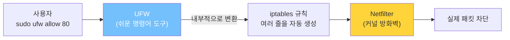
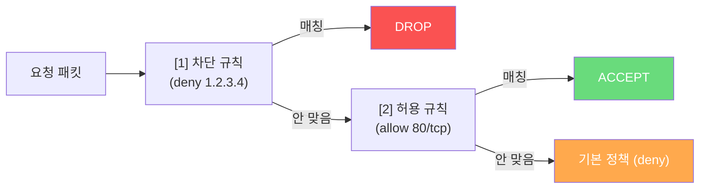
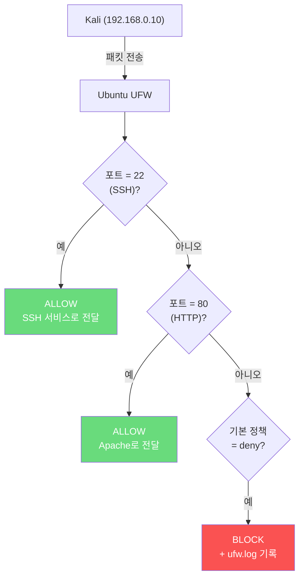
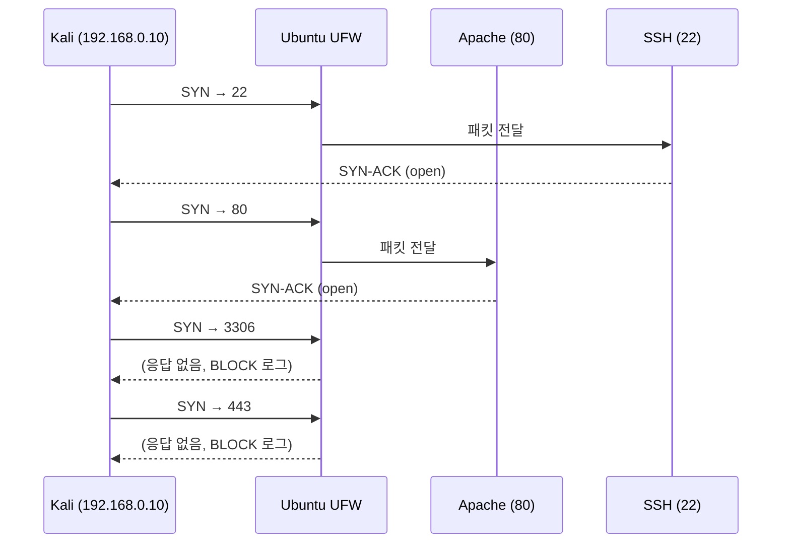
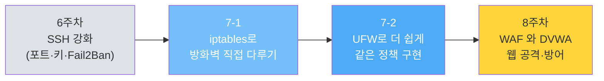

## 실습 환경

| 구분 | 운영체제 | IP 주소 | 역할 |
|------|----------|---------|------|
| 공격자 PC | Kali Linux | 192.168.0.10 | Nmap·ssh·curl·nc로 공격 시도 |
| 서버 | Ubuntu | 192.168.0.30 | UFW 방화벽으로 방어 |

7-1에서는 iptables 명령어를 직접 다뤘습니다. 강력하지만 옵션이 많아 쓰기가 까다롭죠. 7-2에서는 더 간단한 도구인 **UFW(Uncomplicated Firewall)** 를 배웁니다.

---

## 왜 UFW도 따로 배워야 할까?

iptables를 이미 배웠는데 또 다른 도구를 배우는 게 시간 낭비처럼 보일 수 있습니다. 그렇지 않은 이유를 짚고 갑니다.

### 1. 실무에서 가장 많이 마주치는 건 UFW다

Ubuntu 서버를 운영해 본 사람이라면 거의 100% UFW를 본 적이 있습니다.

| 환경 | 기본 방화벽 도구 |
|------|----------------|
| Ubuntu Desktop / Server | UFW (기본 설치) |
| AWS Ubuntu AMI | UFW (자주 활성화돼 있음) |
| 개인 서버·VPS | UFW (가장 흔함) |
| 회사 운영 서버 | iptables 또는 firewalld 또는 자동화 도구 |

iptables는 "원리를 이해하기 위한 도구" 에 가깝고, UFW는 "실제로 손을 가장 많이 대는 도구" 입니다.

### 2. 같은 일이라면 짧은 명령이 안전하다

```bash
# iptables (7-1)
sudo iptables -A INPUT -p tcp --dport 80 -j ACCEPT
sudo iptables -P INPUT DROP

# UFW (7-2)
sudo ufw allow 80/tcp
sudo ufw default deny incoming
```

명령어가 짧으면 **타이핑 실수가 적고**, 다른 사람이 읽기도 편합니다. 운영 환경에서는 한 줄짜리 실수가 큰 사고로 이어지므로, "쉬운 도구로 짧게" 가 곧 "안전" 입니다.

### 3. 그래도 iptables를 알면 디버깅이 쉽다

UFW는 결국 내부적으로 iptables 규칙을 만들어 줍니다. 평소엔 UFW만 쓰다가도, "왜 이게 안 막히지?" 같은 상황에서는 iptables 명령으로 실제로 어떤 규칙이 들어 있는지 확인해야 합니다. 7-1에서 배운 게 그래서 헛되지 않습니다.

```bash
# UFW가 만들어준 실제 iptables 규칙 들여다보기
sudo iptables -L -n -v
# 자주 디버깅에 쓰이는 명령
```

> **오늘의 학습 목표:**
> 1. 7-1과 똑같은 방어 정책을 UFW 명령어로 더 짧게 다시 만든다.
> 2. UFW만의 편의 기능(상태, 번호 삭제, 자동 영구 저장, 로깅)을 익힌다.
> 3. Kali 공격 ↔ UFW 방어 짝을 다시 한 번 직접 확인한다.
{: .prompt-info }

---

## 시작 전 확인 — 7-1에서 만든 iptables 규칙 정리하기

7-1에서 iptables 규칙을 만들고 영구 저장까지 했다면, **UFW를 시작하기 전에 iptables를 깨끗이 비우는 게 안전합니다.** 두 도구가 동시에 같은 Netfilter를 건드리면 규칙이 충돌해서 진단이 어려워집니다.

```bash
# Ubuntu에서 실행 (가급적 VM 콘솔에서 — SSH 끊김 위험 있음)
# 1. 기존 iptables 규칙 비우기 + 기본 정책을 ACCEPT로 복구
#    !! 순서 중요 !! 정책을 먼저 ACCEPT로 바꾼 다음 flush 해야
#    SSH 세션이 안 끊깁니다. 반대 순서면 ESTABLISHED 규칙이 사라지는 동안
#    DROP 정책이 살아 있어 자기 SSH가 끊김.
sudo iptables -P INPUT ACCEPT
sudo iptables -P FORWARD ACCEPT
sudo iptables -P OUTPUT ACCEPT
sudo iptables -F
sudo iptables -X
```

```bash
# 2. iptables-persistent를 깔아 뒀다면(7-1 Part 7 진행 시) 영구 저장도 비우기
#    저장 파일에 옛 규칙이 남으면 재부팅 시 또 부활하기 때문.
#    설치돼 있을 때만 실행되도록 조건 처리:
if command -v netfilter-persistent &>/dev/null; then
    sudo netfilter-persistent save
    echo "기존 영구 저장을 비어 있는 상태로 덮어썼습니다."
else
    echo "iptables-persistent 미설치 — 메모리만 비우면 끝."
fi
```

```bash
# 비어 있는지 확인
sudo iptables -L -n -v
# 모든 체인이 policy ACCEPT 이고 규칙이 0개여야 정상
```


```bash
# 서비스가 정상 실행 중인지 확인
sudo systemctl is-active ssh apache2 mysql
# 세 줄 모두 "active" 가 나와야 함
```

```bash
# Kali에서 — 방어 전 사진 (방화벽 다 풀린 상태)
nmap -p 22,80,443,3306 192.168.0.30
# 예상: 22 open, 80 open, 443 closed, 3306 closed
# 7-1 첫 스캔과 같은 모양이 나오면 정상
```

---

## Part 1. UFW란?

### 1.1 한 줄 정의

> **UFW = Uncomplicated FireWall.** 이름 그대로 "복잡하지 않은 방화벽" 입니다. 내부적으로는 iptables를 그대로 쓰지만, 사람이 외울 만한 짧은 명령어로 감싸 놓은 도구입니다.



| 비교 | iptables | UFW |
|------|----------|-----|
| 명령어 길이 | 길고 옵션 많음 | 짧고 직관적 |
| 학습 난도 | 높음 | 낮음 |
| 영구 저장 | 별도 패키지(`iptables-persistent`) 필요 | **자동 영구 저장** |
| 부팅 시 자동 적용 | 별도 설정 | **자동** |
| 세밀한 제어 | 매우 강력 | 일반적인 용도엔 충분 |

### 1.2 UFW로 같은 일을 더 짧게

7-1에서 iptables로 만든 규칙을 UFW로 다시 쓰면 길이가 확 줄어듭니다.

```bash
# iptables로 SSH(22) 허용
sudo iptables -A INPUT -p tcp --dport 22 -j ACCEPT

# UFW로 같은 규칙
sudo ufw allow 22/tcp
```

```bash
# iptables로 192.168.0.10 의 80번 차단
sudo iptables -A INPUT -s 192.168.0.10 -p tcp --dport 80 -j DROP

# UFW로 같은 규칙
sudo ufw deny from 192.168.0.10 to any port 80 proto tcp
```

> UFW가 간단해 보여도 결국 만들어 주는 건 iptables 규칙입니다. 7-1에서 배운 iptables 개념(체인, 타겟, 순서)이 UFW를 이해하는 데 그대로 도움이 됩니다.
{: .prompt-tip }

### 1.3 UFW가 자동으로 챙겨 주는 것들

iptables로 손수 짤 때 빼먹기 쉬웠던 것들을 UFW는 기본으로 챙겨 줍니다.

| 항목 | iptables (직접) | UFW |
|------|----------------|-----|
| 루프백 허용 | 직접 추가해야 함 | **자동 포함** |
| ESTABLISHED,RELATED 허용 | 직접 추가해야 함 | **자동 포함** |
| 영구 저장 | `netfilter-persistent save` 매번 | **변경 즉시 자동** |
| 부팅 시 적용 | `iptables-persistent` 별도 패키지 | **활성화하면 끝** |

> **인사이트:** UFW가 더 짧은 진짜 이유는 명령어가 짧아서가 아니라, **항상 필요한 안전 규칙을 자동으로 추가**해 주기 때문입니다. 7-1에서 ESTABLISHED 빼먹어서 SSH 끊긴 사고가 UFW에서는 잘 일어나지 않습니다.
{: .prompt-info }

---

## Part 2. UFW 설치와 기본 동작

### 2.1 설치 확인

Ubuntu 서버판에는 기본 설치돼 있습니다. 안전하게 한 번 확인합니다.

```bash
# Ubuntu에서 실행
which ufw
# 결과 예: /usr/sbin/ufw  → 이미 설치됨

# 만약 없다면
sudo apt update
sudo apt install -y ufw
```

### 2.2 현재 상태 확인

```bash
sudo ufw status
# 처음 상태 출력:
#   Status: inactive
# → 아직 켜지지 않은 상태
```

### 2.3 자세한 상태 보기 (계속 쓸 명령)

```bash
sudo ufw status verbose
# verbose : 자세히
# 기본 정책, 로깅 수준, 모든 규칙을 한눈에 보여줌

sudo ufw status numbered
# 규칙마다 번호를 매겨서 보여줌 (삭제할 때 편리)
```

> 이번 주차에서는 `status numbered` 를 자주 쓰게 될 겁니다. 외워 두면 편합니다.
{: .prompt-tip }

---

## Part 3. UFW 기본 명령어 익히기

> 아래 명령들은 **개념 익히기용** 입니다. UFW가 아직 비활성 상태에서 명령을 쳐도 등록만 되고 실제 효과는 활성화한 후에 생깁니다. 본격적인 적용은 Part 5에서 합니다.
{: .prompt-info }

### 3.1 기본 정책 (Default Policy)

UFW의 기본 정책은 방향별로 따로 설정합니다.

| 방향 | 의미 | 권장 |
|------|------|------|
| **incoming** | 외부에서 들어오는 패킷 | **deny** (기본 차단) |
| **outgoing** | 서버에서 나가는 패킷 | **allow** (기본 허용) |
| **routed**   | 서버를 통과해 다른 곳으로 가는 패킷 | **deny** (라우터로 안 쓰면 차단) |

```bash
# 권장 기본 정책 — 명령만 둘러보기 (실제 적용은 Part 5)
sudo ufw default deny incoming    # 들어오는 건 일단 다 차단
sudo ufw default allow outgoing   # 나가는 건 다 허용
sudo ufw default deny routed      # 통과 트래픽도 차단
```

> "들어오는 건 차단, 나가는 건 허용." 7-1에서 배운 **Default Deny** 가 UFW에서는 이 한 줄로 정해집니다.
{: .prompt-tip }

### 3.2 포트 허용/차단

```bash
# 포트 번호와 프로토콜 지정 — 가장 자주 쓰는 형태
sudo ufw allow 22/tcp        # SSH 허용
sudo ufw allow 80/tcp        # HTTP 허용
sudo ufw allow 443/tcp       # HTTPS 허용

# 명시적으로 차단 (default deny면 안 써도 막히지만 의도 명시 목적)
sudo ufw deny 23/tcp         # Telnet 차단
sudo ufw deny 3306/tcp       # MySQL 명시적 차단

# 포트만 적으면 TCP/UDP 모두 적용됨
sudo ufw allow 53            # DNS는 TCP/UDP 둘 다 사용
```

### 3.3 서비스 이름으로 지정

UFW는 잘 알려진 서비스 이름도 알아듣습니다.

```bash
sudo ufw allow ssh           # 22/tcp 허용 (= sudo ufw allow 22/tcp)
sudo ufw allow http          # 80/tcp 허용
sudo ufw allow https         # 443/tcp 허용
```

> SSH 포트를 표준 22에서 옮긴 환경(예: 2222)에서는 `allow ssh` 가 22번을 여는 것이라 맞지 않습니다. 그런 환경에서는 항상 `sudo ufw allow 2222/tcp` 처럼 **포트 번호로** 적습니다.
{: .prompt-warning }

### 3.4 특정 IP에서만 허용 / 차단

```bash
# 특정 IP에서만 SSH 허용 (관리자 PC만 SSH 가능 시나리오)
sudo ufw allow from 192.168.0.1 to any port 22 proto tcp
# from 192.168.0.1   : 출발지 IP가 이 주소일 때만
# to any             : 어떤 목적지든 (= 우리 서버 자신)
# port 22            : 목적지 포트 22
# proto tcp          : TCP만

# 특정 IP에서 오는 모든 트래픽 차단
sudo ufw deny from 192.168.0.10
# Kali(192.168.0.10) 가 우리 서버에 접근 시도하는 걸 전부 막음
```

**🎯 어떤 공격을 막아주는가**

| 공격 시나리오 | 효과 |
|--------------|------|
| 외부에서 SSH 무차별 대입 | 관리자 IP 외 시도는 SYN부터 차단 |
| 특정 공격자 IP가 반복 시도 | 그 IP만 골라서 깔끔히 차단 (Fail2Ban과 같은 사고방식) |

### 3.5 IP 대역(서브넷)으로 허용

```bash
# 192.168.0.0/24 = 192.168.0.0 ~ 192.168.0.255 대역
sudo ufw allow from 192.168.0.0/24 to any port 80 proto tcp
# 사내망에서만 80 허용 같은 시나리오
```

### 3.6 규칙 삭제 — 번호로 깔끔하게 지우기

규칙을 잘못 넣었거나 더 이상 필요 없을 때 지우는 방법은 두 가지입니다. 운영 중에는 **번호로 지우는 방법**이 훨씬 안전하고 자주 쓰입니다.

#### 방법 1. 규칙 내용을 그대로 다시 적기

```bash
sudo ufw delete allow 80/tcp
# 처음에 등록할 때 썼던 형태와 정확히 같아야 삭제됨
```

이 방식은 정확한 형식을 외우고 있어야 해서 실수가 잦습니다. 예를 들어 등록 시 `allow 80/tcp` 였는데 삭제 시 `delete allow 80` 으로 빠뜨리면 매칭이 안 돼서 못 지웁니다.

#### 방법 2. 번호로 지우기 (권장)

세 단계로 진행합니다 — **번호 확인 → 지울 번호 선택 → 삭제**.

**① 번호 확인**

```bash
sudo ufw status numbered
```

예상 출력 (Part 5까지 끝낸 상태):

```
Status: active

     To                         Action      From
     --                         ------      ----
[ 1] 22/tcp                     ALLOW IN    Anywhere
[ 2] 80/tcp                     ALLOW IN    Anywhere
[ 3] 3306/tcp                   DENY IN     Anywhere
[ 4] 22/tcp (v6)                ALLOW IN    Anywhere (v6)
[ 5] 80/tcp (v6)                ALLOW IN    Anywhere (v6)
[ 6] 3306/tcp (v6)              DENY IN     Anywhere (v6)
```

각 줄 앞 `[ 번호 ]` 가 그 규칙의 위치입니다.

**② 지울 번호로 삭제**

```bash
# 예: 80/tcp (v4) 규칙 — 위 출력에서 2번 — 을 삭제
sudo ufw delete 2
# 확인 프롬프트가 뜸:
#   Deleting:
#    allow 80/tcp
#   Proceed with operation (y|n)?
# y 입력
```

**③ 결과 확인**

```bash
sudo ufw status numbered
# 2번이 사라지고, 그 아래 번호들이 한 칸씩 올라온 게 보입니다.
```

> **여러 개 지울 때는 큰 번호부터.**
> 한 번 지우면 그 아래 번호가 위로 한 칸씩 당겨지기 때문입니다. 예를 들어 위 상태에서 `[2]` 와 `[3]` 을 지우려면:
>
> - ❌ `delete 2` → `delete 3` 순서로 하면, 처음 2를 지운 직후 원래 [3]이었던 게 [2]로 올라가고, 그 자리에 새로운 규칙이 와 있어서 엉뚱한 걸 지웁니다.
> - ✅ `delete 3` → `delete 2` 순서가 안전합니다. 큰 번호부터 지우면 위쪽 번호가 영향을 안 받습니다.
{: .prompt-warning }

```bash
# Apache(80)와 MySQL 차단(3306)을 둘 다 지우는 안전한 순서
sudo ufw status numbered           # 번호 다시 확인
sudo ufw delete 3                  # 큰 번호부터 (3306/tcp DENY)
sudo ufw delete 2                  # 그 다음 (80/tcp ALLOW)
```

> **인사이트:** 7-1에서 `iptables -D` 로 지울 때는 "추가할 때 쓴 옵션을 똑같이 다시 적어야" 했습니다. UFW의 번호 삭제는 그것보다 훨씬 직관적입니다 — 번호만 보고 누르면 됩니다. 운영 중에 잘못된 규칙 한 줄을 빠르게 빼야 할 때 진가가 발휘되는 기능입니다.
{: .prompt-info }

### 3.7 규칙 우선순위 — `insert` 로 위치 정하기

UFW 규칙도 7-1에서 배운 iptables처럼 **위에서 아래로 순서대로** 검사됩니다. 처음으로 일치하는 규칙이 적용되고 그 뒤는 무시됩니다. 그래서 **어느 위치에 들어가는가**가 결과를 바꾸기도 합니다.

#### 왜 위치가 중요한가 — 한 시나리오

"전 세계에서 80번을 허용하는데, 악성 IP `1.2.3.4` 만 미리 차단하고 싶다" 는 정책을 만들고 싶다고 합시다.

```bash
# 잘못된 순서로 등록한 경우
sudo ufw allow 80/tcp                # ① 모든 IP에서 80 허용
sudo ufw deny from 1.2.3.4           # ② 1.2.3.4 차단
```

상태를 보면:

```
[ 1] 80/tcp                  ALLOW IN    Anywhere
[ 2] Anywhere                DENY IN     1.2.3.4
```

이 상태에서 `1.2.3.4` 가 80번에 접속하면, **`[1]` 이 먼저 매칭되어 ALLOW** 됩니다. `[2]` 는 검사되지 않습니다. 차단 효과가 없습니다.

#### 해결 — `ufw insert` 로 원하는 위치에 끼워 넣기

7-1 § 3.3 에서 본 원칙을 다시 떠올립니다:

> **"관리자 IP는 SSH 허용 → 그 외 SSH 차단" 순서로 써야 합니다. 반대로 쓰면 첫 규칙이 모든 SSH를 막아 버려서 관리자도 막힙니다.**

같은 원칙을 UFW에서도 적용해야 합니다. 차단 규칙이 더 일반적인 허용 규칙보다 **앞**에 있어야 합니다.

```bash
# 기존 잘못된 [2] 번 규칙 삭제
sudo ufw delete 2

# 차단 규칙을 [1] 번 자리에 끼워 넣기
sudo ufw insert 1 deny from 1.2.3.4
# insert N : N번 위치에 새 규칙을 삽입
#            기존 [1] 이었던 규칙은 [2] 로 밀려남
```

상태 확인:

```bash
sudo ufw status numbered
```

```
[ 1] Anywhere                DENY IN     1.2.3.4
[ 2] 80/tcp                  ALLOW IN    Anywhere
```

이제 `1.2.3.4` 가 80번에 접속하면 `[1]` 이 먼저 매칭되어 DENY 됩니다. 다른 IP는 `[1]` 에 안 맞아서 `[2]` 까지 가서 ALLOW. 의도대로 동작합니다.

#### 자주 쓰는 패턴

| 패턴 | 명령 | 의미 |
|------|------|------|
| 특정 IP만 허용, 나머지는 막기 | `insert 1 allow from 관리자IP` 후 일반 deny | 관리자 IP를 가장 먼저 허용 |
| 악성 IP 우선 차단 | `insert 1 deny from 공격자IP` | 일반 허용 규칙보다 앞 |
| 사내망만 SSH 허용 | `insert 1 allow from 사내대역 to any port 22` 후 `deny 22` | 좁은 허용 → 넓은 차단 |

#### 인사이트 — UFW의 한계와 보완



> **인사이트:** UFW는 단순한 도구라 `insert` 로 직접 위치를 지정하는 것 외에 더 복잡한 우선순위 모델은 없습니다. 진짜 복잡한 우선순위(예: 시간대별 규칙, 트래픽 종류별 우선순위)가 필요하면 7-1에서 배운 iptables를 직접 쓰거나, 차후 배울 nftables 같은 도구로 옮겨갑니다. **"단순한 도구로 충분한 경우 단순한 게 최선"** 이라는 게 UFW의 철학입니다.
{: .prompt-info }

#### 실전 팁 — `insert` 후 항상 확인

```bash
# 끼워 넣은 후엔 반드시 status numbered 로 정확한 순서 확인
sudo ufw insert 1 deny from 1.2.3.4
sudo ufw status numbered
# [1] 자리에 새 규칙이 들어간 것을 눈으로 확인
```

규칙 번호가 의도한 위치에 안 들어갔으면, 삭제 후 다시 `insert` 하면 됩니다.

### 3.8 전체 초기화

```bash
sudo ufw reset
# UFW 비활성화 + 모든 규칙 삭제 + 정책 초기화
# 다시 처음부터 시작하고 싶을 때
```

---

## Part 4. 공격 전 사진 — Kali에서 다시 한 번 스캔

본격 적용 전에 다시 한 번 "현재 모습"을 Kali에서 확인합니다. **시작 전 확인** 단계에서 iptables를 다 비웠으니 결과는 다음과 비슷할 겁니다.

```bash
# Kali에서 실행
nmap -p 22,80,443,3306 192.168.0.30
```

예상 출력 (방화벽 적용 전):

```
PORT     STATE  SERVICE
22/tcp   open   ssh
80/tcp   open   http
443/tcp  closed https
3306/tcp closed mysql
```

이제 UFW로 명시적인 방어 정책을 만들고 다시 비교해 봅니다.

---

## Part 5. UFW 따라하기 — 단계별 적용

여기서부터는 진짜 적용입니다. **순서가 매우 중요합니다.** SSH 허용 규칙을 먼저 등록한 다음 UFW를 활성화해야 자기 SSH가 끊기지 않습니다.

### 5.1 첫 규칙: SSH(22) 허용 (활성화 전에 반드시!)

```bash
# Ubuntu에서 실행
sudo ufw allow 22/tcp
# 이 명령은 UFW가 비활성 상태에서도 등록됩니다.
# 활성화되는 순간부터 효력 발생.
```

> **왜 이걸 가장 먼저 하나?** UFW를 활성화하는 순간 기본 정책 deny가 바로 적용됩니다. 이때 SSH 허용 규칙이 없으면 자기 SSH가 즉시 끊깁니다. "먼저 허용 → 그 다음 활성화" 순서가 절대 원칙입니다.
{: .prompt-danger }

### 5.2 기본 정책 설정

```bash
sudo ufw default deny incoming
sudo ufw default allow outgoing
```

### 5.3 UFW 활성화

```bash
sudo ufw enable
# "Command may disrupt existing ssh connections. Proceed with operation (y|n)?"
# y 입력
# 결과: "Firewall is active and enabled on system startup"
```

마지막 메시지가 핵심입니다 — **"enabled on system startup"** 즉, 재부팅해도 자동으로 켜집니다. iptables처럼 별도 영구 저장이 필요 없습니다.

### 5.4 상태 확인

```bash
sudo ufw status verbose
```

예상 출력:

```
Status: active
Logging: on (low)
Default: deny (incoming), allow (outgoing), disabled (routed)
New profiles: skip

To                         Action      From
--                         ------      ----
22/tcp                     ALLOW IN    Anywhere
22/tcp (v6)                ALLOW IN    Anywhere (v6)
```

> `Default: deny (incoming)` — 들어오는 건 기본 차단. SSH(22)만 명시적 허용. **현재 상태에서 80(HTTP)도 막힌 상태입니다.** 이어서 추가합니다.
{: .prompt-info }

### 5.5 Apache(80) 허용

```bash
sudo ufw allow 80/tcp
```

```bash
# Kali에서 확인
curl -I http://192.168.0.30/
# HTTP/1.1 200 OK 가 보이면 정상 허용 상태
```

### 5.6 MySQL(3306) 명시적 차단 (선택)

기본 정책이 deny라 어차피 막혀 있지만, 의도를 분명히 적어 두기 위해 명시적으로 차단 규칙을 넣어 두는 운영 스타일도 흔합니다.

```bash
sudo ufw deny 3306/tcp
```

> **왜 이미 막힌 걸 또 차단?** 다른 운영자가 규칙 목록을 봤을 때 "여긴 의도적으로 막고 있구나" 하고 한눈에 알 수 있게 하기 위해서입니다. 또 누군가 실수로 default 정책을 풀어도 이 규칙이 한 번 더 막아 줍니다 (Defense in Depth).
{: .prompt-tip }

### 5.7 (선택) 특정 IP만 SSH 허용 시나리오

만약 "관리자 PC(예: 192.168.0.1)에서만 SSH 가능, 나머지 IP는 차단" 정책을 만들고 싶다면:

```bash
# 1) 기존 SSH 허용 규칙 삭제
sudo ufw delete allow 22/tcp

# 2) 관리자 IP만 허용하는 규칙 추가
sudo ufw allow from 192.168.0.1 to any port 22 proto tcp
```

> 이 시나리오를 실습 환경에 그대로 적용하면 본인 PC가 들어가지 않은 한 SSH가 막혀 버립니다. **여기서는 "이렇게 쓸 수 있다" 정도만 보고 실제로는 5.5 상태에서 멈춥니다.**
{: .prompt-warning }

### 5.8 최종 상태 확인

```bash
sudo ufw status numbered
```

예상 출력:

```
Status: active

     To                         Action      From
     --                         ------      ----
[ 1] 22/tcp                     ALLOW IN    Anywhere
[ 2] 80/tcp                     ALLOW IN    Anywhere
[ 3] 3306/tcp                   DENY IN     Anywhere
[ 4] 22/tcp (v6)                ALLOW IN    Anywhere (v6)
[ 5] 80/tcp (v6)                ALLOW IN    Anywhere (v6)
[ 6] 3306/tcp (v6)              DENY IN     Anywhere (v6)
```

> 환경(UFW 버전·IPv6 사용 여부)에 따라 v4/v6가 짝지어 `[1] 22/tcp`, `[2] 22/tcp (v6)` 처럼 번갈아 나오기도 합니다. 번호 자체는 환경마다 다를 수 있으니, 삭제할 때는 항상 `status numbered` 로 다시 확인 후 번호를 쓰세요.
{: .prompt-tip }

7-1의 iptables 결과와 같은 의미를 가지는 정책이 훨씬 짧은 명령으로 만들어졌습니다.

---

## Part 6. Kali에서 방어 효과 검증 — 공격 ↔ 방어 매핑

이제 UFW가 켜졌으니 Kali에서 다시 공격을 시도하며 결과를 비교합니다. 7-1과 동일한 검증입니다.

### 6.1 Nmap 포트 스캔 — 정찰 효과 비교

```bash
# Kali에서 실행
nmap -p 22,80,443,3306 192.168.0.30
```

예상 출력:

```
PORT     STATE    SERVICE
22/tcp   open     ssh
80/tcp   open     http
443/tcp  filtered https
3306/tcp filtered mysql
```

방화벽 적용 전후 비교:

| 포트 | UFW 켜기 전 | UFW 켜기 후 | 의미 |
|------|------------|------------|------|
| 22   | open       | open       | 의도된 노출 |
| 80   | open       | open       | 의도된 노출 |
| 443  | closed     | filtered   | 더 모호해짐 → 정찰 어려워짐 |
| 3306 | closed     | filtered   | DB 노출 위험 차단 |

`filtered` 가 늘어난 게 핵심입니다. 공격자가 "포트가 닫혔는지 막혔는지"를 구분하기 어려워지면, 같은 시간에 더 쉬운 표적으로 옮겨갑니다.

### 6.2 SSH 로그인 시도 — 허용된 경로

```bash
# Kali에서 실행
ssh 사용자명@192.168.0.30
# 정상적으로 로그인 프롬프트가 떠야 함
```

### 6.3 웹 페이지 요청 — 허용된 경로

```bash
# Kali에서 실행
curl -I http://192.168.0.30/
# HTTP/1.1 200 OK
```

### 6.4 MySQL 직접 접속 시도 — 차단된 경로

```bash
# Kali에서 실행
nc -v -w 5 192.168.0.30 3306
# nc       : netcat (TCP 연결 테스트)
# -v       : 자세히
# -w 5     : 5초 타임아웃
# 결과: Connection timed out
```

```bash
# 또는 mysql 클라이언트가 있다면
mysql -h 192.168.0.30 -P 3306 -u root -p
# 결과: ERROR ... Can't connect (timeout)
```

### 6.5 종합 — 공격 ↔ 방어 매핑

| 공격자가 시도한 것 | UFW의 처리 | 결과 |
|------------------|-----------|------|
| `nmap -p 22 192.168.0.30` | 22/tcp ALLOW 일치 | open으로 보임 (의도) |
| `nmap -p 80 192.168.0.30` | 80/tcp ALLOW 일치 | open으로 보임 (의도) |
| `nmap -p 443 192.168.0.30` | 어떤 ALLOW에도 안 맞음 → 기본 deny | filtered (정찰 차단) |
| `nmap -p 3306 192.168.0.30` | 3306/tcp DENY 일치 | filtered (DB 노출 차단) |
| 무차별 SSH 비밀번호 시도 | 22는 허용 → **방화벽이 못 막는 영역** | SSH 키·Fail2Ban이 막아야 함 |
| 외부에서 MySQL 데이터 덤프 시도 | TCP 연결 자체가 차단 | 접근 불가 |

> **인사이트 — 방화벽의 한계가 다음 학습 주제다.**
> 위 표 5번째 줄을 보면, "SSH 무차별 대입은 방화벽이 못 막는다" 가 명확합니다. 22번을 열어 둔 이상 패킷은 통과해야 하고, 그 안에서 어떤 비밀번호를 시도하는지는 방화벽이 모르기 때문입니다. 그래서 SSH 보안은 6주차에서 배운 **키 인증·Fail2Ban** 이 함께 가야 합니다.
> 마찬가지로 80번을 열어 둔 이상 SQL Injection 같은 웹 공격은 방화벽이 못 막습니다. 이게 8주차에서 배울 **WAF(Web Application Firewall)** 의 영역입니다.
{: .prompt-info }

---

## Part 7. UFW 로깅 — 누가 우리를 두드렸을까

UFW는 차단된 시도를 로그로 남길 수 있습니다. 방어자 시점에서 "공격을 받고 있다" 는 사실을 인지하는 가장 기본적인 단서입니다.

### 7.1 로깅 켜기

```bash
# Ubuntu에서 실행
sudo ufw logging on
# 기본은 low 수준
# 더 자세히 보려면:
sudo ufw logging medium
# 또는
sudo ufw logging high
```

### 7.2 공격 패킷 발생시키기 (Kali에서)

로그를 보기 전에 일부러 차단되는 패킷을 만들어 둡니다.

```bash
# Kali에서 실행
nmap -p 3306 192.168.0.30
# 차단되는 시도를 의도적으로 발생시킴
```

### 7.3 로그 보기 (Ubuntu)

```bash
# UFW 차단 로그 확인
sudo grep "UFW BLOCK" /var/log/ufw.log | tail -20
# tail -20 : 마지막 20줄만

# 또는 전체 시스템 로그에서
sudo grep "UFW" /var/log/syslog | tail -20
```

로그 한 줄 예시:

```
... kernel: [UFW BLOCK] IN=ens33 OUT= MAC=... SRC=192.168.0.10 DST=192.168.0.30
   LEN=44 ... PROTO=TCP SPT=53122 DPT=3306 WINDOW=1024 ...
```

| 항목 | 의미 |
|------|------|
| `IN=ens33` | 들어온 인터페이스 이름 |
| `SRC=192.168.0.10` | 출발지 IP (Kali) |
| `DST=192.168.0.30` | 목적지 IP (Ubuntu) |
| `PROTO=TCP` | 프로토콜 |
| `SPT=53122` | 출발지 포트 |
| `DPT=3306` | 목적지 포트 |

> **인사이트:** 로그 한 줄이 곧 **"누가, 언제, 어디로, 무엇으로" 우리를 두드렸는가** 의 증거입니다. 이걸 모아서 분석하면 패턴이 보입니다 — 한 IP가 1초에 100번 SSH(22)를 시도하고 있다면 무차별 대입 중이라는 뜻이고, 여러 IP가 3306·6379·27017 같은 DB 포트를 차례로 두드리면 봇넷의 DB 사냥 중이라는 뜻입니다. 로그 분석이 자동화되면 그게 IDS(Intrusion Detection System) 입니다.
{: .prompt-info }

### 7.4 로깅 수준 선택

`high` 수준은 정상 트래픽도 다 기록해 디스크가 빠르게 차므로, 평소엔 `low` 권장. 보안 분석 중에만 `medium` 이상으로 올립니다.

```bash
sudo ufw logging low
```

---

## Part 8. UFW 동작 한눈에 보기

지금까지 만든 정책의 패킷 흐름을 정리하면 이렇습니다.





---

## Part 9. 자주 만나는 실수 (트러블슈팅)

### 실수 1. UFW를 켜자마자 SSH가 끊김

원인: 활성화 **전에** SSH 허용 규칙을 안 넣어서. 기본 정책이 deny incoming이므로 SSH도 막힙니다.

**예방:** 활성화 전에 반드시:

```bash
sudo ufw allow 22/tcp
sudo ufw enable
```

**복구:** 가상머신 콘솔(VM 화면)에서 직접 로그인 후

```bash
sudo ufw disable          # UFW 끄기
sudo ufw allow 22/tcp     # SSH 허용 등록
sudo ufw enable           # 다시 켜기
```

### 실수 2. iptables와 UFW를 섞어 씀

7-1에서 만든 iptables 규칙이 남아 있고, 그 위에 UFW를 켜면 규칙이 충돌하거나 의도치 않은 결과가 나옵니다.

**해결:** 시작 전에 iptables를 깨끗이 비웁니다(이 글 맨 위 "시작 전 확인" 참고).

### 실수 3. 22 vs 2222 헷갈림

`sudo ufw allow ssh` 는 22번을 여는 명령이라, SSH를 다른 포트로 옮긴 환경에는 맞지 않습니다.

**해결:** 항상 `sudo ufw allow 포트번호/tcp` 처럼 **포트 번호로 명시적**으로 적습니다.

### 실수 4. 규칙을 지웠는데 그대로 보임

`sudo ufw delete` 는 정확히 등록된 형태와 일치해야 삭제됩니다. 형식이 다르면(예: `tcp` 빠뜨림) 못 지웁니다.

**해결:** `sudo ufw status numbered` 로 번호를 보고 번호로 지우는 게 가장 확실합니다.

### 실수 5. 재부팅하니 UFW가 꺼져 있음

UFW는 활성화하면 부팅 시 자동 시작이 등록되지만, 어떤 이유로 꺼져 있다면:

```bash
sudo systemctl enable ufw
sudo systemctl status ufw
```

### 실수 6. 어떤 규칙 때문에 막히는지 모르겠다

UFW 출력만 봐서는 디버깅이 안 될 때, 7-1에서 배운 iptables 명령으로 실제 규칙을 들여다봅니다.

```bash
# UFW가 만든 실제 iptables 규칙 보기
sudo iptables -L -n -v --line-numbers
# pkts 열을 보면 어느 규칙에 패킷이 걸리고 있는지 보임
```

> **인사이트:** UFW의 디버깅은 결국 iptables 지식으로 풀립니다. 7-1에서 배운 게 여기서 빛을 발합니다.
{: .prompt-tip }

---

## Part 10. 실무 인사이트

### 10.1 클라우드 시대 — 보안그룹과 OS 방화벽의 두 겹

AWS·GCP·Azure 등에서는 방화벽이 **두 겹**으로 동작합니다.

| 위치 | 도구 | 차단 단계 |
|------|------|----------|
| 클라우드 인프라 | 보안 그룹(Security Group) | 인스턴스에 패킷 도달 전 |
| 인스턴스 OS | UFW / iptables (오늘 배움) | OS 안에서 다시 검사 |

> **운영 원칙:** 둘 다 **최소 권한**으로. "보안 그룹 다 열고 OS에서 막자" 또는 그 반대는 흔하지만 위험합니다. 한쪽만 의존하면 사고 한 번이면 끝납니다.
{: .prompt-tip }

### 10.2 방화벽이 못 막는 영역 — 다음 단계 도구들

| 공격 종류 | 방화벽으로 막힘? | 진짜 막아주는 도구 |
|-----------|----------------|------------------|
| 외부에서 닫혀야 할 포트 접근 | ✅ 막힘 | 방화벽 (오늘) |
| 허용된 SSH로 무차별 대입 | ❌ | Fail2Ban, SSH 키 인증 (6주차) |
| 허용된 HTTP/HTTPS로 SQL Injection | ❌ | WAF (8주차 예정) |
| 정상 사용자처럼 로그인한 후 내부 활동 | ❌ | EDR, 로그 분석, 침입 탐지 |
| 사회공학(피싱) 으로 자격 탈취 | ❌ | 사용자 교육, 2FA |

> **인사이트:** 방화벽은 **출입구 통제** 까지의 도구입니다. 안에서 일어나는 일은 다른 도구가 책임집니다. 한 가지 도구가 모든 걸 해결하지 않는다는 게 보안의 기본 진리입니다.
{: .prompt-info }

### 10.3 자주 쓰는 운영 패턴

| 패턴 | UFW로 표현 |
|------|----------|
| 일반 웹 서버 | `default deny incoming` + `allow 22/tcp` + `allow 80,443/tcp` |
| 관리 포트는 사내망만 | `allow from 회사대역 to any port 22` |
| DB 서버 (앱서버 IP만 허용) | `default deny incoming` + `allow from 앱서버IP to any port 3306` |
| 개발용 임시 오픈 | (지양) `allow 8080/tcp` 추가 후 **반드시 일시적으로만**, 끝나면 즉시 삭제 |

---

## Part 11. iptables vs UFW 한 줄 요약

| 항목 | iptables | UFW |
|------|----------|-----|
| 명령어 | 길고 옵션 많음 | 짧고 직관적 |
| 같은 규칙 작성 | `iptables -A INPUT -p tcp --dport 80 -j ACCEPT` | `ufw allow 80/tcp` |
| 영구 저장 | `iptables-persistent` 설치 후 `netfilter-persistent save` | **자동 영구 저장** |
| 부팅 시 자동 적용 | 별도 설정 필요 | **자동** |
| 안전 규칙(loopback, ESTABLISHED) | 직접 추가해야 함 | **자동 포함** |
| 적합한 상황 | 복잡한 규칙·고급 NAT | 일반 서버 운영, 학습, 빠른 적용 |
| 학습 가치 | 방화벽 동작 원리 이해 | 실무 빈도 1위 |

> 학습 단계에서는 iptables로 원리를 이해하고, 운영에서는 UFW로 빠르게 구성하는 조합을 흔히 씁니다. **두 도구는 경쟁자가 아니라 같은 일의 두 추상화 단계**입니다.
{: .prompt-tip }

---

## Part 12. 셀프체크

### 객관식 (각 1점)

**Q1.** UFW에서 들어오는 모든 트래픽을 기본 차단하는 명령어는?

① `sudo ufw deny all`
② `sudo ufw block incoming`
③ `sudo ufw default deny incoming`
④ `sudo ufw disable`

---

**Q2.** UFW가 내부적으로 사용하는 도구로 옳은 것은?

① firewalld
② iptables / Netfilter
③ Wireshark
④ tcpdump

---

**Q3.** UFW 활성화 직전에 **가장 먼저** 등록해야 하는 규칙은?

① `sudo ufw deny 3306/tcp`
② `sudo ufw allow 22/tcp` (관리자 SSH)
③ `sudo ufw default deny incoming`
④ `sudo ufw allow 80/tcp`

---

**Q4.** 다음 중 UFW 규칙을 번호로 안전하게 삭제하기 위해 먼저 실행해야 하는 명령은?

① `sudo ufw show`
② `sudo ufw status numbered`
③ `sudo ufw list`
④ `sudo ufw print`

---

**Q5.** Nmap 결과가 `closed`에서 `filtered`로 바뀐 게 보안적으로 의미 있는 이유로 가장 적절한 것은?

① 방화벽이 패킷을 더 빠르게 처리하기 때문
② 공격자가 포트 상태를 확정할 수 없어 정찰 비용이 올라가기 때문
③ 방화벽이 자동으로 IP를 차단하기 때문
④ TCP 연결이 더 안정적으로 되기 때문

---

**Q6.** 방화벽이 **막아주지 못하는** 공격은?

① 외부에서 MySQL(3306) 직접 접속 시도
② 닫힌 관리 페이지(8080) 정찰
③ 허용된 80번 포트를 통한 SQL Injection
④ ICMP 호스트 발견(`nmap -sn`)

---

### 단답형 (각 2점)

**Q7.** UFW를 완전히 초기 상태로 되돌리는 명령어는?

→ `__________`

---

**Q8.** UFW가 패킷을 차단했을 때 로그가 기록되는 기본 파일 이름은?

→ `__________`

---

**Q9.** Nmap 결과에서 포트가 `closed`로 나올 때와 `filtered`로 나올 때의 차이를 한 문장으로 설명하시오.

---

**Q10.** UFW에서 192.168.0.0/24 대역의 PC만 80번 포트에 접속할 수 있도록 허용하는 명령어를 작성하시오.

---

**Q11.** 7-1에서 배운 iptables 규칙 `sudo iptables -A INPUT -p tcp --dport 443 -j ACCEPT` 와 같은 효과를 내는 UFW 명령어를 작성하시오.

---

**Q12.** "방화벽만 잘 설정하면 서버는 안전하다" 는 주장이 왜 틀린지, 다층 방어(Defense in Depth) 관점에서 1~2문장으로 설명하시오.

---

### 정답

| 번호 | 정답 | 해설 |
|------|------|------|
| Q1 | ③ | `default deny incoming` 이 기본 차단 정책 |
| Q2 | ② | UFW는 iptables(=Netfilter)를 감싸는 도구 |
| Q3 | ② | SSH가 막히면 원격 관리 자체가 안 되므로 가장 먼저 |
| Q4 | ② | 번호로 지우려면 `status numbered` 로 번호부터 확인 |
| Q5 | ② | filtered는 정보 노출이 줄어 정찰 비용을 올림 |
| Q6 | ③ | 80은 허용된 정상 트래픽이므로 그 안의 페이로드는 방화벽이 못 봄 → WAF 영역 |
| Q7 | `sudo ufw reset` | UFW 비활성 + 모든 규칙 삭제 + 정책 초기화 |
| Q8 | `/var/log/ufw.log` | (또는 `/var/log/syslog` 에서도 확인 가능) |
| Q9 | closed: 포트는 있으나 그 포트에 서비스 없음. filtered: 방화벽이 막고 있어 상태를 알 수 없음 |
| Q10 | `sudo ufw allow from 192.168.0.0/24 to any port 80 proto tcp` |
| Q11 | `sudo ufw allow 443/tcp` |
| Q12 | 방화벽은 출입구만 통제하므로 허용된 포트 안에서 일어나는 공격(SSH 무차별 대입, 웹 취약점 등)은 못 막는다. 인증·WAF·로그 분석 같은 다른 계층의 방어가 함께 있어야 한다 |

---

## 7주차 정리



**핵심 교훈 다섯 가지**

1. **Default Deny가 기본**. 일단 다 막고, 꼭 필요한 포트만 명시적으로 허용한다.
2. **순서가 결과를 결정한다**. SSH 허용 규칙을 default deny보다 먼저 등록해야 자기 자신이 안 막힌다.
3. **iptables와 UFW는 같은 일을 한다**. UFW가 더 짧고 안전한 명령어로 감싼 도구일 뿐이다.
4. **방화벽은 다층 방어의 한 겹이다**. 막아주는 공격과 못 막는 공격이 분명하다.
5. **공격 ↔ 방어 짝으로 사고하라**. 모든 방화벽 규칙은 "이게 어떤 공격을 막는가" 라는 질문에 답할 수 있어야 한다.

**다음 시간 예고:** 8주차에서는 포트 단위 방화벽이 못 막는 영역, 즉 **허용된 80/443 안에서 일어나는 웹 공격**을 다룹니다. 일부러 취약하게 만든 웹 앱 **DVWA** 를 대상으로 Kali에서 SQL Injection·XSS 등을 시도하고, **WAF(Web Application Firewall)** 로 방어하는 실습을 진행합니다.
