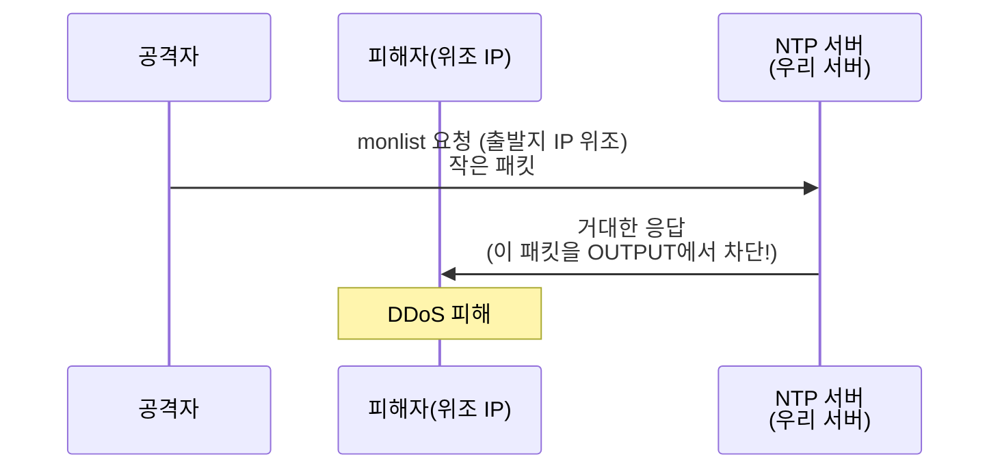

## 보안기사 관련 문제


> **출제 트렌드 분석 (정보보안기사 실기 기출문제집 기준):**
>
> - 2024년 11월(03회): 작업형에 `iptables -A OUTPUT ... --sport 123 ... -j DROP` 직접 작성 문제
> - 2025년 4월(02회): 작업형에 `iptables -P INPUT DROP` + `-A INPUT -s [IP] -j ACCEPT` 직접 작성 문제
> - 단답형에서는 **방화벽 5종 분류**(Screening Router / Bastion Host / Dual-Homed / Screened Host / Screened Subnet)가 반복 출제
>
> 두 시험 연속 iptables 직접 출제 → 다음 시험에서도 출제 가능성 매우 높음.
{: .prompt-info }

---

## Part 1. 단답형 — 방화벽 정의와 구조

### 문제 1-1. 방화벽의 정의

**📋 문제 시나리오** *(연습문제 01회 09번 응용)*

> 다음 특징을 가진 보안 장비는 무엇인가?
> - 인증되지 않은 데이터가 네트워크로 유입되는 것을 방지
> - 어떤 종류의 데이터가 어떻게 외부로 송신되는지 제한
> - 특징: 접근 제어, 트래픽 암호화, 기록 및 감사 추적, NAT

**✅ 정답**

```
방화벽 (Firewall)
```

**🔍 풀이 핵심**

이 문제의 키워드는 **"NAT"** 입니다. NAT은 라우터·방화벽의 핵심 기능 중 하나로, 다른 보안장비(IDS, IPS, ESM)에는 없는 특징입니다. 그래서 NAT이 보이면 거의 항상 답은 방화벽.

| 키워드 | 매칭 장비 |
|--------|----------|
| 침입 **탐지**·실시간 모니터링 | IDS |
| 침입 **차단**·능동적 대응 | IPS |
| 여러 보안장비 **통합 관리** | ESM |
| **접근 제어 + NAT + 트래픽 통제** | **방화벽** |

---

### 문제 1-2. 방화벽 5종 구조

**📋 문제 시나리오** *(연습문제 01회 09번 해설 영역)*

> 방화벽은 구성 방식에 따라 5가지로 분류된다. 각 유형의 이름과 특징을 쓰시오.

**✅ 정답표**

| 종류                   | 한 줄 설명                                       |
| -------------------- | -------------------------------------------- |
| **Screening Router** | IP·TCP·UDP 헤더 정보만 보고 Permit/Drop 결정. 가장 단순.  |
| **Bastion Host**     | 내부망 전체를 보호하는 견고한 호스트. 라우터 뒤에 위치.             |
| **Dual-Homed Host**  | NIC 2개 보유, 한쪽은 내부망·다른쪽은 외부망. 라우팅 비활성화 + 프록시. |
| **Screened Host**    | 패킷 필터링 라우터 + 배스천 호스트 조합.                     |
| **Screened Subnet**  | Screened Host 보완. 내·외부 사이에 **DMZ** 두는 구조.    |

**🔍 풀이 핵심**


**암기 요령:** "라우터(Screening) → 호스트(Bastion) → NIC 2개(Dual-Homed) → 둘 합침(Screened Host) → DMZ 추가(Screened Subnet)" 순서로 점점 강해진다고 외웁니다.

> **시험에서 자주 묻는 부분:** Screened Subnet 구조에서 DMZ가 무엇이고 왜 두는지. **답:** "외부와 내부 사이에 두는 경계 네트워크. 외부 공격이 내부망까지 직접 도달하지 못하게 한 단계 더 막는 영역."
{: .prompt-tip }

---

## Part 2. 단답형 — 방화벽 인접 보안장비

방화벽 단독으로는 시험에 자주 나오지 않고, **IDS/IPS/ESM과 묶어** 출제됩니다. 차이를 명확히 구분할 수 있어야 합니다.

### 문제 2-1. 능동적 침입 방지 시스템

**📋 문제 시나리오** *(연습문제 01회 02번)*

> 능동적 침입 방지, 트래픽 조절, 효율적 보안 정책 수립이 가능한 시스템은?

**✅ 정답:** `IPS (Intrusion Prevention System)`

### 문제 2-2. 침입 탐지 시스템

**📋 문제 시나리오** *(연습문제 03회 13번)*

> 침입의 패턴 데이터베이스와 지능형 엔진을 사용하며, 네트워크나 시스템 사용을 실시간 모니터링하고 침입을 탐지하는 보안 시스템.

**✅ 정답:** `IDS (Intrusion Detection System)`

### 문제 2-3. 통합 보안 관리

**📋 문제 시나리오** *(연습문제 01회 08번)*

> 방화벽, 침입탐지시스템, 가상사설통신망 등 여러 보안 장비에서 발생하는 정보를 통합하여 한 곳에서 관리·대응하는 보안 관리 시스템.

**✅ 정답:** `ESM (Enterprise Security Management)`

### 🎯 IDS vs IPS vs 방화벽 — 시험 단골 비교표

| 구분 | 방화벽 | IDS | IPS |
|------|--------|-----|-----|
| 역할 | 출입구 차단 | 침입 **탐지** | 침입 **차단** |
| 동작 | 사전 정책 기반 | 사후 분석 | 실시간 능동 대응 |
| 검사 대상 | IP·포트·프로토콜 | 패킷 패턴·시그니처 | 패킷 패턴·시그니처 |
| 결과 | Allow / Deny | 알림(로그) | Allow / Drop / Reset |
| 비유 | 문지기 | CCTV | 자동 셔터 |

> **혼동 주의:** IDS는 "탐지만", IPS는 "탐지 + 차단". 방화벽은 "정책 기반 차단(처음부터 정해진 룰만)". 셋이 합쳐져야 비로소 다층 방어가 됨 — 7-1 § 1.2 에서 다룬 내용 그대로입니다.
{: .prompt-warning }

---

## Part 3. 단답형 — NAT과 Land Attack

### 문제 3-1. NAT의 정의

**📋 문제 시나리오** *(연습문제 03회 15번)*

> IP 주소 고갈 문제를 줄이기 위한 방법으로, ( ) 사용 시 외부에서 내부망에 접근할 수 없기 때문에 보안성이 뛰어나며 회선 이동이 용이하다.

**✅ 정답:** `NAT (Network Address Translation)`

**🔍 풀이 핵심**

NAT의 두 가지 효과:
1. **IP 주소 절약**: 내부에서는 사설 IP, 외부에서는 공인 IP만 사용
2. **보안 효과**: 외부에서 내부망 IP를 직접 못 봄 — 방화벽 효과의 일부

7-1 § 0.5 에서 본 MySQL의 `127.0.0.1` 바인딩과 동일한 원리: **외부에서 안 보이게 만든다.**

### 문제 3-2. Land Attack 대응

**📋 문제 시나리오** *(연습문제 03회 17번)*

> 패킷 전송 시 출발지 IP와 목적지 IP를 똑같이 만들어서 공격 대상에게 보내는 공격 기법.

**✅ 정답:** `Land Attack`

**🛡️ 방어 방법 (7-1 § 4.4 응용)**

```bash
# 출발지 IP가 우리 서버 자신(192.168.0.30)인 패킷은 외부에서 들어올 수 없음
# 만약 외부에서 그런 패킷이 오면 위조된 것 → DROP
sudo iptables -A INPUT -s 192.168.0.30 -j DROP
```

> 이게 7-1 § 4.4 "출발지 IP 기준 차단" 의 실전 응용입니다. 강의에서 본 패턴이 시험에서 그대로 나옵니다.
{: .prompt-info }

---

## Part 4. 작업형 — iptables 직접 작성 (⭐ 최우선)

이 부분이 7-3의 핵심입니다. **2024년 11월·2025년 4월 두 시험 연속**으로 iptables 명령을 직접 작성하는 문제가 출제됐습니다.

### 문제 4-1. ⭐⭐⭐ telnet 서비스 차단 시나리오

**📋 문제 시나리오** *(2025년 4월 기출, 02회 18번 응용)*

운영 중인 리눅스 서버에서 다음 두 가지 위험이 확인되었습니다.

```
(가) telnet 190.10.10.10 으로 접속 시 응답
     → Debian Linux 10
(나) telnet 190.10.10.10 21 (FTP 포트) 으로 접속 시 응답
     → vsftpd 3.0.5
```

다음을 답하시오:
1. (가)와 (나)에서 확인된 위험은?
2. (가)에 대한 조치방안 (방화벽 활용 포함)
3. (나)에 대한 조치방안

---

**🔍 위험 분석 (1번)**

- **버전 정보 노출** — telnet 응답·FTP 배너에서 `Debian Linux 10`, `vsftpd 3.0.5` 같은 버전이 그대로 보임
- 공격자는 이 버전 정보로 **알려진 CVE 취약점**을 검색해 정확한 익스플로잇을 사용 가능
- 특히 EOS(End Of Service) 된 버전이면 패치 자체가 불가능해 더 위험

---

**🛡️ 조치방안 (2번) — telnet의 경우**

telnet은 **평문 전송**이므로 운영 서버에서 사용하면 안 됩니다. 3단계로 조치:

**(a) telnet 서비스 자체 중지**

```bash
# 23번 포트 사용 여부 확인
sudo netstat -antp | grep :23
# 또는 modern Linux:
sudo ss -tlnp | grep :23

# 서비스 중지
sudo systemctl stop telnet.socket
sudo systemctl disable telnet.socket
```

**(b) 방화벽(iptables)에서 IP 화이트리스트로 SSH만 허용**

이게 시험에서 직접 묻는 부분입니다. 7-1 § 5에서 배운 Default Deny 정책 그대로:

```bash
# ⭐ 시험 정답 핵심 — 외워둘 것!
sudo iptables -P INPUT DROP                              # 기본 정책: 모두 차단
sudo iptables -A INPUT -s 10.10.10.10 -j ACCEPT          # 관리자 IP만 허용
```

**(c) TCP Wrapper 활용 (더블 방어)**

```bash
# /etc/hosts.allow
sshd : 10.10.10.10

# /etc/hosts.deny
ALL : ALL
```

---

**🛡️ 조치방안 (3번) — vsftp의 경우**

```bash
# 익명 FTP 비활성화
# /etc/vsftpd.conf 에서:
anonymous_enable=NO

# FTP가 꼭 필요하다면 특정 IP만 허용
sudo iptables -A INPUT -s 10.10.10.10 -p tcp --dport 21 -j ACCEPT

# Brute Force 시도 탐지 (Snort 룰 예시)
# alert tcp any any -> any 21 (msg:"Brute Force FTP"; threshold:type threshold, ...)
```

---

**📚 7-1·7-2 강의와의 매핑**

| 시험 답안 | 7-1·7-2의 어느 부분에서 배웠나 |
|-----------|-------------------------------|
| `iptables -P INPUT DROP` | 7-1 § 5.5 "기본 정책을 DROP으로 변경" |
| `iptables -A INPUT -s [IP] -j ACCEPT` | 7-1 § 4.4 "출발지 IP 기준 차단" 의 ALLOW 버전 |
| 화이트리스트 사고방식 | 7-1 § 1.3 "Default Deny가 안전한 이유" |
| TCP Wrapper 보조 방어 | 7-1 Part 9.1 "다층 방어(Defense in Depth)" |

> **시험 답안 작성 팁:** "방화벽 설정"만 쓰면 부분점수, **iptables 명령어 두 줄**(`-P INPUT DROP` + `-A INPUT -s [IP] -j ACCEPT`)을 정확히 써야 만점입니다.
{: .prompt-warning }

---

### 문제 4-2. ⭐⭐⭐ NTP 취약점 DDoS 방어

**📋 문제 시나리오** *(2024년 11월 기출, 03회 18번 응용)*

NTP(Network Time Protocol) 취약점인 `monlist` 기능을 이용한 DDoS 공격이 발생할 수 있습니다. 보안 대책 4가지를 쓰시오.

---

**🛡️ 대책 정답 (해설 핵심 포인트)**

**1) 사설망 NTP 서버 구성**

```
DMZ가 아닌 내부망에 NTP 서버 설치 → 외부 노출 자체를 차단
```

**2) NTP 서버 버전 업데이트**

```bash
ntpd --version    # 현재 버전 확인
sudo apt update && sudo apt upgrade ntp    # 최신 버전으로
```

**3) 설정 파일 수정 (업데이트 불가능 시)**

```bash
# /etc/ntp.conf 에 추가
disable monitor
# monlist 기능을 비활성화 — 증폭 공격 차단의 핵심
```

**4) ⭐ 방화벽 설정 (iptables 직접 작성)**

이게 시험에서 직접 묻는 핵심입니다:

```bash
# ⭐ 시험 정답 — 100바이트 이상의 NTP 패킷을 차단
sudo iptables -A OUTPUT -p udp --sport 123 -m length --length 100: -j DROP
```

명령어 한 줄을 분해하면:

| 옵션 | 의미 | 왜 이렇게 쓰나 |
|------|------|--------------|
| `-A OUTPUT` | OUTPUT 체인에 추가 | NTP 응답이 **나갈 때** 잡아야 (들어올 때 X) |
| `-p udp` | UDP 프로토콜 | NTP는 UDP 123 사용 |
| `--sport 123` | 출발지 포트 123 | 서버에서 나가는 NTP 응답이므로 출발지가 123 |
| `-m length --length 100:` | 길이 매칭 모듈, **100바이트 이상** | monlist 응답은 정상 응답보다 훨씬 큼(증폭의 증거) |
| `-j DROP` | 패킷 버림 | 차단 |

**🔍 왜 OUTPUT 체인인가? (시험에서 자주 함정)**



NTP 증폭 공격은 우리 서버가 **반사판** 으로 악용됩니다. 우리 서버에서 **나가는** 큰 응답을 막아야 다른 사람을 공격하는 도구가 되지 않습니다. 그래서 `INPUT`이 아니라 `OUTPUT`!

**📚 7-1·7-2 강의와의 매핑**

| 시험 답안 | 7-1·7-2 강의 |
|-----------|------------|
| `-A OUTPUT` 체인 사용 | 7-1 § 2.2 "체인 종류" — INPUT 외에 OUTPUT도 활용 |
| `-p udp --sport 123` | 7-1 § 3.1 "규칙 옵션" — `--sport` 출발지 포트 |
| `-m length --length 100:` | 강의에서 미흡 — **확장 모듈(`-m`) 사용** 추가 학습 필요 |
| 증폭 공격(amplification) 개념 | 8-1 Part 1 "방화벽이 못 막는 영역" 의 반례 |

> **시험 답안 작성 팁:** 4가지 대책을 쓰는 문제이므로 ① 내부망 격리, ② 버전 업데이트, ③ `disable monitor`, ④ **iptables 명령어** 를 모두 써야 만점. 보통 학생들이 ④번 명령어 정확히 못 써서 감점됩니다.
{: .prompt-warning }

---

## Part 5. 작업형 응용 — 종합 시나리오

### 문제 5-1. 다층 방어 적용

**📋 문제 시나리오** *(03회 17번 + 02회 18번 합성)*

다음 보안 요구사항을 만족하는 iptables 규칙을 작성하시오.

| 요구사항 | 내용 |
|---------|------|
| ① | SSH(22)는 관리자 PC `192.168.0.1` 에서만 허용 |
| ② | HTTP(80), HTTPS(443)는 모든 IP 허용 |
| ③ | MySQL(3306)은 외부 차단 |
| ④ | 출발지 IP가 우리 서버 자신인 위조 패킷 차단 (Land Attack 방어) |
| ⑤ | 그 외 모든 인바운드 트래픽 차단 |
| ⑥ | 기존 SSH 세션이 끊기지 않도록 설정 |

---

**✅ 정답 (순서대로 입력!)**

```bash
# ⑥ 먼저 ESTABLISHED 허용 (SSH 끊김 방지)
sudo iptables -A INPUT -m conntrack --ctstate ESTABLISHED,RELATED -j ACCEPT

# 루프백 허용 (필수)
sudo iptables -A INPUT -i lo -j ACCEPT

# ④ Land Attack 방어 — 위조된 자기 IP 패킷 차단
sudo iptables -A INPUT -s 192.168.0.30 -j DROP

# ① 관리자만 SSH 허용
sudo iptables -A INPUT -s 192.168.0.1 -p tcp --dport 22 -j ACCEPT

# ② 웹 서비스 허용
sudo iptables -A INPUT -p tcp --dport 80 -j ACCEPT
sudo iptables -A INPUT -p tcp --dport 443 -j ACCEPT

# ③ MySQL 명시적 차단 (의도 표시)
sudo iptables -A INPUT -p tcp --dport 3306 -j DROP

# ⑤ 기본 정책 DROP
sudo iptables -P INPUT DROP

# 영구 저장
sudo netfilter-persistent save
```

---

**🔍 자주 하는 실수 3가지**

| 실수 | 결과 |
|------|------|
| `-P INPUT DROP` 을 가장 먼저 적용 | ESTABLISHED 규칙 추가 전 → 자기 SSH 끊김 |
| 관리자 IP 허용 규칙을 default deny **뒤**에 추가 | 첫 규칙(deny)에 잡혀 관리자도 차단 |
| Land Attack 방어 규칙 누락 | "위조된 자기 IP" 가 통과해 서비스 거부 가능 |

> 7-1 § 5.1 에서 강조한 "**순서가 결과를 결정한다**" 가 시험에서 그대로 시험됩니다.
{: .prompt-tip }

---

## Part 6. 단답형 보너스 — 자주 출제되는 5문항

빠르게 외워둘 단답형:

| Q | 문제 | 정답 |
|---|------|------|
| **B1** | 패킷 전송 시 출발지·목적지 IP를 같게 만드는 공격 | Land Attack |
| **B2** | ICMP 패킷을 정상보다 매우 크게 만들어 시스템 자원 소모 | Ping of Death |
| **B3** | 위조된 출발지 IP로 ICMP 브로드캐스트 → 다수 응답으로 대역폭 소모 | Smurf Attack |
| **B4** | TCP 3-way handshake를 절반만 수행해 백 로그 큐 채우는 공격 | TCP SYN Flooding |
| **B5** | 정상 에이전트 없이 공격 대상 시스템 IP를 위조해 응답 패킷이 집중되도록 하는 향상된 DDoS | DrDoS (Distributed Reflection DoS) |

이런 공격은 모두 **방화벽으로 1차 방어** 가능합니다 — 7-1·7-2 정책이 그 방어선입니다.

---

## Part 7. 셀프체크 (실전 연습)

### Q1. (객관식) 다음 중 IDS와 IPS의 가장 큰 차이는?

① 설치 위치
② 처리 속도
③ **탐지 후 차단 가능 여부**
④ 사용하는 시그니처 종류

→ 정답: ③

---

### Q2. (단답형) 다음 iptables 규칙이 막는 공격의 이름은?

```bash
sudo iptables -A INPUT -s 192.168.0.30 -j DROP
```

(우리 서버 IP가 192.168.0.30 일 때)

→ 정답: **Land Attack** (위조된 자기 IP 패킷 차단)

---

### Q3. (작성형) 다음 시나리오에 맞는 iptables 명령을 쓰시오.

> "출발지 포트가 53(DNS)이고 길이가 200바이트 이상인 UDP 패킷을 OUTPUT 방향에서 차단"

→ 정답:

```bash
sudo iptables -A OUTPUT -p udp --sport 53 -m length --length 200: -j DROP
```

(NTP 증폭 방어 패턴을 DNS 증폭 방어에 응용)

---

### Q4. (서술형) 다음 명령을 SSH 원격 접속 중에 실행하면 무슨 일이 벌어지는지 설명하시오.

```bash
sudo iptables -P INPUT DROP
```

→ 정답:
**ESTABLISHED,RELATED 허용 규칙이 미리 들어 있지 않으면 현재 SSH 세션의 응답 패킷도 차단되어 즉시 연결이 끊긴다.** 따라서 정책을 DROP으로 바꾸기 전에 반드시 `iptables -A INPUT -m conntrack --ctstate ESTABLISHED,RELATED -j ACCEPT` 를 먼저 추가해야 한다.

---

### Q5. (구조형) 다음 방화벽 종류를 외부망 → 내부망 순서로 보안 강도가 약한 것부터 강한 것 순으로 나열하시오.

`Bastion Host`, `Screening Router`, `Screened Subnet`, `Dual-Homed Host`, `Screened Host`

→ 정답 (대체로):

`Screening Router` < `Bastion Host` ≈ `Dual-Homed Host` < `Screened Host` < `Screened Subnet`

핵심: **DMZ 추가 + 두 단계 방어** 인 Screened Subnet이 가장 강함.

---

## Part 8. 시험 직전 체크리스트

### 🎯 외워야 할 명령어 5줄

```bash
# 1. Default Deny
sudo iptables -P INPUT DROP

# 2. 특정 IP 허용
sudo iptables -A INPUT -s 192.168.0.1 -j ACCEPT

# 3. 특정 포트 차단
sudo iptables -A INPUT -p tcp --dport 23 -j DROP

# 4. ESTABLISHED 허용 (안 끊김의 비밀)
sudo iptables -A INPUT -m conntrack --ctstate ESTABLISHED,RELATED -j ACCEPT

# 5. 길이 매칭 차단 (NTP/DNS 증폭 방어)
sudo iptables -A OUTPUT -p udp --sport 123 -m length --length 100: -j DROP
```

### 🎯 시험에서 자주 등장하는 옵션

| 옵션 | 의미 |
|------|------|
| `-P` | Policy (기본 정책) |
| `-A` | Append (규칙 추가) |
| `-D` | Delete (규칙 삭제) |
| `-s` | source (출발지 IP) |
| `-d` | destination (목적지 IP) |
| `-p` | protocol (tcp/udp/icmp) |
| `--dport` | destination port |
| `--sport` | source port |
| `-m` | match module (확장 모듈) |
| `-j` | jump (타겟) |
| `ACCEPT` / `DROP` / `REJECT` / `LOG` | 타겟 |

### 🎯 자주 나오는 보안장비 키워드 매칭

| 핵심 키워드 | 답 |
|------------|----|
| 능동 침입 방지 | IPS |
| 침입 탐지 (수동) | IDS |
| 통합 보안 관리 | ESM |
| 접근 제어 + NAT | 방화벽 |
| 비정상 접근 유도해 분석 | Honeypot |
| DMZ + 패킷 필터링 + 배스천 | Screened Subnet |

---
