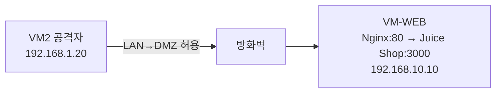

# 보안관제 실습 — 나만의 웹 서비스 띄우고 해커 공격 맛보기

---

## 0. 이번 강의 한눈에

- **지난 강의 도달 상태**: 방화벽(VM1) 구축, VM2가 LAN(192.168.1.20)에서 인터넷·방화벽 접속 가능
- **오늘의 목표**: **DMZ에 취약 웹서버 VM-WEB(192.168.10.10)**을 직접 만들고, **Juice Shop**을 띄운 뒤 VM2에서 첫 **SQL Injection** 공격 체험
- **오늘 켜는 VM**: VM1 + VM2 + **VM-WEB(신규)**
- **오늘 완성되는 연결**: `VM2(192.168.1.20) — [방화벽] — VM-WEB(192.168.10.10) 웹서비스`



---

## 1. 오늘의 이론: SQL Injection(SQL 삽입) 공격이란?

로그인할 때 우리가 넣은 아이디·비밀번호는 **데이터베이스(DB)**라는 창고에서 **SQL**이라는 언어로 조회됩니다. 예:

```sql
SELECT * FROM users WHERE email = '입력한이메일' AND password = '입력한비번';
```

"이메일·비번이 둘 다 맞는 회원을 찾아줘"라는 뜻입니다. 그런데 해커가 이메일 칸에 **특수한 SQL 기호**를 끼워 넣으면, 이 문장의 의미가 통째로 바뀝니다. 이것이 **SQL Injection**입니다. 비밀번호를 몰라도 로그인하거나, 회원 정보를 통째로 빼낼 수 있습니다.

> **왜 DMZ에 두나?** 웹서버는 외부 공격에 가장 많이 노출됩니다. 그래서 2강에서 만든 **DMZ(노출 구역)**에 둡니다. 뚫려도 LAN의 관제서버로는 못 넘어가도록 방화벽이 막아줍니다.
{: .prompt-tip }

---

## 2. 따라하기 실습 ① : 취약 웹서버 VM-WEB 만들기

### [단계 1] Ubuntu Server ISO 받기 & VM 생성

1. 호스트 브라우저에서 [Ubuntu Server 다운로드](https://ubuntu.com/download/server)로 가서 **Ubuntu Server 22.04 LTS** ISO를 받습니다. (데스크톱과 달리 화면이 없는 가벼운 서버용 OS입니다.)
2. VirtualBox **[새로 만들기]**:
   - 이름 `Web-DMZ`, ISO = 방금 받은 server iso, **[Skip Unattended Installation] 체크**
   - 메모리 **`1536` MB**, CPU **1**, 디스크 **`20` GB**
3. 생성 후 **[설정] → [네트워크] → [어댑터 1]**:
   - 다음에 연결: **`내부 네트워크`** → 이름 **`intnet_dmz`** *(DMZ에 두는 게 핵심!)*

### [단계 2] Ubuntu Server 설치

1. `Web-DMZ` 시작 → 텍스트 기반 설치 마법사가 뜹니다. (`Tab`/방향키/`Enter`로 이동, 마우스 안 됨)
   - Language: English → Installer update: **Continue without updating**
   - Keyboard: 기본 → Done
   - Network: 아직 자동(DHCP)으로 두고 → **Done** *(고정 IP는 설치 후 설정)*
   - Proxy/Mirror: 비워두고 Done
   - Storage: **Use an entire disk** → Done → **Continue** (확인창)
2. Profile setup (★ 1강 2.4 표대로 ★):
   - Your name: `student` / server's name: **`web-dmz`** / username: `student` / password: `student1234`
3. **[X] Install OpenSSH server** 에 **Space로 체크** → Done *(나중에 원격 접속 편의)*
4. Featured snaps: 아무것도 고르지 말고 Done
5. 설치 완료 후 **Reboot Now**. ISO 제거 후 Enter. 로그인 프롬프트가 뜨면 `student`/`student1234`로 로그인.

### [단계 3] VM-WEB에 고정 IP(192.168.10.10) 부여

서버는 화면 메뉴가 없으니 설정 파일로 IP를 고정합니다. (Netplan)

**아래 한 덩어리를 그대로 복사해 붙여넣으세요.** 카드 이름·설정 파일명을 자동으로 찾아 IP를 고정합니다. (직접 타이핑·들여쓰기 편집이 전혀 필요 없습니다.)

```bash
IFACE=$(ls /sys/class/net | grep -v lo | head -n1)
sudo rm -f /etc/netplan/00-installer-config.yaml /etc/netplan/50-cloud-init.yaml
sudo tee /etc/netplan/99-soc.yaml > /dev/null <<EOF
network:
  version: 2
  ethernets:
    $IFACE:
      dhcp4: false
      addresses: [192.168.10.10/24]
      routes:
        - to: default
          via: 192.168.10.1
      nameservers:
        addresses: [192.168.10.1, 8.8.8.8]
EOF
sudo chmod 600 /etc/netplan/99-soc.yaml
sudo netplan apply
```

적용됐는지 확인합니다.

```bash
ip addr | grep 192.168.10.10   # IP가 고정됐으면 한 줄 출력
ping -c 3 192.168.10.1         # 방화벽(DMZ GW) 응답 확인
ping -c 3 8.8.8.8              # 인터넷 확인 (2강 'DMZ→인터넷 허용' 규칙 덕분)
```

> 인터넷이 안 되면 2강 [단계 9]의 **DMZ→인터넷 허용 규칙**이 적용됐는지 확인하세요.
{: .prompt-warning }

---

## 3. 따라하기 실습 ② : Docker + Juice Shop + Nginx 띄우기

### [단계 4] Docker 설치

```bash
sudo apt update
sudo apt install -y docker.io
sudo systemctl enable --now docker
sudo usermod -aG docker student     # student 계정이 sudo 없이 docker 사용
```
변경 적용을 위해 한 번 로그아웃 후 다시 로그인합니다.
```bash
exit
# 다시 student/student1234 로그인
docker --version                    # 버전이 나오면 설치 성공
```

### [단계 5] 취약 웹앱 Juice Shop 실행

```bash
docker run -d --restart=always --name juiceshop -p 127.0.0.1:3000:3000 bkimminich/juice-shop
```
- `-d`: 백그라운드 실행 / `--restart=always`: 재부팅해도 자동 시작
- `127.0.0.1:3000`: Juice Shop은 **내부에서만** 듣게 하고, 외부에는 곧 설치할 Nginx로만 노출합니다.

### [단계 6] Nginx 리버스 프록시 설치 (★ 접근 로그가 4·5강 탐지의 재료 ★)

웹 공격을 관제(Wazuh)가 탐지하려면 **누가 어떤 URL로 들어왔는지 기록(접근 로그)**이 필요합니다. Juice Shop 앞에 **Nginx**를 세워 80번 포트로 받고, 모든 요청을 로그로 남깁니다.

```bash
sudo apt install -y nginx
sudo tee /etc/nginx/sites-available/juiceshop > /dev/null <<'EOF'
server {
    listen 80;
    server_name _;
    access_log /var/log/nginx/access.log;
    location / {
        proxy_pass http://127.0.0.1:3000;
        proxy_set_header Host $host;
        proxy_set_header X-Real-IP $remote_addr;
    }
}
EOF
sudo ln -sf /etc/nginx/sites-available/juiceshop /etc/nginx/sites-enabled/juiceshop
sudo rm -f /etc/nginx/sites-enabled/default
sudo nginx -t && sudo systemctl restart nginx
```

이제 웹서버 준비 완료입니다. (이 로그 파일 `/var/log/nginx/access.log`을 4강에서 Wazuh 센서가 감시하게 됩니다.)

---

## 4. 따라하기 실습 ③ : VM2에서 첫 해킹 시도

### [단계 7] 쇼핑몰 접속

1. **VM2(Ubuntu Desktop)**에서 Firefox를 엽니다.
2. 주소창에 **`http://192.168.10.10`** 입력. *(LAN→DMZ가 허용돼 있으니 접속됩니다.)*
3. 주황색 **OWASP Juice Shop** 쇼핑몰이 뜹니다. 환영 팝업은 **[Dismiss]**.

### [단계 8] 공격 A — 로그인 우회 (비밀번호 없이 관리자 로그인)

1. 우측 상단 **[Account] → [Login]**.
2. **Email** 칸에 아래를 **정확히** 입력(따옴표·공백 주의):
   ```text
   ' OR 1=1 --
   ```
3. **Password** 칸에는 아무 값(`1234`).
4. **[Log in]** 클릭 → 비밀번호 없이 로그인 성공! **[Account]**를 보면 최고관리자 **`admin@juice-sh.op`**로 들어가 있습니다.

#### 왜 뚫릴까?
입력값이 SQL에 끼어들어 문장이 이렇게 바뀝니다.
```sql
SELECT * FROM users WHERE email = '' OR 1=1 --' AND password = '1234';
```
- `OR 1=1` → 항상 **참**이라 모든 조건을 무력화
- `--` → 뒤의 비밀번호 검사 부분을 **주석(메모)**으로 무시
→ 결국 첫 번째 회원(관리자)으로 로그인됩니다.

### [단계 9] 공격 B — 검색창 SQL Injection (4·5강 탐지 실습용)

이 공격은 **주소(URL)에 공격 코드가 들어가** Nginx 로그에 또렷이 남습니다. 5강에서 이 흔적을 관제로 탐지할 것입니다.

1. Firefox 주소창에 아래를 입력하고 Enter:
   ```text
   http://192.168.10.10/rest/products/search?q=apple'))--
   ```
2. 화면에 JSON 응답이 뜨거나 오류가 납니다. 이때 VM-WEB의 로그에는 다음과 같은 줄이 남습니다(서버에서 확인 가능):
   ```bash
   # (VM-WEB 터미널에서)
   sudo tail -n 5 /var/log/nginx/access.log
   # 192.168.1.20 ... "GET /rest/products/search?q=apple'))-- HTTP/1.1" ...
   ```
   → 공격자 IP가 **VM2의 192.168.1.20**으로 또렷이 기록됩니다.

---

## 5. 검증 체크리스트

**🔎 한 줄 자가진단** — VM-WEB 터미널에서:
```bash
docker ps --filter name=juiceshop --format "JuiceShop: {{.Status}}" && \
curl -s -o /dev/null -w "웹응답:%{http_code}\n" http://localhost && echo "3강 통과: 웹서버 정상"
```
(VM2 브라우저에서는 `http://192.168.10.10` 접속이 200으로 떠야 합니다.)

- [ ] VM-WEB의 IP가 `192.168.10.10`, 인터넷·방화벽 ping 성공
- [ ] `docker ps` 에 juiceshop 컨테이너가 Up 상태
- [ ] VM2 브라우저로 `http://192.168.10.10` 쇼핑몰 접속 성공
- [ ] `' OR 1=1 --` 로 admin 계정 로그인 성공
- [ ] 검색 공격 후 `access.log`에 `192.168.1.20`과 공격 URL이 기록됨

## 6. 자주 나는 오류

- **VM2에서 `192.168.10.10` 접속 안 됨**: VM-WEB 어댑터가 `intnet_dmz`인지, 2강의 **LAN→DMZ 허용(기본 LAN 규칙)**이 있는지 확인.
- **`docker: permission denied`**: [단계 4]의 `usermod -aG docker` 후 **재로그인**을 안 한 경우. 다시 로그인하세요.
- **Nginx `502 Bad Gateway`**: Juice Shop 컨테이너가 아직 부팅 중(10~20초)이거나 꺼진 경우. `docker ps`로 확인.

---

## 7. 핵심 요약

- 취약 웹서버를 **DMZ(192.168.10.10)**에 직접 구축하고, **Docker(Juice Shop) + Nginx(접근 로그)** 구조로 띄웠습니다.
- **SQL Injection**은 입력창에 SQL 기호를 주입해 인증을 우회/탈취하는 공격입니다.
- Nginx 접근 로그에 남은 공격 흔적(공격자 IP=192.168.1.20)이 **다음 강의 탐지 실습의 재료**입니다.

## 💾 안전망: 스냅샷 찍기 (꼭!)

`Web-DMZ` VM을 **전원 끄고** 우클릭 → **[스냅샷] → [찍기]**. Docker·Nginx까지 설치된 상태를 저장해 두면, 다음 강의에서 문제가 생겨도 강사 제공 **"정답 스냅샷"**으로 이 시점부터 이어갈 수 있습니다.

---

## 8. 다음 강의 예고

4강에서는 **관제 서버 VM3(192.168.1.100)**에 **Wazuh(SIEM)**를 직접 설치하고, VM-WEB에 **센서(에이전트)**를 붙여 웹서버 로그를 관제실로 실시간 전송합니다.
