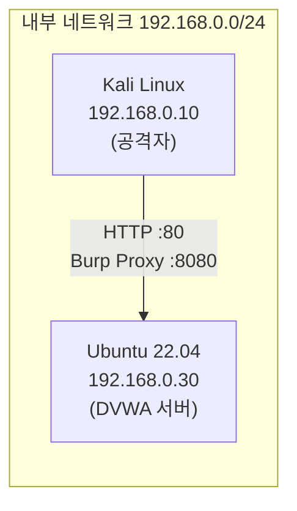
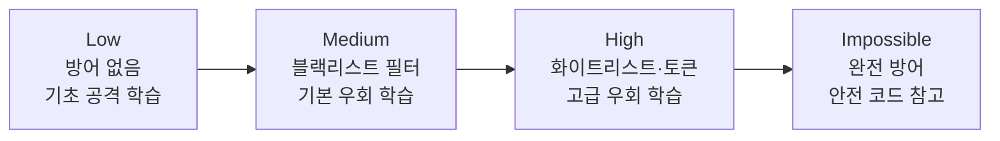

# DVWA 실습 환경 구축

웹 모의해킹 실습을 시작하기 전에, 공격 실습에 특화된 취약한 웹 애플리케이션 **DVWA(Damn Vulnerable Web Application)**를 설치한다.  
DVWA는 SQL Injection, XSS, CSRF, 파일 업로드 취약점 등 OWASP Top 10에 포함된 주요 웹 취약점을 직접 실습할 수 있도록 설계된 오픈소스 프로젝트다.

이 포스트에서는 다음을 다룬다.

1. 실습 환경 개요 및 네트워크 구성
2. Ubuntu 22.04에 DVWA 설치 및 설정
3. Kali Linux에서 Burp Suite 프록시 설정
4. DVWA Security Level 이해
5. 주요 실습 도구 목록

---

## 1. 실습 환경 개요

### 1.1 환경 구성

| 역할 | OS | IP 주소 | 주요 도구 |
|---|---|---|---|
| 공격자 머신 | Kali Linux | 192.168.0.10 | Burp Suite, SQLmap, Nikto, gobuster |
| 피해자(대상) 서버 | Ubuntu 22.04 LTS | 192.168.0.30 | Apache2, PHP, MariaDB, DVWA |

두 머신은 동일한 내부 네트워크(192.168.0.0/24)에 연결되어 있으며, Kali Linux에서 Ubuntu 서버의 DVWA로 직접 접근한다.

> 실습은 반드시 본인이 소유하거나 허가받은 환경에서만 진행해야 한다.  
> 타인의 시스템을 허가 없이 공격하는 것은 정보통신망법 위반에 해당한다.
{: .prompt-warning }

### 1.2 네트워크 구성도



---

## 2. Ubuntu에 DVWA 설치

### 2.1 패키지 업데이트 및 Apache2 / PHP 설치

Ubuntu 서버(192.168.0.30)에 SSH로 접속하거나 직접 터미널을 열어 다음을 실행한다.

```bash
sudo apt update && sudo apt upgrade -y
sudo apt install -y apache2 php php-mysqli php-gd libapache2-mod-php mariadb-server git
```

> **왜 MySQL이 아닌 MariaDB인가?**  
> MariaDB는 MySQL의 오픈소스 포크로, Oracle의 상용화 이후 커뮤니티 주도로 개발되고 있다.  
> Ubuntu 22.04의 기본 `mysql-server` 패키지도 내부적으로 MariaDB를 포함하는 경우가 많다.  
> MariaDB는 완전한 오픈소스이며, 보안 패치가 더 빠르고 기능적으로도 MySQL과 거의 완전히 호환된다.  
> 실습 환경에서는 `mariadb-server` 패키지를 명시적으로 지정하는 것이 안전하다.
{: .prompt-tip }

설치 후 Apache2와 MariaDB 서비스를 활성화한다.

```bash
sudo systemctl enable --now apache2
sudo systemctl enable --now mariadb
```

### 2.2 MariaDB 보안 초기화

```bash
sudo mariadb-secure-installation
```

> Ubuntu 22.04 이상에서는 `mysql_secure_installation` 대신 `mariadb-secure-installation`을 사용한다.  
> 두 명령 모두 동작하지만, MariaDB 전용 명령을 쓰는 것이 더 명확하다.
{: .prompt-tip }

프롬프트가 나타나면 다음과 같이 응답한다.

- `Enter current password for root`: 엔터 (초기 비밀번호 없음)
- `Switch to unix_socket authentication`: `n`
- `Change the root password?`: `y` → 원하는 비밀번호 입력
- 나머지: 모두 `y`

### 2.3 DVWA 데이터베이스 및 사용자 생성

MariaDB 콘솔에 접속한다.  
`mariadb` 명령은 MariaDB 전용 클라이언트로, `mysql` 명령과 동일하게 동작한다.

```bash
sudo mariadb -u root -p
```

다음 SQL을 실행한다.

```sql
CREATE DATABASE dvwa CHARACTER SET utf8mb4 COLLATE utf8mb4_unicode_ci;
CREATE USER 'dvwa'@'localhost' IDENTIFIED BY 'p@ssw0rd';
GRANT ALL PRIVILEGES ON dvwa.* TO 'dvwa'@'localhost';
FLUSH PRIVILEGES;
EXIT;
```

> DB 비밀번호(`p@ssw0rd`)는 실습 전용 환경이므로 단순하게 설정해도 무방하지만,  
> 인터넷에 노출된 서버에서는 절대 이런 비밀번호를 사용하지 않도록 한다.
{: .prompt-warning }

### 2.4 DVWA 소스코드 다운로드

```bash
cd /var/www/html
sudo git clone https://github.com/digininja/DVWA.git
sudo chown -R www-data:www-data /var/www/html/DVWA
```

### 2.5 config.inc.php 설정

샘플 설정 파일을 복사하고 편집한다.

```bash
sudo cp /var/www/html/DVWA/config/config.inc.php.dist /var/www/html/DVWA/config/config.inc.php
sudo nano /var/www/html/DVWA/config/config.inc.php
```

아래 항목을 앞서 생성한 DB 정보와 일치하도록 수정한다.

```php
$_DVWA[ 'db_server' ]   = '127.0.0.1';
$_DVWA[ 'db_database' ] = 'dvwa';
$_DVWA[ 'db_user' ]     = 'dvwa';
$_DVWA[ 'db_password' ] = 'p@ssw0rd';
$_DVWA[ 'db_port']      = '3306';
```

reCAPTCHA 키는 실습 환경에서는 임의 문자열을 넣어도 된다.

```php
$_DVWA[ 'recaptcha_public_key' ]  = 'test';
$_DVWA[ 'recaptcha_private_key' ] = 'test';
```

### 2.6 PHP 설정 조정

DVWA 실습에 필요한 PHP 옵션을 활성화한다.

```bash
sudo nano /etc/php/$(php -r 'echo PHP_MAJOR_VERSION.".".PHP_MINOR_VERSION;')/apache2/php.ini
```

다음 항목을 찾아 수정한다.

```ini
allow_url_include = On
```

> `allow_url_include = On`은 보안상 매우 위험한 설정이다.  
> 반드시 인터넷과 격리된 실습 전용 서버에서만 적용한다.
{: .prompt-warning }

### 2.7 Apache 가상 호스트 설정

기본 설정으로도 접근 가능하지만, 루트 경로에서 바로 접속하고 싶다면 심볼릭 링크를 추가한다.

```bash
# 기본 Apache DocumentRoot에서 DVWA 접근 허용
sudo ln -s /var/www/html/DVWA /var/www/html/dvwa_link
```

또는 별도의 가상 호스트 파일을 작성한다.

```bash
sudo nano /etc/apache2/sites-available/dvwa.conf
```

```apache
<VirtualHost *:80>
    ServerName 192.168.0.30
    DocumentRoot /var/www/html/DVWA

    <Directory /var/www/html/DVWA>
        Options Indexes FollowSymLinks
        AllowOverride All
        Require all granted
    </Directory>

    ErrorLog ${APACHE_LOG_DIR}/dvwa_error.log
    CustomLog ${APACHE_LOG_DIR}/dvwa_access.log combined
</VirtualHost>
```

가상 호스트를 활성화하고 Apache를 재시작한다.

```bash
sudo a2ensite dvwa.conf
sudo a2dissite 000-default.conf
sudo systemctl reload apache2
```

### 2.8 DVWA Setup 페이지에서 DB 초기화

1. Kali Linux 브라우저에서 `http://192.168.0.30/setup.php` 에 접속한다.
2. 페이지 하단의 **[Create / Reset Database]** 버튼을 클릭한다.
3. 정상적으로 완료되면 로그인 페이지(`http://192.168.0.30/login.php`)로 이동된다.

> Setup 페이지에서 빨간색으로 표시된 항목이 있다면 PHP 설정이나 파일 권한 문제다.  
> `allow_url_include`, `config.inc.php` 권한, MariaDB 연결 정보를 다시 확인한다.
{: .prompt-tip }

**기본 로그인 계정**

| 항목 | 값 |
|---|---|
| Username | `admin` |
| Password | `password` |

---

## 3. Kali Linux에서 Burp Suite 프록시 설정

Burp Suite는 웹 애플리케이션 모의해킹에서 HTTP 트래픽을 가로채고 분석하는 핵심 도구다.  
DVWA 실습에서는 Burp Suite를 브라우저와 서버 사이에 프록시로 끼워 요청/응답을 실시간으로 확인한다.

### 3.1 Burp Suite 실행

Kali Linux에서 터미널을 열고 실행하거나, 애플리케이션 메뉴에서 찾는다.

```bash
burpsuite &
```

Community Edition을 사용하는 경우 "Temporary project" → "Use Burp defaults" 로 시작한다.

### 3.2 Burp Suite Proxy 리스너 확인

1. **Proxy** 탭 → **Options(또는 Proxy settings)** 클릭
2. **Proxy Listeners** 항목에서 `127.0.0.1:8080` 이 Running 상태인지 확인
3. 없으면 **[Add]** 버튼으로 추가한다.

### 3.3 브라우저 프록시 설정

**Firefox 기준**

1. 우측 상단 메뉴(≡) → **Settings** → **General** → 하단의 **Network Settings** → **[Settings...]**
2. **Manual proxy configuration** 선택
3. HTTP Proxy: `127.0.0.1`, Port: `8080`
4. **[OK]** 저장

또는 FoxyProxy 확장 프로그램을 사용해 프록시를 ON/OFF로 빠르게 전환할 수 있다.

```bash
# FoxyProxy Standard 설치 (Firefox 확장 마켓에서도 가능)
# Kali Linux에는 Firefox ESR이 기본 내장되어 있다.
```

### 3.4 Burp CA 인증서 설치 (HTTPS 트래픽 분석 시)

HTTPS 트래픽을 가로채려면 Burp CA 인증서를 브라우저에 등록해야 한다.  
DVWA는 HTTP이므로 이 단계는 생략 가능하지만, 이후 실습을 위해 미리 설정해 두는 것을 권장한다.

1. 브라우저에서 `http://burpsuite` 또는 `http://127.0.0.1:8080` 에 접속
2. **CA Certificate** 링크를 클릭해 `cacert.der` 다운로드
3. Firefox: **Settings** → **Privacy & Security** → **Certificates** → **[View Certificates]** → **Authorities** 탭 → **[Import]**
4. 다운로드한 `cacert.der` 선택 후 "Trust this CA to identify websites" 체크

### 3.5 DVWA 접속 및 Burp 트래픽 확인

1. 브라우저에서 `http://192.168.0.30/login.php` 에 접속
2. Burp Suite **Proxy** 탭 → **Intercept** 탭에서 요청이 가로채졌는지 확인
3. **[Forward]** 를 눌러 요청을 전달하거나, **[Intercept is off]** 로 설정해 자동 통과시킨다.

> Intercept가 켜진 상태에서 **[Forward]** 를 클릭하지 않으면 브라우저가 응답을 받지 못해 멈춘 것처럼 보인다.  
> 실습 중 브라우저가 로딩 중이면 Burp Suite Intercept 탭을 먼저 확인한다.
{: .prompt-tip }

4. 기본 계정(`admin` / `password`)으로 로그인 후 DVWA 메인 화면이 나타나면 환경 구축 완료다.

---

## 4. DVWA Security Level

DVWA는 동일한 취약점을 난이도별로 구현해 두고 있다.  
Security Level을 조정하면 서버 측 방어 코드의 강도가 달라져, 다양한 방어 우회 기법을 단계적으로 학습할 수 있다.

**Security Level 설정 위치**: 로그인 후 좌측 메뉴 → **DVWA Security**

### 4.1 각 레벨 설명

| 레벨 | 방어 수준 | 특징 | 학습 목적 |
|---|---|---|---|
| **Low** | 없음 | 입력값을 전혀 검증하지 않음 | 기초 공격 기법 이해 |
| **Medium** | 일부 | 간단한 필터링(블랙리스트 방식)이 적용됨 | 기본 필터 우회 기법 학습 |
| **High** | 강함 | 화이트리스트, CSRF 토큰 등 적용 | 고급 우회 기법 또는 로직 취약점 탐색 |
| **Impossible** | 완전 | 취약점이 없도록 안전하게 구현 | 안전한 코드 패턴 참고용 |



> 처음 실습할 때는 반드시 **Low** 레벨에서 시작한다.  
> 공격이 성공한 후에는 소스 코드 탭(**View Source**)을 열어 왜 취약한지 직접 확인하는 것이 핵심 학습법이다.
{: .prompt-tip }

### 4.2 실습 추천 순서

1. **Low** 레벨에서 공격 성공
2. **View Source** 로 취약한 코드 확인
3. **Medium** 레벨로 올려 필터 우회 시도
4. **High** 레벨에서 추가 우회 기법 적용
5. **Impossible** 레벨 소스와 Low 레벨 소스 비교 분석

---

## 5. 실습 도구 목록

Kali Linux에는 웹 모의해킹에 필요한 도구 대부분이 기본 설치되어 있다.

### 5.1 주요 도구 요약

| 도구 | 용도 | 기본 포함 여부 |
|---|---|---|
| **Burp Suite** | HTTP 프록시, 인터셉트, 스캐너 | 기본 포함 (Community) |
| **SQLmap** | SQL Injection 자동화 탐지 및 익스플로잇 | 기본 포함 |
| **Nikto** | 웹 서버 취약점 스캐너 | 기본 포함 |
| **gobuster** | 디렉토리·파일 브루트포스 | 기본 포함 |
| **dirb** | 웹 콘텐츠 스캐너 | 기본 포함 |
| **curl** | HTTP 요청 CLI 도구 | 기본 포함 |
| **Hydra** | 로그인 브루트포스 | 기본 포함 |
| **wfuzz** | 웹 파라미터 퍼징 | 기본 포함 |

### 5.2 도구 설치 확인 및 업데이트

```bash
# Kali Linux 패키지 업데이트
sudo apt update && sudo apt upgrade -y

# 누락된 도구 설치 (필요 시)
sudo apt install -y sqlmap nikto gobuster dirb hydra wfuzz
```

### 5.3 SQLmap 기본 사용법 예시

```bash
# DVWA SQL Injection 페이지에 대한 기본 스캔
# (Burp Suite에서 가로챈 요청을 파일로 저장한 후 사용)
sqlmap -u "http://192.168.0.30/vulnerabilities/sqli/?id=1&Submit=Submit" \
       --cookie="PHPSESSID=<세션값>; security=low" \
       --dbs
```

### 5.4 Nikto 기본 사용법 예시

```bash
# DVWA 서버 기본 취약점 스캔
nikto -h http://192.168.0.30
```

### 5.5 gobuster 기본 사용법 예시

```bash
# 디렉토리 브루트포스
gobuster dir -u http://192.168.0.30 \
             -w /usr/share/wordlists/dirb/common.txt \
             -t 50
```

> SQLmap을 포함한 자동화 도구는 짧은 시간에 수많은 요청을 보낸다.  
> 실습 환경이 아닌 실제 서비스에 절대 사용하지 않는다.
{: .prompt-warning }

---

## 6. 환경 점검 체크리스트

실습을 시작하기 전에 다음 항목을 확인한다.

- [ ] Ubuntu 서버(192.168.0.30)에서 Apache2 서비스가 실행 중인가
- [ ] `http://192.168.0.30/login.php` 에 Kali Linux 브라우저에서 접근 가능한가
- [ ] `admin` / `password` 로 DVWA 로그인이 되는가
- [ ] Burp Suite가 `127.0.0.1:8080` 에서 리스닝 중인가
- [ ] 브라우저 프록시가 Burp Suite를 가리키고 있는가
- [ ] Burp Suite **Proxy** → **Intercept** 탭에서 요청이 가로채지는가
- [ ] DVWA Security Level이 **Low** 로 설정되어 있는가

모든 항목이 확인되면 SQL Injection, XSS 등 개별 실습 포스트로 이동해 실습을 시작할 수 있다.

---

## 7. 다음 실습 예고

환경 구축이 완료되면 다음 단계로 넘어간다.

| 포스트 | 내용 |
|---|---|
| **01. SQL Injection** | DVWA SQLi 실습 — Low/Medium/High 레벨 공략 |
| **02. XSS** | Reflected / Stored XSS 실습 |
| **03. CSRF** | CSRF 토큰 없는 환경에서의 공격 시나리오 |
| **04. File Upload** | 웹쉘 업로드를 통한 RCE 실습 |
| **05. Command Injection** | OS 명령 삽입 공격 실습 |
